# Gatsby 基础

## 一、Gatsby 介绍

-   Gatsby 是一个静态站点生成器.
-   官网：https://www.gatsbyjs.org/

#### 1. 静态应用的优势

-   访问速度快
-   更利于 SEO 搜索引擎的内容抓取
-   部署简单

#### 2. Gatsby 总览

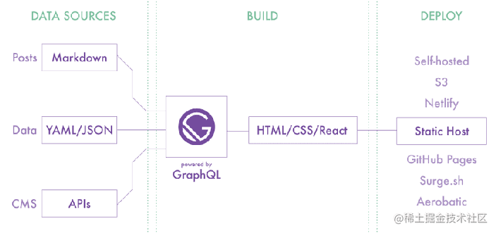

1. 基于 React 和 GraphQL. 结合了 webpack, babel, react-router 等前端领域中最先进工具. 开发人员开发体验好\
2. 采用数据层和 UI 层分离而不失 SEO 的现代前端开发模式. 对 SEO 非常友好\
3. 数据预读取, 在浏览器空闲的时候预先读取链接对应的页面内容. 使静态页面拥有 SPA 应用的用户体验, 用户体验好\
4. 数据来源多样化: Headless CMS, markdown, API.\
5. 功能插件化, Gatsby 中提供了丰富且功能强大的各种类型的插件, 用什么装什么

#### 3. 创建 Gatsby 项目

-   全局安装脚手架工具 `npm install gatsby-cli -g`
-   创建：gatsby new project-name https://github.com/gatsbyjs/gatsby-starter-hello-world\
-   启动：gatsby develop 或 npm start
-   访问：localhost:8000

#### 4. 基于文件的路由系统

-   Gatsby 框架内置基于文件的路由系统, 页面组件被放置在 src/pages 文件夹中.

#### 5、以编程的方式创建页面

-   基于同一个模板创建多个 HTML 页面，有多少数据就创建多少页面
-   比如商品详情页面，有多少商品就生成多少商品详情展示页面

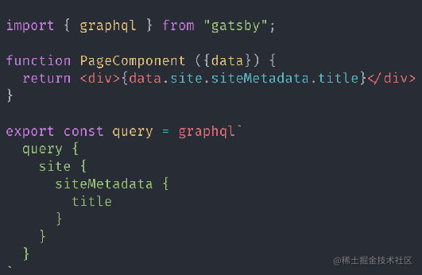

#### 6、 Link 组件

-   在 Gatsby 框架中页面跳转通过 Link 组件实现.

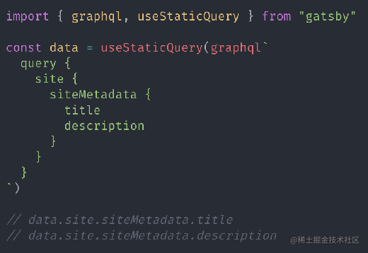

## 二、GraphQL 数据层

-   在 Gatsby 框架中提供了一个统一的存储数据的地方，叫做数据层.
-   在应用构建时，Gatsby 会从外部获取数据并将数据放入数据层，组件可以直接从数据层查询数据.
-   数据层使用 GraphQL 构建.
-   调试工具：localhost:8000/\_\_\_graphql
    

#### 1、 页面组件

-   在组件文件中导出查询命令, 框架执行查询并将结果传递给组件的 prop 对象. 存储在 props 对象的 data 属性中


#### 2、 非页面组件

-   通过钩子函数 useStaticQuery 进行手动查询\


#### 3、Gatsby 插件

-   Gatsby 框架内置插件系统, 插件是为应用添加功能的最好的方式.https://www.gatsbyjs.org/plugins/
-   在 Gatsby 中有三种类型的插件: 分别为数据源插件 ( source ), 数据转换插件 ( transformer ), 功能插件 ( plugin )
-   数据源插件：负责从应用外部获取数据，将数据统一放在 Gatsby 的数据层中
-   数据转换插件：负责转换特定类型的数据的格式，比如将 markdown 文件中的内容转换为对象形式
-   功能插件：为应用提供功能，比如通过插件让应用支持 Less 或者 TypeScript.

#### 4、将 JSON 数据放入数据层

-   要将本地 JSON 文件中的数据放入数据层需要用到两个插件.
-   gatsby-source-filesystem: 用于将本地文件中的数据添加至数据层.
-   gatsby-transformer-json：将原始 JSON 字符串转换为 JavaScript 对象.

-   // guide\gatsby-config.js
    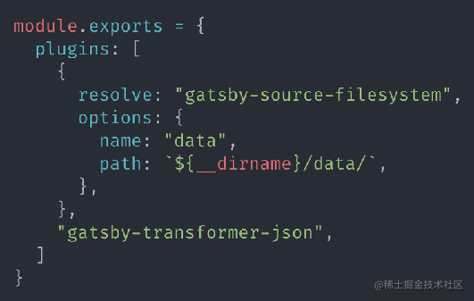

#### 5、图像优化

-   图像文件和数据文件不在源代码中的同一位置\
-   图像路径基于构建站点的绝对路径, 而不是相对于数据的路径, 难以分析出图片的真实位置
-   图像没有经过任何优化操作

-   gatsby-source-filesystem: 用于将本地文件信息添加至数据层.
-   gatsby-plugin-sharp: 提供本地图像的处理功能(调整图像尺寸, 压缩图像体积 等等).
-   gatsby-transformer-sharp: 将 gatsby-plugin-sharp 插件处理后的图像信息添加到数据层.
-   gatsby-image: React 组件, 优化图像显示, 基于 gatsby-transformer-sharp 插件转化后的数据.
-   1.生成多个具有不同宽度的图像版本, 为图像设置 srcset 和 sizes 属性, 因此无论您的设备是什么宽度都可以加载到合适大小的图片
-   2.使用"模糊处理"技术, 其中将一个 20px 宽的小图像显示为占位符, 直到实际图像下载完成为止.  
     `npm install gatsby-plugin-sharp gatsby-transformer-sharp gatsby-image`

#### 6、将 markdown 数据放入数据层

-   通过 gatsby-source-filesystem 将 markdown 文件数据放入数据层

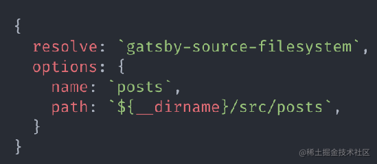

-   通过 gatsby-transformer-remark 将数据层中的原始 markdown 数据转换为对象形式

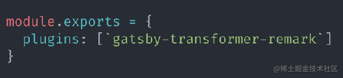

-   组件数据查询

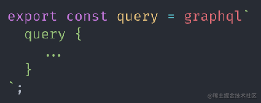

-   重新构建查询数据, 添加 slug 作为请求标识, slug 值为文件名称

```
gatsby.md -> /posts/gatsby\
react.md -> /posts/react
```

-   重新构建查询数据, 添加 slug 作为请求标识, slug 值为文件名称

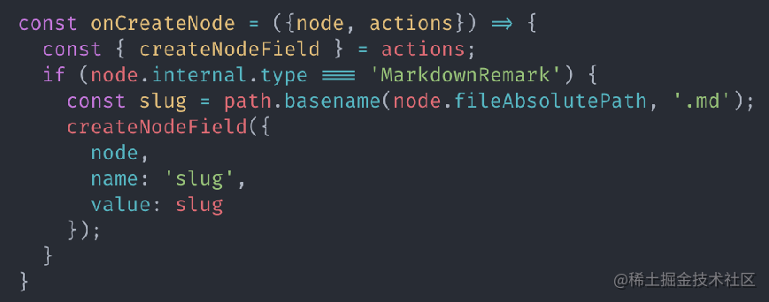

-   根据 slug 标识构建页面

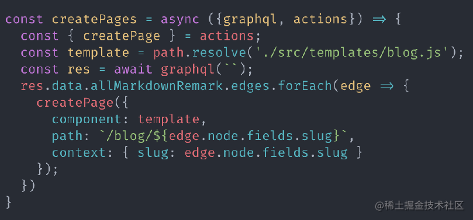

-   组件数据查询

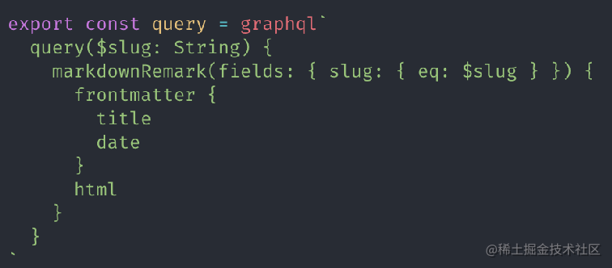

-   处理 markdown 文件中图片
    gatsby-remark-images: 处理 markdown 中的图片, 以便可以在生产环境中使用\

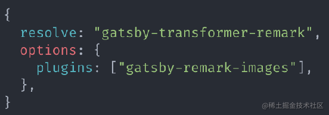

#### 7、Gatsby Source 插件开发

数据源插件负责从 Gatsby 应用外部获取数据，创建数据查询节点供开发者使用

1. gatsby clean 清除上一次的构建内容
2. 在项目根目录里下创建 plugins 文件夹，在此文件夹中继续创建具体的插件文件夹，比如 gatsby-source-mystrapi 文件夹
3. 在插件文件夹中创建 gatsby-node.js 文件
4. 插件实际上就是 npm 包
5. 导出 sourceNodes 方法用于获取外部数据，创建数据查询节点
6. 在 gatsby-config.js 文件中配置插件，并传递插件所需的配置参数
7. 重新运行应用

transformer 插件将 source 插件提供的数据转换为新的数据

1. 在 plugins 文件夹中创建 gatsby-transformer-xml 文件件
2. 在插件文件夹中创建 gatsby-node.js 文件
3. 在文件中导出 onCreateNode 方法用于构建 Gatsby 查询节点
4. 根据节点类型筛选 xml 节点 node.internal.mediaType -> application/xml
5. 通过 loadNodeContent 方法读取节点中的数据
6. 通过 xml2js 将 xml 数据转换为对象
7. 将对象转换为 Gatsby 查询节点

#### 8、SEO 优化

gatsby-plugin-react-helmet\
react-helmet 是一个组件, 用于控制页面元数据. 这对于 SEO 非常重要.\
此插件用于将页面元数据添加到 Gatsby 构建的静态 HTML 页面中.\
npm install gatsby-plugin-react-helmet react-helmet

#### 9、Less 支持

在 gatsby 应用中使用 less\
下载插件：npm install --save gatsby-plugin-less\
配置插件：plugins: [`gatsby-plugin-less`]\
创建样式：index.module.less\
引入样式：import styles from './index.module.less'

#### 10、Gatsby 构建

Gatsby + github + Netlify
