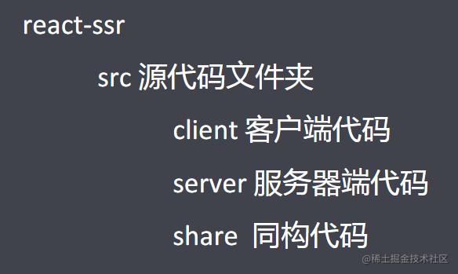
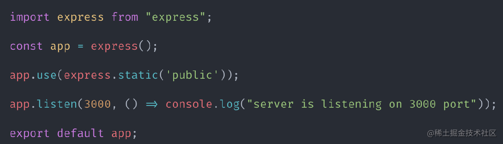
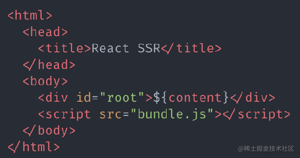
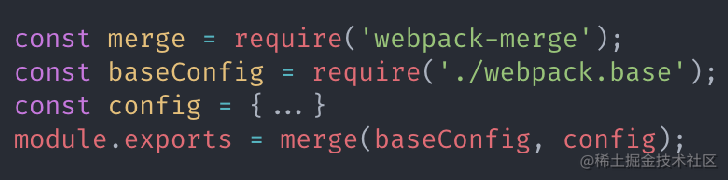
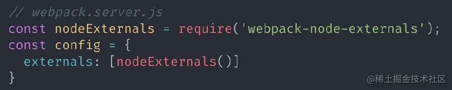
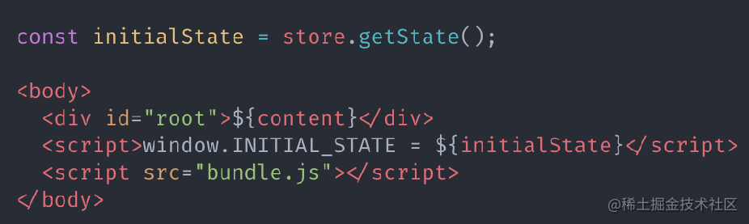
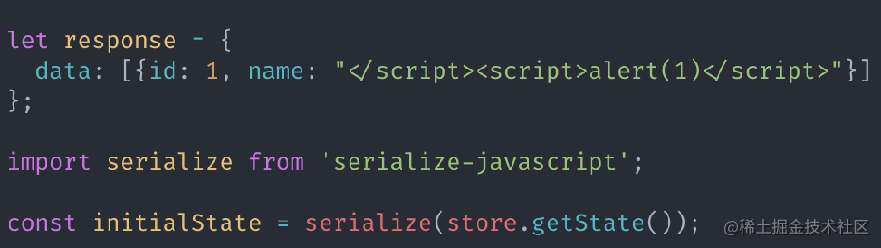

# React SSR 简介及应用

## 一、React SSR 介绍

#### 1. 什么是客户端渲染？

-   `CSR：Client Side Rendering`
-   服务器端仅返回 `JSON` 数据, `DATA` 和 `HTML` 在客户端进行渲染


#### 2. 什么是服务器端渲染?

-   `SSR：Server Side Rendering`
-   服务器端返回`HTML`, `DATA` 和 `HTML` 在服务器端进行渲染.


#### 3. 客户端渲染存在的问题

-   首屏等待时间长, 用户体验差
-   页面结构为空, 不利于 `SEO`

#### 4. `React SSR` 同构

-   同构指的是代码复用. 即实现客户端和服务器端最大程度的代码复用

## 二、服务端渲染

#### 1. 项目结构



#### 2. 创建 Node 服务器



#### 3. 实现`React SSR`

-   在服务端应用程序中引入要渲染的 `React` 组件
-   通过 `renderToString`方法将 `React` 组件转换为 `HTML` 字符串
-   将结果`HTML`字符串传到客户端
-   `renderToString` 方法用于将 `React` 组件转换为 `HTML` 字符串, 通过 `react-dom/server` 导入.

#### 4. `webpack`打包配置

-   原因: `Node` 环境不支持 `ESModule` 模块系统, 不支持 `JSX` 语法
-   更改文件自动打包：配置服务器端打包命令: `"dev:server-build": "webpack --config webpack.server.js --watch"`
-   `build`文件变更后，自动重启服务器：配置服务端启动命令: `"dev:server-run": "nodemon --watch build --exec \"node build/bundle.js\""`

#### 5. 为组件元素添加事件

-   实现思路：在客户端对组件进行二次"渲染", 为组件元素附加事件.
-   客户端二次 "渲染" `hydrate`: 使用 `hydrate` 方法对组件进行渲染, 为组件元素附加事件. `hydrate` 方法在实现渲染的时候, 会复用原本已经存在的 `DOM` 节点, 减少重新生成节点以及删除原本 `DOM` 节点的开销.通过 `react-dom` 导入 `hydrate`.

```jsx
// react-ssr\src\client\index.js
ReactDOM.hydrate(
    <Provider store={store}>
        <BrowserRouter>{renderRoutes(routes)}</BrowserRouter>
    </Provider>,
    document.getElementById('root')
);
```

#### 5.1. 客户端`React`打包配置

-   `webpack` 配置打包目的: 转换`JSX`语法, 转换浏览器不识别的高级 `JavaScript` 语法
-   打包目标位置: `public` 文件夹
-   打包启动命令配置：`"dev:client-build": "webpack --config webpack.client.js --watch"`

#### 5.2. 添加客户端包文件请求链接

-   在响应给客户端的 `HTML` 代码中添加 `script` 标签, 请求客户端 `JavaScript` 打包文件.



#### 5.3. 服务器端实现静态资源访问

-   服务器端程序实现静态资源访问功能, 客户端 JavaScript 打包文件会被作为静态资源使用

```js
app.use(express.static('public'));
```

#### 6. 优化`webpack`配置

#### 6.1. 合并 `webpack` 配置

-   服务器端 `webpack` 配置和客户端 `webpack` 配置存在重复. 将重复配置抽象到 `webpack.base.js` 配置文件中



#### 6.2. 合并项目启动命令

-   目的: 使用一个命令启动项目, 解决多个命令启动的繁琐问题. 通过 `npm-run-all` 工具实现.

```
 "dev": "npm-run-all --parallel dev:*",
```

#### 6.3. 服务器端打包文件体积优化

-   问题：在服务器端打包文件中, 包含了 `Node` 系统模块. 导致打包文件本身体积庞大.
-   解决：通过 `webpack` 配置剔除打包文件中的 `Node` 模块.



#### 6.4. 将启动服务器代码和渲染代码进行模块化拆分

-   优化代码组织方式, 渲染 React 组件代码是独立功能, 所以把它从服务器端入口文件中进行抽离.

#### 7. 路由支持（服务端和客户端）

-   在 `React SSR` 项目中需要实现两端路由.
-   客户端路由是用于支持用户通过点击链接的形式跳转页面.
-   服务器端路由是用于支持用户直接从浏览器地址栏中访问页面.
-   客户端和服务器端公用一套路由规则.

#### 7.1. 编写路由规则

```js
// react-ssr\src\share\routes.js
import Home from '../share/pages/Home';
import List from '../share/pages/List';

export default [
    {
        path: '/',
        component: Home,
        exact: true,
    },
    {
        path: '/list',
        ...List,
    },
];
```

#### 7.2. 实现服务器端路由

-   Express 路由接收任何请求: Express 路由接收所有 GET 请求, 服务器端 React 路由通过请求路径匹配要进行渲染的组件.

```js
// react-ssr\src\server\index.js
app.get('*', (req, res) => {});
```

-   服务器端路由配置

```js
// react-ssr\src\server\renderer.js
import React from 'react';
import { renderToString } from 'react-dom/server';
import { StaticRouter } from 'react-router-dom';
import routes from '../share/routes';
import { renderRoutes } from 'react-router-config';
import { Provider } from 'react-redux';
import serialize from 'serialize-javascript';

export default (req, store) => {
    const content = renderToString(
        <Provider store={store}>
            <StaticRouter location={req.path}>
                {renderRoutes(routes)}
            </StaticRouter>
        </Provider>
    );
    const initalState = serialize(store.getState());
    return `
  <html>
    <head>
      <title>React SSR</title>
    </head>
    <body>
      <div id="root">${content}</div>
      <script>window.INITIAL_STATE = ${initalState} </script>
      <script src="bundle.js"></script>
    </body>
  </html>
`;
};
```

#### 7.3. 实现客户端路由

-   添加客户端路由配置

```js
// react-ssr\src\client\index.js
import React from 'react';
import ReactDOM from 'react-dom';
import { BrowserRouter } from 'react-router-dom';
import { renderRoutes } from 'react-router-config';
import routes from '../share/routes';
import { Provider } from 'react-redux';
import store from './createStore';

ReactDOM.hydrate(
    <Provider store={store}>
        <BrowserRouter>{renderRoutes(routes)}</BrowserRouter>
    </Provider>,
    document.getElementById('root')
);
```

#### 8. Redux 支持

-   在实现了 React SSR 的项目中需要实现两端 Redux.
-   客户端 Redux 就是通过客户端 JavaScript 管理 Store 中的数据.
-   服务器端 Redux 就是在服务器端搭建一套 Redux 代码, 用于管理组件中的数据.
-   客户端和服务器端共用一套 Reducer 代码.
-   创建 Store 的代码由于参数传递不同所以不可以共用.

#### 8.1. 实现客户端 Redux

-   创建 Store
-   配置 Store
-   创建 Action 和 Reducer
-   配置 polyfill, 由于浏览器不能识别异步函数代码, 所以需要 polyfill 进行填充.

```js
import { applyMiddleware, createStore } from 'redux';
import thunk from 'redux-thunk';
import reducer from '../share/store/reducers';

const store = createStore(
    reducer,
    window.INITIAL_STATE,
    applyMiddleware(thunk)
);

export default store;
```

#### 8.2. 实现服务端 Redux

-   创建 Store

```js
// react-ssr\src\server\createStore.js
import { createStore, applyMiddleware } from 'redux';
import thunk from 'redux-thunk';
import reducer from '../share/store/reducers';

export default () => createStore(reducer, {}, applyMiddleware(thunk));
```

-   配置 Store

```js
app.get('*', (req, res) => {
    const store = createStore();
    // 1. 请求地址 req.path
    // 2. 获取到路由配置信息 routes
    // 3. 根据请求地址匹配出要渲染的组件的路由对象信息
    const promises = matchRoutes(routes, req.path).map(({ route }) => {
        // 如何才能知道数据什么时候获取完成
        if (route.loadData) return route.loadData(store);
    });

    Promise.all(promises).then(() => {
        res.send(renderer(req, store));
    });
});
```

```js
export default (req, store) => {
    const content = renderToString(
        <Provider store={store}>
            <StaticRouter location={req.path}>
                {renderRoutes(routes)}
            </StaticRouter>
        </Provider>
    );
    const initalState = serialize(store.getState());
    return `
  <html>
    <head>
      <title>React SSR</title>
    </head>
    <body>
      <div id="root">${content}</div>
      <script>window.INITIAL_STATE = ${initalState} </script>
      <script src="bundle.js"></script>
    </body>
  </html>
`;
};
```

-   服务器端 store 数据填充
    问题：服务器端创建的 store 是空的, 组件并不能从 Store 中获取到任何数据.\
    解决：服务器端在渲染组件之前获取到组件所需要的数据
    > 1、在组件中添加 loadData 方法, 此方法用于获取组件所需数据，方法被服务器端调用  
    > 2、将 loadData 方法保存在当前组件的路由信息对象中.  
    > 3、服务器端在接收到请求后，根据请求地址匹配出要渲染的组件的路由信息  
    > 4、从路由信息中获取组件中的 loadData 方法并调用方法获取组件所需数据  
    > 5、当数据获取完成以后再渲染组件并将结果响应到客户端
-   组件 loadData 方法
    服务器端通过调用组件的 loadData 方法获取组件所需数据并将数据存储在服务器端的 Store 中

```js
// react-ssr\src\share\pages\List.js
function loadData(store) {
    return store.dispatch(fetchUser());
}
```

-   服务器端获取组件所需数据
    服务器端在接收到请求以后，先根据请求路径分析出要渲染的路由信息，再从路由信息中得到 loadData 方法

```js
app.get('*', (req, res) => {
    const store = createStore();
    // 1. 请求地址 req.path
    // 2. 获取到路由配置信息 routes
    // 3. 根据请求地址匹配出要渲染的组件的路由对象信息
    const promises = matchRoutes(routes, req.path).map(({ route }) => {
        // 如何才能知道数据什么时候获取完成
        if (route.loadData) return route.loadData(store);
    });

    Promise.all(promises).then(() => {
        res.send(renderer(req, store));
    });
});
```

-   React 警告消除
    警告原因: 客户端 Store 在初始状态下是没有数据的, 在渲染组件的时候生成的是空 ul, 但是服务器端是先获取数据再进行的组件渲染,\
    所以生成的是有子元素的 ul, hydrate 方法在对比的时候发现两者不一致, 所以报了个警告.\
    解决思路: 将服务器端获取到的数据回填给客户端, 让客户端拥有初始数据
    服务器响应 Store 初始状态:


客户端设置 Store 初始状态:

```js
// react-ssr\src\client\createStore.js
const store = createStore(
    reducer,
    window.INITIAL_STATE,
    applyMiddleware(thunk)
);
```

#### 9. 防止 XSS 攻击

-   转义状态中的恶意代码


