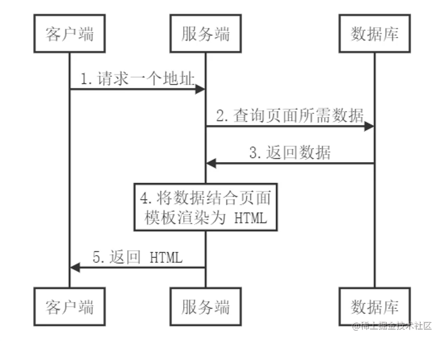
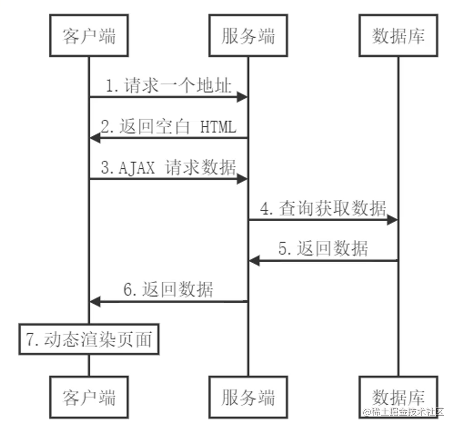
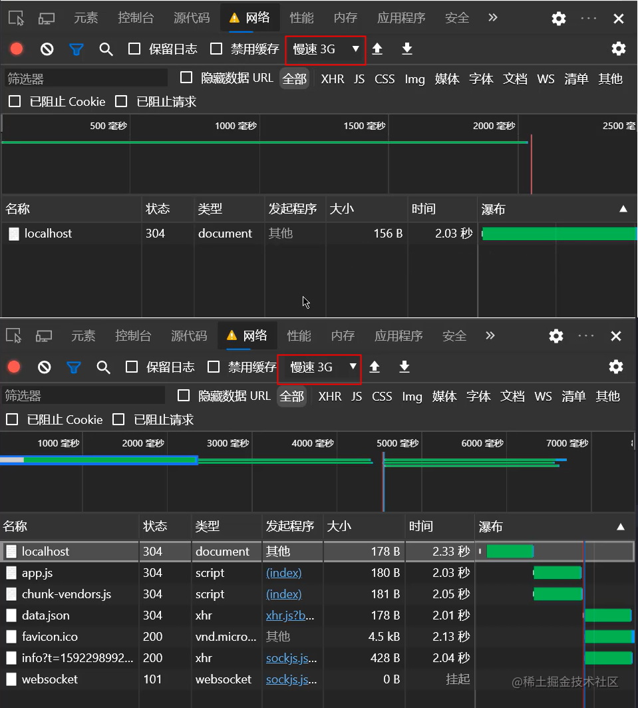
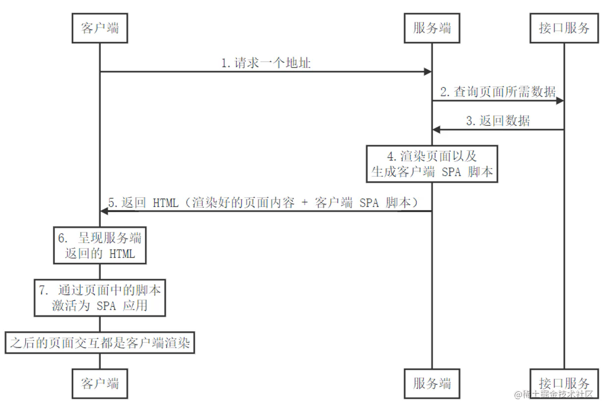

# 服务端渲染


## 1、渲染的本质

把数据+模板拼接到一起  

## 2、传统的服务端渲染

-   图解过程
    
-   服务端处理

```js
app.get('/', (req, res) => {
    // 1. 获取页面模板
    const templateStr = fs.readFileSync('./index.html', 'utf-8');

    // 2. 获取数据
    const data = JSON.parse(fs.readFileSync('./data.json', 'utf-8'));

    // 3. 渲染：数据 + 模板 = 最终结果
    const html = template.render(templateStr, data);

    // 4. 把渲染结果发送给客户端
    res.send(html);
});
```

-   缺点
    -   前后端代码完全耦合在一起，不利于开发和维护
    -   前端没有足够的发挥空间
    -   服务端压力大
    -   用户体验一般（每次请求新页面都需要刷新页面）

## 3、客户端渲染

-   图解过程（后端处理数据接口、前端负责将接口数据渲染到页面中，前端更独立）
    
-   缺点 - 首屏渲染慢: 对比穿透服务端渲染与客户端渲染页面呈现的耗时。  
     - 不利于`SEO`: 因为在请求一个地址后服务端返回的是空`HTML`,搜索引擎不能解析`JS`获取动态页面，在`body`标签内得不到有用的信息。

## 4、现代化的服务端渲染（同构渲染）

-   理解同构渲染
    -   基于 React、Vue 等框架，客户端渲染和服务器端渲染的结合
        -   在服务器端执行一次，用于实现服务器端渲染（首屏直出）
        -   在客户端再执行一次，用于接管页面交互
    -   核心解决 SEO 和首屏渲染慢的问题
    -   拥有传统服务端渲染的优点，也有客户端渲染的优点
-   图解过程
    
-   实现同构渲染的方案
    -   使用 Vue、React 等框架的官方解决方案
        -   优点：有助于理解原理
        -   缺点：需要搭建环境，比较麻烦
    -   使用第三方解决方案
        -   React 生态的 Next.js
        -   Vue 生态的 Nuxt.js

## 5、同构渲染的问题

-   开发条件所限
    -   浏览器特定的代码只能在某些生命周期钩子函数中使用；
    -   一些外部扩展库可能需要特殊处理才能在服务端渲染应用中运行；
    -   不能在服务端渲染期间操作 DOM
    -   某些代码操作需要区分运行环境
-   涉及构建设置和部署的更多要求，对比如下：
    | |客户端渲染 |同构渲染 |
    | -- | -- |-- |
    | 构建 | 仅构建客户端应用即可 | 需要构建两个端 |
    | 部署 | 可以部署在任意 web 服务器中 | 只能部署在 Node.js Server |
-   更多的服务器负载
    -   在 Node 中渲染完整的应用程序，相比仅仅提供静态文件的服务器需要大量占用`CPU`资源
    -   如果应用在高流量环境下使用，需要准备相应的服务器负载
    -   需要更多的服务端渲染优化工作处理
