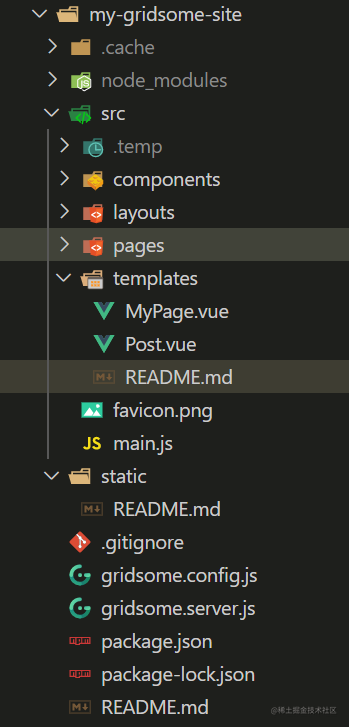
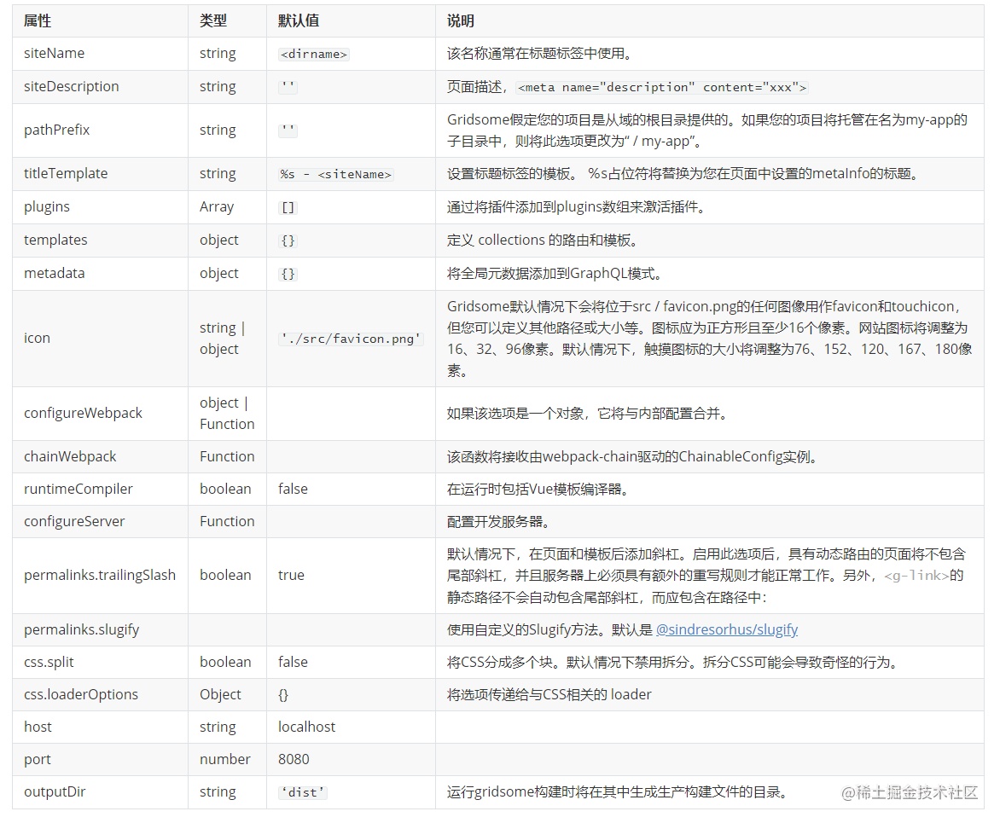
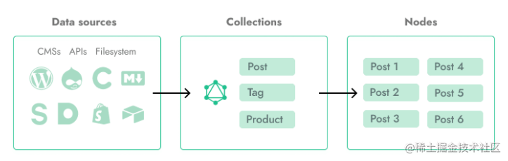
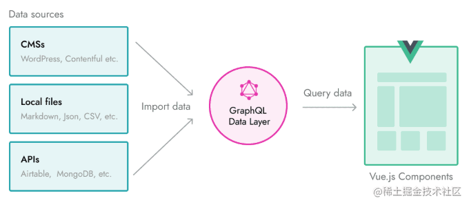
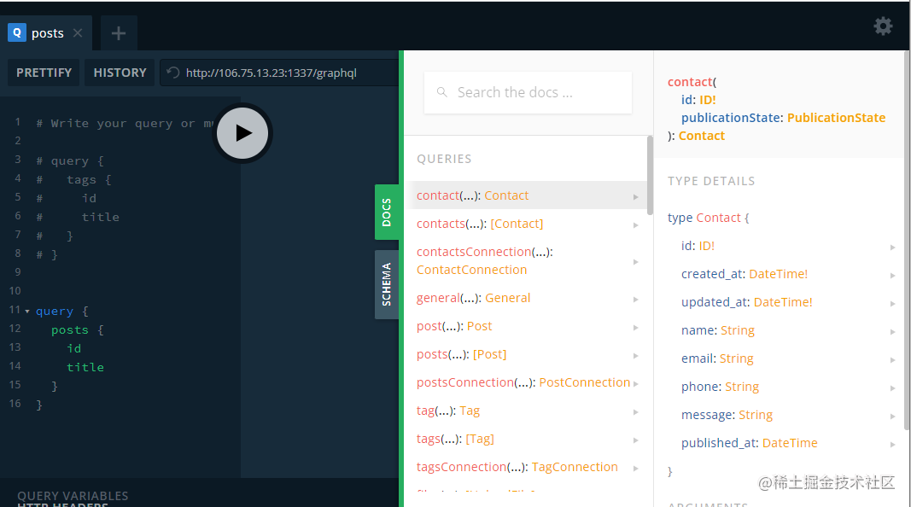

# 静态站点生成

## 一、Gridsome 介绍

1、[`Gridsome`](https://github.com/gridsome/gridsome) 是由`Vue.js`驱动的 Jamstack 框架,用于生产静态网站。用于为任何无头`CMS`，本地文件或`API`构建可用于`CDN`的网站  
2、[`Jamstack`](https://gridsome.org/docs/jamstack/)使您可以通过预渲染文件并直接从`CDN`直接提供文件来构建快速安全的站点和应用程序，而无需管理或运行 Web 服务器。

-   `JAMStack`的`JAM`是`JavaScript`， `API`和`Markup`的首字母组合本质上是一种胖前端，通过调用各种`API`来实现更多的功能
-   其实也是一种前后端的模式，只不过离得比较开，甚至前后端来自多个不同的厂商
    
3、使用`Vue.js`，`webpack`和`Node.js`等现代工具构建网站。通过`npm`进行热重载并访问任何软件包，并使用自动前缀在您喜欢的预处理器（如`Sass`或`Less`）中编写`CSS`。  

4、静态网站的好处

-   省钱：不需要专业的服务器，只要托管静态文件的空间即可
-   快速：不经过后端服务器的处理，只传输内容
-   安全：没有后端程序的执行

5、常见的静态网站生成器  

`ekyll (Ruby)` `Hexo (Node)` `Hugo (Golang)` `Gatsby (Node/React)` `Gridsome (Node/Vue)`另外， `Next.js`， `Nuxt.js`也能生成静态网站，但是它们更多被认为是`SSR` （服务端渲染）框架。

6、静态应用使用场景

-   不适合有大量路由页面的应用
-   不适合有大量动态内容的应用（如后台管理系统，频繁增删改查）

## 二、Gridsome 基础

1、官方文档：https://gridsome.org/docs/  
2、快速了解 `Gridsome` 项目

```
# 创建项目
gridsome create my-gridsome-site

# 进入项目中
cd my-gridsome-site

# 启动开发模式，或 npm run develop
gridsome develop
```

3、目录结构



-   关于项目的一些配置，参考：https://gridsome.org/docs/config/
-   `Gridsome`需要 `gridsome.config.js` 才能工作。插件和项目设置位于此处。基本配置文件如下所示：
    
    
4、数据预处理  

如果您要在网站上放置博客文章，标签，产品等，则收藏很有用。可以使用 [Source 插件](https://gridsome.org/plugins)或 [Data Store API](https://gridsome.org/docs/data-store-api/) 从任何 Headless CMS，内容 API 或 Markdown 文件中获取集合


5、项目中 pages 文件夹

通过在`src/pages`文件夹中添加`Vue`组件来创建页面。他们使用基于文件的路由系统。例如，`src/pages/
About.vue`将是 mywebsite.com/about/`。页面用于简单页面和列出集合的页面（例如 `/blog/`）。

## 三、使用 Strapi 管理数据

-   介绍了选择 `Gatsby` 的原因，其中提到了 `Gatsby` 使用 `GraphQL` 。大家可能会有疑惑，不是建静态博客么，怎么会有 `GraphQL`？难道还要部署服务器？
-   其实这里 `GraphQL` 并不是作为服务器端部署，而是作为 `Gridsome` 在本地管理资源的一种方式。
-   通过 `GraphQL` 统一管理实际上非常方便，因为作为一个数据库查询语言，它有非常完备的查询语句，与 JSON 相似的描述结构，再结合 `Relay` 的 `Connections` 方式处理集合，管理资源不再需要自行引入其它项目，大大减轻了维护难度。
    
1、GraphQL 数据层


    
2、GraphQL 资源管理器

-   每个 `Gridsome` 项目都有一个 `GraphQL` 资源管理器，可以在开发模式下使用它来探索和测试查询。
-   在这里，您还将获得所有可用 `GraphQL` 集合的列表。
-   通常可以通过转到 `http:// localhost:8080/___explore` 来打开它。
    

四、部署 Strapi [参考](https://gitee.com/lagoufed/fed-e-questions/blob/master/part3/part3-4/01-%E5%AE%89%E8%A3%85strapi%E5%92%8Cmysql.md)

五、部署 Gridsome 应用（采用[vercel](https://vercel.com/)托管）
