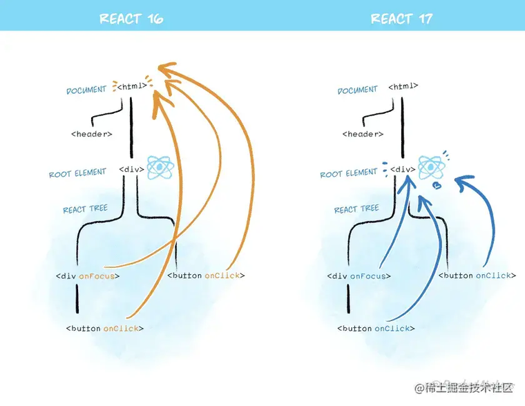

# React 介绍

## 概念

React 由 `Facebook` 开源，是一个声明式、高效且灵活的用于构建用户界面的 JavaScript 库。使用 React 可以将一些简短、独立的代码片段组合成复杂的 `UI` 界面，这些代码片段被称作组件

-   [英文文档](https://reactjs.org/)
-   [中文文档 1](https://react.docschina.org/)
-   [中文文档 2](https://reactjs.bootcss.com/)

## React 版本之间的差异

-   16.3：引入 fiber 架构。
-   16.8：正式引入 Hooks。（这条很重要，一定要能说出来）
-   17：垫脚石版本
    -   事件委托的变更 、启发式更新算法更新 、
    -   React16 的 expirationTimes 模型只能区分是否>=expirationTimes 决定节点是否更新。
    -   React17 的 lanes 模型可以选定一个更新区间，并且动态的向区间中增减优先级，可以处理更细粒度的更新。
-   18： 大量新特性出现，如自动批量处理、非紧急更新、Concurrent 等。

## 设计思想

1. 组件化
   每个组件都符合开放-封闭原则，封闭是针对渲染工作流来说的，指的是组件内部的状态都由自身维护，只处理内部的渲染逻辑。开放是针对组件通信来说的，指的是不同组件可以通过 props（单项数据流）进行数据交互

2. 数据驱动视图
   UI=f(data)
   通过上面这个公式得出，如果要渲染界面，不应该直接操作 DOM，而是通过修改数据(state 或 prop)，数据驱动视图更新

3. 虚拟 DOM
   由浏览器的渲染流水线可知，DOM 操作是一个昂贵的操作，很耗性能，因此产生了虚拟 DOM。虚拟 DOM 是对真实 DOM 的映射，React 通过新旧虚拟 DOM 对比，得到需要更新的部分，实现数据的增量更新

## React 事件机制
我们在React中平常使用的onClick、onChange等写法，其实用的就是React中事件，我们通常称之为合成事件。

React自定义的合成事件机制，帮助用户解决了平台兼容性、事件委托等优化机制，用户只需关注写React本身就行了。

关于合成事件，React17曾发生过一次变化，在17以前，事件是委托在document上的，但是实际上，React项目是可以作为其它项目的子项目的。那么这个时候就会出现这样的问题，比如父项目在document层定义了事件，而React的事件也委托在document层，那么这两个事件就会产生交叉，出现bug。React17解决了这个问题，把事件委托在了自己的container层。



## React JSX

### 基本介绍

JSX 全称 JavaScript XML。React 定义了一种类似于 XML 的 JavaScript 扩展语法

本质上是 `React.createElement(component, props, ...children)` 方法的语法糖

**作用：** 用来简化创建虚拟 DOM

**优点：**

1. JSX 执行的更快。在通过 Babel 编译为 JavaScript 代码时会进行优化
2. JSX 编写模板更加简单便捷
3. 类型更安全，编译过程如果出错就不能编译，及时发现错误

**注意：**

1. JSX 必要得有根节点
2. 正常的普通 HTML 元素要小写。如果是大写，默认认为是组件。

### 语法规则

1. 标签中混入 JavaScript 表达式要用 `{}` 包裹
2. 标签的类名指定不能用 `class`，要用 `className`
3. 内联样式，要用 **双花括号** 包裹
4. 只有一个根标签
5. 标签必须闭合
6. 标签首字母
    1. **标签首字母是小写字母开头**，则将该标签转为 HTML 中同名元素，若 HTML 中无该标签对应的同名元素则报错
    2. **标签首字母是大写字母开头**，React 就去渲染对应的组件，若组件没有定义则报错

### JSX 转换升级
React 17以前，React中如果使用JSX，则必须导入React，否则会报错，这是因为旧的 JSX 转换会把 JSX 转换为 React.createElement(...) 调用。

当然，这并不完美，除了增加了学习成本，还有无法做到的性能优化和简化， 如createElement里还要动态做children的拼接、依赖于React的导入等等。

而React 17带来了改变，可以让我们单独使用 JSX 而无需引入 React。这是因为新的 JSX 转换不会将 JSX 转换为 React.createElement，而是自动从 React 的 package 中引入新的入口函数并调用。另外此次升级不会改变 JSX 语法，旧的 JSX 转换也将继续工作。  
React 17 版本中的 JSX 转换支持自动导入 react/jsx-runtime 中的函数，因此在使用 JSX 时不再需要显式地引入 React


## JSX 基本语法

### 元素渲染

使用 `{}` 进行渲染变量

```jsx
const HelloText = 'Hello World'
// 遇到 <> 标签按 XML/HTML解析， 遇到 {} 按 JS 解析
const VDom = (
	<>
  	<h1>{HelloText}</h1>
  <>
)
```

### JSX 注释

```jsx
const HelloText = 'Hello World'
const VDom = (
	<>
  	{/* JSX内如何编写注释 */}
  	<h1>{HelloText}</h1>
  <>
)
```

### 添加样式

在 React 中，通过 `className` 这个属性来指定 `CSS` 类。这个和 HTML 的 `class` 的属性功能是一样的

```jsx
const VDom = <h1 className='container'>Hello World</h1>;
```

### 列表渲染

在 React JSX 中，使用**数组的 Map 方法**，对每一项数据按照 JSX 的形式进行加工，最终得到一个每一项都是 JSX 对象的数组，在将数组渲染到模板中

Key 值的作用：如果数据索引没有发生变化则 UI 不会发送重绘， 只有发生变化的部分会发生重绘，这样达到节省资源节省渲染提升性能。

```jsx
const numbers = ['React', 'Vue', 'Angular', 'JavaScript', 'TypeScript'];
const VDom = (
    <ul>
        {numbers.map((item, index) => {
            return <li key={index}>{item}</li>;
        })}
    </ul>
);
// 渲染虚拟DOM
ReactDOM.render(VDom, document.getElementById('app'));
```

### 条件渲染

在 React 中，你可以创建不同的组件来封装各种你需要的行为。然后，依据应用的不同状态，你可以只渲染对应状态下的部分内容

在 React 中通过 `if` 和 条件表达式来进行条件渲染

#### if 语句

```jsx
let content;
const isReact = true;
// 通过If语法来实现条件渲染
if (isReact) {
    content = 'It is React framework';
} else {
    content = "It's not React framework";
}
const VDom = <div>{content}</div>;
// 渲染虚拟DOM
ReactDOM.render(VDom, document.getElementById('app'));
```

#### 条件表达式

```jsx
const isReact = true
const VDom = (
	{
    isReact ? (<div>It is React framework</div>)
		: (<div>It's not React framework</div>)
  }
)
// 渲染虚拟DOM
ReactDOM.render(VDom, document.getElementById('app'))
```

**注意点：** 如果不需要 `else` 分支，还可以使用更加简短的 `&&` 语法

```jsx
const isReact = true
const VDom = (
	{
    isReact && (<div>It is React framework</div>)
  }
)
// 渲染虚拟DOM
ReactDOM.render(VDom, document.getElementById('app'))
```

## React Developer Tools 调试工具

React 提供的谷歌开发者工具调试插件

## React Component 组件

React 用来定义组件有两种方式：**函数式组件**、**类式组件**

函数式组件适用于简单组件（无状态）的定义

类式组件适用于复杂组件（有状态）的定义

### 函数式组件

```jsx
function MyComponent() {
    // 函数式组件的This是undefined
    console.log(this);
    return <h2>函数式组件</h2>;
}
// 渲染组件
ReactDOM.render(<MyComponent />, document.getElementById('app'));
```

### 类式组件

```jsx
class MyComponent extends React.Component {
    render() {
        // This是组件实例对象
        console.log(this);
        return <h2>类式组件</h2>;
    }
}
// 渲染组件
ReactDOM.render(<MyComponent />, document.getElementById('app'));
```

### 注意点

1. 组件名首字母必须大写
2. 虚拟 DOM 元素只能有一个根元素
3. 虚拟 DOM 元素必须有结束标签

## React State 状态

组件实例的三大核心属性之一：`State`

### 基本定义

```jsx
class Weather extends React.Component {
    constructor(props) {
        super(props);
        // 组件状态初始化
        this.state = { isHot: false };
    }
    render() {
        return (
            <div>
                {/* 通过组件状态数据来进行条件渲染 */}
                今天天气很热吗？ {this.state.isHot ? '是' : '不是'}
            </div>
        );
    }
}
```

### `.setState()`

在 React 中使用 `this.setState({key: value})` 来更新组件实例对象的 State

```js
this.setState({ isHot: !isHot });
```

**注意** `setState` 更新状态的 2 种写法

`setState(stateChange, [callback])`

-   `stateChange` 为状态对象（该对象可以体现出状态的更改）
-   callback 是可选的回调函数，它在状态更新完毕、界面也更新后(render 调用后)才被调用

`setState(updater, [callback])`

-   `updater` 为返回 `stateChange` 对象的函数
-   `updater`可以接收到 State 和 Props
-   callback 是可选的回调函数，它在状态更新完毕、界面也更新后(render 调用后)才被调用

## React Props 属性

组件实例的三大核心属性之一：`Props`

使用 `PropsTypes`进行类型检查，可[参考文档](https://react.docschina.org/docs/typechecking-with-proptypes.html)

### 基本使用

```jsx
class Person extends React.Component {
    render() {
        const { name, sex, age } = this.props;
        return (
            <ul>
                <li>姓名：{name}</li>
                <li>性别：{sex}</li>
                <li>年龄：{age}</li>
            </ul>
        );
    }
}
const tom = { name: 'Tom', sex: '男', age: 20 };
ReactDOM.render(
    // 简写方式：<Person {...tom} />
    <Person name={tom.name} sex={tom.sex} age={tom.age} />,
    document.getElementById('app')
);
```

### 对 Props 属性类型进行限制

```jsx
class Person extends React.Component {
  render() {
    const { name, sex, age } = this.props;
    return (
      <ul>
        <li>姓名：{name}</li>
        <li>性别：{sex}</li>
        <li>年龄：{age}</li>
      </ul>
    );
  }
}
// 对Props属性类型限制
Person.propTypes = {
  name: PropTypes.string.isRequired // String类型、必传
  sex: PropTypes.string // String类型
  age: PropTypes.number // Number类型
}
```

### 对 Props 属性设置默认值

```jsx
class Person extends React.Component {
    render() {
        const { name, sex, age } = this.props;
        return (
            <ul>
                <li>姓名：{name}</li>
                <li>性别：{sex}</li>
                <li>年龄：{age}</li>
            </ul>
        );
    }
}
// 对Props属性设置默认值
Person.defaultProps = {
    sex: '男',
    age: 18,
};
```

### 简写类型检查的方式

```jsx
class Person extends React.Component {
  // 对Props属性类型限制
  static propTypes = {
    name: PropTypes.string.isRequired // String类型、必传
    sex: PropTypes.string // String类型
    age: PropTypes.number // Number类型
  }
  // 对Props属性设置默认值
  static defaultProps = {
    sex: '男',
    age: 18
  }

  render() {
    const { name, sex, age } = this.props;
    return (
      <ul>
        <li>姓名：{name}</li>
        <li>性别：{sex}</li>
        <li>年龄：{age}</li>
      </ul>
    );
  }
}
```

## React Refs

组件实例的三大核心属性之一：`Refs`

[参考文档](https://react.docschina.org/docs/refs-and-the-dom.html)

在 React 中我们可以通过组件实例属性`Refs` 来获取到绑定了 `ref`属性的 DOM 节点

### 字符串类型 Ref

```jsx
class Demo extends React.Component {
    showData() {
        const { input1 } = this.refs;
        console.log(input1.value);
    }
    showData2() {
        const { input2 } = this.refs;
        console.log(input2.value);
    }
    render() {
        return (
            <div>
                <input
                    ref='input1'
                    type='text'
                    placeholder='点击按钮提示数据'
                />
                <button onClick={() => this.showData()}>
                    点我提示左侧的数据
                </button>
                <input
                    ref='input2'
                    type='text'
                    onBlur={() => this.showData2()}
                    placeholder='失去焦点提示数据'
                />
            </div>
        );
    }
}
```

### 回调函数 Ref

回调形式的`Ref`，会把当前的 DOM 元素通过实参的方式传递给开发者

[关于回调 refs 的说明](https://react.docschina.org/docs/refs-and-the-dom.html#caveats-with-callback-refs)

```jsx
class Demo extends React.Component {
    showData() {
        const { input1 } = this;
        console.log(input1.value);
    }
    showData2() {
        const { input2 } = this;
        console.log(input2.value);
    }
    render() {
        return (
            <div>
                {/* element是绑定的DOM元素 */}
                <input
                    ref={(element) => (this.input1 = element)}
                    type='text'
                    placeholder='点击按钮提示数据'
                />
                <button onClick={() => this.showData()}>
                    点我提示左侧的数据
                </button>
                <input
                    ref={(element) => (this.input2 = element)}
                    type='text'
                    onBlur={() => this.showData2()}
                    placeholder='失去焦点提示数据'
                />
            </div>
        );
    }
}
```

### `React.createRef()` 创建 Ref

`React.createRef()` 调用后可以返回一个容器，该容器可以存储被 `ref` 所标识的节点

```jsx
class Demo extends React.Component {
    inputOne = React.createRef();
    inputTwo = React.createRef();
    showData = () => {
        console.log(this.inputOne.current.value);
    };
    showData2 = () => {
        console.log(this.inputTwo.current.value);
    };
    render() {
        return (
            <div>
                <input
                    ref={this.inputOne}
                    type='text'
                    placeholder='点击按钮提示数据'
                />
                &nbsp;
                <button onClick={this.showData}>点我提示左侧的数据</button>
                &nbsp;
                <input
                    ref={this.inputTwo}
                    onBlur={this.showData2}
                    type='text'
                    placeholder='失去焦点提示数据'
                />
                &nbsp;
            </div>
        );
    }
}
```

## React Method 事件

特点：绑定的事件命名为驼峰命名法、`{}` 插入的是一个函数

[参考文档](https://react.docschina.org/docs/handling-events.html)

### 基本示例

```jsx
class Weather extends React.Component {
    constructor(props) {
        super(props);
        this.state = { isHot: false };
    }
    // 注册事件
    setIsHot(value) {
        this.setState({ isHot: !value });
    }
    render() {
        const { isHot } = this.state;
        return (
            // 绑定事件函数（组件事件名大小写）
            // <div onClick={this.setIsHot.bind(this, isHot)}>
            <div onClick={() => this.setIsHot(isHot)}>
                天气炎热吗？ {isHot ? '是' : '不是'}
            </div>
        );
    }
}
```

### 为事件传递参数

```jsx
// 第一种
<button onClick={(e) => this.deleteRow(id, e)}>Delete Row</button>
// 第二种
<button onClick={this.deleteRow.bind(this, id)}>Delete Row</button>
```

## 非受控组件

在 HTML 中，通常表单之类的标签有内置的属性和方法来维护自己的 State，并且根据用户输入进行更新。

**而非受控组件就是不需要通过 React 来管理表单数据，而是通过真实 DOM 来获取数据**

```jsx
class NameForm extends React.Component {
    constructor(props) {
        super(props);
        this.handleSubmit = this.handleSubmit.bind(this);
        this.input = React.createRef();
    }
    handleSubmit(event) {
        event.preventDefault();
        alert('A name was submitted: ' + this.input.current.value);
    }
    render() {
        return (
            <form onSubmit={this.handleSubmit}>
                <label>
                    Name:
                    <input type='text' ref={this.input} />
                </label>
                <input type='submit' value='Submit' />
            </form>
        );
    }
}
```

## 受控组件

在 HTML 中，通常表单之类的标签有内置的属性和方法来维护自己的 State，并且根据用户输入进行更新

而在 React，通常将数据状态保存在组件实例的 State 属性中，并且只能通过 `setState()` 来更新

**而这种通过 React 来控制元素状态的成为受控组件**

```jsx
class NameForm extends React.Component {
    constructor(props) {
        super(props);
        this.state = { value: '' };
        this.handleChange = this.handleChange.bind(this);
        this.handleSubmit = this.handleSubmit.bind(this);
    }
    handleChange(event) {
        this.setState({ value: event.target.value });
    }
    handleSubmit(event) {
        // 阻止默认事件提交
        event.preventDefault();
        alert('提交的名字: ' + this.state.value);
    }
    render() {
        return (
            <form onSubmit={this.handleSubmit}>
                <label>
                    名字:
                    <input
                        type='text'
                        value={this.state.value}
                        onChange={this.handleChange}
                    />
                </label>
                <input type='submit' value='提交' />
            </form>
        );
    }
}
```

## React 生命周期钩子函数

React 组件从创建到死亡会经历一些特定的阶段。其中就包含了一系列钩子函数，会在特定的时刻调用

**主要分为三个阶段**：初始化阶段、更新阶段、卸载阶段

### React 生命周期(旧)


```jsx
class Clock extends React.Component {
    constructor(props) {
        super(props);
        this.state = { date: new Date() };
    }

    // 组件挂载前
    componentWillMount() {}
    // 组件挂载后
    componentDidMount() {}

    // 子组件（父组件传递给子组件的Props发生改变调用）
    // 此钩子函数被调用后 再进入 shouldComponentUpdate
    componentWillReceiveProps() {}

    // 组件是否更新（在组件挂载后，如果State状态发送改变，则进入此钩子）
    // 返回 True 代表允许更新，返回 False 代表不允许更新（此钩子函数如果不写默认是True）
    // 此钩子就是一个阀门
    shouldComponentUpdate() {}

    // 组件更新前（State、Props、.forceUpdate()）
    componentWillUpdate() {}
    // 组件更新后（State、Props）
    componentDidUpdate() {}

    // 组件卸载前
    componentWillUnmount() {}

    // 初次渲染、State状态更新后
    render() {
        return <h2>It is {this.state.date.toLocaleTimeString()}</h2>;
    }
}
```

### React 生命周期(新)

[参考文档](https://react.docschina.org/docs/react-component.html#the-component-lifecycle)

在新版本中 `componentWillMount`、`componentWillReceiveProps`、`componentWillUpdate` 废除三个钩子函数

新增两个钩子函数 `static getDerivedStateFromProps()`、`static getSnapshotBeforeUpdate()`


```jsx
class Clock extends React.Component {
    constructor(props) {
        super(props);
        this.state = { date: new Date() };
    }

    // 组件挂载后
    componentDidMount() {}

    // 组件是否更新（在组件挂载后，如果State状态发送改变，则进入此钩子）
    // 返回 True 代表允许更新，返回 False 代表不允许更新（此钩子函数如果不写默认是True）
    // 此钩子就是一个阀门
    shouldComponentUpdate() {}

    // derived 派生的
    // 若State的值在任何时候都取决于Props，那么可以使用此钩子函数
    static getDerivedStateFromProps(props, state) {
        return props;
    }
    // snapshot 快照
    // 参考文档：https://react.docschina.org/docs/react-component.html#getsnapshotbeforeupdate
    static getSnapshotBeforeUpdate() {}

    // 组件更新后（State、Props）
    componentDidUpdate() {}

    // 组件卸载前
    componentWillUnmount() {}

    // 初次渲染、State状态更新后
    render() {
        return <h2>It is {this.state.date.toLocaleTimeString()}</h2>;
    }
}
```

## `<Fragment>`

使用 `Fragment` 包裹的组件，可以不用必须有一个真实的 DOM 根标签了

```jsx
class Demo extends React.Component {
    render() {
        return (
            // Fragment 不会被渲染在DOM节点上
            <Fragment>
                <div>Hello World</div>
            </Fragment>
        );
    }
}
```

## React 脚手架

安装 `npm install -g create-react-app` 或 使用 `npx create-react-app projectName` 命令

## VsCode 相关插件

-   `Simple React Snippets`
-   `ES7 React/Redux/GraphQL/React-Native`
