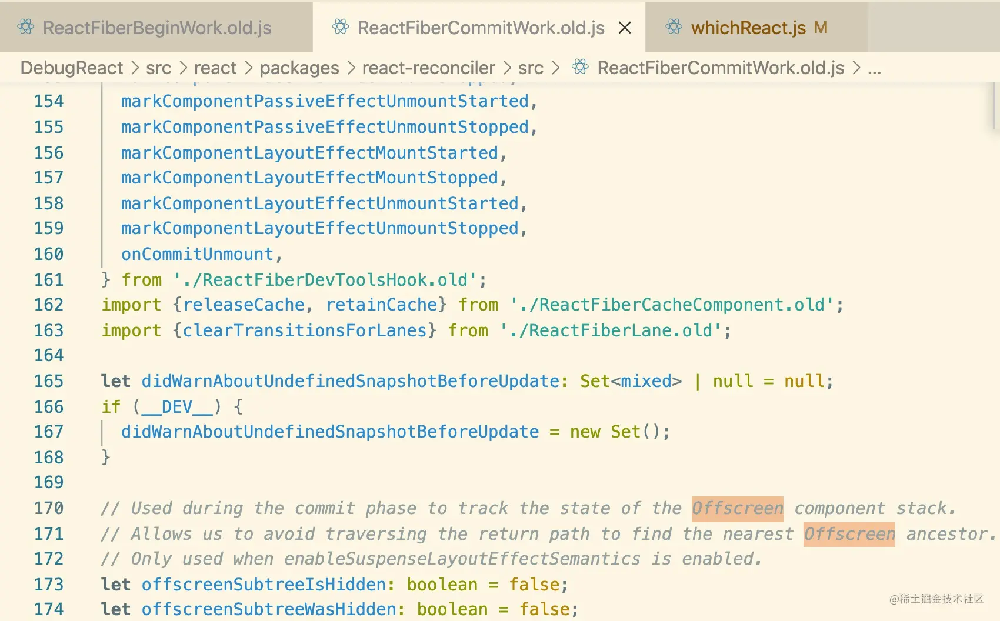
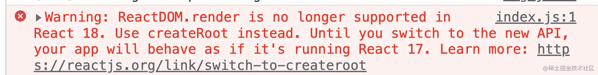

# React18+新特性

[详细新特性参考](https://juejin.cn/post/7182382408807743548)
## 统计react18+ 用法
- 15个 hook（`useMemo`|`useCallback`、`useReducer`|`useState`、`useRef`、`useEffect`、`useContext`、`useTransition`|`useDeferredValue`、`useDebugValue`、`useId`、`useImperativeHandle`、`useInsertionEffect`、`useLayoutEffect`、`useSyncExternalStore`）
- 4个 component（`<Fragment>`、`<Profiler>`、`<StrictMode>`、`<Suspense>`）
- 5个 API（`createContext(defaultValue)`、`forwardRef(render)`、`lazy(load)`、`memo(SomeComponent, arePropsEqual?)`、`startTransition(scope)`）

## 1、setState自动批处理
在react17中，只有react事件会进行批处理，原生js事件、promise，setTimeout、setInterval不会

react18，将所有事件都进行批处理，即多次setState会被合并为1次执行，提高了性能，在数据层，将多个状态更新合并成一次处理（在视图层，将多次渲染合并成一次渲染）

## 2、正式支持Concurrent
Concurrent最主要的特点就是渲染是可中断的。以前是不可中断的，也就是说，以前React中的update是同步渲染，在这种情况下，一旦update开启，在任务完成前，都不可中断。
- 可中断（如：渲染）: 对于React来说，任务可能很多，需要区分优先级，高优先级任务可以中断低优先级任务（基于fiber本身链表结构，可以记录任务的执行情况，便于恢复）
- （任务）被遗弃：React 可能会把一些更新标记为低优先级，以避免阻塞高优先级更新的渲染，从而提高用户体验。这意味着某些低优先级更新可能会被暂停、中止或完全丢弃，因为它们在后续更新到达之前已经过时。
如：在现在React18中，这个模糊查询相关的UI可以被当做transition。
- 支持状态的复用：某些情况下，比如用户走了，又回来，那么上一次的页面状态应当被保存下来，而不是完全从头再来。当然实际情况下不能缓存所有的页面，不然内存不得爆炸，所以还得做成可选的。目前，React正在用Offscreen组件来实现这个功能。嗯，也就是这关于这个状态复用，其实还没完成呢。不过源码中已经在做了：

另外，使用OffScreen，除了可以复用原先的状态，我们也可以使用它来当做新UI的缓存准备，就是虽然新UI还没登场，但是可以先在后台准备着嘛，这样一旦轮到它，就可以立马快速地渲染出来。

总结一下：Concurrent并不是API之类的新特性，但是呢，它很重要，因为它是React18大部分新特性的实现基础，包括Suspense、transitions、流式服务端渲染等。

## 3、createRoot 取代以前的 ReactDOM.render
```jsx
//React 17
import React from "react"
import ReactDOM from "react-dom"
import App from "./App"

const root = document.getElementById("root")
ReactDOM.render(<App/>,root)

// 卸载组件
ReactDOM.unmountComponentAtNode(root)  

// React 18
import React from "react"
import ReactDOM from "react-dom/client"
import App from "./App"
import Demo from "./Demo"
const root = ReactDOM.createRoot(document.getElementById("root"))
// 并发模式的渲染
root.render(<App/>)
root.render(<Demo/>)

// 卸载组件
root.unmount()  
```
以前 root 对象 只存在于React内部，现在用户也可以复用 root 对象了。

以前ReactDOM.render第三个参数是在更新完成执行的callback，而在React18中，这样的callback会建议放在useEffect中：
```js
const root = createRoot(document.getElementById("root"));

function AppWithCallbackAfterRender() {

  useEffect(() => {
    console.log('rendered');
  });

  return jsx
}

root.render(<AppWithCallbackAfterRender/>);
```

## 4、ssr 中的 ReactDOM.hydrate 也换成了新的 hydrateRoot
以上两个API目前依然支持，只是已经移入legacy模式，开发环境下会报warning。


## 5、Suspense 
可以“等待”目标UI加载，并且可以直接指定一个加载的界面（像是个 spinner），让它在用户等待的时候显示。
```js
<Suspense fallback={<Spinner />}>
  <Comments />
</Suspense>
```
其实Suspense也早就出现在React中了，只不过之前功能有限。在React18中，背靠Concurrent模式，Suspense终于爆发了自己的光彩。

在概念上，Suspense有点像catch，只不过Suspense捕获的不是异常，而是组件的suspending状态，即挂载中。
#### 显示 loading 
```jsx
import {useState, Suspense} from "react";
import User from "../components/User";
import Num from "../components/Num";
import {fetchData} from "../utils";
import ErrorBoundaryPage from "./ErrorBoundaryPage";

const initialResource = fetchData();

export default function SuspensePage(props) {
  const [resource, setResource] = useState(initialResource);

  return (
    <div>
      <h3>SuspensePage</h3>
      {/* 捕获异常 */}
      <ErrorBoundaryPage fallback={<h1>网络出错了</h1>}>
        <Suspense fallback={<h1>loading - user</h1>}>
          <User resource={resource} />
        </Suspense>
      </ErrorBoundaryPage>
      {/* 显示 loading */}
      <Suspense fallback={<h1>loading-num</h1>}>
        <Num resource={resource} />
      </Suspense>

      <button onClick={() => setResource(fetchData())}>refresh</button>
    </div>
  );
}
```
#### 错误处理
每当使用 Promises，大概率我们会用 catch() 来做错误处理。但当我们用 Suspense 时，我们不等待 Promises 就直接开始渲染，这时 catch() 就不适用了。这种情况下，错误处理该怎么进行呢？

在 Suspense 中，获取数据时抛出的错误和组件渲染时的报错处理方式一样——你可以在需要的层级渲染一个错误边界组件来“捕捉”层级下面的所有的报错信息。

```jsx
import { Component } from "../whichReact";

export default class ErrorBoundaryPage extends Component {
  state = { hasError: false, error: null };
  // 此生命周期会在后代组件抛出错误后被调用。 它将抛出的错误作为参数，并返回一个值以更新 state
  static getDerivedStateFromError(error) {
    return {
      hasError: true,
      error,
    };
  }
  render() {
    if (this.state.hasError) {
      return this.props.fallback;
    }
    return this.props.children;
  }
}
```
## 6、SuspenseList
SuspenseList在[DebugReact](https://github.com/bubucuo/DebugReact)中可用，也就是 **DEV 环境下可以用**。目前还未完成，预计18.X会正式支持，以下例子当做参考，以后也许会改变。

用于控制Suspense组件的显示顺序。

#### revealOrder 属性
Suspense 加载顺序
- together： 所有Suspense一起显示，也就是最后一个加载完了才一起显示全部
- forwards： 按照顺序显示Suspense
- backwards： 反序显示Suspense

#### tail 属性
是否显示fallback，只在 revealOrder 为 forwards 或者 backwards 时候有效
- hidden 不显示
- collapsed 轮到自己再显示

```jsx
import {useState, Suspense, SuspenseList} from "react";
import User from "../components/User";
import Num from "../components/Num";
import {fetchData} from "../utils";
import ErrorBoundaryPage from "./ErrorBoundaryPage";

const initialResource = fetchData();

export default function SuspenseListPage(props) {
  const [resource, setResource] = useState(initialResource);

  return (
    <div>
      <h3>SuspenseListPage</h3>
      <SuspenseList tail="collapsed">
        <ErrorBoundaryPage fallback={<h1>网络出错了</h1>}>
          <Suspense fallback={<h1>loading - user</h1>}>
            <User resource={resource} />
          </Suspense>
        </ErrorBoundaryPage>

        <Suspense fallback={<h1>loading-num</h1>}>
          <Num resource={resource} />
        </Suspense>
      </SuspenseList>

      <button onClick={() => setResource(fetchData())}>refresh</button>
    </div>
  );
}
```

## 7、transition
React把update分成两种：

- Urgent updates 紧急更新，指直接交互，通常指的用户交互。如点击、输入等。这种更新一旦不及时，用户就会觉得哪里不对。
- Transition updates 过渡更新，如UI从一个视图向另一个视图的更新。通常这种更新用户并不着急看到(不中断交互)。

#### startTransition

startTransition 可以用在任何你想更新的时候。但是从实际来说，以下是两种典型适用场景：
- 渲染慢：如果你有很多没那么着急的内容要渲染更新。
- 网络慢：如果你的更新需要花较多时间从服务端获取。这个时候也可以再结合Suspense。

Button
```jsx
import {
  //startTransition,
  useTransition,
} from "react";

export default function Button({refresh}) {
  const [isPending, startTransition] = useTransition();

  return (
    <div className="border">
      <h3>Button</h3>
      <button
        onClick={() => {
          startTransition(() => {
            refresh();
          });
        }}
        disabled={isPending}>
        点击刷新数据
      </button>
      {isPending ? <div>loading...</div> : null}
    </div>
  );
}
```

```jsx
import {useEffect, useState, Suspense} from "react";
import Button from "../components/Button";
import User from "../components/User";
import Num from "../components/Num";
import {fetchData} from "../utils";

const initialResource = fetchData();

export default function TransitionPage(props) {
  const [resource, setResource] = useState(initialResource);

  // useEffect(() => {
  //   console.log("resource", resource); //sy-log
  // }, [resource]);

  return (
    <div>
      <h3>TransitionPage</h3>
      <Suspense fallback={<h1>loading - user</h1>}>
        <User resource={resource} />
      </Suspense>

      <Suspense fallback={<h1>loading-num</h1>}>
        <Num resource={resource} />
      </Suspense>

      <Button
        refresh={() => {
          setResource(fetchData());
        }}
      />
    </div>
  );
}
```
#### 与setTimeout异同
在startTransition出现之前，我们可以使用setTimeout来实现优化。但是现在在处理上面的优化的时候，有了startTransition基本上可以抛弃setTimeout了，原因主要有以三点：
- 与 setTimeout 不同的是，startTransition 并不会延迟调度，而是会立即执行，
- startTransition 接收的函数是同步执行的，只是这个 update 被加了一个 “transitions" 的标记。而这个标记，React 内部处理更新的时候是会作为参考信息的。
- 相比于 setTimeout， 把一个 update 交给 startTransition 能够更早地被处理。而在于较快的设备上，这个过度是用户感知不到的

#### useTransition
在使用startTransition更新状态的时候，用户可能想要知道transition的实时情况，这个时候可以使用React提供的hook api useTransition。
```jsx
import { useTransition } from 'react';
const [isPending, startTransition] = useTransition();
```
如果transition未完成，isPending值为true，否则为false。

#### Suspense与transitions结合
所谓提高用户体验，一个重要的准则就是保证UI的连续性，如下面的例子，如果此时我想把tab从‘photos’切换到‘comments’，但是Comments又没法立马渲染出来，这个时候不可避免地，就会Photos页面消失，显现Spinner的loading页面，等一会儿，Comments页面才姗姗来迟。

```jsx
function handleClick() {
  setTab('comments');
}

<Suspense fallback={<Spinner />}>
  {tab === 'photos' ? <Photos /> : <Comments />}
</Suspense>
```
从UI连续性上来说，这个中间出现的Spinner就已经破坏了连续性。而实际上，正常人的反应其实是没有那么快，短暂的延迟我们是感觉不到的。所以考虑到UI的连续性，上面的例子，交互可不可以修改一下，把上面页面的切换当做transitions，这样即使tab切换，但是依然短暂停留在Photos，之后再改变到Comments。

```jsx
function handleClick() {
  startTransition(() => {
    setTab('comments');
  });
}
```
上面这个例子我们使用的是startTransition，如果需要知道pending状态，可以使用useTransition:
```jsx
const [isPending, startTransition] = useTransition();

function handleClick() {
  startTransition(() => {
    setTab('comments');
  });
}

<Suspense fallback={<Spinner />}>
  <div style={{ opacity: isPending ? 0.8 : 1 }}>
    {tab === 'photos' ? <Photos /> : <Comments />}
  </div>
</Suspense>
```

#### useDeferredValue
使得我们可以延迟更新某个不那么重要的部分

相当于参数版的transitions。

举例：如下图，当用户在输入框输入“书”的时候，用户应该立马看到输入框的反应，而相比之下，下面的模糊查询框如果延迟出现一会儿其实是完全可以接受的，因为用户可能会继续修改输入框内容，这个过程中模糊查询结果还是会变化，但是这个变化对用户来说相对没那么重要，用户最关心的是看到最后的匹配结果。


用法如下：
```jsx
import {useDeferredValue, useState} from "react";
import MySlowList from "../components/MySlowList";

export default function UseDeferredValuePage(props) {
  const [text, setText] = useState("hello");
  const deferredText = useDeferredValue(text);

  const handleChange = (e) => {
    setText(e.target.value);
  };
  return (
    <div>
      <h3>UseDeferredValuePage</h3>
      {/* 保持将当前文本传递给 input */}
      <input value={text} onChange={handleChange} />
      {/* 但在必要时可以将列表“延后” */}
      <p>{deferredText}</p>

      <MySlowList text={deferredText} />
    </div>
  );
}
```

MySlowList:
```jsx
import React, {memo} from "react";

function ListItem({children}) {
  let now = performance.now();
  while (performance.now() - now < 3) {}
  return <div className="ListItem">{children}</div>;
}

export default memo(function MySlowList({text}) {
  let items = [];
  for (let i = 0; i < 80; i++) {
    items.push(
      <ListItem key={i}>
        Result #{i} for "{text}"
      </ListItem>
    );
  }
  return (
    <div className="border">
      <p>
        <b>Results for "{text}":</b>
      </p>
      <ul className="List">{items}</ul>
    </div>
  );
});
```

## 8、新的Hooks
关于useTransition与useDeferredValue上面已经介绍过了，接下来说下React18其它的新Hooks，其中useSyncExternalStore与useInsertionEffect属于Library Hooks。也就是普通应用开发者一般用不到，这俩主要用于那些需要深度融合React模型的库开发，比如Recoil等。

#### useId
用于产生一个在服务端与Web端都稳定且唯一的ID，也支持加前缀，这个特性多用于支持ssr的环境下：
```jsx
export default function NewHookApi(props) {
  const id = useId();

  return (
    <div>
      <h3 id={id}>NewHookApi</h3>
    </div>
  );
}
```
:::tip
注意：useId产生的ID不支持css选择器，如querySelectorAll。
:::

#### useSyncExternalStore

[官方指南](https://react.dev/reference/react/useSyncExternalStore)

```jsx
const state = useSyncExternalStore(subscribe, getSnapshot, getServerSnapshot);
```
此Hook用于外部数据的读取与订阅，可应用Concurrent。

基本用法如下：
```jsx
import { useStore } from "../store";
import { useId, useSyncExternalStore } from "../whichReact";

export default function NewHookApi(props) {
  const store = useStore();
  const state = useSyncExternalStore(store.subscribe, store.getSnapshot);

  return (
    <div>
      <h3>NewHookApi</h3>

      <button onClick={() => store.dispatch({ type: "ADD" })}>{state}</button>
    </div>
  );
}    
```
useStore是我另外定义的，

```jsx
export function useStore() {
  const storeRef = useRef();

  if (!storeRef.current) {
    storeRef.current = createStore(countReducer);
  }

  return storeRef.current;
}

function countReducer(action, state = 0) {
  switch (action.type) {
    case "ADD":
      return state + 1;
    case "MINUS":
      return state - 1;
    default:
      return state;
  }
}
```

这里的createStore用的redux思路：
```jsx
export function createStore(reducer) {
  let currentState;
  let listeners = [];

  function getSnapshot() {
    return currentState;
  }

  function dispatch(action) {
    currentState = reducer(action, currentState);
    listeners.map((listener) => listener());
  }

  function subscribe(listener) {
    listeners.push(listener);

    return () => {
      //   console.log("unmount", listeners);
    };
  }

  dispatch({ type: "TIANNA" });

  return {
    getSnapshot,
    dispatch,
    subscribe,
  };
}
```

#### useInsertionEffect
```jsx
useInsertionEffect(didUpdate);
```

函数签名同useEffect，但是它是在所有DOM变更前同步触发。主要用于css-in-js库，往DOM中动态注入`<style>` 或者 SVG `<defs>`。因为执行时机，因此不可读取refs。
```jsx
function useCSS(rule) {
  useInsertionEffect(() => {
    if (!isInserted.has(rule)) {
      isInserted.add(rule);
      document.head.appendChild(getStyleForRule(rule));
    }
  });
  return rule;
}
function Component() {
  let className = useCSS(rule);
  return <div className={className} />;
}
```
[详细文章](https://link.juejin.cn/?target=https%3A%2F%2Fgithub.com%2Freactwg%2Freact-18%2Fdiscussions%2F110)

:::tip
注意：hooks的执行顺序先后为，useInsertionEffect 、useLayoutEffect、useEffect 。
:::