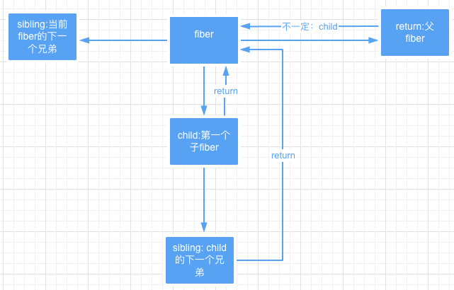
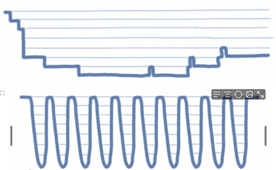

# VirtualDOM 及 Diff 算法

## 什么是 Virtual DOM
Virtual DOM是一种编程概念.在这个概念里，UI以一种理怨化的，或者说“虚拟的"裹现形式被保存于内存中.并通过如ReactDOM等类库使之与“其实的"DOM同步.这一过程叫做协调.

这种方式赎予了 React声明式的API：您告诉React希望让UI是什么状态,React就确保DOM匹配该状态.这使您可以从属性操作、事件处理和手动DOM更新这些在构建应用程序时,必要的操作中解放出来.

与其将“Virtual DOM”视为一种技术，不如说它是一种模式，人们爆到它时经常是要表达不同的东西.在React的世界里，术语"Virtual DOM"通常与React元素关联在一起，因为它们都是代表了用户界面的对象.而React也使用一个名为“fibers”的内部对象来存放组件树的附加信息.上述二者也被认为是React中-Virtual DOM”实现的一部分.

用 JavaScript 对象表示 DOM 信息和结构，当状态变更的时候，重新渲染这个 JavaScript 的对象结构。这个 JavaScript 对象称为虚拟DOM。

DOM操作很慢，轻微的操作都可能导致页面重新排版，非常耗性能。相对于DOM对象，js对象处理起来更快，而且更简单。通过diff算法对比新旧vdom之间的差异，可以批量的、最小化的执行dom操作，从而提升用户体验。


## Fiber是什么
传统的VDOM中，如React15 VDOM 和 Vue3 VDOM，当父节点有多个子节点的时候，父节点标记子节点的属性children是个数组，在更新VDOM的过程中，我们会按照深度优先遍历的方式，自上而下，自左而右，遍历子节点。

#### 存在问题

React 16 之前的版本比对更新 VirtualDOM 的过程是采用循环加递归实现的，这种比对方式有一个问题，就是一旦任务开始进行就无法中断，如果应用中组件数量庞大，主线程被长期占用，直到整棵 VirtualDOM 树比对更新完成之后主线程才能被释放，主线程才能执行其他任务。这就会导致一些用户交互，动画等任务无法立即得到执行，页面就会产生卡顿, 非常的影响用户体验。

核心问题：递归无法中断，执行重任务耗时长。 JavaScript 又是单线程，无法同时执行其他任务，导致任务延迟页面卡顿，用户体验差。

#### 解决方案

1. 利用浏览器空闲时间执行任务，拒绝长时间占用主线程
2. 放弃递归只采用循环，因为循环可以被中断
3. 任务拆分，将任务拆分成一个个的小任务

#### 实现思路

在 Fiber 方案中，为了实现任务的终止再继续，DOM 比对算法被分成了两部分：

1. 构建 Fiber (可中断)
2. 提交 Commit (不可中断)

DOM 初始渲染: virtualDOM -> Fiber -> Fiber[] -> DOM

DOM 更新操作: newFiber vs oldFiber -> Fiber[] -> DOM

#### Fiber 对象

```
{
  type         节点类型 (元素, 文本, 组件)(具体的类型)
  props        节点属性
  stateNode    节点 DOM 对象 | 组件实例对象
  tag          节点标记 (对具体类型的分类 hostRoot || hostComponent || classComponent || functionComponent)
  effects      数组, 存储需要更改的 fiber 对象
  effectTag    当前 Fiber 要被执行的操作 (新增, 删除, 修改)
  parent       当前 Fiber 的父级 Fiber
  child        当前 Fiber 的子级 Fiber
  sibling      当前 Fiber 的下一个兄弟 Fiber
  alternate    Fiber 备份 fiber 比对时使用
}
```

但是随着React的演进，传统VDOM被淘汰，Fiber取而代之，Fiber与传统VDOM的不同之处主要体现在它的结构上，如child、return、sibling属性的添加。关系如下图所示：


这种传统VDOM到Fiber的演进，被称为stack reconciler到fiber reconciler的演进。

#### 为什么会发生这种改变呢？

在传统的stack reconciler中，一旦任务开始，就无法停下，不管这个任务有多庞大，而这个时候如果来了更高优先级的任务，那么高优先级的任务无法得到立即处理，从而会出现卡顿现象。

如何解决这种问题呢？  
做任务分解、给任务添加优先级，即实现增量渲染，把渲染任务拆分成块，匀到多帧。这也就意味着一个任务执行完毕后，下个任务可能是它的下一个兄弟节点或者叔叔节点，这个时候Fiber的链表结构就派上用场了。

## 时间切片是什么?
一个时间段。


现在广泛使用的屏幕的刷新率一般都是 60Hz，而在两次硬件刷新之间浏览器进行两次重绘是没有意义的，只会消耗性能。因此 浏览器会利用这个间隔时间1000ms/60适当地对绘制进行节流， 因此 16ms 就成为页面渲染优化的一个关键时间。 

React中使用的是5ms，并没有使用传统的16ms，也就是说没有实现帧对齐，因为大部分任务不需要与帧对齐，如果需要的话，可以用 requestAnimationFrame。

调度器周期地执行任务，防止主线程上还有其他高优先级任务，如用户交互事件。默认情况下，每帧内周期性执行几次。

## 描述下React的任务调度机制
React中实现了一个`单线程任务调度器`，使用`最小堆`的数据结构管理这些任务，每次来了新的任务都会先放入最小堆任务池。

在时间切片内，循环执行任务，如果超时，那么再次重新调度。这样就避免了一些高优先级任务因为来的晚而迟迟得不到处理的问题，从而提升页面流畅度。

任务执行的顺序取决于它们的优先级与过期时间，所以值越小，证明这个任务越应该先被执行。而单线程任务调度器每次只能执行一个最任务，因此采用最小堆的数据结构。

## React18 VDOM DIFF算法

[参考思维导图](https://www.processon.com/view/link/61b20cab1e08534ca6ddc6f8?spm=wolai.workspace.0.0.7885398eMuh3KS)

## Vue3 VDOM DIFF算法

- [参考思维导图](https://www.processon.com/view/link/61b20cab1e08534ca6ddc6f8?spm=wolai.workspace.0.0.7885398eMuh3KS)
- [参考文章](https://mp.weixin.qq.com/s/-5XD6eYoEWgw_fcD2GVpjQ?spm=wolai.workspace.0.0.165d30aaUWmjyK)
- [参考视频](https://www.bilibili.com/video/BV1QL4y1u7Nd/?spm=wolai.workspace.0.0.165d30aaUWmjyK&spm_id_from=333.999.0.0&vd_source=ce7ca0ac5a3d9bb363768d9e1ce9fbfb)
## 对比React18/Vue3 VDOM DIFF
1. 子节点数据结构上 React的old是单链表，Vue的old是数组 React只单向查找，Vue双向查找
2. 哈希表 为了快速通过key值找到节点，双方都用到了Map React中根据old做出Map，Vue中则是根据new做成Map 延伸：为什么是Map，而不是Object
React18/Vue3VDOMDIFF比较
3. 如果old和new其中一方已经遍历完毕，两者处理相同。这也是必然的
4. Vue用到了LIs. 注意掌握其算法