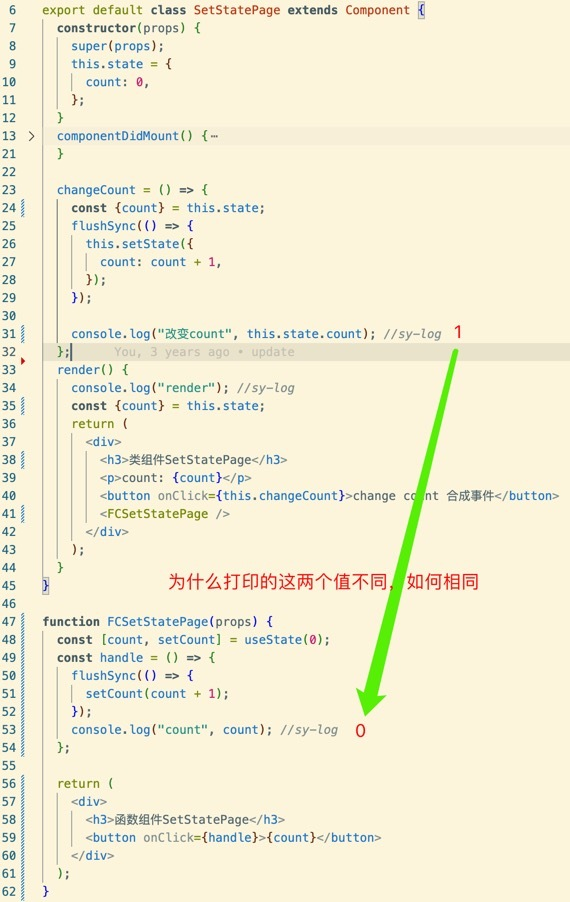
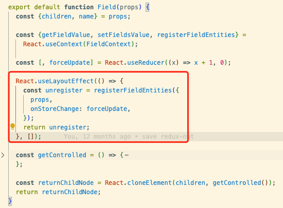
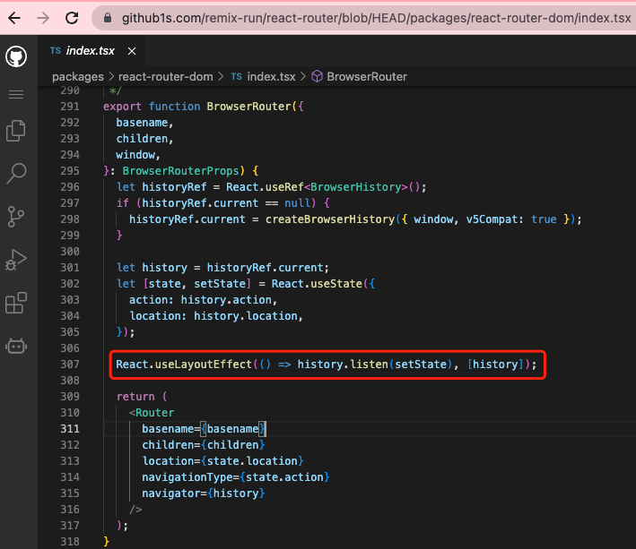
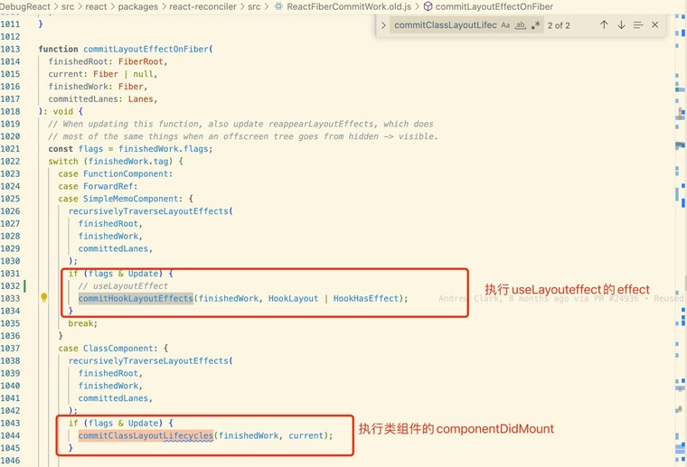
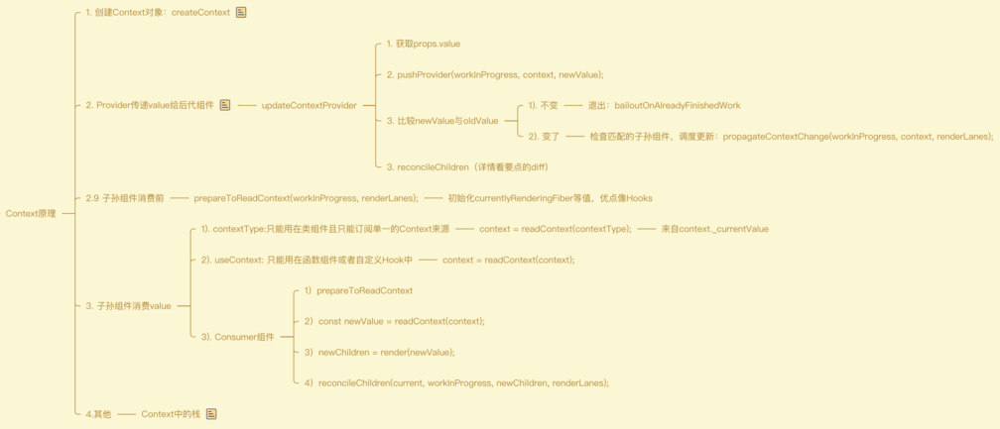

# ReactHooks

## 简单介绍

React 出现最初，99%组件都是类组件，因为我们可以在类组件内部使用状态、使用副作用等，而这些在函数组件内部都做不到，因此以前的函数组件基本上只能作为静态组件展示。因此，哪怕刚开始你使用了函数组件，随着项目迭代，可能也要再修改为类组件。

Hooks 的引入，使得在函数组件内部定义状态、使用副作用等成为可能。并且 Hooks 还带来了其他好处，比如使得可以使用自定义 Hook 复用状态逻辑、也可以定义多个副作用处理函数。完美解决了类组件臃肿的问题。

## Hooks 的优势

1. **更利于状态逻辑的复用**：类组件中一般通过渲染属性和高阶组件（HOC）复用一些逻辑，需要在外层嵌套组件，比较臃肿。
2. **更加易于测试**：React 函数组件具有更好的测试性，因为函数组件只依赖于输入的 props
3. **class 存在类成员方法`this`指向的正确性问题**
4. **类组件每个生命周期函数只能写一次**：在编写复杂组件情况下，代码臃肿。hooks 更细粒度，可以自定义 hook 拆分复用逻辑。
5. **类组件也给工具带来一些问题**：react class 不能很好的压缩，并且会使热重载出现不稳定的情况

> 不好压缩：因为它们使用了 ES6 的 class 语法糖和大量的方法，如 render() 等。这些方法被绑定到了组件实例上，使得组件在执行时需要访问这些方法。而压缩器可能会删除这些方法的名称，从而导致组件无法正常运行。相比之下，函数组件通常是无状态的，没有绑定的方法和实例，因此更容易被压缩。

> 热重载不稳定: 因为在热重载时，React 将会重新加载组件，但由于 Class Components 在内部维护了一些状态和副作用，这些状态和副作用会在重新加载时被重置，从而导致不稳定的情况。相对地，函数式组件更容易进行热重载，因为它们没有内部状态和副作用

:::tip 自定义 hook
useXyz命名方式，注意是use+大写字母开头的命名方式，用于React中复用状态逻辑。具体应用如AntD4/5 Form的`useForm`、React-Redux的`useDispatch`、`useSelector`等。

自定义Hook中可以像函数组件一样，使用所有的Hooks API。

推荐ahooks库：[https://ahooks.js.org/zh-CN/guide](https://ahooks.js.org/zh-CN/guide), 建议解读下其中自定义hooks源码。
:::

## 为什么Hook出现之后，函数组件中可以定义state，保存在了哪里?
hooks出现之前，函数组件内部无法定义state，主要是因为函数组件每次更新，定义在函数体里的值都要重新初始化，没法保存。

而hooks提供的useState或者useReducer可以让函数组件在组件内定义state，每一个hook都有个对应的hook对象，这个对象上会存储状态值、reducer等值，这个hook对象又以单链表的数据结构存在fiber上，而fiber是React的虚拟DOM，存在于内存中。

## React 类组件写法(不推荐)

```jsx
import React, { Component } from 'react';
class Example extends Component {
    constructor(props) {
        super(props);
        this.state = {
            count: 0,
        };
    }
    render() {
        return (
            <div>
                <p>你点击的次数{this.state.count}</p>
                <button onClick={this.addCount.bind(this)}>请点击</button>
            </div>
        );
    }
    addCount() {
        this.setState({
            count: this.state.count + 1,
        });
    }
}
export default Example;
```

## React 函数组件写法

```jsx
import { useState } from 'react';

function Example() {
    const [count, setCount] = useState(0);

    function handleClick() {
        setCount(count + 1);
    }

    return <button onClick={handleClick}>Clicked {count} times</button>;
}
export default Example;
```

## 比较函数组件与类组件的内部状态
问题：

### 相同点
定义组件状态，并且状态更新，组件也要更新。

### 不同点
- API不同
类组件：this.state、this.setState

函数组件：useState、useReducer


- 存储方式不同
类组件的state存储在类组件实例与fiber上

函数组件的state存储在fiber的hook上

- 更新不同
setState时候，类组件的新的state与旧的state合并对象，而函数组件是新的state覆盖老的state。并且，在useState的setState中，新旧state相同，则函数组件拒绝更新。

- 组件中使用状态的时候，取值直接来源不同

类组件中使用状态，直接使用this.state，它的直接来源是类组件实例。换句话说，如果想要获取类组件的新的状态值，可以直接访问this.state。

*注：fiber与类组件实例上的state保持同步。*

函数组件中使用状态，直接使用useState或者useReducer**函数返回值**数组的第0个元素，这个值来着fiber上的hook对象。
而如果想要获取函数组件中的一个新的状态值，必须重新执行useState或者useReducer函数，即必须执行函数组件。

图中的函数组件内未获取到最新 state 的问题，可以通过 useEffect 依赖

## 类组件废除三个老生命周期的原因
图片：https://projects.wojtekmaj.pl/react-lifecycle-methods-diagram/
- *UNSAFE_componentWillMount*
- *UNSAFE_componentWillUpdate*
- *UNSAFE_componentWillReceiveProps*

stack reconciler → fiber reconciler

从16.3开始，这三个生命周期将不再被推荐使用，因为在随着React架构的迭代，组件的更新时间将不再确定，并且可能会被打断、中止，那么“将要挂载、更新、接收参数这些事情”，都将变得不再可靠 （可能会执行多次）。因此，这些生命周期都成为了*UNSAFE_*，不再建议使用。（这里，“不安全”不是指安全性，而是表示使用这些生命周期的代码在 React 的未来版本中更有可能出现错误，尤其是在启用异步渲染后。）

## `useState`

是 React 自带的一个 Hook 函数，它的作用是用来声明状态 State 变量

```jsx
import { useState } from 'react';
function Counter() {
    const [count, setCount] = useState(0);

    function handleClick() {
        setCount(count + 1);
    }

    return <button onClick={handleClick}>Clicked {count} times</button>;
}
export default Counter;
```

`useState` 返回值的第二个设置的方法，有两种写法

```jsx
// 第一种直接传入更新的值
setState(value);
// 第二种传入一个回调函数，进行复制的更新逻辑操作
setState(callback);
```

**注意**：如果更新的数据与上一次一样，React 将跳过子组件的渲染和 Effect 的执行

## setState 是同步还是异步

这个需要分两种情况分析：

1. 18.x 以下版本（[参考](https://zhuanlan.zhihu.com/p/350332132)）

-   先说结论：  
    只要你进入了 react 的调度流程，那就是异步的。只要你没有进入 react 的调度流程，那就是同步的。什么东西不会进入 react 的调度流程？  
    setTimeout setInterval ，直接在 DOM 上绑定原生事件等。这些都不会走 React 的调度流程，你在这种情况下调用 setState ，那这次 setState 就是同步的。 否则就是异步的。  
    而 setState 同步执行的情况下， DOM 也会被同步更新，也就意味着如果你多次 setState ，会导致多次更新，这是毫无意义并且浪费性能的。
-   分析源码

```js
// react 17.x
if (executionContext === NoContext) {
    resetRenderTimer();
    flushSyncCallbackQueue();
}
```

2. 18.x 及以上版本（[参考](https://zhuanlan.zhihu.com/p/460668459)）

-   先说结论：  
    从 react 18 开始, 使用了 createRoot 创建应用后, 所有的更新都会进行[自动批处理](https://github.com/reactwg/react-18/discussions/21)(也就是异步合并).使用 render 的应用会保持之前的行为.  
    如果你想保持同步更新行为, 可以使用 ReactDOM.flushSync().
-   分析源码

```js
// react 18.x
if (
    lane === SyncLane &&
    executionContext === NoContext &&
    (fiber.mode & ConcurrentMode) === NoMode &&
    // Treat `act` as if it's inside `batchedUpdates`, even in legacy mode.
    !ReactCurrentActQueue$1.isBatchingLegacy
) {
    resetRenderTimer();
    // 仅在遗留模式下刷新同步回调
    flushSyncCallbacksOnlyInLegacyMode();
}
// 总结：在升级到18版本之后的react，只有在你使用ReactDOM.render的时候(LegacyMode)才会保持之前的行为, 否则都会对你的更新进行合并处理, 也就是自动批处理. 
```

:::tip
我们一直说的同步异步并不是指setState本身, setState本身一直一个同步函数, 我们指的是调用完setState后react会同步的去执行后续的步骤还是会异步的去执行后续的步骤.
:::

## flushSync 是什么？
如果我们想进行同步更新可以使用flushSync函数, 那么它又干了啥。[参见源码](https://github.com/facebook/react/blob/main/packages/react-reconciler/src/ReactFiberWorkLoop.js#L1527)   
结论：这个函数会在执行完传给他的fn函数后马上去清空一次更新队列, 也就是调用flushSyncCallbacks方法, 就是我们之前在异步中调用setState的行为.

-   示例代码
```js
import React from 'react';
import { flushSync } from 'react-dom';

class App extends React.Component {
  state = {
    data: 1
  }

  test = () => {
    setTimeout(() => {
      flushSync(() => {
        this.setState({data: 2});
      });

      console.log('data', this.state.data); // data 2

      flushSync(() => {
        this.setState({data: 3});
      });

      console.log('data', this.state.data); // data 3
    }, 0);
  }

  render() {
    console.log("render");
    return (
      <div>
        <button onClick={this.test}>{this.state.data}</button>
      </div>
    )
  }
}

export default App;
```

## setState 异步的原因

-   保证内部的一致性：当我们使用 state-lifting(状态提升) 时候，同步更新 state，但 this.props 并不会，如果要立即更新 this.props （也就是立即重渲染父组件），就必须放弃批处理（根据情况的不同，性能可能会有显著的下降）[Dan 的解释](https://github.com/facebook/react/issues/11527) 现在 React ( state, props, refs)提供的对象在内部是相互一致的。
-   性能优化：将 state 的更新延缓到最后批量合并再去渲染对于应用的性能优化是有极大好处的，如果每次的状态改变都去重新渲染真实 dom，那么它将带来巨大的性能消耗。

## setState 使用注意事项

- 对于复杂对象的更改，使用 Immer 编写简洁的更新逻辑。Immer 允许您编写简洁的代码，就好像您正在改变对象一样，但在幕后它执行不可变的更新。[示例Demo](https://codesandbox.io/s/mclx2n?file=/App.js&utm_medium=sandpack)
- 当使用 useState 进行复杂对象的初始化时，可以将初始值设置为一个函数，而不是一个对象，以实现延迟初始化。[示例Demo](https://codesandbox.io/s/wxcif1?file=%2FApp.js&utm_medium=sandpack)
> 请注意，您传递函数本身，而不是函数调用后的结果。如果你传递一个函数给useState，React 只会在初始化期间调用它。
- 当使用usestate对数据进行更新，并不能立刻获取到最新的数据。可以配合useEffect使用
- useState存入的值只是该值的引用（引用类型）
[具体参考官方文档](https://react.dev/reference/react/useState#usage)
[hooks使用官方文档](https://react.dev/reference/react)

## useState 与 useReducer 区别
这两个Hook都是用于函数组件内部定义状态，`useReducer`可以接收一个reducer函数，意味着可以把状态修改逻辑放在reducer函数中，还可以多次复用。

因此，对于简单的状态值定义，可以使用`useState`，如果状态值修改逻辑复杂，想要抽离出来或者复用修改逻辑，可以选择useReducer。
```jsx
const [state, setState] = useState(initialState);
const [state, dispatch] = useReducer(reducer, initialArg, init);
```
使用useState的时候，如果state不发生变化，组件不会更新。但是useReducer却会更新。
```js
import {useState, useReducer} from "react";

const third = (x) => x;

export default function App() {
  const [first, setFirst] = useState(0);
  const [second, setSecond] = useReducer((x) => x, 0, third);

  console.log("render"); //sy-log

  return (
    <div className="App">
      {/* 不会更新组件 */}
      <button onClick={() => setFirst(0)}>first{first}</button>
      {/* 会更新组件 */}
      <button onClick={() => setSecond(0)}>first{second}</button>
    </div>
  );
}
```
用法参考[官方 Demo 使用示例](https://codesandbox.io/s/fjrfuh?file=/App.js&utm_medium=sandpack)

> 原因：使用useReducer时，由于返回的state是一个新的对象，虽然它的值与旧的state相同，但其引用已经发生了改变，因此React会认为state已经发生了变化，触发组件重新渲染。

## 为什么useState/useReducer返回一个数组，而不是其它结构，比如对象
因为函数组件中可以多次使用useState/useReducer，可以定义多个不同state，数组可以一次返回state、setState，命名交给用户自定义。  
如果是对象再解构，那么state的命名就要写死了，用户想定义多个state的时候，还得自己改写名字，太麻烦了。

## useRef 与 useState 区别
`useRef`用于记录一个值，这个值在函数组件卸载前，指的都是同一个引用。比如上面图中的例子，组件卸载前，我都想要的是这一个history，而不是每次都新建一个，新建就不是更新了，因此使用了useRef做了记录。这个值记录在`hook.memoizedState`上。

`useState`用于定义一个state，当state改变，组件更新。state也是记录在`hook.memoizedState`上。

## useEffect/useLayoutEffect用法与区别
`useEffect(setup, dependencies?)`

该 Hook 接收一个包含命令式、且可能有副作用代码的函数。

在函数组件主体内（这里指在 React 渲染阶段）改变 DOM、添加订阅、设置定时器、记录日志以及执行其他包含副作用的操作都是不被允许的，因为这可能会产生莫名其妙的 bug 并破坏 UI 的一致性。

使用 useEffect 完成副作用操作。赋值给 useEffect 的函数会在组件渲染到屏幕之后**延迟**执行。默认情况下，effect 将在每轮渲染结束后执行，但你可以选择让它 在只有某些值改变的时候才执行。

`useLayoutEffect`函数签名与 `useEffect` 相同，但它会在所有的 DOM 变更之后**同步**调用 effect。可以使用它来读取 DOM 布局并同步触发重渲染。在浏览器执行绘制之前，`useLayoutEffect` 内部的更新计划将被同步刷新。

`setup`函数返回值在源码中称为destroy，如果destroy是函数，则会在组件更新或者卸载前执行。经常用于清除订阅、清除定时器等操作。

#### 进阶内容：
这里所谓的延迟、同步，指的是React任务调度中的任务调度，所谓延迟就是`useEffect`的effect不与组件渲染使用同一个任务调度函数，而是再单独调用一次任务调度函数，即用的不是一个task。因为如果effect和组件渲染使用同一个task，那么effect势必会加长这个task的执行时间，阻碍组件渲染。同理，`useLayoutEffect`所谓同步，指的是`useLayoutEffect`的effect和组件渲染使用同一个task，那么就会阻碍组件渲染。

因此大多数情况下，尽可能使用标准的 useEffect 以避免阻塞视觉更新。举个需要使用`useLayoutEffect`的场景，AntD4/5 Form的底层form，也就是rc-feild-form中的field如果用函数组件实现，就得这么写，如果换成`useEffect`，你会发现组件没有初始值，这是因为使用`useEffect`的时候，订阅会被延迟，那么组件接收到store变更，却没有要执行组件更新的操作，因为这个时候订阅还没有发生。


同样的事情在react-router中也存在，因此都是适用的useLayoutEffect，如下图所示。


## 为什么不能在循环，条件或嵌套函数中调用Hook？
Hooks使用规则：**不要在循环，条件或嵌套函数中调用Hook， 确保总是在你的React 函数的最顶层以及任何return 之前调用他们。**

React中每个组件都有一个对应的FiberNode，其实就是一个对象，这个对象是有个属性叫memoizedState。当组件是函数组件的时候，fiber.memoizedState上存储的就是Hooks单链表。

单链表的每个hook节点没有名字或者key，因为除了它们的顺序，我们无法记录它们的唯一性。因此为了确保某个Hook是它本身，我们不能破坏这个链表的稳定性。

试想一下，如果在if内部使用Hook，那么组件更新的时候，hook3可能就变成了hook0，这不就乱了，毕竟每个hook都存了很多信息，比如state、effect、依赖项等。

在嵌套函数内部使用Hook，我们也不难确保这个嵌套函数里的Hook到底什么时候调用，所以还是不能确定fiber.memoizedState单链表上hook节点的稳定性。

Hook类型定义如下：
```js
export type Hook = {
  memoizedState: any,  // 不同情况下，取值也不同，useState/useReducer时候存的是state，useEffect/useLayoutEffect时候存的是effect单向循环链表
  baseState: any,
  baseQueue: Update<any, any> | null, 
  queue: any,
  next: Hook | null, // 下一个Hook，如果为null，证明这是最后一个hook
};
```
```js
fiber.memorizedState(hook0)-> next(hook1)-> next(hook2)->next(hook3)->next(hook4)->next(hook5)(workInProgressHook)

const workInProgressHook = null
//let workInProgressHook = null
//hook3

function FunctionalComponent () {
  const [state1, setState1] = useState(0)
  const [state2, setState2] = useState(1)  
  const [state3, setState3] = useState(2)  
  return ...
}

hook1 => Fiber.memoizedState
state1 === hook1.memoizedState
hook1.next => hook2
state2 === hook2.memoizedState
hook2.next => hook3
state3 === hook2.memoizedState
```

## useState/useReducer原理

用于定义函数组件内部状态，状态变更，组件更新。状态值存储在函数组件的fiber的hook.memoizedState上。

组件初次渲染阶段：

1. 把state初始值存储hook.memoizedState
2. 初始化更新队列，存储到hook.queue上
3. 定义dispatch事件，并存储到hook.queue上。（注意现在useState/useReducer的dispatch事件并不相同）
4. 返回 ` [hook.memoizedState, dispatch];`

组件更新阶段，（批量更新）：

1. 检查是否有上次未处理的更新，如果有，则添加到更新队列上（更新队列是个环形链表）
2. 循环遍历更新队列，得到newState
3. 把最终得到的newState赋值到hook.memoizedState上
4. 返回 ` [hook.memoizedState, dispatch];`

执行useReducer的dispatch事件：  
// dispatchReducerAction  
创建一个update对象，存储到更新队列中，然后执行scheduleUpdateOnFiber函数，去更新。


执行useState的dispatch事件：  
// dispatchSetState  
创建一个update对象，如果新的state和老的state相同，则退出更新，即进入bailout。否则存储update到更新队列中，然后执行scheduleUpdateOnFiber函数，去更新。

## 解释下useImperativeHandle场景
[https://zh-hans.react.dev/reference/react/useImperativeHandle#exposing-your-own-imperative-methods](https://zh-hans.react.dev/reference/react/useImperativeHandle#exposing-your-own-imperative-methods)

让用户可以把一个变量当做ref暴露出来， 经常和forwardRef一起使用。

1. 把ref暴露给父组件。比如AntD 4/5中支持类组件实现时候用到了。
2. 暴露一个重要方法给父组件。

## 类组件的componentDidMount与useEffect/useLayoutEffect对比

复习知识点：useEffect／useLayoutEffect 用法与区别（上面有这个问题）

赋值给 `useEffect` 的函数会在组件渲染到屏幕之后**延迟**执行。

`useLayoutEffect`函数签名与 `useEffect` 相同，但它会在所有的 DOM 变更之后**同步**调用 effect。

`componentDidMount`执行时机同`useLayoutEffect`。

源码截图：


## 讲述Context原理



## hooks 缺点

#### 简述

1. 状态不同步、不好用的 useEffect

这绝对可以成为摒弃 react hooks 的理由。函数的运行是独立的，每个函数都有一份父级作用域。当我们处理复杂逻辑的时候，经常会碰到状态不同步的问题

2. 副作用代码从主动式变成响应式

写函数组件时，你不得不改变一些写法习惯。你必须把深入理解 useEffect 和 useCallback 这些 api 的第二个参数的作用。其次，还有下面几点：

3. useEffect 的依赖参数并不好写
   你需要花时间去判断该把什么变量加入到依赖数组，幸运的是 eslint-plugin-react-hooks 很多场景可以帮你解决这点，但有时得靠你自己加以判断

4. useEffect 很容易出错
   它是响应式的，当某个依赖项变化时它才会被调用。你必须去理解它的调用时机、调用时的状态老旧问题，这不直观，也难以维护。有时，useEffect 会发生比你预期更多的调用次数

#### 怎么避免 react hooks 的常见问题

不要在 useEffect 里面写太多的依赖项，划分这些依赖项成多个 useEffect，这样更好维护

#### Hook API

| 名称                | 描述                                                             |
| ------------------- | ---------------------------------------------------------------- |
| useState            | 在函数组件中维护自己的状态                                       |
| useEffect           | 在函数组件中实现生命周期钩子函数                                 |
| useContext          | 用来处理多层级传递数据的方式，减少组件嵌套                       |
| useReducer          | 跟 react-redux 的使用方式一样，算是提供一个 mini 的 Redux 版本   |
| useCallback         | 获得一个记忆函数，避免在某些情况下重新渲染子组件，用来做性能优化 |
| useMemo             | 获得一个记忆组件，和 useCallback 非常类似，它适用于返回确定的值  |
| useRef              | 生成对 DOM 对象的引用，它是一个真正的引用，而不是把值拷过去      |
| useImperativeHandle | 透传 ref，用于让父组件获取子组件内的引用                         |
| useLayoutEffect     | 同步执行副作用，在页面完全渲染完成后，操作 DOM                   |

写函数组件时，你不得不改变一些写法习惯。你必须清楚代码中`useEffect`和`useCallback`的“依赖项数组”的改变时机。有时候，你的 useEffect 依赖某个函数的不可变性，这个函数的不可变性又依赖于另一个函数的不可变性，这样便形成了一条依赖链。一旦这条依赖链的某个节点意外地被改变了，你的 useEffect 就被意外地触发了，如果你的 useEffect 是幂等的操作，可能带来的是性能层次的问题，如果是非幂等，那就糟糕了。

所以，对比`componentDidmount`和`componentDidUpdate`，useEffect 带来的心智负担更大。

#### 避免 react hooks 的常见问题

1.  不要在`useEffect`里面写太多的依赖项，划分这些依赖项成多个单一功能的`useEffect`。其实这点是遵循了软件设计的“单一职责模式”。
1.  如果你碰到状态不同步的问题，可以考虑下手动传递参数到函数。如：

```
   // showCount的count来自父级作用域
   const [count,setCount] = useState(xxx);
   function showCount(){ console.log(count) }

   // showCount的count来自参数
   const [count,setCount] = useState(xxx);
   function showCount(c){ console.log(c) }
```

但这个也只能解决一部分问题，很多时候你不得不使用上述的`useRef`方案。

3. 拆分组件，细化组件的粒度。复杂业务场景中使用 hooks，应尽可能地细分组件，使得组件的功能尽可能单一，这样的 hooks 组件更好维护。
4. `hooks`很好用很强大，但它不擅长异步。但在有太多异步逻辑的代码时，class 比它更适合、更稳、更好维护。
5. 一定要加入 eslint-plugin-react-hooks 这个插件，并且重视它的警告！
