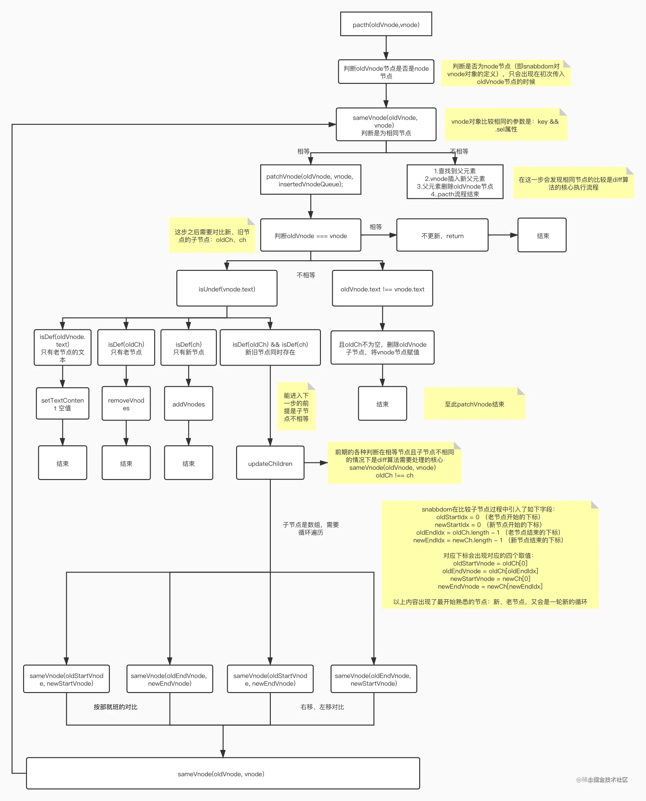

# 虚拟 DOM 原理

## 一、Diff 算法的执行过程

`Diff`算法是一种通过同层的树节点进行比较的高效算法，避免了对树进行逐层搜索遍历。  
执行流程：  
1、执行`patch`函数传入新旧两个节点如：`patch(oldVnode, vnode)`   
2、判断两个新旧节点`oldVnode, vnode`是否相同。即将新旧节点`oldVnode, vnode`转化为`VNode`对象，判断节点的  `vnode.key`与`vnode.key`是否都相同。  
3、若两个节点不相同，在父节点插入新节点`vnode`，然后删除老节点`oldVnode`   
4、如果两个节点的`vnode.key`与`vnode.key`相同，就需要对比两个节点的文本、子节点（数组）是否相同，找出差异点。  
5、如果新老节点的文本不相同，只需要更新文本内容，同时判断老节点的子节点数组不为空的，删除老节点的所有子节点  
6、如果只有新节点有子节点数组，重置老节点的文本为空，添加新节点数组。  
7、如果只有老节点有子节点数组，删除所有子节点数组  
8、如果新老节点都有子节点数组，且子节点不相同（`vnode.key`与`vnode.key`都相同，但子节点数组不同）--复杂的逻辑  
9、这一步会发现是新老子节点数组对比，那么必定是一个循环遍历。

## 二、详细分析参考

[深入浅出虚拟 DOM 和 Diff 算法，及 Vue2 与 Vue3 中的区别](https://juejin.cn/post/7010594233253888013)

## 三、以下是简单的伪代码实现流程如下

代码注释可能会帮助理解流程：

```js
function init () {
    function updateChildren (oldCh, newCh) {
        // 以下参数有助于帮助理解遍历是下标的移动过程
        let oldStartIdx = 0;
        let newStartIdx = 0;
        let oldEndIdx = oldCh.length - 1;
        let oldStartVnode = oldCh[0];
        let oldEndVnode = oldCh[oldEndIdx];
        let newEndIdx = newCh.length - 1;
        let newStartVnode = newCh[0];
        let newEndVnode = newCh[newEndIdx];
        let oldKeyToIdx: KeyToIndexMap | undefined;
        let idxInOld: number;
        let elmToMove: VNode;
        let before: any;

        //同级别节点比较
        while (oldStartIdx <= oldEndIdx && newStartIdx <= newEndIdx) {
            if (oldStartVnode == null) {
                oldStartVnode = oldCh[++oldStartIdx]; // Vnode might have been moved left
            } else if (oldEndVnode == null) {
                oldEndVnode = oldCh[--oldEndIdx];
            } else if (newStartVnode == null) {
                newStartVnode = newCh[++newStartIdx];
            } else if (newEndVnode == null) {
                newEndVnode = newCh[--newEndIdx];
            } else if (sameVnode(oldStartVnode, newStartVnode)) {
                // 同级节点且新、旧开始位置相同 比较好理解
                patchVnode(oldStartVnode, newStartVnode);
                oldStartVnode = oldCh[++oldStartIdx];
                newStartVnode = newCh[++newStartIdx];
            } else if (sameVnode(oldEndVnode, newEndVnode)) {
                // 同级节点且新、旧开始位置相同 比较好理解
                patchVnode(oldEndVnode, newEndVnode);
                oldEndVnode = oldCh[--oldEndIdx];
                newEndVnode = newCh[--newEndIdx];
            } else if (sameVnode(oldStartVnode, newEndVnode)) {
                // 同级节点且新、旧开始位置不同，如果相同交互位置
                // Vnode moved right
                patchVnode(oldStartVnode, newEndVnode);
                api.insertBefore();
                oldStartVnode = oldCh[++oldStartIdx];
                newEndVnode = newCh[--newEndIdx];
            } else if (sameVnode(oldEndVnode, newStartVnode)) {
                / 同级节点且新、旧开始位置不同，如果相同交互位置
                // Vnode moved left
                patchVnode(oldEndVnode, newStartVnode);
                api.insertBefore();
                oldEndVnode = oldCh[--oldEndIdx];
                newStartVnode = newCh[++newStartIdx];
            } else {
                // createKeyToOldIdx 获取所有老节点子节点数组的key  这可能是最麻烦的对比的位置
                if (oldKeyToIdx === undefined) {
                    oldKeyToIdx = createKeyToOldIdx(oldCh, oldStartIdx, oldEndIdx);
                }
                // 最后的理论场景还是将新节点插入到老节点的父元素
                // 找到老节点子节点数组key
                // 找到新开始节点位置的key 不为空 然后插入父元素
                idxInOld = oldKeyToIdx[newStartVnode.key as string];
                if (isUndef(idxInOld)) {
                    // New element
                    api.insertBefore();
                } else {
                    elmToMove = oldCh[idxInOld];
                    if (elmToMove.sel !== newStartVnode.sel) {
                        api.insertBefore();
                    } else {
                        patchVnode(elmToMove, newStartVnode);
                        oldCh[idxInOld] = undefined as any;
                        api.insertBefore();
                    }
                }
                newStartVnode = newCh[++newStartIdx];
            }
        }
        //循环结束的收尾工作
        if (oldStartIdx <= oldEndIdx || newStartIdx <= newEndIdx) {
            if (oldStartIdx > oldEndIdx) {
                before = newCh[newEndIdx + 1] == null ? null : newCh[newEndIdx + 1].elm;
                addVnodes();
            } else {
                removeVnodes(parentElm, oldCh, oldStartIdx, oldEndIdx);
            }
        }
    }

    function patchVnode (oldVnode, vnode) {
        if (oldVnode === vnode) return;
        if (isUndef(vnode.text)) {
            if (isDef(oldCh) && isDef(ch)) {
                // 新旧节点的子节点存在且不相同是，逐个对比子节点，如要遍历
                if (oldCh !== ch) updateChildren(elm, oldCh, ch, insertedVnodeQueue);
            } else if (isDef(ch)) {
                // 只有新节点的子节点数组有值，添加所有子节点
                // 重置文本参数
                if (isDef(oldVnode.text)) api.setTextContent(elm, "");
                addVnodes();
            } else if (isDef(oldCh)) {
                // 只有老节点的子节点数组有值 删除所有子节点
                removeVnodes();
            } else if (isDef(oldVnode.text)) {
                // 只有老节点的文本有值 重置参数
                api.setTextContent(elm, "");
            }
        } else if (oldVnode.text !== vnode.text) {
            if (isDef(oldCh)) {
                // 若老节点的子节点数组不为空 删除
                removeVnodes()
            }
            api.setTextContent(elm, vnode.text!);
        }
    }

    return patch(oldVnode, vnode) {
        if (!isVnode(oldVnode)) {
            // 初次将oldVnode转换成VNode节点
            oldVnode = emptyNodeAt(oldVnode)
        }
        // 比较两个节点是否相同 key && sel (即两个节点的标识是否相同)
        if (sameVnode(oldVnode, vnode)) {
            // 详情对比新旧两个节点参数
            patchVnode(oldVnode, vnode);
        } else {
            // 找到父元素是否存在
            // 创建新节点
            createElm(vnode);
            // 插入新节点，移除老节点
            if (parent !== null) {
                api.insertBefore(parent, vnode.elm!, api.nextSibling(elm));
                removeVnodes(parent, [oldVnode], 0, 0);
            }
        }
        return vnode
    }
}
```

附录：

