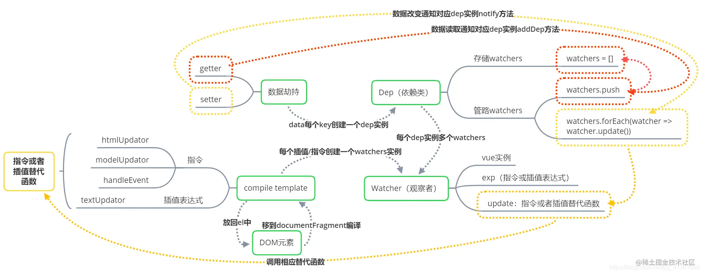

# 响应式系统

## 常用响应式 API 介绍

### ref

通常使用 ref 方法来声明一个**基本数据类型**的**响应式变量**

```ts
<template>
     <div>ref变量：{{ count }}</div>
</template>

<script setup lang="ts">
import { ref } from "vue";

const count = ref<number>(5); // 类型是：Ref<number>
// 在script当中访问值的方式：
console.log(count.value)
</script>
```

### isRef

检查参数是否是 Ref 类型的，返回 boolean 值

### unref

如果参数是一个 Ref 类型的，则返回内部值即 `xx.value` 否则返回参数本身。
实际就是 `isRef(val) ? val.value : val` 这样的判断而已。

### toRef

可以为一个源响应式对象的某个属性去创建一个 ref 并且会保持源响应式对象上的属性 和 ref 的响应式连接。

```ts
import { ref, reactive, toRef } from "vue";

const state = reactive({
    foo: 1,
    text: "我是reactive",
});

const toRefText = toRef(state, "text");
console.log("Old-Text", toRefText.value); // 我是reactive
state.text = "我是reactive-ToRef";
console.log("New-Text", toRefText.value); // 我是reactive-ToRef
```

### toRefs

将响应式对象解构为一个个 Ref 类型的响应式变量

```ts
import { reactive, toRefs } from "vue";

const state = reactive({
    foo: 1,
    text: "我是reactive",
});

const { foo, text } = toRefs(state);
// foo： Ref<number>
// text：Ref<string>
```

### reactive

创建一个响应式对象副本

```ts
import { reactive } from "vue";

interface IState {
    foo: number;
    text: string;
}

const state = reactive<IState>({
    foo: 1,
    text: "我是reactive",
});
```

### readonly

接受一个响应式对象、普通对象或 Ref 并且返回其只读代理

```ts
import { reactive, readonly } from "vue";

interface IState {
    foo: number;
    text: string;
}

let state = reactive<IState>({
    foo: 1,
    text: "我是reactive",
});

const copy = readonly(state);
/**
 * copy：{ readonly foo: number; readonly text: string;}
 */
```

### computed

**第一种：** 接收一个 getter 函数，并且根据函数的返回值返回一个不可变的响应式 ref 对象

```ts
import { ref, computed } from "vue";

const count = ref<number>(5);

const computedCount1 = computed(() => {
    return count.value * 10;
});
```

**第二种：** 接收一个具有**get** 和**set**函数的对象，用来创建可写的 ref 对象

```ts
import { ref, computed } from "vue";

const count = ref<number>(5);

const computedCount2 = computed<number>({
    get() {
        return count.value + 1;
    },
    set(val) {
        console.log("value", val);
        count.value = val + 5;
    },
});
// 我们给计算属性computedCount2赋值时会执行set函数，访问使用computedCount2时会执行get函数
computedCount2.value = 5;
```

### watchEffect

立即执行传入的函数，同时响应式的追踪函数内部其依赖，并在依赖发生变化时重新运行该函数。作用类似与监听器 watch，不在过多介绍其写法了。

**停止监听**：watchEffect 在组件的 setup 或生命周期当中被使用，在组件卸载时会自动停止。当然我们也可以手动停止监听，直接调用返回值来停止监听。

```ts
const stopEffect = watchEffect(() => {
    // 相关代码
});

// 停止监听
stopEffect();
```

注：3.2 版本还新增了两个`watchPostEffect`和`watchSyncEffect`，但只是参数上的不同。具体使用细节还是得看文档呀~

### watch

watch 是惰性的-即回调只在监听源发生变化才会执行。说明监听源在初始赋值时是不会去执行的。

**监听单源**

```ts
const count = ref<number>(5);
const changeCountValue = () => {
    count.value = count.value + 5;
};
watch(
    () => count.value,
    (newVal, oldVal) => {
        console.log("newVal", newVal);
        console.log("oldVal:", oldVal);
    }
);
```

**监听多源**

第一个参数可以传入一个数组来同时监听对个源

```ts
watch([foo, bar], ([newFoo, newBar], [oldFoo, oldBar]) => {
    /* ... */
});
```

## 组件通信-defineProps 和 defineEmits

Vue 给我们提供了 defineProps 和 defineEmits 两个途径去定义 props 和 emits。它们只在 setup 中才能使用的**编译器宏**，不需要我们导入可以直接写。

### 父组件向子组件传值 Props

子组件定义 Props 的方法，withDefaults 则是写 Props 的默认值

```ts
<template>
    <div>{{ text }}</div>
    <div>{{ totalValue }}</div>
</template>

<script setup lang='ts'>
interface IPropPrams {
    text: string;
    totalValue: number
}
/**
 * 提供的默认值
 */
withDefaults(defineProps<IPropPrams>(), {
    text: "2",
    totalValue: 6
})
</script>
```

### 子组件向父组件传值或触发父组件时间 Emits

```ts
<template>
    <div @click="triggerEmit">点击触发emits</div>
</template>

<script setup lang='ts'>
interface IEmitFun {
    (e: 'update:change', id: number): void
}

const emits = defineEmits<IEmitFun>()

const triggerEmit = () => {
    emits('update:change', 2)
}
</script>
```

### 获取某组件实例-defineExpose

在使用 setup 语法糖时，组件是默认关闭，无法访问到组件的公开实例的。需要使用 defineExpose 在组件中定义需要被暴露出去的值或方法。

子组件暴露可访问的值或方法：

```ts
<script setup lang='ts'>
import { ref } from 'vue';

const exposeValue = ref(20)
const exposeFun = (data: number) => {
    console.log("defineProp", data)
}

defineExpose({
    val: exposeValue.value,
    fun: exposeFun
})
</script>
```

父组件使用子组件暴露的值或方法

```ts
<template>
  <ChildCom
    ref="comp"
  ></ChildCom>
</template>

<script setup lang="ts">
import { ref, onMounted } from 'vue'
const comp = ref<any>(null)

onMounted(() => {
  comp.value.fun(comp.value.val)
})
</script>
```

注意：setup 的代码会在每次组件被创建时执行，还无法获取到子组件实例。需要在 mounted 时调用

## 自定义指令的使用

自定义指令在进行 DOM 节点操作时显得格外的重要

```ts
// 注册
app.directive("my-directive", {
    // 指令具有一组生命周期钩子：
    // 在绑定元素的 attribute 或事件监听器被应用之前调用
    created() {},
    // 在绑定元素的父组件挂载之前调用
    beforeMount() {},
    // 在绑定元素的父组件挂载之后调用
    mounted() {},
    // 在包含组件的 VNode 更新之前调用
    beforeUpdate() {},
    // 在包含组件的 VNode 及其子组件的 VNode 更新之后调用
    updated() {},
    // 在绑定元素的父组件卸载之前调用
    beforeUnmount() {},
    // 在绑定元素的父组件卸载之后调用
    unmounted() {},
});
```

下面有个 copy 文本到剪贴板的例子：

-   代码来源：[# Vue3 自定义指令-10 个常见的实用指令，带详细讲解，快拿去收藏！！！](https://juejin.cn/post/6968996649515515917#heading-1)

-   关于参数：**el、binding** 参考官方文档的解释，挺多的

```ts
app.directive("copy", {
    beforeMount(el: HTMLButtonElement, binding) {
        el.textContent = binding.value;
        const copySuccess: any = binding.arg;

        el.addEventListener("click", () => {
            if (!el.textContent) return console.log("没有需要复制的内容");

            // 创建textarea标签
            const textarea = document.createElement("textarea");
            // 设置标签的相关属性
            //   textarea.style.position = "fixed";
            textarea.style.top = "-999999px";
            // 将目标内容复制个textarea标签
            textarea.value = el.textContent;
            // 插入到页面中
            document.body.appendChild(textarea);
            // 调用onselect方法a
            textarea.select();
            // 把目标内容复制进剪贴板, 该API会返回一个Boolean
            const res = document.execCommand("Copy");
            res && copySuccess
                ? copySuccess(el.textContent)
                : console.log("复制成功，剪贴板内容：" + el.textContent);
            // 移除textarea标签
            document.body.removeChild(textarea);
        });
    },
    updated(el, binding) {
        // 实时更新最新的目标内容
        el.textContent = binding.value;
    },
    unmounted(el) {
        el.removeEventListener("click", () => {});
    },
});
```

使用方式：

```ts
<template>
  <button v-copy:[copySuccess]="'点击复制'">点击复制</button>
</template>

<script setup lang="ts">
const copySuccess = (value: string) => {
  console.log("copy的值为：", value);
}
</script>
```

## 插槽的使用

### 匿名插槽

子组件：

```ts
<template>
    <div>
        <slot>默认内容</slot>
    </div>
</template>
```

父组件：

```ts
<template>
    <SlotUse>匿名插槽</SlotUse>
</template>
```

### 匿名插槽

-   写法：`v-slot:name`， 简写：`#name`

子组件：

```ts
<template>
    <div>
        <header>
            <slot name="header">默认头部</slot>
        </header>
        <main>
            <slot>默认内容</slot>
        </main>
        <footer>
            <slot name="footer">默认底部</slot>
        </footer>
    </div>
</template>
```

父组件：

```ts
<template>
    <!-- 写法：v-slot:name、简写：#name -->
    <template v-slot:header>头部内容</template>
    插槽内容
    <template #footer>底部内容</template>
  </SlotUse>
</template>
```

### 作用域插槽

作用域插槽的作用是：可以将子组件的数据通过插槽的方式传给父组件，提供给插槽内容使用

子组件：

```ts
<template>
    <div>
        <ul>
            <li v-for="(item, index) in todoList" :key="index">
                <!-- 是已通过Props的形式传出去 -->
                <slot :item="item" :index="index"></slot>
            </li>
        </ul>
    </div>
</template>

<script setup lang='ts'>
import { ref } from 'vue';
const todoList = ref(['Feed a cat', 'Buy milk'])
</script>
```

父组件：

```ts
<template>
  <SlotUse>
    <template #default="slotProps">
      <span>{{ slotProps.index }}:{{ slotProps.item }}</span>
    </template>
  </SlotUse>
</template>

// 当组件当中只定义了默认插槽时 可以简写如下方式：
// 组件中如果还包含了匿名插槽时 则需要上面这种方式
<template>
  <SlotUse v-slot="slotProps">
    <span>{{ slotProps.index }}:{{ slotProps.item }}</span>
  </SlotUse>
</template>

// 同时还支持解构插槽Prop
<template>
  <SlotUse>
    <template #default="{ item, index }">
      <span>{{ index }}:{{ item }}</span>
    </template>
  </SlotUse>
</template>

<template>
    <SlotUse v-slot="{ item, index }">
      <span>{{ index }}:{{ item }}</span>
    </SlotUse>
</template>
```

绑定在  `<slot>`  元素上的 attribute 被称为**插槽 prop**。而在父级作用域中，可以使用带值的  `v-slot`  来定义提供的插槽 prop 的名字。

## Provide 和 Inject

一个组件如果嵌套了多层子组件，那么互相传递 props 会显得相当麻烦。这时候可考虑使用 Provide 和 Inject 来传递值给更深层的组件中。

父组件：

```ts
<script setup lang="ts">
import { ref, onMounted, provide } from 'vue'

const propsTotalValue = ref(6)
const copySuccess = (value: string) => {
  console.log("copy的值为：", value);
}

provide('number', propsTotalValue)
provide('copySuccess', copySuccess)
</script>
```

子组件或更深层的子组件：

```ts
<script setup lang='ts'>
import { ref, inject, Ref } from 'vue';

const number = inject('number') as Ref<number>
const copySuccess: any = inject('copySuccess')
console.log("number->>>>", number.value);
copySuccess(78787)
</script>
```

## 响应式原理图解


