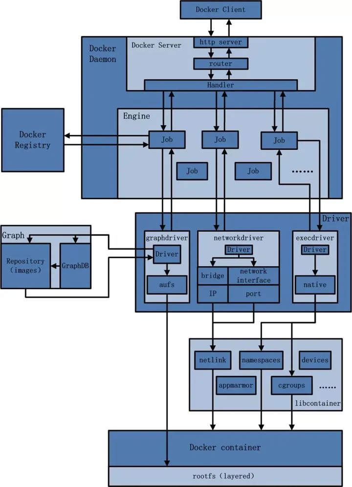

# Docker 介绍

## 概述
Docker 是一种开源的容器化平台，它可以让开发者创建、部署和运行应用程序。    Docker 容器是轻量级、可移植和自包含的，使得开发者可以在不同的环境中构建和部署应用程序，而不必担心兼容性问题或依赖关系。Docker 基于容器化的概念，即将应用程序及其所有依赖项和库打包到一个容器中。这使得应用程序可以在支持 Docker 的任何平台上运行，而不必担心底层基础架构。Docker 在软件开发行业广泛应用于构建、测试和部署应用程序。

## Docker 架构
Docker 是一个 C/S 模式的架构，后端是一个松耦合架构，模块各司其职。Docker 的架构如下图所示：



1. 用户是使用 Docker Client 与 Docker Daemon 建立通信，并发送请求给后者。

2. Docker Daemon 作为 Docker 架构中的主体部分，首先提供 Docker Server 的功能使其可以接受 Docker Client 的请求。

3. Docker Engine 执行 Docker 内部的一系列工作，每一项工作都是以一个 Job 的形式的存在。

4. Job 的运行过程中，当需要容器镜像时，则从 Docker Registry 中下载镜像，并通过镜像管理驱动 Graphdriver 将下载镜像以 Graph 的形式存储。

5. 当需要为 Docker 创建网络环境时，通过网络管理驱动 Networkdriver 创建并配置 Docker容器网络环境。

6. 当需要限制 Docker 容器运行资源或执行用户指令等操作时，则通过 Execdriver 来完成。

7. Libcontainer 是一项独立的容器管理包，Networkdriver 以及 Execdriver 都是通过 Libcontainer 来实现具体对容器进行的操作。

[详细参考](https://zhuanlan.zhihu.com/p/338838117)

## 底层技术
Docker 是用Go 编程语言编写的，并利用 Linux 内核的几个特性来提供其功能。Docker 使用一种称为容器namespaces的技术来提供隔离的工作空间。当您运行容器时，Docker 会 为该容器创建一组名称空间。

这些命名空间提供了一层隔离。容器的每个方面都在单独的命名空间中运行，并且其访问仅限于该命名空间。

## Docker 的优势与缺点
1. Docker 的优势包括：

- 轻量级：Docker容器相对于传统虚拟化技术更加轻量级，容器与主机共享操作系统内核，从而减少资源的消耗和占用。
- 可移植性：Docker容器可以在任何支持Docker的平台上运行，无需任何修改，提高了应用程序的可移植性。
- 快速部署：Docker容器可以非常快速地启动和停止，快速部署和升级应用程序。
- 环境一致性：Docker容器可以创建一个隔离的运行环境，提供了环境一致性，避免了因为环境差异导致的应用程序出现问题。
可伸缩性：Docker容器可以根据需要快速地增加或减少实例，提高了系统的可伸缩性。

2. Docker 的缺点包括：

- 安全性问题：容器与宿主机共享操作系统内核，如果操作系统内核有漏洞，容器也会受到影响。
- 存储和网络管理复杂：Docker的存储和网络管理相对复杂，需要更多的管理和维护工作。


## 容器化应用程序
1. Docker 在本地运行。按照说明[下载并安装 Docker](https://docs.docker.com/get-docker/)。

2. 创建并开发应用程序，在根目录创建`docker-compose.yml`文件，示例：
```yaml
services:
  app:
    image: node:18-alpine
    command: sh -c "yarn install && yarn run dev"
    ports:
      - 3000:3000
    working_dir: /app
    volumes:
      - ./:/app
    environment:
      MYSQL_HOST: mysql
      MYSQL_USER: root
      MYSQL_PASSWORD: secret
      MYSQL_DB: todos

  mysql:
    image: mysql:8.0
    volumes:
      - todo-mysql-data:/var/lib/mysql
    environment:
      MYSQL_ROOT_PASSWORD: secret
      MYSQL_DATABASE: todos

volumes:
  todo-mysql-data:
```
3. 在根目录创建`.dockerignore`文件，忽略不需要的复制的文件

4. 在根目录 命令启动应用程序堆栈`docker compose up -d`。我们将添加`-d`标志以在后台运行所有内容

:::tip
您会注意,我们没有创建了卷以及网络！默认情况下，Docker Compose 会自动为应用程序堆栈专门创建一个网络（这就是我们没有在 compose 文件中定义的原因）
:::

以上使用多容器应用：


请记住，默认情况下，容器是独立运行的，对同一台机器上的其他进程或容器一无所知。那么，如何让一个容器与另一个容器通信呢？答案是网络。如果将两个容器放在同一个网络上，它们就可以相互通信。Docker Compose 会自动为应用程序堆栈专门创建一个网络。

以上我们使用卷挂载将数据持久保存在我们的数据库中。当您需要在某处持久存储您的应用程序数据时，卷挂载是一个不错的选择。

## Docker 卷挂载和绑定挂载的区别

Docker中的卷挂载和绑定挂载是用于在容器中持久化保存数据的机制。它们的主要区别在于数据存储的位置和生命周期。

卷挂载是将一个主机目录或文件挂载到容器中，容器中的应用程序可以访问这个挂载点。卷的生命周期独立于容器，当容器被删除时，卷不会被删除，可以在多个容器中共享使用[1]。

绑定挂载则是将主机上的目录或文件直接映射到容器中，这意味着容器和主机之间共享同一份数据，生命周期与容器相同，当容器被删除时，挂载的数据也会被删除[1]。

因此，如果需要在容器中持久保存数据并且需要在多个容器之间共享使用，则应使用卷挂载。如果只是需要将主机上的数据共享给容器并且不需要持久化保存，则可以使用绑定挂载。

## 容器编排
