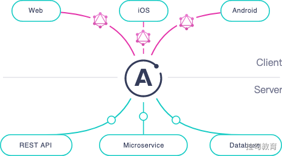
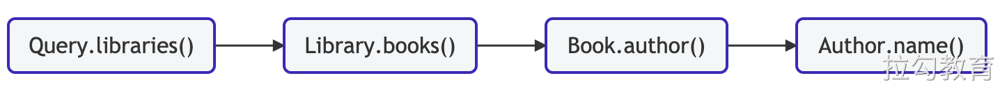
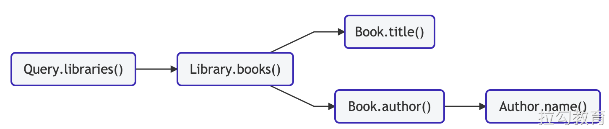
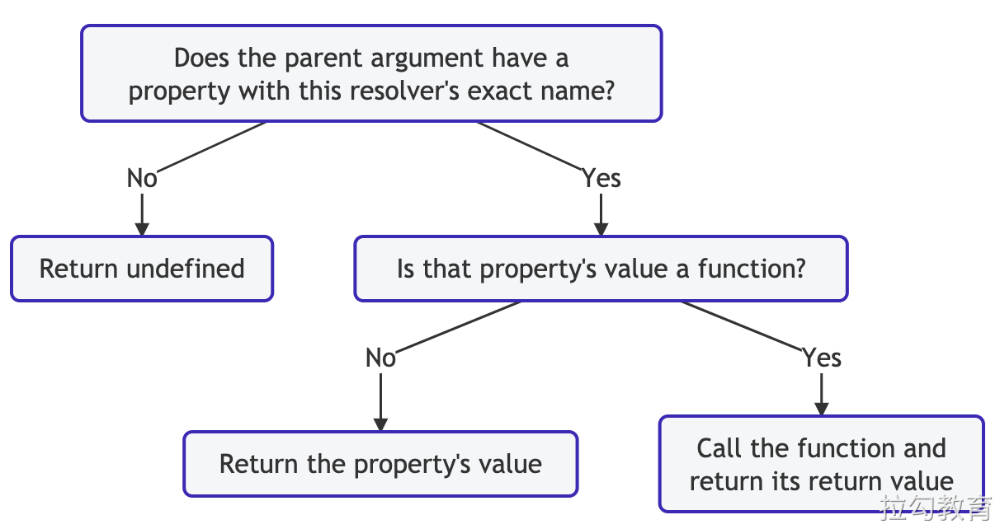
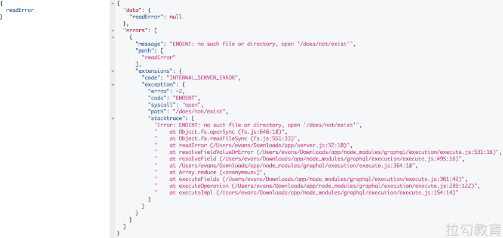
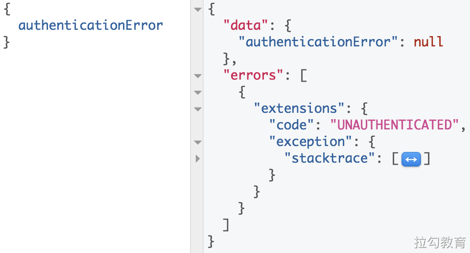
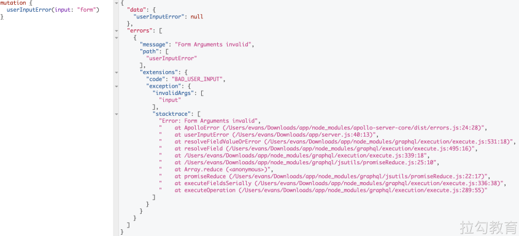

# Apollo GraphQL
Apollo 是一个开源的 GraphQL 开发平台， 提供了符合 GraphQL 规范的服务端和客户端实现。使用 Apollo 可以帮助我们更方便快捷的开发使用 GraphQL。



- 官网：https://www.apollographql.com/
- GitHub 相关开源仓库：https://github.com/apollographql

## 基本用法
1、准备

```Shell
# 创建项目目录
mkdir graphql-server-example
cd graphql-server-example

# 初始化 package.json 文件
npm init -y

# 安装依赖
npm install apollo-server graphql

# 创建 index.js
touch index.js
```

2、index.js

```js
const { ApolloServer, gql } = require('apollo-server')

const typeDefs = gql`
  # Comments in GraphQL strings (such as this one) start with the hash (#) symbol.

  # This "Book" type defines the queryable fields for every book in our data source.
  type Book {
    title: String
    author: String
  }

  # The "Query" type is special: it lists all of the available queries that
  # clients can execute, along with the return type for each. In this
  # case, the "books" query returns an array of zero or more Books (defined above).
  type Query {
    books: [Book]
  }
`

const books = [
  {
    title: 'The Awakening',
    author: 'Kate Chopin'
  },
  {
    title: 'City of Glass',
    author: 'Paul Auster'
  }
]

const resolvers = {
  Query: {
    books: () => books
  }
}

// The ApolloServer constructor requires two parameters: your schema
// definition and your set of resolvers.
const server = new ApolloServer({ typeDefs, resolvers })

// The `listen` method launches a web server.
server.listen().then(({ url }) => {
  console.log(`🚀  Server ready at ${url}`)
})

```

3、关于 gql 标签模板

- gql 标签模板将查询字符串解析为 AST，用于使用 Prettier 突出显示编辑器语法和自动格式化。
- 将来，我们将使用它来静态分析 GraphQL 查询，因此 Apollo Server 需要使用 gql 包装您的 schema。
- gql 也可以用作将字符串转换为AST的常规函数

## 与 Node.js 中间件集成

Apollo Server 可以轻松地与几个流行的 Node.js 中间件库集成。要集成，请首先从下表中安装适当的软件包，而不是核心 apollo-server 软件包。

#### 兼容的软件包
| 中间件 | npm包 |
| ---  | --- |
| Express | apollo-server-express |
| AWS Lambda | apollo-server-lambda |
| Koa | apollo-server-koa |
| hapi | apollo-server-hapi |
| Micro | apollo-server-micro |
| Fastify | apollo-server-fastify |
| Google Cloud Functions | apollo-server-cloud-functions |
| Azure Functions | apollo-server-azure-functions |
| Cloudflare | apollo-server-cloudflare |
如果您已经安装了核心 apollo-server 软件包，则可以在安装集成软件包后 npm 卸载它。
#### 应用中间件
与中间件集成时，首先像往常一样初始化 Apollo Server，然后调用 applyMiddleware。

这是为 Hello 服务的基本 Express 示例。从 /graphql 以外的每个路径访问，该路径与 Apollo Server 一起提供GraphQL端点：
```JavaScript
const express = require('express');
const { ApolloServer } = require('apollo-server-express');
const { typeDefs, resolvers } = require('./schema');

const app = express();
const server = new ApolloServer({
  typeDefs,
  resolvers,
});

server.applyMiddleware({ app });

app.use((req, res) => {
  res.status(200);
  res.send('Hello!');
  res.end();
});

app.listen({ port: 4000 }, () =>
  console.log(`🚀 Server ready at http://localhost:4000${server.graphqlPath}`)
)
```
您提供给 applyMiddleware 的参数是中间件对应用程序的顶级表示。在 Express 应用程序中，此变量通常称为app。

当您将应用程序传递给 applyMiddleware 时，Apollo Server 会自动配置各种中间件（包括请求体解析，GraphQL Playground 前端和 CORS 支持），因此您不需要通过诸如 app.use 之类的机制来应用它们。

## 解析器
#### 基本用法
schema：
```GraphQL
type Query {
  numberSix: Int! # Should always return the number 6 when queried
  numberSeven: Int! # Should always return 7
}
```

resolver：
```js
const resolvers = {
  Query: {
    numberSix() {
      return 6;
    },
    numberSeven() {
      return 7;
    }
  }
};

```
#### 处理参数
schema：
```GraphQL
type User {
  id: ID!
  name: String
}

type Query {
  user(id: ID!): User
}
```
resolver：
```js
const users = [
  {
    id: '1',
    name: 'Elizabeth Bennet'
  },
  {
    id: '2',
    name: 'Fitzwilliam Darcy'
  }
];

const resolvers = {
  Query: {
    user(parent, args, context, info) {
      return users.find(user => user.id === args.id);
    }
  }
}

```
#### 解析器链
schema：
```GraphQL
# A library has a branch and books
type Library {
  branch: String!
  books: [Book!]
}

# A book has a title and author
type Book {
  title: String!
  author: Author!
}

# An author has a name
type Author {
  name: String!
}

type Query {
  libraries: [Library]
}

```
有效的查询语法：

```GraphQL
query GetBooksByLibrary {
  libraries {
    books {
      author {
        name
      }
    }
  }
}
```
此查询的结果解析器链与查询本身的层次结构匹配：


这些解析器按上述顺序执行，并将其返回值通过父参数传递给链中的下一个解析器。
resolver 处理如下：
```js
const { ApolloServer, gql } = require('apollo-server');

const libraries = [
  {
    branch: 'downtown'
  },
  {
    branch: 'riverside'
  },
];

// The branch field of a book indicates which library has it in stock
const books = [
  {
    title: 'The Awakening',
    author: 'Kate Chopin',
    branch: 'riverside'
  },
  {
    title: 'City of Glass',
    author: 'Paul Auster',
    branch: 'downtown'
  },
];

// Schema definition
const typeDefs = gql`

# A library has a branch and books
  type Library {
    branch: String!
    books: [Book!]
  }

  # A book has a title and author
  type Book {
    title: String!
    author: Author!
  }

  # An author has a name
  type Author {
    name: String!
  }

  # Queries can fetch a list of libraries
  type Query {
    libraries: [Library]
  }
`;

// Resolver map
const resolvers = {
  Query: {
    libraries() {

      // Return our hardcoded array of libraries
      return libraries;
    }
  },
  Library: {
    books(parent) {

      // Filter the hardcoded array of books to only include
      // books that are located at the correct branch
      return books.filter(book => book.branch === parent.branch);
    }
  },
  Book: {

    // The parent resolver (Library.books) returns an object with the
    // author's name in the "author" field. Return a JSON object containing
    // the name, because this field expects an object.
    author(parent) {
      return {
        name: parent.author
      };
    }
  }

  // Because Book.author returns an object with a "name" field,
  // Apollo Server's default resolver for Author.name will work.
  // We don't need to define one.
};

// Pass schema definition and resolvers to the
// ApolloServer constructor
const server = new ApolloServer({ typeDefs, resolvers });

// Launch the server
server.listen().then(({ url }) => {
  console.log(`🚀  Server ready at ${url}`);
});

```

如果现在我们更新查询以同时询问每本书的标题：
```GraphQL
query GetBooksByLibrary {
  libraries {
    books {

      title
      author {
        name
      }
    }
  }
}
```
然后，解析器链如下所示：


当一条链像这样“发散”时，每个子链并行执行。
#### 解析器参数
解析程序函数按顺序接受以下位置参数：
| 论点 | 描述 |
| ---  | --- |
| parent | 此字段的父项（即，解析程序链中的前一个解析程序）的解析程序的返回值。
对于没有父级的顶级字段的解析器（例如Query的字段），此值是从传递给Apollo Server构造函数的rootValue函数获得的。 |
| args | 包含为此字段提供的所有GraphQL参数的对象。
例如，当执行查询 { user(id: "4") } 时，传递给用户解析器的args对象是 { "id": "4" }。 |
| context | 在为特定操作而执行的所有解析器之间共享的对象。使用它可以共享每个操作的状态，包括身份验证信息，数据加载器实例以及在解析器之间进行跟踪的其他任何内容。 |
| info | 包含有关操作执行状态的信息，包括字段名称，从根到字段的路径等。
GraphQL.js源代码中列出了它的核心字段，并且其他模块（例如apollo-cache-control）通过附加功能对其进行了扩展。 |
#### context 参数
context 参数对于传递任何解析器可能需要的东西很有用，例如身份验证范围，数据库连接和自定义获取函数。如果您正在使用数据加载器跨解析器批处理请求，则也可以将它们附加到上下文。

解析器决不应破坏性地修改上下文参数。这样可以确保所有解析程序的一致性，并防止意外错误。

要为您的解析器提供上下文，请向 ApolloServer 构造函数添加上下文初始化函数。每个请求都会调用此函数，因此您可以根据请求的详细信息（例如HTTP标头）设置上下文。
```js

// Constructor
const server = new ApolloServer({
  typeDefs,
  resolvers,
  context: (req) => ({
    authScope: getScope(req.headers.authorization)
  })
}));

// Example resolver
(parent, args, context, info) => {
  if(context.authScope !== ADMIN) throw new AuthenticationError('not admin');
  // Proceed
}

```
> 如果您使用的是 Express 以外的中间件，则传递给上下文函数的对象的字段会有所不同。有关详细信息，请参见API参考。

上下文初始化可以是异步的，从而可以完成数据库连接和其他操作：
```js
context: async () => ({
  db: await client.connect(),
})

// Resolver
(parent, args, context, info) => {
  return context.db.query('SELECT * FROM table_name');
}

```
#### 返回值
Apollo Server根据其类型对解析器函数的返回值进行不同的处理：
| 类型 | 详情 |
| ---  | --- |
| Scalar / object | 解析程序可以返回单个值或对象，如定义解析程序中所示。该返回值通过父参数传递给任何嵌套的解析器。 |
| Array | 当且仅当您的模式指示解析器的关联字段包含列表时，才返回一个数组。 
返回数组后，Apollo Server为数组中的每个项目执行嵌套的解析器。 |
| null / undefined| 表示找不到该字段的值。 
如果您的模式指示此解析器的字段可为空，则操作结果在该字段的位置具有空值。
如果此解析器的字段不可为空，则Apollo Server会将字段的父级设置为null。如有必要，此过程将继续沿解析程序链向上移动，直至到达可为空的字段。这样可以确保响应永远不会为不可为空的字段包含空值。 |
| Promise | 解析程序通常执行异步操作，例如从数据库或后端API提取。为了支持这一点，解析器可以返回可解析为其他任何受支持的返回类型的promise。 |
#### 默认解析器
如果您没有为特定的架构字段定义解析器，则Apollo Server会为其定义默认解析器（请参阅源代码）。

默认的解析器功能使用以下逻辑：


例如，请考虑以下 schema：
```GraphQL
type Book {
  title: String
}

type Author {
  books: [Book]
}
```
如果 books 字段的解析程序返回一个对象数组，每个对象包含一个 title 字段，则可以为 title 字段使用默认的解析程序。默认解析器将正确返回 parent.title。
#### 监控解析器性能
与所有代码一样，解析器的性能取决于其逻辑。重要的是要了解模式中的哪些字段在计算上是昂贵的或难以解决的，以便您可以提高其性能或确保仅在必要时查询它们。

Apollo Studio 直接与 Apollo Server 集成在一起，以提供字段级指标，以帮助您了解一段时间内数据图的性能。有关更多信息，请参阅分析性能。

在本地进行开发时，您可以为 ApolloServer 构造函数提供 tracing: true，以启用跟踪面板：
```JavaScript
const server = new ApolloServer({
  typeDefs,
  resolvers,
  tracing: true,
});
```
## 连接到数据源
Apollo Server 可以从多给位置获取数据。

Apollo提供了一个 DataSource 类，我们可以扩展该类以处理特定类型的数据源的交互逻辑。

#### 连接到 REST API

#### 连接到数据库
SQLDataSource from datasource-sql
MongoDataSource from apollo-datasource-mongodb
#### 从解析器访问数据
为了使解析器能够访问数据源，可以将它们作为选项传递给 ApolloServer 构造函数：
```JavaScript
const server = new ApolloServer({
  typeDefs,
  resolvers,
  dataSources: () => {
    return {
      moviesAPI: new MoviesAPI(),
      personalizationAPI: new PersonalizationAPI(),
    };
  },
  context: () => {
    return {
      token: 'foo',
    };
  },
});
```
Apollo Server 会将每个请求的数据源放在上下文中，因此您可以从解析器访问它们。它还将使您的数据源可以访问上下文。 （之所以没有让用户直接将数据源放在上下文中，是因为这会导致循环依赖。）
从解析器中，我们可以访问数据源并返回结果：
```JavaScript
 Query: {
    movie: async (_source, { id }, { dataSources }) => {
      return dataSources.moviesAPI.getMovie(id);
    },
    mostViewedMovies: async (_source, _args, { dataSources }) => {
      return dataSources.moviesAPI.getMostViewedMovies();
    },
    favorites: async (_source, _args, { dataSources }) => {
      return dataSources.personalizationAPI.getFavorites();
    },
  },
```
#### 关于 DataLoader
#### 使用 Memcached/Redis 缓存后端数据
#### 实现自己的缓存后端

## 错误处理

Apollo 服务器提供了一组预定义的错误，包括 AuthenticationError，ForbiddenError，UserInputError 和常规 ApolloError。这些错误旨在增强 GraphQL 执行之前和执行过程中引发的错误，从而使调试 Apollo Server 集成更加容易，并使客户端能够基于错误采取特定的措施。

当解析器内部和外部的 Apollo Server 中都发生错误时，errors 数组内部的每个错误都包含一个扩展对象，该对象包含由 Apollo Server 添加的信息。

#### 默认信息
改善服务器可用性的第一步是默认情况下提供错误堆栈跟踪。下面的示例演示了从Apollo Server返回的响应，该响应带有引发节点 SystemError 的解析器。
```js
const {
  ApolloServer,
  gql,
} = require('apollo-server');

const typeDefs = gql`
  type Query {
    readError: String
  }
`;

const resolvers = {
  Query: {

    readError: (parent, args, context) => {
      fs.readFileSync('/does/not/exist');
    },
  },
};
```
响应结果如下：


要为生产禁用堆栈跟踪，请将 debug: false 传递给 Apollo Server 构造函数，或者将 NODE_ENV 环境变量设置为 'production' 或 'test'。请注意，这会使 stacktrace 对您的应用程序不可用。如果要记录堆栈跟踪信息，但不将其发送给客户端，请参阅下面的屏蔽和记录错误。


#### 错误代号
除了堆栈跟踪外，Apollo Server 导出的错误还在扩展的代码字段中指定了人类可读的字符串，该字符串使客户端能够执行纠正措施。除了改善客户体验之外，代码字段还允许服务器对错误进行分类。例如，AuthenticationError 将代码设置为 UNAUTHENTICATED，这使客户端可以重新进行身份验证，通常会被视为服务器异常而被忽略。
```js
const {
  ApolloServer,
  gql,

  AuthenticationError,
} = require('apollo-server');

const typeDefs = gql`
  type Query {
    authenticationError: String
  }
`;

const resolvers = {
  Query: {

    authenticationError: (parent, args, context) => {
      throw new AuthenticationError('must authenticate');
    },
  },
};
```
响应结果如下：


#### 扩大错误的详细信息
当客户端提供错误的输入时，您可能希望针对无效的每个字段或参数返回其他信息，例如本地化消息。下面的示例演示如何使用 UserInputError 来添加更多详细信息来增加错误消息。
```js
const {
  ApolloServer,
  UserInputError,
  gql,
} = require('apollo-server');

const typeDefs = gql`
  type Mutation {
    userInputError(input: String): String
  }
`;

const resolvers = {
  Mutation: {

    userInputError: (parent, args, context, info) => {
      if (args.input !== 'expected') {
        throw new UserInputError('Form Arguments invalid', {
          invalidArgs: Object.keys(args),
        });
      }
    },
  },
};
```
响应将返回：


#### 其它错误
如果需要定义特定于您的应用程序的其他错误代码，则可以使用 ApolloError 基类。
```js
new ApolloError(message, code, additionalProperties);
```

#### 掩盖和记录错误
对于客户端响应
Apollo Server 构造函数接受一个 formatError 函数，该函数在传递回客户端的每个错误上运行。这可用于掩盖错误以及记录日志。
> 请注意，虽然这会更改发送到客户端的错误，但不会更改发送到 Apollo Studio 的错误。如果需要此行为，请参见下面的 For Apollo Studio 报告中的 rewriteError 函数。

此示例演示当错误消息以 Database Error: 开头时抛出另一个错误：
```js
const server = new ApolloServer({
  typeDefs,
  resolvers,

  formatError: (err) => {
    // Don't give the specific errors to the client.
    if (err.message.startsWith("Database Error: ")) {
      return new Error('Internal server error');
    }
    // Otherwise return the original error.  The error can also
    // be manipulated in other ways, so long as it's returned.
    return err;
  },
});

server.listen().then(({ url }) => {
  console.log(`🚀 Server ready at ${url}`);
});
```
formatError（一个GraphQLError）接收到的错误实例包含一个 originalError 属性，该属性表示在解析器中引发的原始错误。这可以用于 instanceof 检查特定的错误类，例如 AuthenticationError，ValidationError 等：
```js
  /* ... */
  formatError(err) {
    if (err.originalError instanceof AuthenticationError) {
      return new Error('Different authentication error message!');
    }
  },
  /* ... */
```
> 要针对 formatError 接收到的错误进行特定于上下文的调整（例如，本地化或个性化设置），请考虑使用 didEncounterErrors 生命周期挂钩将其他属性附加到错误，可以在 formatError 中访问和利用附加属性。

#### 对于 Apollo Studio 报告

## 权限认证
如何在 GraphQL API 中授权用户和权限控制。

在构建GraphQL端点时的某个时间点（可能很早），您可能不得不面对一个问题，即如何控制谁可以看到您的API中的数据并与之交互。

身份验证是确定用户是否已登录，然后确定某人是哪个用户。然后，授权将决定用户有权执行或查看的内容。

一旦知道用户尝试发出请求，本文将主要侧重于如何为您的 schema 设置授权，但是我们将通过一个身份验证示例来了解我们正在做的事情的背景。

#### 将用户信息放到 context 中
在弄清楚用户权限之前，我们必须先弄清楚如何识别用户。从 HTTP 标头到 JSON Web Token，有多种方法可以处理用户身份验证，但是一旦拥有用户，控制访问就非常相似。

我们将以 HTTP 授权标头中的登录令牌为例。
```js
// using apollo-server 2.x
const { ApolloServer } = require('apollo-server');

const server = new ApolloServer({
 typeDefs,
 resolvers,
 context: ({ req }) => {
   // Note! This example uses the `req` object to access headers,
   // but the arguments received by `context` vary by integration.
   // This means they will vary for Express, Koa, Lambda, etc.!
   //
   // To find out the correct arguments for a specific integration,
   // see the `context` option in the API reference for `apollo-server`:
   // https://www.apollographql.com/docs/apollo-server/api/apollo-server/

   // Get the user token from the headers.
   const token = req.headers.authorization || '';

   // try to retrieve a user with the token
   const user = getUser(token);

   // add the user to the context
   return { user };
 },
});

server.listen().then(({ url }) => {
 console.log(`🚀 Server ready at ${url}`)
});
```
那么，这里到底发生了什么？此代码块使用 Apollo Server 2.0 设置新的 GraphQL 服务器。新版本的 Apollo Server 简化了用于创建新服务器的 API，并具有一些更智能的默认值。你可以在这里读更多关于它的内容！

在此构造函数中，我们将类型定义和解析器传递给构造函数以及用于构建上下文对象的函数。上下文对象是传递给每个级别的每个解析器的对象，因此我们可以在 schema 代码中的任何位置访问它。在这里我们可以存储数据提取程序，数据库连接以及（方便地）有关发出请求的用户的信息。

由于每次新请求都会重新生成上下文，因此我们不必担心在执行结束时清理用户数据。

这里的上下文函数查看请求标头，提取名为 authorization 的标头，并将其存储到变量中。然后，它将使用该令牌调用 getUser 函数，并期望在令牌有效的情况下返回用户。之后，它返回一个包含（潜在）用户的上下文对象，供我们所有的解析器使用。

对于每种身份验证方法，检索用户的细节将有所不同，但是最终部分每次都会看起来相同。您的 schema 需要的授权可能要求您仅在上下文中添加 `{ loggingIn: true }`，但可能还需要 ID 或角色，例如 `{user: {id: 12345，role: ['user', 'admin' ]}}`。

在下一节中，我们将探讨使用现在需要保护用户信息的用户信息的方法。

#### Schema 授权

#### 解析器中的授权

#### 数据模型中的授权

#### 通过自定义指令授权

#### GraphQL 之外的授权

## Apollo Client
- https://www.apollographql.com/docs/react/integrations/integrations/
- https://github.com/vuejs/vue-apollo
- http://apollo.vuejs.org/

## GraphQL 综合案例
- https://github.com/attraction11/realworld-graphql

## 其它工具库
- [TypeGraphQL](https://github.com/MichalLytek/type-graphql)    使用类和装饰器，使用TypeScript创建GraphQL模式和解析器！
- [Tipe](https://github.com/tipeio/tipe)    面向开发人员的下一代 API 优先 CMS。使用脱机原型和内联编辑器从 GraphQL schema 生成 API 优先的 CMS。

graphql-tools
- graphql-tools 是一个用于更快地开发 GraphQL schema 的实用工具库。
  - 官方网站：https://www.graphql-tools.com/
  - GitHub 仓库：https://github.com/ardatan/graphql-tools
- GraphQL 优先
  - 使用 GraphQL schema 语言来生成完全支持解析器、接口、联合类型和自定义标量的 schema
  - 生成的 schema 与 GraphQL.js 完全兼容
- 模拟 GraphQL API
  - 它不仅对构建服务器有用，它也可以在浏览器中使用，例如在开发或测试期间模拟后端
  - 借助 GraphQL 工具，您可以使用细粒度的每个类型的模拟来模拟 GraphQL API，从而无需任何数据源即可进行快速原型制作。
- 拼接多个 GraphQL schema
  - 以简单，快速和强大的方式将多个 schema 自动缝合到一个较大的 API 中
- 它可以与任何一个 GraphQL-JS 架构一起使用，并且每个工具都可以单独使用