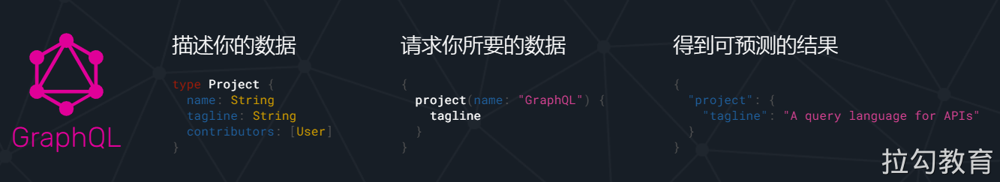
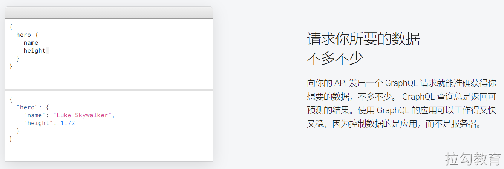
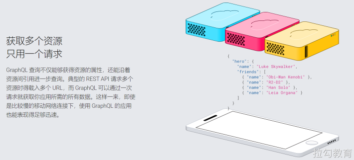
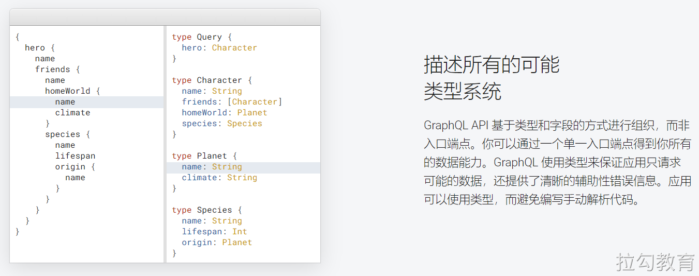
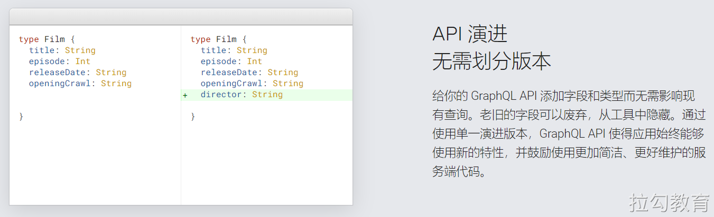
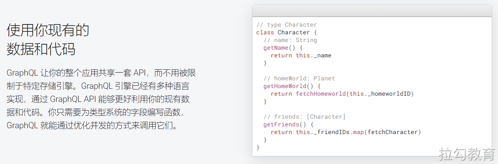
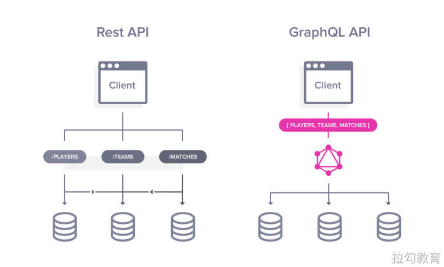
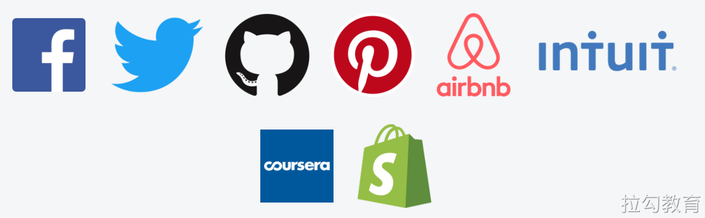

# GraphQL 简介

## 参考

https://www.yuque.com/lipengzhou/graphql?xume=

## 接口开发方式
- RESTful
- GraphQL
## RESTful 的问题
- 接口粒度比较细，很多场景需要调用多次请求才能完成一个功能
- 接口扩展、维护成本高
- 接口响应的数据格式无法预知（JSON 已经成为主流格式）
## GraphQL 介绍

官网介绍：GraphQL 既是一种用于 API 的查询语言也是一个满足你数据查询的运行时。 GraphQL 对你的 API 中的数据提供了一套易于理解的完整描述，使得客户端能够准确地获得它需要的数据，而且没有任何冗余，也让 API 更容易地随着时间推移而演进，还能用于构建强大的开发者工具。

传统的 API 调用一般获取到的是后端组装好的一个完整对象，而前端可能只需要用其中的某些字段，大部分数据的查询和传输工作都浪费了。GraphQL 提供一种全新数据查询方式，可以只获取需要的数据，使 API 调用更灵活、高效和低成本。

- GraphQL 是 Facebook 开发的一种用于 API 的数据查询语言并于 2015 年开源
- GraphQL 既是一种用于 API 的查询语言，也是一个满足你数据查询的运行时。
- GraphQL 是一种接口开发标准，支持常见的服务端开发语言。例如：Java、PHP、Python、Node.js 等
- 官方网站：https://graphql.org/
- 中文文档：https://graphql.cn/
- GitHub：https://github.com/graphql
- 未来技术趋势，可能替代 RESTful，但是近几年还不太行
    - 因为 RESTful 沉淀了很多年
    - 一个新项目可以全部使用 GraphQL
    - GraphQL 和 RESTful 结合使用
## 为什么选择 GraphQL
在某些情况下，GraphQL 绝对是构建服务器的最佳选择，例如：
- 如果您有多个客户端，因为它们只是用他们选择的语言编写自己的查询（GraphQL支持所有这些）；
- 如果您在不同的平台上工作：Web，移动，应用程序等；
- 如果您的API是高度可定制的。
## GraphQL 特性

## RESTful 和 GraphQL 对比

## 谁在使用 GraphQL
Facebook 的移动应用从 2012 年就开始使用 GraphQL。GraphQL 规范于 2015 年开源，现已经在多种环境下可用，并被各种体量的团队所使用。

## 参考链接
- [https://zhuanlan.zhihu.com/p/33876142](https://zhuanlan.zhihu.com/p/33876142)
- [https://github.com/graphql/graphiql](https://github.com/graphql/graphiql)
- [5个用/不用GraphQL的理由](https://www.jianshu.com/p/12dff5905cf6)
- [https://github.com/mrdulin/blog/issues/88](https://github.com/mrdulin/blog/issues/88)

