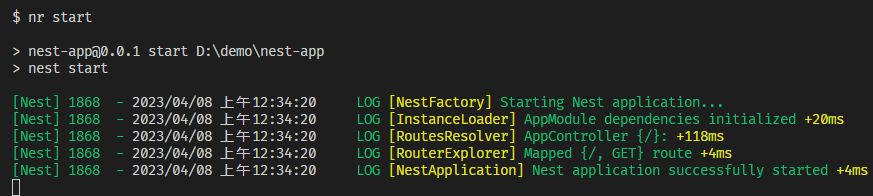

# Nest.js 教程

## 基本介绍

NestJS 是一个用于构建高效、可伸缩 Web 应用程序的 Node.js 框架，它基于 TypeScript 构建，使用了面向对象的编程思想和模块化的设计风格。NestJS 支持多种 Web 框架，包括 Express 和 Fastify 等，并提供了强大的依赖注入系统和模块化的架构设计，以帮助开发者构建可维护、可测试、可扩展的应用程序。

NestJS 的主要特点包括：

-   基于 TypeScript：NestJS 是完全基于 TypeScript 构建的，可以利用 TypeScript 的语言特性和类型系统来提高代码的可读性和可维护性。
-   模块化的架构设计：NestJS 的架构非常清晰，采用了模块化的设计思想，可以帮助开发者更好地组织代码和功能模块。
-   强大的依赖注入系统：NestJS 的依赖注入系统可以帮助开发者解耦代码，降低代码的复杂度，提高代码的可测试性和可维护性。
-   支持多种 Web 框架：NestJS 支持多种 Web 框架，包括 Express、Fastify 等，可以根据需求选择最适合的 Web 框架。
-   可扩展性强：NestJS 提供了一系列的扩展机制，包括中间件、过滤器、拦截器等，可以满足不同场景下的需求。
-   灵活的数据库集成：NestJS 支持多种数据库，包括 MySQL、PostgreSQL、MongoDB 等，可以根据需求选择最适合的数据库。

总之，NestJS 是一个功能强大、易于使用、灵活可扩展的 Node.js 框架，适用于构建复杂、可扩展的 Web 应用程序，特别是企业级应用程序。

## 项目搭建

:::tip
请确保在您的操作系统上安装了 Node.js (>= 10.13.0，v13 除外)
:::

```shell
npm i -g @nestjs/cli
nest new project-name
```

项目创建后生成如下一个核心文件：

+-- src[目录] // 源文件/代码，程序员主要编写的目录  
| +-- app.controller.spec.ts // 对于基本控制器的单元测试样例  
| +-- app.controller.ts // 控制器文件，可以简单理解为路由文件  
| +-- app.module.ts // 模块文件，在 NestJS 世界里主要操作的就是模块  
| +-- app.service.ts // 服务文件，提供的服务文件，业务逻辑编写在这里  
| +-- app.main.ts // 项目的入口文件，里边包括项目的主模块和监听端口号

打开 package.json 文件，可以看到下面的代码:

```json
"start": "nest start",                              // 最常用的开始模式
"start:dev": "nest start --watch",                  // 开发模式的启动 有监视功能
"start:debug": "nest start --debug --watch",        // 调试Bug时的启动 调试程序时使用
```

使用命令行进入到项目 cd nest-demo  
然后再使用 npm run start 启动项目  
看到下面的提示，说明我们的项目已经创建成功了。  


## Controller 控制器-路由的创建

`/src/app.controller.ts` 是控制器，其实也就是编写路由。

#### 新建一个路由/Controller

比如要新建一个 `http://localhost:3000/jspang` 的页面，访问时直接返回 Hello NestJS,这时候就可以在 app.controller.ts 文件里编写下面的代码。

```ts
import { Controller, Get } from '@nestjs/common';
import { AppService } from './app.service';

@Controller()
export class AppController {
    constructor(private readonly appService: AppService) {}

    @Get()
    getHello(): string {
        return this.appService.getHello();
    }
    //---------添加部分-----------
    @Get('JSpang')
    getJSpang(): string {
        return 'Hello NestJS.';
    }
    //---------------------------
}
```

编写完成后，就可以来到浏览器访问`http://localhost:3000/jspang` ，这时候你就可以看到你想要的结果了。

## 参考

https://jspang.com/article/87

https://juejin.cn/column/7142507898579451912
