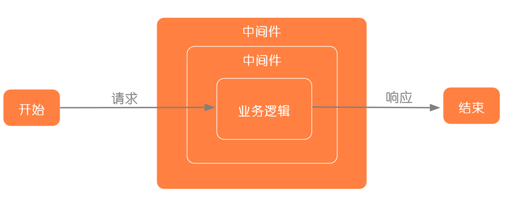
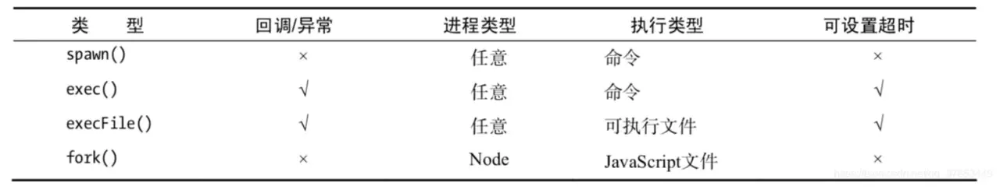

# Node.js 介绍

## 资料：
- [Node.js 最佳实践](https://github.com/i0natan/nodebestpractices)
- [Node 面试资源](https://github.com/ElemeFE/node-interview)
- [Node 高级编程](https://www.yuque.com/lipengzhou/nodejs-tutorial)
- [airbnb JS规范](https://github.com/airbnb/javascript)

## 学习目标
- 知道 Node.js 是什么
- 理解 Node.js 的运行原理
- 了解 Node.js 的运行机制
## Node.js 是什么
- 不是编程语言, 也不是框架和库
- 是一个 JavaScript 运行时（环境）
    - 能解析和执行 JavaScript 代码（严格来说应该是 ECMAScript 代码）
- 构建于 Chrome V8 JavaScript 引擎之上
- 为 JavaScript 提供了服务端编程的能力
    - 文件 IO
    - 网络 IO
- 从技术角度它的能力和 Java、PHP、Python、Perl、Ruby 等服务端技术类似
## Node 的特点
- 事件驱动
- 非阻塞 IO（异步） 模型
- 单线程
- 跨平台
## Node 的运行机制
多线程处理机制：

传统的 Web 服务器（Apache、Tomcat、IIS）：
- 请求进来
- Web 服务器开启一个线程来处理用户请求
- 同一时间有 n 请求，服务器就需要开启 n 个线程
    - 一个线程最少得消耗 8MB 内存
    - 对于一个 8GB 内存的服务器来说，它能应对的并发数是 1024 * 8 / 8 = 1024 个并发

事件驱动处理模型：

- Node 中低层封装了一堆的异步操作 API
    - 文件操作
    - 网络操作
    - ...
- JavaScript 语言本身是单线程的

## Event Loop（事件循环）
- [菲利普·罗伯茨：到底什么是 Event Loop 呢？](https://youtu.be/8aGhZQkoFbQ)
- [The Node.js Event Loop, Timers, and process.nextTick()](https://nodejs.org/en/docs/guides/event-loop-timers-and-nexttick/)
- [阮一峰 - JavaScript 运行机制详解：再谈 Event Loop](http://www.ruanyifeng.com/blog/2014/10/event-loop.html)
## Node 发展历史
以下内容节选自：[来自朴灵大大的 -- Node.js 简史](https://cnodejs.org/topic/555d3d54e684c4c8088a0d78)

Node.js 不是凭空出现的项目，也**不是某个 Web 前端工程师为了完成将 JavaScript 应用到服务端的理想而在实验室里捣鼓出来的**。它的出现主要归功于**Ryan Dahl 历时多年的研究**，以及一个恰到好处的节点。2008 年**V8 随着 Chrome 浏览器的出世**，JavaScript 脚本语言的执行效率得到质的提升，这给 Ryan Dahl 带来新的启示，他原本的研究工作与 V8 之间碰撞出火花，于是带来了一个基于事件的高性能 Web 服务器。

上图为 Node.js 创始人 Ryan Dahl。

Ryan Dahl 的经历比较奇特，他并非科班出身的开发者，在 2004 年的时候他还在纽约的罗彻斯特大学数学系读博士，期间有研究一些分形、分类以及 p-adic 分析，这些都跟开源和编程没啥关系。2006 年，也许是厌倦了读博的无聊，他产生了『世界那么大，我想去看看』的念头，做出了退学的决定，然后一个人来到智利的 Valparaiso 小镇。那时候他尚不知道找一个什么样的工作来糊口，期间他曾熬夜做了一些不切实际的研究，如如何通过云进行通信。下面是这个阶段他产出的中间产物，与后来苹果发布的 iCloud 似乎有那么点相似。

从那起，Ryan Dahl 不知道是否因为生活的关系，他开始学习网站开发了，走上了码农的道路。那时候 Ruby on Rails 很火，他也不例外的学习了它。从那时候开始，Ryan Dahl 的生活方式就是接项目，然后去客户的地方工作，在他眼中，拿工资和上班其实就是去那里旅行。此后他去过很多地方，如阿根廷的布宜诺斯艾利斯、德国的科隆、奥地利的维也纳。

Ryan Dahl 经过两年的工作后，成为了高性能 Web 服务器的专家，从接开发应用到变成专门帮客户解决性能问题的专家。期间他开始写一些开源项目帮助客户解决Web 服务器的高并发性能问题，尝试过的语言有 Ruby、C、Lua。当然这些尝试都最终失败了，只有其中通过 C 写的 HTTP 服务库 libebb 项目略有起色，基本上算作 libuv 的前身。这些失败各有各的原因，Ruby 因为虚拟机性能太烂而无法解决根本问题，C 代码的性能高，但是让业务通过 C 进行开发显然是不太现实的事情，Lua 则是已有的同步 I/O 导致无法发挥性能优势。虽然经历了失败，但 Ryan Dahl 大致的感觉到了解决问题的关键是要**通过事件驱动和异步 I/O**来达成目的。

在他快绝望的时候，V8 引擎来了。V8 满足他关于高性能 Web 服务器的想象：

- 没有历史包袱，没有同步 I/O。不会出现一个同步 I/O 导致事件循环性能急剧降低的情况。
- V8 性能足够好，远远比 Python、Ruby 等其他脚本语言的引擎快。
- JavaScript 语言的闭包特性非常方便，比 C 中的回调函数好用。

于是在 2009 年的 2 月，按新的想法他提交了项目的第一行代码，这个项目的名字最终被定名为 node。

2009 年 5 月，Ryan Dahl 正式向外界宣布他做的这个项目。2009 年底，Ryan Dahl 在柏林举行的 JSConf EU 会议上发表关于 Node.js 的演讲，之后 Node.js 逐渐流行于世。

以上就是Node.js 项目的由来，是一个专注于实现高性能 Web 服务器优化的专家，几经探索，几经挫折后，遇到 V8 而诞生的项目。

- 2009 年 5 月，Ryan Dahl 在 github 上发布了最初的 Node 版本
- 2010 年底，Ryan Dahl 加入 Joyent 公司全职负责 Node 的发展
- 2011 年 7 月，Node 在微软的支持下发布了 Windows 版
- 2012 年 1 月底，Ryan Dahl 将掌门人身份转交给了 Isaac Z.Schlueter，自己转向一些研究项目
- 2014 年 12 月，多为重量级 Node 开发者不满 Joyent 对 Node 的管理，自立门户创建了 io.js
- 2015 年 9 月，Node 与 io.js 合并，Node 的版本从 0.12.7 直接升级到了 4.0.0
合并后的 io.js 和 Node 在 Joyent 公司的维护下并行了两个版本：
    - 一个是 4.x.x 还是原来的 Node，这个版本是稳定版
    - 一个是 5.x.x，目前已经更新到了 6.8.1，其实就是 io.js，最新特性版，不建议生产环境使用
- Node 计划在 2016 年 10 月底正式发布 Node 7.0
    - 7.0 已经最大限度的支持了很多的 ES6 新语法
    - 而且提高了整体的执行性能，提供了一些别的 API

Node 各个重要版本发展阶段：

1.0 之前等了 6 年，而从 1.0 到 8.0，只用了 2 年时间。
- 从 v0.1 到 0.12 用了 6 年
- 2015-01-14 发布了 v1.0.0 版本（io.js）
- 2.x（io.js）
- 3.x（io.js）
- 2015 年 09 月 Node.js 基金会已发布 Node.js V4.0 版 与 io.js 合并后的第一个版本
- 2015 年 10 月 Node.jsv4.2.0 将是首个 lts 长期支持版本
- 2016 年底发布到 4.2.4 && 5.4.0
- 2016 年 3 月 20 日 v4.4.0 LTS（长期支持版本）和 v5.9.0 Stable（稳定版本）
- 2016 年底 v6.0 支持 95%以上的 es6 特性 ， v7.0 通过 flag 支持 async 函数，99%的 es6 特性
- 2017 年 2 月发布 v7.6 版本，可以不通过 flag 使用 async 函数
## 为什么要学习 Node
- 增加职业竞争力
- 企业需求
- 进一步理解 Web
- 大前端必备技能
- 为了更好的学习前端框架
- ...
## Node 能做什么
> Node 打破了过去 JavaScript 只能在浏览器中运行的局面
前后端编程环境统一，大大降低了前后端语言切换的代价
知乎 - JavaScript 能做什么，该做什么？
Atwood's Law: any application that can be written in JavaScript, will eventually be written in JavaScript.
凡是能用 JavaScript 写出来的，最终都会用 JavaScript 写出来。

- Web 服务器
- 命令行工具
- 网络爬虫
- 桌面应用程序开发（Electron）
- ...

## 结语
JavaScript 长久以来一直被限制在浏览器的沙箱中运行， 它的能力取决于浏览器中间层提供的支持多少。 Node 将高性能的 V8 带到了服务器端，使 JavaScript 也可以开发出实时高性能的服务器。 在 Node 中，不再与 CSS 样式表，DOM 树打交道， 可以随意的访问本地文件，搭建 WebSocket 服务器，连接数据库等系统级底层操作。 Node 不处理 UI，只关心数据，无论是本地数据还是网络数据。 前后端编程统一，大大降低了前后端编程切换的代码。

对于前端工程师而言，自己熟悉的 JavaScript 如今竟然可以在另一个地方大放异彩， 不谈其他原因，仅仅因为好奇，也值得去关注和探究它。

## 相关链接
- [Node.js 官方文档](https://nodejs.org/en/docs/)
- [Node.js 中文文档（非官方）](http://nodejs.cn/)
- [深入浅出 Node.js](https://read.douban.com/ebook/12053349/)
- [Node.js 权威指南](https://book.douban.com/subject/25892704/)
- [Node.js 实战](https://book.douban.com/subject/25870705/)
- [Node.js 实战](https://book.douban.com/subject/25867920/)
- [Node.js 实战（第 2 季）](https://book.douban.com/subject/26642320/)
- [Node.js 中文社区](http://cnodejs.org/)
- [Node.js 包教不包会](https://github.com/alsotang/node-lessons)
- [EcmaScript 6 入门](http://es6.ruanyifeng.com/)
- [七天学会 NodeJS](https://github.com/nqdeng/7-days-nodejs)
