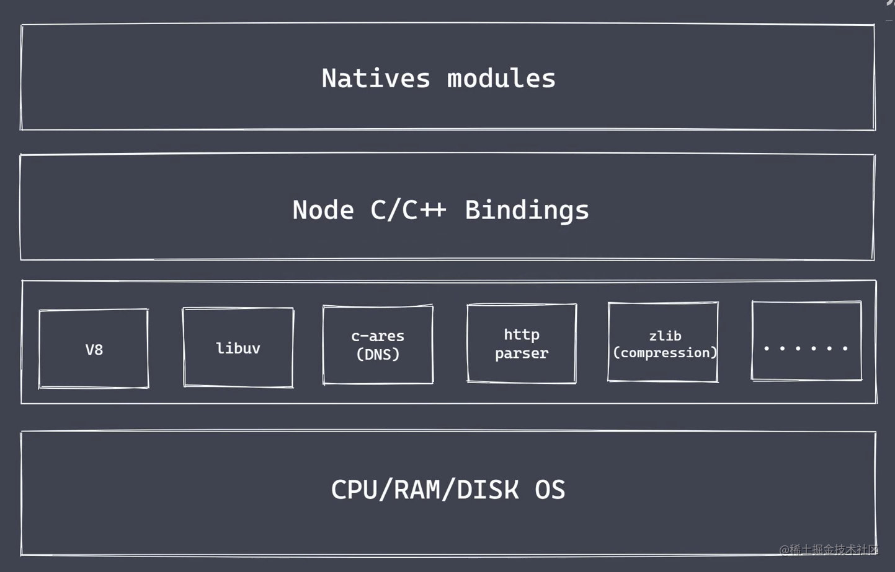
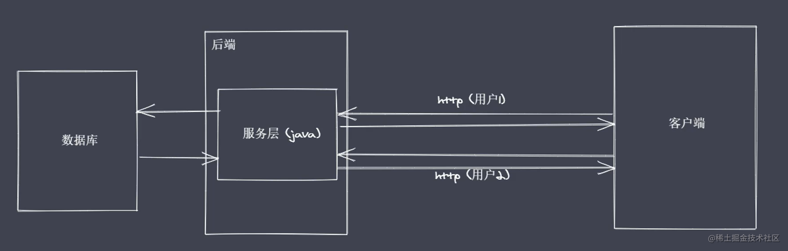
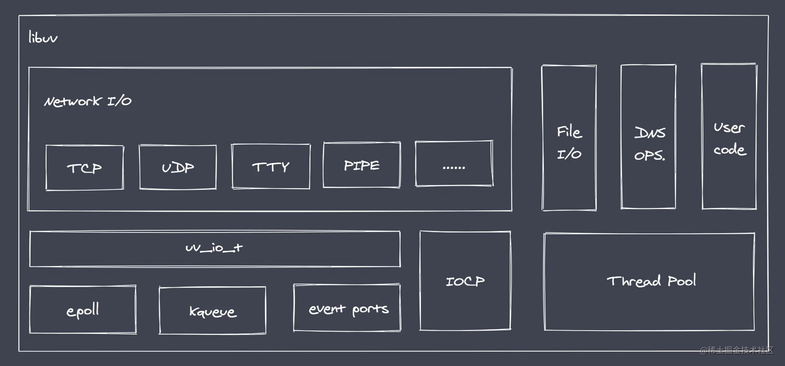
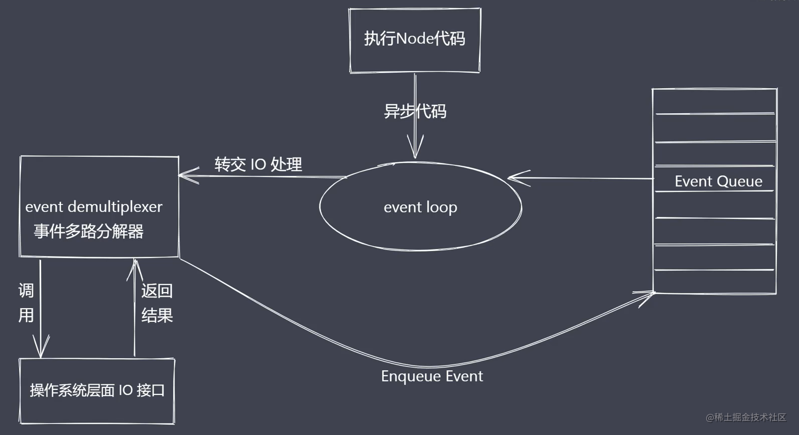
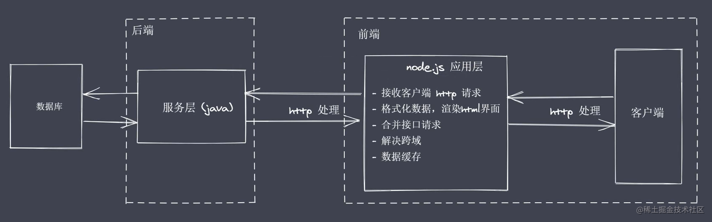

# Node.js 基础

## 一、Nodejs 可以做什么？

1. 轻量级、可伸缩、高性能的 Web 服务
2. 前后端 Javascript 同构开发
3. 便捷高效的前端工程化

## 二、Nodejs 的架构

总体架构分层如下：



1. Natives modules

-   当前层内容由 JS 实现
-   提供应用程序可以直接调用的库（内置核心模块），例如 fs、path、http 等

2. Builtin modules "胶水层"

-   JS 语言无法直接操作底层硬件设置，但可以通过 Builtin modules "胶水层"，让 Nodejs 的核心模块得到具体的服务支持，从而完成更底层的操作。
-   Builtin modules 类似一个调用表，帮助我们去调用具体的 C++函数的作用。

3. 底层

-   V8 引擎: 类似虚拟机执行 JS 代码，提供桥梁接口完成 JS 对 C++函数的调用（构建 Nodejs 执行环境）。
-   Libuv 库：事件循环、事件队列、异步 IO（函数执行细节）
-   第三方功能模块：zlib、http、c-ares 等
    Nodejs 是一个平台，它扩展了 JS 的功能。

## 三、Nodejs 的特性

-   Nodejs 从最开始的高性能 Web 服务，慢慢演变为一门服务端“语言”。 （Nodejs 是平台、运行时）
-   IO 是计算机操作中最缓慢的环节。传统的后端语言，如 Java 采用多线程或多进程的方式。
-   Nodejs 采用 Reactor 模式实现异步 IO、事件驱动，单线程完成多线程工作，采用异步非阻塞的 IO，来更好的使用 CPU 资源，并且实现高并发请求的处理。避免多个线程之间在进行上下文切换的时候，考虑状态保存、时间消耗、状态锁等问题。
-   Nodejs 更适用于 IO 密集型高并发请求。



1. Nodejs 异步 IO  
   同步与异步任务示意图


-   阻塞 IO ：重复调用 IO 操作，判断 IO 是否结束（轮询）。常见的轮询技术：read、select、poll、kqueue、event ports。
-   期望实现无须主动判断的非阻塞 IO。Nodejs 中通过 libUv 库实现多种异步 IO 实现方式的抽象。依据平台的不同调用相应的异步 IO 处理方式（实现跨平台）。
    

-   Nodejs 异步 IO 的实现过程：IO 是应用程序的瓶颈所在、异步 IO 可以提高性能，因为无须原地等待结果的返回（提高 CPU 利用率）、IO 操作属于操作系统级别，平台都有对应的实现、Nodejs 单线程配合事件驱动架构及 libuv 库实现异步非阻塞 IO.



2. Nodejs 事件驱动架构

-   事件驱动架构是软件开发中的通用模式
-   类比事件驱动 、发布订阅、观察者：相同点是都是主体发布消息，其他实例监听之前订阅的事件，接收消息。

```js
const EventEmitter = require('events');

const myEvent = new EventEmitter();

myEvent.on('事件1', () => {
    console.log('事件1执行了');
});

myEvent.on('事件1', () => {
    console.log('事件1-2执行了');
});

myEvent.emit('事件1');
```

3. Nodejs 单线程（单线程指的是主线程（v8）, libuv 库中有 4 个线程-网络 IO/非网络 IO/非 IO）

-   Nodejs 实现并发：异步非阻塞 IO 配合事件回调通知
-   单线程在处理 CPU 密集型问题时，所存在的阻塞现象

```js
const http = require('http');

function sleepTime(time) {
    const sleep = Date.now() + time * 1000;
    while (Date.now() < sleep) {}
    return;
}
sleepTime(4);
const server = http.createServer((req, res) => {
    res.end('server starting......');
});

server.listen(8080, () => {
    console.log('服务启动了');
});
```

## 四、Nodejs 应用场景

1. IO 密集型高并发请求- Nodejs 作为中间层



2. 操作数据库提供 API 服务- 搭建高效轻量的 API 服务

```Ts
// 需求：希望有一个服务，可以依据请求的接口内容返回相应的数据
import express from 'express'
import { DataStore } from './data'

// console.log(DataStore.list)

const app = express()

app.get('/', (req, res) => {
  // res.end('1122')
  res.json(DataStore.list)
})

app.listen(8080, () => {
  console.log('服务已经开启了')
})
```

4. 实现聊天应用程序
5. 前端工程化

## 五、Nodejs 全局对象和全局变量

浏览器平台的 window 不完全相同， Nodejs 全局对象上挂载许多属性

1. Global 的根本作用就是作为宿主，全局对象可以看做是全局变量的宿主。

-   \_\_filename: 返回正在执行脚本文件的绝对路径 
-   dirname：返回正在执行脚本所在目录
-   timer 类函数：执行顺序与事件循环间的关系
-   process：提供与当前进程互动的接口
-   require：实现模块的加载
-   module、exports：处理模块的导出

```js
console.log(global);

console.log(__filename);
console.log(__dirname);

console.log(this);
// 默认情况 this 是空对象，和 global 并不是一样的

console.log(this == global)(
    // false

    function () {
        console.log(this == global); // true
    }
)();

// nodejs的模块实现：自执行函数传入全局变量
/* require('module')
__filename
__dirname
module 
exports  */
```

2. 全局变量 process

```js
// 1 资源： cpu 内存
console.log(process.memoryUsage());
console.log(process.cpuUsage());
// {
//   rss: 19599360,
//   heapTotal: 4481024,
//   heapUsed: 2824128,
//   external: 938610,
//   arrayBuffers: 9898
// }
// { user: 15000, system: 93000 }

// 2 运行环境：运行目录、node环境、cpu架构、用户环境、系统平台
console.log(process.cwd());
console.log(process.version);
console.log(process.versions);
console.log(process.arch);
console.log(process.env.NODE_ENV);
// console.log(process.env.PATH)
console.log(process.env.USERPROFILE); // HOME
console.log(process.platform);

// 3 运行状态： 启动参数、PID、运行时间
console.log(process.argv);
console.log(process.argv0); // execArgv
console.log(process.pid); // ppid

setTimeout(() => {
    console.log(process.uptime());
}, 3000);

// 4. 事件监听
process.on('beforeExit', (code) => {
    // 可以写同步代码或异步代码
    console.log('beforeExit' + code);
});
process.on('exit', (code) => {
    console.log('exit' + code);
    // 无效-因为只能写同步代码
    // setTimeout(() => {
    //   console.log('123')
    // }, 1000)
});
console.log('代码执行结束');
// process.exit() // 主动退出

// 5. 标准输入、输出、错误
console.log = function (data) {
    process.stdout.write('---' + data + '\n');
};
console.log(111);
console.log(222);

const fs = require('fs');
fs.createReadStream('data.txt').pipe(process.stdout);
// 标准输入经管道输出
process.stdin.pipe(process.stdout);

process.stdin.setEncoding('utf-8');
process.stdin.on('readable', () => {
    const chunk = process.stdin.read();
    if (chunk !== null) {
        process.stdout.write('dasss' + chunk);
    }
});
```
