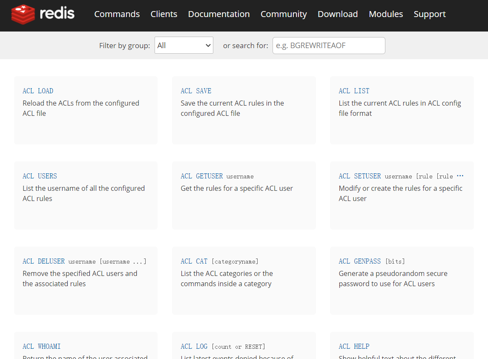

# Redis 简介

## 参考

https://www.yuque.com/lipengzhou/redis?gsz1=


## Redis 的由来

2008 年，意大利的一家创业公司 Merzia 推出了一款基于 MySQL 的网站实时统计系统 LLOOGG ，然而没过多久该公司的创始人 Salvatore Sanfilippo 便开始对 MySQL 的性能感到失望，于是他决定亲自为 LLOOGG 量身定做一个数据库，并于 2009 年开发完成，这个数据库就是 Redis。

不过 Salvatore Sanfilippo 并不满足只将 Redis 用于 LLOOGG 这一款产品，而是希望让更多的人使用它，于是在同一年 Salvatore Sanfilippo 将 Redis 开源发布，并开始和 Redis 的另一名主要的代码贡献者 Pieter Noordhuis 一起继续着 Redis  的开发，直到今天。

Salvatore Sanfilippo 自己也没有想到，短短的几年时间，Redis 就拥有了庞大的用户群体。国内如BAT、新浪微博、知乎等，国外如 GitHub、Stack Overflow、Flickr、暴雪和 Instagram 等，都是 Redis 的用户。

发展时间线：
- VMware 公司从 2010 年开始赞助 Redis 的开发，Salvatore Sanfilippo 和 Pieter Noordhuis 也分别于同年的 3 月和 5 月加入 VMware，全职开发 Redis
- 而 2013 年 5 月至 2015 年 6 月期间，其开发由 Pivotal 赞助
- 2015 年 6 月，Redis Labs 为进一步的开发进行赞助一直到现在

Redis 代码托管在 GitHub 上（https://github.com/redis/redis），开发十分活跃。

## 什么是 Redis

以下是官方文档的解释。

Redis 是一个使用 ANSI C 编写的开源、支持网络、基于内存、可选持久性的键值对存储数据库。

Redis 不是简单的 Key-Value 数据库，它还支持数据结构，例如
- 字符串
- 哈希
- 列表
- 集合
- 带范围查询的排序集合
- 位图
- 超日志
- 带有半径查询和流的地理空间索引

Redis 具有内置的复制功能，解析执行 Lua 脚本，LRU 缓存控制，事务和不同级别的磁盘持久性，并通过 Redis Sentinel 和 Redis Cluster 自动分区提供高可用性。

#### Redis 的存储结构

在大多数编程语言中都有一种数据结构：字典，例如代码 dict["key"] = "value" 中：
- dict 是一个字典结构变量
- key 是键名
- value 是键值
在字典中我们可以获取或设置键名对应的键值，也可以删除一个键。

Redis 是 REmote DIctionary Server（远程字典服务器）的缩写，它以字典结构存储数据，并允许其他应用通过 TCP 协议读写字典中的内容。

Redis 字典中的键值除了可以是字符串，还可以是其它数据类型。其中比较常见的有：
| 类型 | 说明 |
| ---  | --- |
|String | 字符串 |
|Hash | 散列，是由与值相关联的字段组成的内容。字段和值都是字符串。这与 Ruby 或 Python 哈希非常相似。类似于 JavaScript 中的对象结构。 |
|List | 列表，根据插入顺序排序的字符串元素的集合。它们基本上是链表。 |
|Set | 未排序的字符串元素集合，集合中的数据是不重复的 |
|ZSet | 与Sets类似，但每个字符串元素都与一个称为分数的浮点值相关联。元素总是按它们的分数排序。因此与 Sets 不同，可以检索一系列元素（例如，您可能会问：给我前10名或后10名） |

#### 内存存储与持久化

Redis 数据库中所有数据都存储在内存中。相对于磁盘，内存的数据读/写速度要快得多，所以我们通常用 Redis 做缓存数据库，在一台普通电脑上，Redis 可以在一秒内读写超过 10 万个键值。
> Redis 官网的性能测试显示，在 Linux 2.6、Xeon X3320 2.5 GHz 服务器上，50 个并发的情况下请求 100000 次，SET 操作可达 110000 次/s，GET 操作可达 81000 次/s

将数据存储在内存中也有问题，比如程序退出后内存中的数据会丢失。不过 Redis 提供了对持久化的支持，即可以将内存中的数据异步写入到硬盘中，同时不影响继续提供服务。

#### 功能丰富

Redis 虽然是作为数据库开发的，但是由于提供了丰富的功能，越来越多人将其用作缓存、队列系统等。

（1）作为缓存系统
Redis 可以为每个键设置生存时间，生存时间到期后会自动被删除。这一功能配合出色的性能让 Redis 可以作为缓存来使用。作为缓存系统，Redis 还可以限定数据占用的最大空间，在数据达到空间限制后可以按照一定的规则自动淘汰不需要的键。

（2）作为队列系统
除此之外，Redis 的列表类型键可以用来实现队列，并且支持阻塞式读取，可以很容易的实现一个高性能的优先级队列。

（3）“发布/订阅”功能
同时在更高层面上，Redis 还支持“发布/订阅”的消息模式，可以基于此构建聊天室等系统。

#### 简单稳定

即使功能再丰富，如果使用起来太复杂也很难吸引人。Redis 直观的存储结构使得通过程序与 Redis 交互十分简单。

在 Redis 中使用命令来读写数据，命令语句之于 Redis 就相当于 SQL 语言之于关系数据库。例如在关系数据库中要获取 posts 表内 id 为 1 的记录的 title 字段可以使用如下 SQL 语句实现：

```SQL
SELECT title FROM posts WHERE id=1 LIMIT 1
```
相对应的，在 Redis 中要读取键名为 post: 1 的散列类型键的 title 字段的值，可以使用如下语句实现：
```Shell
HGET post:1 title
```
其中，HGET 就是一个命令，post:1 是键名，title 是要读取的数据字段。

Redis 提供了 250 多个命令，听起来很多，但是常用的也就几十个，并且每个命令都很容易记忆。

> Redis 命令列表：https://redis.io/commands

Redis 提供了几十种不同编程语言的客户端（https://redis.io/clients），这些库都很好的封装了 Redis 的命令，使得在程序中与 Redis 进行交互变得更容易。

## Redis 应用场景

Redis是一个 Key-Value 存储系统，大部分情况下是因为其高性能的特性，被当做缓存使用，这里介绍下Redis经常遇到的使用场景。

一个产品的使用场景肯定是需要根据产品的特性，先列举一下 Redis 的特点：

- 读写性能优异
- 持久化
- 数据类型丰富
- 单线程
- 数据自动过期
- 发布订阅
- 分布式

这里我们通过几个场景，不同维度说下 Redis 的应用。

（1）缓存系统
缓存现在几乎是所有中大型网站都在用的必杀技，合理的利用缓存不仅能够提升网站访问速度，还能大大降低数据库的压力。Redis 提供了键过期功能，也提供了灵活的键淘汰策略，所以，现在 Redis 用在缓存的场合非常多。

（2）排行榜
很多网站都有排行榜应用的，如京东的月度销量榜单、商品按时间的上新排行榜等。Redis提供的有序集合数据类构能实现各种复杂的排行榜应用。

（3）计数器
什么是计数器，如电商网站商品的浏览量、视频网站视频的播放数等。为了保证数据实时效，每次浏览都得给+1，并发量高时如果每次都请求数据库操作无疑是种挑战和压力。Redis提供的incr命令来实现计数器功能，内存操作，性能非常好，非常适用于这些计数场景。

（4）分布式会话
集群模式下，在应用不多的情况下一般使用容器自带的session复制功能就能满足，当应用增多相对复杂的系统中，一般都会搭建以Redis等内存数据库为中心的session服务，session不再由容器管理，而是由session服务及内存数据库管理。

（5）分布式锁
在很多互联网公司中都使用了分布式技术，分布式技术带来的技术挑战是对同一个资源的并发访问，如全局ID、减库存、秒杀等场景，并发量不大的场景可以使用数据库的悲观锁、乐观锁来实现，但在并发量高的场合中，利用数据库锁来控制资源的并发访问是不太理想的，大大影响了数据库的性能。可以利用Redis的setnx功能来编写分布式的锁，如果设置返回1说明获取锁成功，否则获取锁失败，实际应用中要考虑的细节要更多。

（6）社交网络
点赞、踩、关注/被关注、共同好友等是社交网站的基本功能，社交网站的访问量通常来说比较大，而且传统的关系数据库类型不适合存储这种类型的数据，Redis提供的哈希、集合等数据结构能很方便的的实现这些功能。

（7）最新列表
Redis列表结构，LPUSH可以在列表头部插入一个内容ID作为关键字，LTRIM可用来限制列表的数量，这样列表永远为N个ID，无需查询最新的列表，直接根据ID去到对应的内容页即可。

（8）消息系统
消息队列是大型网站必用中间件，如 ActiveMQ、RabbitMQ、Kafka 等流行的消息队列中间件，主要用于业务解耦、流量削峰及异步处理实时性低的业务。Redis 提供了发布/订阅及阻塞队列功能，能实现一个简单的消息队列系统。另外，这个不能和专业的消息中间件相比。

（9）示例：秒杀和 Redis 的结合
秒杀是现在互联网系统中常见的营销模式，作为开发者，其实最不愿意这样的活动，因为非技术人员无法理解到其中的技术难度，导致在资源协调上总是有些偏差。

秒杀其实经常会出现的问题包括：
- 并发太高导致程序阻塞。
- 库存无法有效控制，出现超卖的情况。

其实解决这些问题基本就两个方案：
- 数据尽量缓存,阻断用户和数据库的直接交互。
- 通过锁来控制避免超卖现象。

现在说明一下，如果现在做一个秒杀，那么，Redis 应该如何结合进行使用?
- 提前预热数据，放入Redis
- 商品列表放入Redis List
- 商品的详情数据 Redis Hash 保存，设置过期时间
- 商品的库存数据Redis Sorted Set 保存
- 用户的地址信息 Redis Set 保存
- 订单产生扣库存通过 Redis 制造分布式锁，库存同步扣除
- 订单产生后发货的数据，产生 Redis List，通过消息队列处理
- 秒杀结束后，再把 Redis 数据和数据库进行同步
以上是一个简略的秒杀系统和 Redis 结合的方案，当然实际可能还会引入 HTTP 缓存，或者将消息对接用 MQ 代替等方案，也会出现业务遗漏的情况，这个只是希望能抛砖引玉。

## 相关资源

- 官网：https://redis.io/
- GitHub 仓库：https://github.com/redis/redis
- 交互式学习 Redis：https://try.redis.io/
- Redis 中文网（非官方）：http://www.redis.cn/
- Redis 命令参考：http://doc.redisfans.com/
