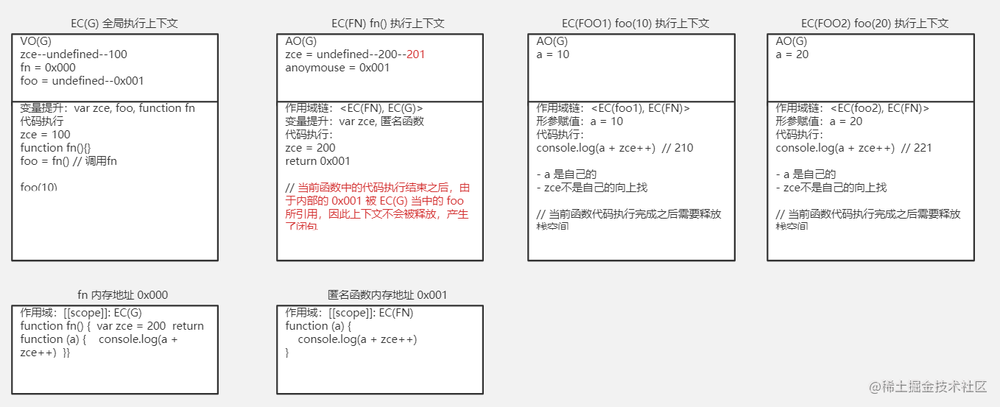
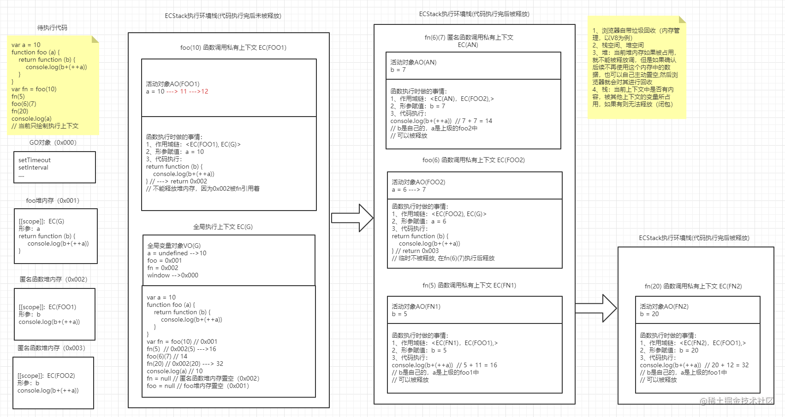

# 理解堆栈执行

## JS 执行平

通常可以执行 JS 代码的平台有 nodejs、浏览器、原生或非原生的应用(webview)。

## 执行环境

编程语言开发的程序最终是在内存中运行的，这片内存空间简称执行环境栈。

## 执行上下文

通过一段示例明确它对策意义

```js
const name = "zce";
function foo() {
    const name = "lagou";
}
function fn() {
    console.log("1111");
}
```

1. 一个`JS`文件中会包含多种代码（变量、函数、对象），将不同的代码组合在一起形成了代码块。
2. 不同的代码块之间可能会出现相同的命名（如上）......等，代码在执行的时候如何对它们进行区分呢？
3. 区分方式：将每段代码都放到自己的执行上下文当中
4. 我们可以认为执行上下文就类似一个"**容器**"，在它当中包含了当前代码进栈执行时所需要使用的一切
5. `EC`(execution context) 执行上下文

## 进栈执行

1. 执行环境栈,类似**大容器**（浏览器加载界面默认会创建内存空间），先进后出
2. 代码执行（函数调用）会产生一个独立的执行上下文，它会进到环境栈当中，运行内部的代码
3. 内部代码执行完成后，考虑是否出栈

## EC(G)全局执行上下文

1. 默认情况下浏览器会生成一个全局执行上下文用于存放。
2. 默认情况下它会自动出现在栈（执行环境栈）底。那什么时候这个执行上下文占据的内存空间会被释放呢？（关闭当前网页，因为浏览器是多线程的，当前网页只是其中的一个线程）

## VO(G)全局变量对象

1. 全局变量对象(它是一个对象，一定可以存数据，存什么？)，`VO(G)`在`EC(G)`全局执行上下文中。

## GO 全局对象

1. `global object`全局对象，它和`VO`(variable object)并不是同一个东西
2. 浏览器在加载界面的时候默认会创建一个空间，它里面存放了一些我们在 JS 当中可以直接访问的`API`（`setTimeout`、`setInterval`、`toString`......）
3. 为了`JS`方便找到内置的这些 API，在全局执行上下文当中的`VO`中定义了一个变量叫`window`（引用地址）指向这些`API`

## 声明

如：`var name; const age`

## 定义

如：`name = 'aaa'`

## JS 数据类型的表现形式

1. 基本数据类型值存在栈空间，引用类型需要单独开辟一个空间来进行储存（堆内存）
2. 堆内存会有一个内存地址（16 进制的地址），在栈区的变量存放的是内存地址
3. 作用域链查找机制，最终到（ `GO` ）
4. 函数的讨论一般分为 2 部分：函数的创建 + 函数的执行
5. 函数的创建和变量有些类似，可以将函数名看作一个变量，但是它与变量的不同点在于，提升阶段（预解析）函数是声明 + 定义都做，而变量只做声明。
6. 函数也是一个对象，因此会占据一个堆内存。
7. **对于函数来说，在创建的时候就会确定好它的作用域** （词法作用域、scope）
8. 函数所对应的堆内存当中会将函数体以字符串的方式保存起来。
9. 函数执行的目的就是为了将它里面所保存的字符串形式的代码拿到内存中，当作真正的代码运行起来。
10. 因为函数里面也有很多的数据，为了和其他的代码块当中的数据做隔离，因此**每个函数每次调用都会创建一个新的独立的执行上下文。** 在这个上下文中保存它内部的数据，然后再整体执行进栈调用。

## 函数的执行

函数执行，需要走的 6 个步骤：

1. 确定作用域链：函数当前执行上下文（如：`EC(FOO)`）--> 函数的词法作用域（`EC(G)`）
2. 确定`this`: 如`window`...(后续讨论)
3. 初始化`argument`：创建一个伪数组...
4. 形参赋值：形参赋值就会在`AO`当中新增一个变量
5. 变量提升
6. 代码执行: 在代码执行中可能会开辟新的堆内存、赋值、创建函数等等
   图解一个实例，便于理解函数执行：

## 实践一下

例子 1

```js
var zce = 100;
function fn() {
    var zce = 200;
    return function (a) {
        console.log(a + zce++);
    };
}

var foo = fn();
foo(10); // 210
foo(20); // 221
```

> 解析：函数执行时会产新生成一个执行上下文，一般来说函数中的代码执行结束之后就需要出栈从而释放当前上下文所占据的内存空间，
> 从而释放它内部的声明和值，但是如果此时当前执行上下文当中的数据（一般就是堆内存引用）被当前上下文之外的变量所引用，
> 那么这个上下文就不能被释放掉，此时就形成了一个闭包。

图解以上代码的执行过程：


例子 1

```js
var a = 10;
function foo(a) {
    return function (b) {
        console.log(b + ++a);
    };
}
var fn = foo(10);
fn(5); // 16
foo(6)(7); // 14
fn(20); // 32
console.log(a); // 10
```

图解以上代码的执行过程：

