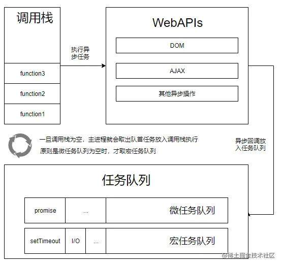

# 同步与异步模式

## 进程与线程

-   进程是操作系统资源分配的最小单位
-   线程是 CPU 调度的最小单位

采用一个简单的比喻理解：进程=火车，线程=车厢

-   线程在进程下行进（单纯的车厢无法运行）
-   一个进程可以包含多个线程（一辆火车可以有多个车厢）
-   不同进程间数据很难共享（一辆火车上的乘客很难换到另外一辆火车，比如站点换乘）
-   同一进程下不同线程间数据很易共享（A 车厢换到 B 车厢很容易）
-   进程要比线程消耗更多的计算机资源（采用多列火车相比多个车厢更耗资源）
-   进程间不会相互影响，一个线程挂掉将导致整个进程挂掉（一列火车不会影响到另外一列火车，但是如果一列火车上中间的一节车厢着火了，将影响到所有车厢）
-   进程可以拓展到多机，进程最多适合多核（不同火车可以开在多个轨道上，同一火车的车厢不能在行进的不同的轨道上）
-   进程使用的内存地址可以上锁，即一个线程使用某些共享内存时，其他线程必须等它结束，才能使用这一块内存。（比如火车上的洗手间）－"互斥锁"
-   进程使用的内存地址可以限定使用量（比如火车上的餐厅，最多只允许多少人进入，如果满了需要在门口等，等有人出来了才能进去）－“信号量”

通常我们打开浏览器或者浏览器打开一个页面，可以看做开启一个进程。它包含了 **GUI 渲染线程**、**JS 引擎线程**、**事件触发线程**、**定时器触发线程**、**异步 http 请求线程**。  
通常 JS 中的大部分代码都是同步执行的，但是遇到耗时长的程序必须要进行等待，因此需要一种机制提高程序的执行效率。  
可以采用基于**单线程的 EventLoop(事件循环机制)** 实现出异步效果。

## JS 中的异步编程

-   promise（then)
-   async/await （generator)
-   requestAnimationFrame
-   定时器操作
-   ajax(Http 网络请求)
-   事件绑定

## EventLoop 模型

先贴图


代码的执行顺序:

-   浏览器加载界面之后会开启一个线程来执行 JS，称之叫 JS 引擎（主线程）
-   JS 引擎会自上而下的执行 JS 代码，此过程会遇到（定时器，网络请求，事件绑定，promise....)
-   遇到上述代码执行之后，浏览器会开启一个 Event Queue(任务|事件)队列 优先级队列结构
-   在队列当中存在二个任务队列：微任务 microtask | 宏任务 macrotask
-   最终会将遇到的异步任务存放到 Event Queue 队列当中（未执行）
-   主线程会继续向下执行同步代码，直到所有同步执行完就会处理异步任务
-   进入 Event Queue 当中查找异步任务，找到之后放入主线程中执行（此时主线程又被占用）
-   执行完一个异步任务之后，主线程再次空闲，此时再进入 Event Queue 查找余下的异步任务

## 理解执行顺序

先贴代码

```js
setTimeout(() => {
    console.log("1");
}, 30);

console.log(2);

setTimeout(() => {
    console.log(3);
}, 20);

console.log(4);

console.time("AA");
// 消耗95ms
for (let i = 0; i < 88888888; i++) {}
console.timeEnd("AA");

console.log(5);

setTimeout(() => {
    console.log(6);
}, 18);

console.log(7);

setTimeout(() => {
    console.log(8);
}, 25);

console.log(9);
```

> 解析：先执行同步任务输出 2、4、AA:\*\*、5、7、9；再执行异步任务。异步任务存在 4 个定时器。
> for 循环前后的定时器都按照进入任务队列的先后顺序执行，依次输出 3、1、6、8。
