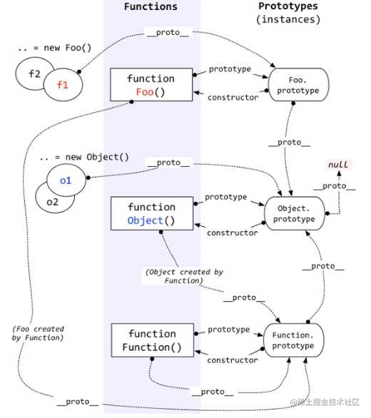

# 面向对象

## 普通函数与构造函数

```js
function Foo(m, n) {
    let ret = m + n;
    this.m = m;
    this.n = n;
    return ret;
}

// 01 普通函数调用
let ret = Foo(10, 20);
console.log(ret); // 30

// 02 构造函数执行
let res = new Foo(20, 20);
console.log(res); // Foo {m: 20, n: 20}
```

普通函数

-   正常调用，不需要 new 关键字
-   执行过程还是按着堆栈执行 + 作用域链查找机制

构造函数

-   使用 new 关键字调用
-   与普通函数类似，同样会创建私有上下文，然后进栈执行
-   执行 new 操作时，浏览器会创建一个空间表示空对象与 this 进行关联
-   函数体内如果没有 return 或者说 return 的是基本数据类型，默认返回对象实例
-   函数体内如果返回引用类型，那么就以自己返回为主
-   函数此时叫做类，返回的结果叫对象实例

new 操作符

-   正常情况下使用 new 完成对象实例创建，如果当前类不需要传递参数，则可以不加括号运行
-   new Foo,未加小括号说明 FOO 不需要传参，称之为无参列表
-   new Foo 与 new Foo() 的优先级不同，前者为 19， 后者为 20
-   每一次 new 都会将函数重新执行，生成一个新的执行上下文，创建一个新的实例对象，因此两个实例对象不一样

## 原型及原型链

先贴图


名词说明

-   prototype 属性
    -   每个**函数**（除箭头函数）数据类型，都**自带一个 prototype 属性**，指向原型对象（Function 除外）
    -   **每个原型对象自带一个 constructor 属性**，指向当前构造函数本身
    -   函数数据类型
        -   普通函数、箭头函数、生成器函数
        -   构造函数（自定义类）
        -   内置函数（内置构造函数）
-   **proto** 属性
    -   **每一个对象数据类型，都自带一个 proto 属性**，（隐式原型）
    -   该属性的值指向所属类的原型对象 prototype
    -   对象数据类型
        -   普通对象、数组对象、正则对象、日期对象
        -   prototype 原型对象
        -   实例对象
        -   函数也是对象
-   Object 类
    -   所有对象都是 Object 内置类的实例
    -   Object 也是一个函数，同样具有 prototype 属性，指向自己的原型对象
    -   它的原型也是一个对象，因此具有 **proto** 属性
    -   Object 原型对象的**proto** 指向 Null( 内部设计 )

## 原型链查找机制

1. 首先找自己私有的属性， 私有中存在就是私有的
2. 私有中不存在，则默认基于 **proto** 找所属类的原型对象
3. 如果类的原型上没有，则基于原型对象的 **proto** 继续向上查找，直到找到 Object.prototype 为止

## 实践一下

```js
function Foo() {
    this.m = 10;
    this.n = 24;
    this.getM = function () {
        console.log(this.m);
    };
}
Foo.prototype.getM = function () {
    console.log(this.m);
};

Foo.prototype.getN = function () {
    console.log(this.n);
};

let foo1 = new Foo();
let foo2 = new Foo();
console.log(foo1.getM === foo2.getM); // false
console.log(foo1.getN === foo2.getN); // true
console.log(foo1.__proto__.getN === Foo.prototype.getN); // true
console.log(foo1.__proto__.getM === foo2.getM); // false
console.log(foo1.getM === Foo.prototype.getM); // false
console.log(foo1.constructor); // Foo() { this.m = 10;this.n = 24;this.getM = function () {console.log(this.m);}; }
console.log(Foo.prototype.__proto__.constructor); // Object() { [native code] }
foo1.getM(); // 10
foo1.__proto__.getM(); // undefined
foo2.getN(); // 24
Foo.prototype.getN(); // undefined
```

## 模拟 new 实现

```js
function Person(name) {
    this.name = name;
}
Person.prototype.slogan = function () {
    console.log("前端界最帅的人");
};
Person.prototype.sayName = function () {
    console.log(`我的名字是${this.name}`);
};

// let p1 = new Person('zce')
// p1.slogan()
// p1.sayName()

function _new(Ctor, ...params) {
    //01 创建实例对象
    // let obj = {}
    // obj.__proto__ = Ctor.prototype
    let obj = Object.create(Ctor.prototype);

    //02 调用构造函数，改变this指向
    let ret = Ctor.call(obj, ...params);

    //03 处理返回结果
    if (ret !== null && /^(object|function)$/.test(typeof ret)) return ret;
    return obj;
}

let p1 = _new(Person, "zce");
p1.slogan();
p1.sayName();
console.log(p1 instanceof Person);
```

## Function 与 Object


代码释义

```js
//①构造器Function的构造器是它自身
Function.constructor === Function; //true

//②构造器Object的构造器是Function（由此可知所有构造器的constructor都指向Function）
Object.constructor === Function; //true

//③构造器Function的__proto__是一个特殊的匿名函数function() {}
console.log(Function.__proto__); //function() {}

//④这个特殊的匿名函数的__proto__指向Object的prototype原型。
Function.__proto__.__proto__ === Object.prototype; //true

//⑤Object的__proto__指向Function的prototype，也就是上面③中所述的特殊匿名函数
Object.__proto__ === Function.prototype; //true
Function.prototype === Function.__proto__; //true
```

对象的构造函数等于函数的构造函数。  
函数的构造函数是函数自身。  
对象的原型(**proto**)等于函数的原型(prototype)。  
函数的原型(prototype)有等于函数的原型(**proto**)。

## 函数与对象语录

1. Function 是一等公民，在 JS 中存在多种角色，普通函数、构造函数、对象
2. 每一个对象都存在 **proto** 属性，指向所属类的原型对象（隐式原型，原型链属性）
3. 每一个函数都存在 prototype 属性，指向它的原型对象
4. 所有函数都是 Function 内置类的实例，且 Function 本身也是一个函数
5. 所有对象都是 Object 的实例，且 Object 本身也是一个函数
6. Function 与 Object 是二大并行的基类，虽然最终查找落脚点都是 Object 身上
7. Function.prototype 原型对象是一个匿名函数，虽然它是一个函数，但是它的处理机制和原型对象是一样的， 它的 **proto** 属性指向所属类的原型对象，也就是 Object.prototype

## 不具备 prototype 属性的情况

1. Function.prototype 不具备，是一个匿名函数
2. 对象中使用 ES6 语法定义函数 `const obj = { say(){} }`
3. 箭头函数
4. 不具备 prototype 属性的函数是不能执行 new 操作的
