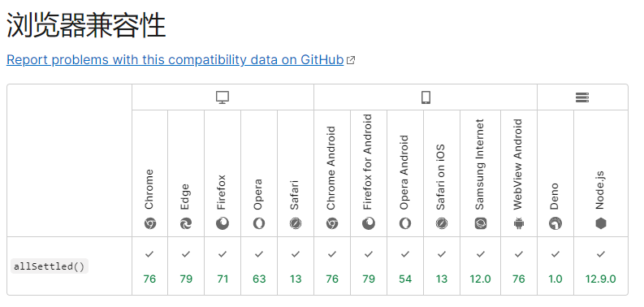
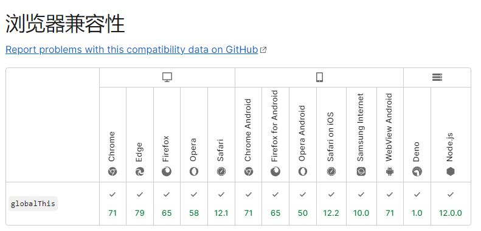

# ES 新特性

## ECMASCript 简介

1、`Javascript`语言本身指的就是`ECMASCript`,只不过运行在不同的平台`Javascript`进行了扩展。  
2、`Javascript`在`Web`下使用包括了：`ECMASCript` + `Web APIs` (`BOM`、`DOM`)。  
3、`Javascript`在`Node.js`下使用包括了：`ECMASCript` + `Node APIs` (`fs`、`net`、`etc.`)。  
4、2016 年开始 ES 保持每年一个版本迭代，行业内我们所说的`ES6`可以泛指`ECMASCript`的所有标准。  
5、`ES6`对原有基础的做了很大改进，主要体现在四个方面：

-   对原有语法的增强，如：`Object.values()`、`Object.assign()` ...
-   解决原有语法上的一些问题或者缺陷，如：`let`、`const`、`块作用域` ...
-   全新的对象、全新的方法、全新的功能，如：`Proxy`、`Reflect`、`class`关键词、`extends`类的继承...
-   全新的数据类型和数据结构，如：`Symbol`、`Set`、`Map`...

## 数组解构、对象解构

1、以往获取数组元素的方式是通过数组下标,`ES6`获取数组元素可以按照位置相同进行赋值，也可以添加默认值。另外通过剩余运算符可以获取集合。

```js
const arr = [100, 200, 300];
const [foo, bar, baz, car = 400] = arr;
const [bas, ...rest] = arr;
log(foo, bar, baz, car); // 100 200 300 400
log(bas, rest); // 100 [ 200, 300 ]
```

2、以往获取对象属性的方式是通过.运算符，`ES6`可以通过变量名与属性名相同获取属性值，也可以重命名属性名，给属性值添加默认值。

```js
const obj = { name: "Tom", age: 20 };
const name = "Jack";
const { name: objName = "default" } = obj;
log(objName); // Tom
```

## 模板字符串及扩展方法

1、模板字符串普通用法支持支持变量，反引号转义、换行、插值运算

```js
const name = "peek";
log(`hello es2015
my name is ${name + 1} \`\string\``);
```

2、带标签的模板字符串可以对字符串进行加工

```js
const name = "peek";
const gender = true;
function myTagFunc(string, name, gender) {
    return string[0] + name + string[1] + gender + string[2];
}
const result = myTagFunc`hey, ${name} is a ${gender}`;
console.log(result); // hey, peek is a true
```

3、`ES6`提供的字符串的扩展方法

```js
const message = "Error: foo is not defined";
log(message.includes("foo")); // true
log(message.startsWith("Error")); // true
log(message.endsWith("defined")); // true
```

## ...运算符

1、函数参数传值采用剩余运算符，最好放在形参的最后

```js
const hello = (sum, ...rest) => {
    log(sum); // 100
    log(rest); // [ 1, 2, 3 ]
};
hello(100, 1, 2, 3);
```

2、数组中使用扩展运算符

```js
const arr = ["1", "2", "3"];
console.log(...arr); // 1 2 3
```

## Object 对象字面量增强

```js
const x = "11";
const family = {
    x,
    y() {
        // 推荐写法，简洁
        console.log(this); // this指向family
    },
    z: () => {
        // 推荐写法，方便理解
        console.log(this.y); // this指向window
        console.log(family.y); // 调用family对象的属性
        return null;
    },
    // 计算属性名作为属性名
    [Math.random()]: "33",
};

console.log(family);
```

## Object 对象新方法

```js
log(Object.assign({ a: 1, b: 2 }, { a: 3, c: 4 })); // 对象合并
log(Object.assign({}, { a: 3, c: 4 })); // 浅拷贝
log(-0 === +0); // true
log(null === null); // true
log(Object.is(-0, +0)); // false 判断对象是否相等
log(Object.is(null, null)); // true
```

## Proxy 对象(俗称：门卫)

1、`Proxy`对象采用的是非侵入的方式劫持整个对象, 对整个对象进行监管

```js
const person = {
    name: "Tom",
    age: 24,
};
const personProxy = new Proxy(person, {
    get(target, prop) {
        // 1、对对象属性的取值操作，添加默认值，最后返回属性值
        return target[prop] ? target[prop] : "default";
    },
    set(target, prop, value) {
        // 小知识：vscode提示的代码不是我们所需要的，按下Esc键即可
        // 2、对对象属性的赋值操作，添加校验以及异常处理
        if (prop === "age") {
            if (!Number.isInteger(value)) {
                throw new Error("this value must be a integer");
            }
        }
        // 3、给对象属性赋值
        target[prop] = value;
    },
});

personProxy.age = "20";
log(personProxy.name);
log(personProxy.xxx);
```

2、`Proxy` 与 `Object.defineProperty`对比
`Object.defineProperty`仅支持对对象的读写进行劫持，并且是侵入式写法，需要改造对象。 `Proxy`是对整个对象进行监管, `Proxy`采用非侵入的方式劫持整个对象。

```js
const person = {
    name: "Tom",
    age: 24,
};
const personProxy = new Proxy(person, {
    set(target, prop, value) {
        target[prop] = value;
    },
    deleteProperty(target, prop) {
        console.log("delete", prop);
        delete target[prop];
    },
});

delete personProxy.age;
personProxy.gender = "man";
log(person); // { name: 'Tom', gender: 'man' }
```

`Proxy`对数组操作更友好的监视，以往都是采用重写数组的方法实现数组监听（vue2+）

```js
const list = [];
const listProxy = new Proxy(list, {
    set(target, prop, value) {
        target[prop] = value;
        return true; // 标记数组元素添加成功
    },
});

listProxy.push("11");
log(list); // [ '11' ]
```

3、除了上面常用的属性操作，还有其他的操作，如下：


## Reflect 静态类

诞生的意义： `Reflect`静态类提供了统一的操作对象的方法。以前我们操作对象的方法很杂，比如 `delete`、`in`、`Object.keys()`, 未来要废弃的。

```js
const person = {
    name: "Tom",
    age: 24,
};

log("name" in person);
log(Reflect.get(person, "name"));
log(Reflect.set(person, "name", 'link'));
// 判断一个对象是否存在某个属性，和 in 运算符 的功能完全相同。
log(Reflect.has(person, "name"));
log(delete person.name);
// 作为函数的delete操作符，相当于执行 delete target[name]
log(Reflect.deleteProperty(person, "name"));
log(Object.keys(person));
// 返回一个包含所有自身属性（不包含继承属性）的数组。(类似于 Object.keys(), 但不会受enumerable影响).
log(Reflect.ownKeys(person));

// 如果参数为 Object，返回结果相同
Object.getPrototypeOf({})   // Object.prototype
Reflect.getPrototypeOf({})  // Object.prototype
Reflect.setPrototypeOf({}, Object.prototype); // true

// 新对象是可扩展的.
var empty = {};
Reflect.isExtensible(empty); // === true
// ...但这可以改变.
Reflect.preventExtensions(empty);
Reflect.isExtensible(empty); // === false

// 与 Object.getOwnPropertyDescriptor() 的不同点
Reflect.getOwnPropertyDescriptor("foo", 0);
// 类型错误:foo并不非null对象
Object.getOwnPropertyDescriptor("foo", 0);
// { value: "f", writable: false, enumerable: true, configurable: false }

// 使用 Reflect.defineProperty()
let obj = {}
Reflect.defineProperty(obj, 'x', {value: 7})  // true
obj.x                                         // 7

// 静态方法 Reflect.ownKeys() 返回一个由目标对象自身的属性键组成的数组。
Reflect.ownKeys({z: 3, y: 2, x: 1}); // [ "z", "y", "x" ]
Reflect.ownKeys([]); // ["length"]

// 静态方法 Reflect.apply() 通过指定的参数列表发起对目标 (target) 函数的调用。
Reflect.apply(Math.floor, undefined, [1.75]);
```

可以改造之前的`Proxy`获取对象属性的方法

```js
const personProxy = new Proxy(person, {
    get(target, prop, value) {
        log("watch ...");
        return Reflect.get(target, prop);
    },
});

console.log(personProxy.age);
```

除了上面常用的属性操作，还有其他的操作，如下：


## Promise 对象

略，参考[手写 promise](https://juejin.cn/post/6980906770323472421)

## class 关键词

诞生的意义：让`Javascript`类的定义, 简洁易懂。  
1、以往我们定义一个类是采用构造函数的方式,如下：

```js
function Person(value) {
    this.name = value;
}
Person.create = function (value) {
    // ES5定义类的静态方法
    return new Person(value);
};
Person.prototype.say = function () {
    log(`hi, my name is ${this.name}`);
};

// const person = new Person()
const person = Person.create("Tom");
person.say();
```

2、现在我们采用 class 关键词定义类, 简洁易懂

```js
class Person {
    constructor(value) {
        this.name = value;
    }
    say() {
        log(`hi, my name is ${this.name}`);
    }
    static create(value) {
        // ES6定义类的静态方法
        return new Person(value);
    }
}

// const person = new Person('Tom')
const person = Person.create("Tom");
person.say();
```

## extends 类的继承

诞生的意义：让类的继承更加简洁易懂。

```js
class Person {
    constructor(value) {
        this.name = value;
    }
    say() {
        log(`hi, my name is ${this.name}`);
    }
}

class Student extends Person {
    constructor(name, number) {
        super(name); // super对象始终指向父类，调用它即调用父类构造函数
        this.number = number;
    }
    hello() {
        super.say();
        log(`my school number is ${this.number}`);
    }
}

// extends实现类的继承，相比于ES5中原型继承，更简洁易懂
const student = new Student("jack", 101);
console.log(student.hello());
```

## Set 数据结构

诞生的意义：Set 对象允许你存储任何类型的唯一值，无论是原始值或者是对象引用。

```js
const list = new Set(); // 数据集合中的元素不存在重复
list.add(1).add(2).add(2).add(4); // add方法会返回集合本身，因此可以链式调用

for (i of list) {
    log(i);
}

log(list.delete(4));
log(list.size);
log(list.has(4));
// 常用的场景是数组去重
const arr = [1, 1, 4, 4, 5, 6];
log(Array.from(new Set(arr)));
log([...new Set(arr)]);
```

## Map 数据结构

诞生的意义：严格意义上的键值对的集合,可以以任意数据类型作为键。  
1、以往以多种数据类型作为键值的对象

```js
const obj1 = {
    [123]: "123",
    [true]: "true",
    [{ a: 1 }]: "a",
    [{ b: 1 }]: "b",
};

log(Object.keys(obj1)); // [ '123', 'true', '[object Object]' ]
log(obj1["[object Object]"]); // b
```

问题：键值默认被`Object.prototype.toString.call(key)` 转为字符串  
2、`ES6`键值对的集合定义

```js
const obj2 = new Map();
const tom = { name: "tom" };

obj2.set(tom, "c");
log(obj2); // Map(1) {{…} => 'c'}
obj2.forEach((value, key) => log(value, key)); // {name: 'tom'}
log(obj2.get(tom)); // c
log(obj2.has(tom)); // true
log(obj2.delete(tom)); // true
log(obj2.clear()); // undefined
```

## Symbol 基本数据类型

1、以往当不同文件重复定义全局对象的同一个属性出现覆盖问题，以下模拟不同文件。

```js
const cache = {};
/* -----------------a.js--------------------- */
cache["foo"] = "111";

/* ----------------b.js--------------------- */
cache["foo"] = "222";
log(cache); // { foo: '222' }
```

2、Symbol 类型可以定义常量，并添加对 Symbol 数据的描述

```js
const s = Symbol("foo");
log(typeof s); // Symbol
log(Symbol("foo")); // Symbol(foo) 添加对Symbol数据的描述
log(Symbol("bar"));
log(Symbol("fpp"));
```

3、定义对象的私有属性,以前都是约定的如：\_name : 'Tom',不可靠

```js
const name = Symbol("name");
const person = {
    [name]: "Tom", // 3、定义对象的私有属性,以前都是约定的如：_name : 'Tom'
    say() {
        log(`${this[name]}`);
    },
};
log(person.name); // undefined
log(person.say()); // Tom
```

`Symbol`类型的数据最主要的作用就是为对象添加一个独一无二的属性名  
4、Symbol 类型的比较

```js
log(Symbol() === Symbol(), Symbol("foo") === Symbol("foo")); // false false
// Symbol内部维护了一个描述符到Symbol的映射表
log(Symbol.for("foo") === Symbol.for("foo")); // true
// Symbol.for()内部调用了toString()方法
log(Symbol.for(true) === Symbol.for("true")); // true
```

5、`Symbol()`属性更适合作为对象的私有属性

```js
const obj1 = {
    [Symbol()]: "Symbol value",
    [Symbol()]: "Symbol value",
    foo: "value",
};
for (key in obj1) {
    // foo
    log(key);
}
log(Object.keys(obj1)); // [ 'foo' ]
log(JSON.stringify(obj1)); // {"foo":"value"}

// 获取对象所有Symbol类型的键值
log(Object.getOwnPropertySymbols(obj1)); // [ Symbol(), Symbol() ]
```

`for...in` 、`Object.keys()`、`JSON.stringify()` 等都获取不了 Symbol 类型的属性，也反证 Symbol 类型更适合作为对象的私有属性。

## ES6 可迭代接口

诞生意义：理论上`for...of`可以遍历任何一种数据结构（数组、伪数组、`Set`、`Map`、等）  
1、`JavaScript`中的循环遍历

```js
const list1 = [1, 2, 3, 4, 5];
// const list1 = new Set([1, 2, 3, 4, 5])
for (const value of list1) {
    log(value);
    if (value > 2) {
        break;
    }
}

// list1.some()
// list1.every()

const list2 = new Map();
list2.set({ a: 1 }, 1);
list2.set({ b: 2 }, 2);
for (const [key, value] of list2) {
    log(key, value);
}
```

2、对比`forEach`和`for...of`

```js
list2.forEach((item) => log(item)); // 不能跳出循环
```

3、数据接口含有可迭代接口--Symbol(Symbol.iterator)

```js
// const arr = [1, 2, 3, 4]
const arr = new Set([1, 2, 3, 4]);
log(arr[Symbol.iterator]); // [Function: values]  数组原型对象上定义了可迭代函数，返回对象
log(arr[Symbol.iterator]().next()); // { value: 1, done: false }  调用对象的next() 方法
```

4、如何实现对象的可迭代接口，采用迭代器模式（设计模式）

```js
const obj2 = {
    study: ["吃饭", "睡觉", "大豆豆"],
    life: ["出行", "旅游", "美食"],
    work: ["摸鱼"],
    [Symbol.iterator]() {
        const list = Object.entries(obj2);
        let index = 0;
        return {
            next() {
                return { value: list[index], done: index++ >= list.length };
            },
        };
    },
};
// 通过自定义对象的[Symbol.iterator]，实现了对象的可迭代接口，就可使用for...of
for (const [key, value] of obj2) {
    log(key, value);
}
```

## ES6 生成器

1、一般使用

```js
function* fn() {
    log("111...");
    yield 100;
    log("222...");
    yield 200;
}

const result = fn();
log(result.next()); // 111... 返回 { value: 100, done: false }
log(result.next()); // 222... 返回 { value: 200, done: false }
log(result.next()); // 返回 { value: undefined, done: true }
```

2、场景需求：实现一个发号器

```js
function* createIdMaker() {
    let id = 1;
    while (true) {
        yield id++;
    }
}

const maker = createIdMaker();
log(maker.next().value); // 依次递增
log(maker.next().value);
log(maker.next().value);
```

3、如何实现对象的可迭代接口，采用生成器

```js
const obj2 = {
    study: ["吃饭", "睡觉", "大豆豆"],
    life: ["出行", "旅游", "美食"],
    work: ["摸鱼"],
    [Symbol.iterator]: function* () {
        const list = Object.entries(obj2);
        for (const item of list) {
            yield item;
        }
    },
};

for (const item of obj2) {
    log(item);
}
```

## Object 新增 API

1、`Object.values()`、`Object.entries()`、`Object.getOwnPropertyDescriptors`

```js
const p1 = {
    firsetName: "Yon",
    lastName: "zhang",
    get fullName() {
        return this.firsetName + " " + this.lastName;
    },
};

log(Object.values(p1)); // [ 'Yon', 'zhang', 'Yon zhang' ]  获取对象属性值的集合
log(Object.entries(p1)); //  获取对象属性与值的集合

const descriptors = Object.getOwnPropertyDescriptors(p1);
log(descriptors);
const p2 = Object.defineProperties({}, descriptors);
p2.firsetName = "ton";
log(p2.fullName);
```

## 字符串的扩展方法

`padEnd()`和`padStart()`

```js
const books = {
    html: 3,
    css: 10,
    javaScript: 103,
};

for (const [key, value] of Object.entries(books)) {
    log(`${key.padEnd(16, "-")} | ${value.toString().padStart(3, "0")}`);
}
// html------------ | 003
// css------------- | 010
// javaScript------ | 103
```

## 指数操作符

在 ES7 中引入了指数运算符**，**具有与 Math.pow(..)等效的计算结果。  
使用自定义的递归函数 calculateExponent 或者 Math.pow()或者指数运算符\*\*进行指数运算。

```js
function calculateExponent(base, exponent) {
    if (exponent === 1) {
        return base;
    } else {
        return base * calculateExponent(base, exponent - 1);
    }
}

console.log(calculateExponent(2, 10)); // 输出1024
console.log(Math.pow(2, 10)); // 输出1024
console.log(2 ** 10); // 输出1024
```

## SharedArrayBuffer 对象

SharedArrayBuffer 对象用来表示一个通用的，固定长度的原始二进制数据缓冲区，类似于 ArrayBuffer 对象，它们都可以用来在共享内存（shared memory）上创建视图。与 ArrayBuffer 不同的是，SharedArrayBuffer 不能被分离。

```js
/**
 *
 * @param {*} length 所创建的数组缓冲区的大小，以字节(byte)为单位。
 * @returns {SharedArrayBuffer} 一个大小指定的新 SharedArrayBuffer 对象。其内容被初始化为 0。
 */
new SharedArrayBuffer(length);
```

## Atomics 对象

Atomics 对象提供了一组静态方法用来对 SharedArrayBuffer 对象进行原子操作。

这些原子操作属于 Atomics 模块。与一般的全局对象不同，Atomics 不是构造函数，因此不能使用 new 操作符调用，也不能将其当作函数直接调用。Atomics 的所有属性和方法都是静态的（与 Math 对象一样）。

多个共享内存的线程能够同时读写同一位置上的数据。原子操作会确保正在读或写的数据的值是符合预期的，即下一个原子操作一定会在上一个原子操作结束后才会开始，其操作过程不会中断。
Atomics.add()
将指定位置上的数组元素与给定的值相加，并返回相加前该元素的值。

Atomics.and()
将指定位置上的数组元素与给定的值相与，并返回与操作前该元素的值。

Atomics.compareExchange()
如果数组中指定的元素与给定的值相等，则将其更新为新的值，并返回该元素原先的值。

Atomics.exchange()
将数组中指定的元素更新为给定的值，并返回该元素更新前的值。

Atomics.load()
返回数组中指定元素的值。

Atomics.or()
将指定位置上的数组元素与给定的值相或，并返回或操作前该元素的值。

Atomics.store()
将数组中指定的元素设置为给定的值，并返回该值。

Atomics.sub()
将指定位置上的数组元素与给定的值相减，并返回相减前该元素的值。

Atomics.xor()
将指定位置上的数组元素与给定的值相异或，并返回异或操作前该元素的值。

wait() 和 wake() 方法采用的是 Linux 上的 futexes 模型（fast user-space mutex，快速用户空间互斥量），可以让进程一直等待直到某个特定的条件为真，主要用于实现阻塞。

Atomics.wait()
检测数组中某个指定位置上的值是否仍然是给定值，是则保持挂起直到被唤醒或超时。返回值为 "ok"、"not-equal" 或 "time-out"。调用时，如果当前线程不允许阻塞，则会抛出异常（大多数浏览器都不允许在主线程中调用 wait()）。

Atomics.wake()
唤醒等待队列中正在数组指定位置的元素上等待的线程。返回值为成功唤醒的线程数量。

Atomics.isLockFree(size)
可以用来检测当前系统是否支持硬件级的原子操作。对于指定大小的数组，如果当前系统支持硬件级的原子操作，则返回 true；否则就意味着对于该数组，Atomics 对象中的各原子操作都只能用锁来实现。此函数面向的是技术专家。

## 异步迭代（ES9-2018）

在 async/await 的某些时刻，你可能尝试在同步循环中调用异步函数。例如：

```js
async function process(array) {
    for (let i of array) {
        await doSomething(i);
    }
}
```

这段代码不会正常运行，下面这段同样也不会

```js
async function process(array) {
    array.forEach(async (i) => {
        await doSomething(i);
    });
}
```

这段代码中，循环本身依旧保持同步，并在在内部异步函数之前全部调用完成。  
ES2018 引入异步迭代器（asynchronous iterators），这就像常规迭代器，除了 next()方法返回一个 Promise。因此 await 可以和 for...of 循环一起使用，以串行的方式运行异步操作。例如：

```js
async function process(array) {
    for await (let i of array) {
        doSomething(i);
    }
}
```

## 正则表达式命名捕获组(ES9)

JavaScript 正则表达式可以返回一个匹配的对象——一个包含匹配字符串的类数组，例如：以 YYYY-MM-DD 的格式解析日期：

```js
const reDate = /([0-9]{4})-([0-9]{2})-([0-9]{2})/,
    match = reDate.exec("2018-04-30"),
    year = match[1], // 2018
    month = match[2], // 04
    day = match[3]; // 30
```

这样的代码很难读懂，并且改变正则表达式的结构有可能改变匹配对象的索引。  
ES2018 允许命名捕获组使用符号，在打开捕获括号(后立即命名，示例如下：

```js
const reDate = /(?<year>[0-9]{4})-(?<month>[0-9]{2})-(?<day>[0-9]{2})/,
    match = reDate.exec("2018-04-30"),
    year = match.groups.year, // 2018
    month = match.groups.month, // 04
    day = match.groups.day; // 30
```

任何匹配失败的命名组都将返回 undefined。  
命名捕获也可以使用在 replace()方法中。例如将日期转换为美国的 MM-DD-YYYY 格式：

```js
const reDate = /(?<year>[0-9]{4})-(?<month>[0-9]{2})-(?<day>[0-9]{2})/,
    d = "2018-04-30",
    usDate = d.replace(reDate, "$<month>-$<day>-$<year>");
```

## 正则表达式

(?=pattern): 正向先行断言。
目前 JavaScript 在正则表达式中支持先行断言（lookahead）。这意味着匹配会发生，但不会有任何捕获，并且断言没有包含在整个匹配字段中。例如从价格中捕获货币符号：

```js
const reLookahead = /\D(?=\d+)/,
    match = reLookahead.exec("$123.89");

console.log(match[0]); // $
```

(?<=pattern) : 零宽正向后行断言
ES2018 引入以相同方式工作但是匹配前面的反向断言（lookbehind），这样我就可以忽略货币符号，单纯的捕获价格的数字

```js
const reLookbehind = /(?<=\D)\d+/,
    match = reLookbehind.exec("$123.89");

console.log(match[0]); // 123
```

(?<!pattern) : 零宽负向后行断言
以上是 肯定反向断言，非数字\D 必须存在。同样的，还存在 否定反向断言，表示一个值必须不存在，例如：

```js
const reLookbehindNeg = /(?<!\D)\d+/,
    match = reLookbehind.exec("$123.89");

console.log(match[0]); // 123
```

## 行分隔符、段分隔符

行分隔符（U + 2028）和段分隔符（U + 2029）符号现在允许在字符串文字中，与 JSON 匹配。  
以前，这些符号在字符串文字中被视为行终止符，因此使用它们会导致 SyntaxError 异常。

## Array 的 flat()方法和 flatMap()

flat()和 flatMap()本质上就是是归纳（reduce） 与 合并（concat）的操作。  
Array.prototype.flat()。flat() 方法会按照一个可指定的深度递归遍历数组，并将所有元素与遍历到的子数组中的元素合并为一个新数组返回。

-   flat()方法最基本的作用就是数组降维

```js
var arr1 = [1, 2, [3, 4]];
arr1.flat();
// [1, 2, 3, 4]

var arr2 = [1, 2, [3, 4, [5, 6]]];
arr2.flat();
// [1, 2, 3, 4, [5, 6]]

var arr3 = [1, 2, [3, 4, [5, 6]]];
arr3.flat(2);
// [1, 2, 3, 4, 5, 6]

//使用 Infinity 作为深度，展开任意深度的嵌套数组
arr3.flat(Infinity);
// [1, 2, 3, 4, 5, 6]
```

-   其次，还可以利用 flat()方法的特性来去除数组的空项

```js
var arr4 = [1, 2, , 4, 5];
arr4.flat();
// [1, 2, 4, 5]
```

Array.prototype.flatMap()。flatMap() 方法首先使用映射函数映射每个元素，然后将结果压缩成一个新数组。它与 map 和 深度值 1 的 flat 几乎相同，但 flatMap 通常在合并成一种方法的效率稍微高一些。 这里我们拿 map 方法与 flatMap 方法做一个比较。

```js
var arr1 = [1, 2, 3, 4];

arr1.map((x) => [x * 2]);
// [[2], [4], [6], [8]]

arr1.flatMap((x) => [x * 2]);
// [2, 4, 6, 8]

// 只会将 flatMap 中的函数返回的数组 “压平” 一层
arr1.flatMap((x) => [[x * 2]]);
// [[2], [4], [6], [8]]
```

## String 的 trimStart()方法和 trimEnd()方法

新增的这两个方法很好理解，分别去除字符串首尾空白字符，这里就不用例子说声明了

## Object.fromEntries()

Object.entries()方法的作用是返回一个给定对象自身可枚举属性的键值对数组，其排列与使用 for...in 循环遍历该对象时返回的顺序一致（区别在于 for-in 循环也枚举原型链中的属性）。  
**Object.fromEntries() 则是 Object.entries() 的反转**

> Object.fromEntries() 函数传入一个键值对的列表，并返回一个带有这些键值对的新对象。这个迭代参数应该是一个能够实现@iterator 方法的的对象，返回一个迭代器对象。它生成一个具有两个元素的类似数组的对象，第一个元素是将用作属性键的值，第二个元素是与该属性键关联的值。

-   通过 Object.fromEntries， 可以将 Map 转化为 Object:

```js
const map = new Map([
    ["foo", "bar"],
    ["baz", 42],
]);
const obj = Object.fromEntries(map);
console.log(obj); // { foo: "bar", baz: 42 }
```

-   通过 Object.fromEntries， 可以将 Array 转化为 Object:

```js
const arr = [
    ["0", "a"],
    ["1", "b"],
    ["2", "c"],
];
const obj = Object.fromEntries(arr);
console.log(obj); // { 0: "a", 1: "b", 2: "c" }
```

## tring.prototype.matchAll

matchAll() 方法返回一个包含所有匹配正则表达式及分组捕获结果的迭代器。 在 matchAll 出现之前，通过在循环中调用 regexp.exec 来获取所有匹配项信息（regexp 需使用/g 标志：

```js
const regexp = RegExp("foo*", "g");
const str = "table football, foosball";

while ((matches = regexp.exec(str)) !== null) {
    console.log(`Found ${matches[0]}. Next starts at ${regexp.lastIndex}.`);
    // expected output: "Found foo. Next starts at 9."
    // expected output: "Found foo. Next starts at 19."
}
```

如果使用 matchAll ，就可以不必使用 while 循环加 exec 方式（且正则表达式需使用／g 标志）。使用 matchAll 会得到一个迭代器的返回值，配合 for...of, array spread, or Array.from() 可以更方便实现功能：

```js
const regexp = RegExp("foo*", "g");
const str = "table football, foosball";
let matches = str.matchAll(regexp);

for (const match of matches) {
    console.log(match);
}
// Array [ "foo" ]
// Array [ "foo" ]

// matches iterator is exhausted after the for..of iteration
// Call matchAll again to create a new iterator
matches = str.matchAll(regexp);

Array.from(matches, (m) => m[0]);
// Array [ "foo", "foo" ]
```

## 修改 catch 绑定

在 ES10 之前，我们必须通过语法为 catch 子句绑定异常变量，无论是否有必要。很多时候 catch 块是多余的。 ES10 提案使我们能够简单的把变量省略掉。之前是

```js
try {
} catch (e) {}
```

现在

```js
try {
} catch {}
```

## 新的基本数据类型 BigInt

现在的基本数据类型（值类型）不止 5 种（ES6 之后是六种）了哦！加上 BigInt 一共有七种基本数据类型，分别是： String、Number、Boolean、Null、Undefined、Symbol、BigInt

## 可选链操作符（Optional Chaining) ES2020

可选链 可让我们在查询具有多个层级的对象时，不再需要进行冗余的各种前置校验。
日常开发中，当需要访问嵌套在对象内部好几层的属性时，可能就会得到臭名昭著的错误 Uncaught TypeError: Cannot read property...，这种错误，让整段程序运行中止。  
于是，你就要修改你的代码来处理来处理属性链中每一个可能的 undefined 对象，比如：

```js
// let nestedProp = obj && obj.first && obj.first.second;
let nestedProp = obj?.first?.second;
```


## 空值合并运算符（??）

一个逻辑运算符，当左侧的操作数为 null 或者 undefined 时，返回其右侧操作数，否则返回左侧操作数。

```js
const foo = null ?? "default string";
console.log(foo);
// expected output: "default string"

const baz = 0 ?? 42;
console.log(baz);
// expected output: 0
```

## Promise.allSettled

我们知道 Promise.all 具有并发执行异步任务的能力。但它的最大问题就是如果参数中的任何一个 promise 为 reject 的话，则整个 Promise.all 调用会立即终止，并返回一个 reject 的新的 Promise 对象。

```js
const promises = [
    Promise.resolve(1),
    Promise.resolve(2),
    Promise.reject("error"),
];

Promise.all(promises)
    .then((responses) => console.log(responses))
    .catch((e) => console.log(e)); // "error"
```

假如有这样的场景：一个页面有三个区域，分别对应三个独立的接口数据，使用 Promise.all 来并发请求三个接口，如果其中任意一个接口出现异常，状态是 reject,这会导致页面中该三个区域数据全都无法出来，这个状况我们是无法接受，Promise.allSettled 的出现就可以解决这个痛点：

```js
Promise.allSettled([
    Promise.reject({ code: 500, msg: "服务异常" }),
    Promise.resolve({ code: 200, list: [] }),
    Promise.resolve({ code: 200, list: [] }),
]).then((res) => {
    console.log(res);
    /*
        0: {status: "rejected", reason: {…}}
        1: {status: "fulfilled", value: {…}}
        2: {status: "fulfilled", value: {…}}
    */
    // 过滤掉 rejected 状态，尽可能多的保证页面区域数据渲染
    RenderContent(
        res.filter((el) => {
            return el.status !== "rejected";
        })
    );
});
```

Promise.allSettled 跟 Promise.all 类似, 其参数接受一个 Promise 的数组, 返回一个新的 Promise, 唯一的不同在于, 它不会进行短路, 也就是说当 Promise 全部处理完成后,我们可以拿到每个 Promise 的状态, 而不管是否处理成功。


## globalThis

globalThis 是一个全新的标准方法用来获取全局 this 。之前开发者会通过如下的一些方法获取：

-   全局变量 window：是一个经典的获取全局对象的方法。但是它在 Node.js 和 Web Workers 中并不能使用
-   全局变量 self：通常只在 Web Workers 和浏览器中生效。但是它不支持 Node.js。一些人会通过判断 self 是否存在识别代码是否运行在 Web Workers 和浏览器中
-   全局变量 global：只在 Node.js 中生效

过去获取全局对象，可通过一个全局函数：

```js
// ES10之前的解决方案
const getGlobal = function () {
    if (typeof self !== "undefined") return self;
    if (typeof window !== "undefined") return window;
    if (typeof global !== "undefined") return global;
    throw new Error("unable to locate global object");
};

// ES10内置
globalThis.Array(0, 1, 2); // [0,1,2]

// 定义一个全局对象v = { value:true } ,ES10用如下方式定义
globalThis.v = { value: true };
```

而 globalThis 目的就是提供一种标准化方式访问全局对象，有了 globalThis 后，你可以在任意上下文，任意时刻都能获取到全局对象。  
如果您在浏览器上，globalThis 将为 window，如果您在 Node 上，globalThis 则将为 global。因此，不再需要考虑不同的环境问题。

```js
// worker.js
globalThis === self;
// node.js
globalThis === global;
// browser.js
globalThis === window;
```

新提案也规定了，Object.prototype 必须在全局对象的原型链中。下面的代码在最新浏览器中已经会返回 true 了：

```js
Object.prototype.isPrototypeOf(globalThis); // true
```



## Object.hasOwn()

如果指定的对象自身有指定的属性，则静态方法 Object.hasOwn() 返回 true。如果属性是继承的或者不存在，该方法返回 false。  
在 ES2022 之前，可以使用 Object.prototype.hasOwnProperty() 来检查一个属性是否属于对象。  
Object.hasOwn 特性是一种更简洁、更可靠的检查属性是否直接设置在对象上的方法：

```js
const example = {
    property: "123",
};

console.log(Object.prototype.hasOwnProperty.call(example, "property"));
console.log(Object.hasOwn(example, "property"));
```


## at()

at() 是一个数组方法，用于通过给定索引来获取数组元素。当给定索引为正时，这种新方法与使用括号表示法访问具有相同的行为。当给出负整数索引时，就会从数组的最后一项开始检索：

```js
const array = [0, 1, 2, 3, 4, 5];

console.log(array[array.length - 1]); // 5
console.log(array.at(-1)); // 5

console.log(array[array.lenght - 2]); // 4
console.log(array.at(-2)); // 4
```

除了数组，字符串也可以使用 at()方法进行索引

```js
const str = "hello world";

console.log(str[str.length - 1]); // d
console.log(str.at(-1)); // d
```
