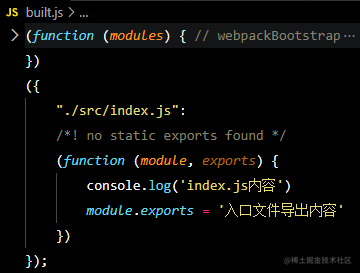

# Webpack 解析

## 一、webpack 打包文件

#### 1、输出文件整体分析：

1. 打包后的文件就是一个函数自调用，当前函数调用时传入一个对象
2. 这个对象我们为了方便称之为是模块定义，它就是一个键值对
3. 这个键名就是当前被加载模块的文件名与某个目录的拼接
4. 这个键值就是一个函数和 node.js 里的模块加载有一些类似，会将被加载的模块内容包裹在一个函数中
5. 这个函数在将来某个时间点上会被调用，同时接收到一定的参数，利用这些参数就可以实现模块的加载操作
6. 针对上述的代码就相当于是将 {}(模块定义) 传递给 modules

## 二、webpack 源码分析过程

01、 cmd 文件的核心作用就是组装了 node \*\*\*\*/webpack/bin/webpack.js

02、 webpack.js 中的核心操作是 require 了 node_modules/webpack-cli/bin/cli.js

03、 cli.js - 文件有 2 个操作：处理参数和将参数交给不同的逻辑（分发业务） - options - complier - complier.run( 至于 run 里面做了什么，后续再分析， 当前只关注代码入口点)

04、文件 node_modules\webpack\lib\Compiler.js this.hooks 中关键步骤的执行顺序 - beforeRun - run - thisCompilation - compilation - beforeCompile - compile - make - afterCompile

05、WebpackOptionsApply
---> process(options, compiler)
---> EntryOptionPlugin
---> entryOption (在 EntryOptionPlugin 内部的 apply 方法中调用了 tap 注册了事件监听.. )
上述的事件监听 在 new 完了 EntryOptionPlugin 之后调用
---> itemToPlugin (它是一个函数 接收三个参数 context、 item(entry)、'main')
---> SingleEntryPlugin (在调用 itemToPlugin 的时候又返回了一个 实例对象)
有一个构造函数，负责接收上文中的 context entry name
apply 函数中注册了 compilation、make 钩子监听 'SingleEntryPlugin' 事件

06、分析 compile 的实现
--->通过 newCompilationParams 处理参数 仅关注正常的 createNormalModuleFactory
上述操作是为了获取参数
---> 接着调用 beforeCompile 钩子监听， 在它的回调中又触发了 compiler 监听
---> 调用 newCompilation 方法， 传入上面的 params, 返回一个 compilation
---> 调用了一个 createCompilation() (Compilation.js)
上述操作完成后就可以触发 make 钩子监听

07、步骤
---> 实例化 compiler 对象 （它会贯穿整个 webpack 工作的过程）
---> 由 compiler 调用 run 方法

08、compiler 实例化操作
---> compiler 继承 tapable， 因此它具备钩子的操作能力（监听事件、触发事件、webpack 是一个事件流）
---> 在实例化了 compiler 对象之后就往它的身上挂载很多属性，其中 NodeEnvironmentPlugin 整个操作就是让它具备了
文件读写的能力（我们模拟时采用的是 node 自带的 fs 模块）
---> 具备了 fs 操作能力之后，又将 plugins 中的插件都挂载到 compiler 对象身上
---> 将内部默认的插件与 compiler 建立关系 其中有一个 EntryOptionPlugin 处理入口模块的 id
---> 上述的实例化 compiler 的时候只是监听了 make 钩子 （SingleEntryPlugin）
- 1、在 SingleEntryPlugin 模块中有两个钩子的监听，其中 compilation 钩子 就是让 钩子 具备利用 normalModuleFactory 工厂创建普通模块的能力
- 2、因为 它就是利用一个自己创建的模块来加载需要打包的模块
- 3、其中 make 钩子 在 compiler.run 的时候会被触发，走到这里就意味就意味着某个模块执行打包之前的所有准备工作完成了。
- 4、addEntry 方法调用（）

09、run 方法执行（当前想看一下什么时候触发了 make 钩子）
---> run 方法里就是一堆钩子、按照顺序触发 （beforeRun、Run、compiler 方法调用）
----> compiler 方法执行
- 1、准备参数(其中 NormalModuleFactory 后续用于创建模块)
- 2、触发 beforeCompile 方法
- 3、将第一步的参数传给函数，开始创建一个 compilation
- 4、在调用 newCompilation 方法的内部， - 调用 createCompilation - 触发了 this.compilation 钩子和 compilation 钩子的监听
- 5、当创建了 compilation 对象之后就触发了 make 钩子
- 6、当我们触发 make 钩子监听的时候，将 copilation 对象传递过去

## 总结

1. 实例化 compiler
2. 调用 compile 方法
3. newCompilation
4. 实例化一个 compilation 对象（它 和 compiler 是有关系的）
5. 触发 make 监听
6. addEntry 方法(这个时候 就带着 context name entry一堆东西)  就奔着编译去了

:::tip 关键函数
 * beforeRun
 * run
 * thisCompilation
 * compilation
 * beforeCompile
 * compile
 * make
 * afterCompile
 :::

-------------------依赖模块处理----------------------  
1、需要将 index.js 里面的 require 方法替换成 `__webpack_require__`  
2、将 ./title 替换成 ./src/title.js  
3、文件递归操作： 因此需要将依赖的模块信息保存好，等待下一次的 create 操作
