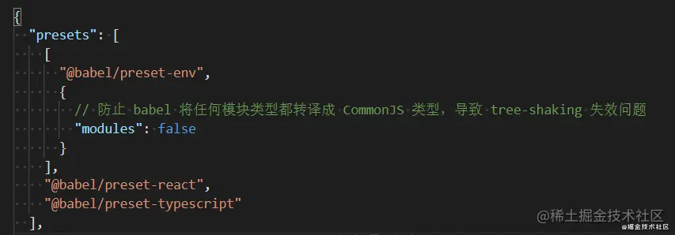

# webpack5 和 webpack4 的区别有哪些 ？
## 1、Tree Shaking
作用： 如果我们的项目中引入了 lodash 包，但是我只有了其中的一个方法。其他没有用到的方法是不是冗余的？此时 tree-shaking 就可以把没有用的那些东西剔除掉，来减少最终的bundle体积。

> usedExports : true, 标记没有用的叶子

> minimize: true, 摇掉那些没有用的叶子
```js
  // webpack.config.js中
  module.exports = {
     optimization: {
       usedExports: true, //只导出被使用的模块
       minimize : true // 启动压缩
     }
  }
```
由于 tree shaking 只支持 esmodule ，如果你打包出来的是 commonjs，此时 tree-shaking 就失效了。不过当前大家都用的是 vue，react 等框架，他们都是用 babel-loader 编译，以下配置就能够保证他一定是 esmodule



webpack5的 mode=“production” 自动开启 tree-shaking。
## 2、压缩代码
1. webpack4

> webpack4 上需要下载安装 terser-webpack-plugin 插件，并且需要以下配置：

```js
const TerserPlugin = require('terser-webpack-plugin')

module.exports = { 
// ...other config
optimization: {
  minimize: !isDev,
  minimizer: [
    new TerserPlugin({
      extractComments: false, 
      terserOptions: { 
        compress: { 
          pure_funcs: ['console.log'] 
        }
      }
    }) ]
 }
```
2. webpack5
内部本身就自带 js 压缩功能，他内置了 terser-webpack-plugin 插件，我们不用再下载安装。而且在 mode=“production” 的时候会自动开启 js 压缩功能。

如果你要在开发环境使用，就用下面：
```js
  // webpack.config.js中
  module.exports = {
     optimization: {
       usedExports: true, //只导出被使用的模块
       minimize : true // 启动压缩
     }
  }
```
3. js 压缩失效问题
当你下载 optimize-css-assets-webpack-plugin ，执行 css 压缩以后，你会发现 webpack5 默认的 js 压缩功能失效了。先说 optimize-css-assets-webpack-plugin 的配置：

npm install optimize-css-assets-webpack-plugin -D

```js
module.exports = { 
  optimization: { 
    minimizer: [ 
      new OptimizeCssAssetsPlugin() 
    ]
  },
}
```

此时的压缩插件 optimize-css-assets-webpack-plugin 可以配置到 plugins 里面去，也可以如图配置到到 optimization 里面。区别如下：

配置到 plugins 中，那么这个插件在任何情况下都会工作。 而配置在 optimization 表示只有 minimize 为 true 的时候才能工作。

当安装 optimize-css-assets-webpack-plugin 以后你去打包会发现原来可以压缩的 js 文件，现在不能压缩了。原因是你指定的压缩器是

optimize-css-assets-webpack-plugin 导致默认的 terser-webpack-plugin 就会失效。解决办法如下：

> npm install terser-webpack-plugin -D

```js
 optimization: {
    minimizer: [
      new TerserPlugin({
        extractComments: false,
        terserOptions: {
          compress: { pure_funcs: ['console.log'] },
        },
      }),
      new OptimiazeCssAssetPlugin(),
    ]
  },
```
即便在 webpack5 中，你也要像 webpack4 中一样使用 js 压缩。
4. 注意事项
在webpack5里面使用 optimize-css-assets-webpack-plugin 又是会报错，因为官方已经打算要废除了，请使用替换方案：

> npm i css-assets-webpack-plugin -D

## 3、合并模块

> 普通打包只是将一个模块最终放到一个单独的立即执行函数中，如果你有很多模块，那么就有很多立即执行函数。concatenateModules 可以要所有的模块都合并到一个函数里面去。

optimization.concatenateModules = true

配置如下：
```js
module.exports = {
  optimization: {
    usedExports: true,
    concatenateModules: true,
    minimize: true
  }
}
```
此时配合 tree-shaking 你会发现打包的体积会减小很多。
## 4、副作用 sideEffects

> webpack4 新增了一个 sideEffects 的功能，容许我们通过配置来标识我们的代码是否有副作用。


这个特性只有在开发 npm 包的时候用到

副作用的解释： 在utils文件夹下面有index.js文件，用于系统导出utils里面其他文件，作用就是写的少， 不管 utils 里面有多少方法，我都只需要引入 utils 即可。
```js
// utils/index.js
  export * from './getXXX.js';
  export * from './getAAA.js';
  export * from './getBBB.js';
  export * from './getCCC.js';
```
```js
 // 在其他文件使用 getXXX 引入
  import {getXX} from '../utils'
```
此时，如果文件 getBBB 在外界没有用到，而 tree-shaking 又不能把它摇掉咋办？这个 getBBB 就是副作用。你或许要问 tree-shaking 为什么不能奈何他？原因就是：他在 utils/index.js 里面使用了。只能开启副作用特性。如下：
```js
// package.json中
{
  name：“项目名称”,
  ....
  sideEffects: false
}
```
```js
// webpack.config.js

module.exports = {
  mode: 'none',
  ....
  optimization: {
    sideEffects: true
  }
}
```
副作用开启：

(1) optimization.sideEffects = true 开启副作用功能

(2) package.json 中设置 sideEffects : false 标记所有模块无副作用

说明： webpack 打包前都会检查项目所属的 package.json 文件中的 sideEffects 标识，如果没有副作用，那些没有用到的模块就不需要打包，反之亦然。此时，在webpack.config.js 里面开启 sideEffects。
## 5、webpack 缓存
1. webpack4 缓存配置
支持缓存在内存中

npm install hard-source-webpack-plugin -D
```js
const HardSourceWebpackPlugin = require('hard-source-webpack-plugin') 

module.exports = { 
plugins: [
  // 其它 plugin... 
  new HardSourceWebpackPlugin(), 
] }
```
2. webpack5 缓存配置
webpack5 内部内置了 cache 缓存机制。直接配置即可。

cache 会在开发模式下被设置成 type： memory 而且会在生产模式把cache 给禁用掉。
```js
// webpack.config.js
module.exports= {
  // 使用持久化缓存
  cache: {
    type: 'filesystem'，
    cacheDirectory: path.join(__dirname, 'node_modules/.cac/webpack')
  }
}
```

type 的可选值为： memory 使用内容缓存，filesystem 使用文件缓存。

当 type=filesystem的时候设置cacheDirectory才生效。用于设置你需要的东西缓存放在哪里？

## 6、对loader的优化

webpack 4 加载资源需要用不同的 loader

- raw-loader 将文件导入为字符串
- url-loader 将文件作为 data url 内联到 bundle文件中
- file-loader 将文件发送到输出目录中

webpack5 的资源模块类型替换 loader

- asset/resource 替换 file-loader(发送单独文件)
- asset/inline 替换 url-loader （导出 url）
- asset/source 替换 raw-loader（导出源代码）

asset

webpack5
## 7、启动服务的差别
1. webpack4 启动服务
通过 webpack-dev-server 启动服务
2. webpack5 启动服务
内置使用 webpack serve 启动，但是他的日志不是很好，所以一般都加都喜欢用 webpack-dev-server 优化。
## 8、 模块联邦（微前端）

webpack 可以实现 应用程序和应用程序之间的引用。

## 9、devtool的差别
sourceMap需要在 webpack.config.js里面直接配置 devtool 就可以实现了。而 devtool有很多个选项值，不同的选项值，不同的选项产生的 .map 文件不同，打包速度不同。
一般情况下，我们一般在开发环境配置用“cheap-eval-module-source-map”，在生产环境用‘none’。
devtool在webpack4和webpack5上也是有区别的

v4: devtool: 'cheap-eval-module-source-map'


v5: devtool: 'eval-cheap-module-source-map'

## 10、热更新差别

webpack4设置


webpack5 设置

如果你使用的是bable6，按照上述设置，你会发现热更新无效，需要添加配置：
```js
  module.hot.accept('需要热启动的文件',(source)=>{
     //自定义热启动
  })
```
当前最新版的babel里面的 babel-loader已经帮我们处理的热更新失效的问题。所以不必担心，直接使用即可。
如果你引入 mini-css-extract-plugin 以后你会发现 样式的热更新也会失效。
只能在开发环境使用style-loader，而在生产环境用MinicssExtractPlugin.loader。 如下：

## 11、使用 webpack-merge 的差别

webpack4 导入

> const merge = require('webpack-merge);

webpack 5 导入

> const {merge} = require('webpack-merge');
## 12、 使用 copy-webpack-plugin 的差别
```js
//webpack.config.js
const CopyWebpackPlugin = require('copy-webpack-plugin');

module.exports = {
  plugins: [
    // webpack 4
    new CopyWebpackPlugin(['public']),
    
    // webpack 5
    new CopyWebpackPlugin({
      patterns: [{
        from: './public',
        to: './dist/public'
      }]
    })
  ]
}
```
webpack5 支持的新版本里面需要配置的更加清楚。
