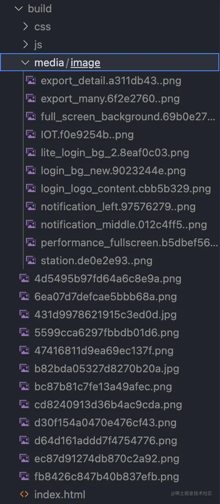
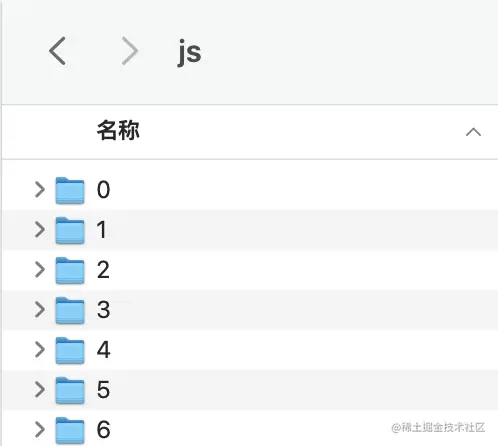
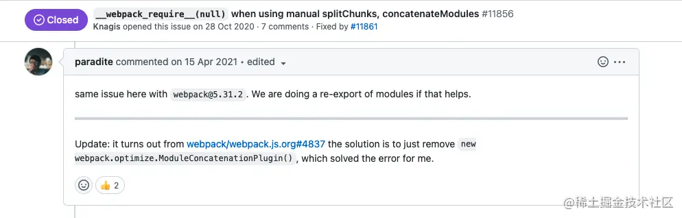
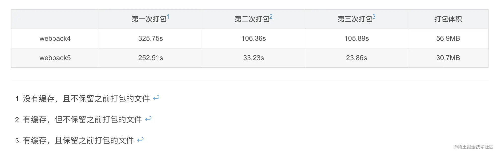

# webpack4升级到webpack5

## 背景
最近接手了公司内部webpack相关的依赖包，于是打算优化一波。考虑到webpack5已经正式发布近两年，跟webpack相关的依赖包应该适配的差不多了。计划先把webpack4升级到webpack5，然后基于webpack5再进行优化。

升级前用的是 "webpack": "^4.42.1" ，升级后用的是 "webpack": "^5.72.1" 。

笔者采用的升级webpack的方式是先一键升级所有的依赖包，然后一个一个地去解决运行过程中的报错。

首先，全局安装npm-check-updates：
> yarn global add npm-check-updates

然后在项目中执行 ncu -u ，这样项目的package.json会把所有的依赖包都更新到最新版本。然后执行 yarn 。升级完就可以开启漫长的debug之旅了。

## terser-webpack-plugin语法报错
```vb
Invalid options object. Terser Plugin has been initialized using an options object that does not match the API schema.
 - options has an unknown property 'cache'. These properties are valid:
   object { test?, include?, exclude?, terserOptions?, extractComments?, parallel?, minify? }
```

原来的配置：
```
minimizer: [
	new TerserPlugin({
		cache: true,
		parallel: true,
		terserOptions: {
			mangle: false, // Note `mangle.properties` is `false` by default.
		},
	}),
]
```
从报错来看，terser-webpack-plugin的配置属性发生了改变，现在已经没有 cache 这个选项了。

terser-webpack-plugin是用来压缩JavaScript代码的。不过webpack5已经自带了terser-webpack-plugin，如果说你用的是webpack5或者更高版本，同时还希望自定义配置，那么还是需要安装terser-webpack-plugin。

webpack4的时候可以通过terser-webpack-plugin的cache属性开启文件缓存。现在webpack5自身提供了持久化缓存机制，它能够将首次打包的结果缓存到硬盘中，等下次打包的时候就可以跳过一系类的耗时的操作，复用第一次的打包结果。可以通过以下配置开启持久化缓存：

```
cache: {
 type: 'filesystem',
 version: 'yourVersion'
}
```
缓存默认保存路径是 node_modules/.cache/webpack。这里要注意每当我们修改了webpack配置，记得更新cache的version，否则可能会出现因为重用了缓存导致配置没生效的问题。

综上，最后代码修改如下：
```
  cache: {
    type: 'filesystem',
    version: '3.8.1',
  },
  optimization: {
    ...
    minimizer: [
      new TerserPlugin({
        parallel: true,
        terserOptions: {
          mangle: false, // Note `mangle.properties` is `false` by default.
        },
      }),
    ],
    ...
  }
```
## fork-ts-checker-webpack-plugin语法报错
```vb
Invalid configuration object. ForkTsCheckerWebpackPlugin has been initialized using a configuration object that does not match the API schema.
 - configuration has an unknown property 'reportFiles'. These properties are valid:
   object { async?, typescript?, formatter?, issue?, logger?, devServer? }
```

fork-ts-checker-webpack-plugin 是在单独的进程上运行 TypeScript 类型检查器的 Webpack 插件。当文件发生改动需要重新转译和类型检查时，fork-ts-checker-webpack-plugin会开辟一个单独的进程去执行类型检查的任务，这样就不会影响 webpack 重新编译的速度。

原来的配置：
```
plugins: [
  new ForkTsCheckerWebpackPlugin({
      memoryLimit: 4096,
      tsconfig: PATH.appDirectory + '/tsconfig.json',
      checkSyntacticErrors: true,
      reportFiles: [`${PATH.appSrc}/**/*.{ts,tsx}`],
    }),
]
```
fork-ts-checker-webpack-plugin从  4.1.3  升级到  7.2.11  ，这个plugin的API已经发生了改变。

改成：
```
plugins: [
  new ForkTsCheckerWebpackPlugin({
      typescript: {
        memoryLimit: 4096,
        configFile: PATH.appDirectory + '/tsconfig.json',
        diagnosticOptions: { syntactic: false, semantic: false, declaration: false, global: false }
      },
    }),
]
```
diagnosticOptions选项用来设置哪些TypeScript语法需要检查。
## IgnorePlugin报错
```vb
Invalid options object. Ignore Plugin has been initialized using an options object that does not match the API schema.
 - options should be one of these:
   object { resourceRegExp, contextRegExp? } | object { checkResource }
   Details:
    * options misses the property 'resourceRegExp'. Should be:
      RegExp
      -> A RegExp to test the request against.
    * options misses the property 'checkResource'. Should be:
      function
      -> A filter function for resource and context.
```

IgnorePlugin的作用是忽略第三方包指定目录，让这些指定目录不会被打包进去。比如moment包的locale文件夹包括了各国语言的目录，如果把所有语言都打包进去就会影响打包效率。

原来的配置：
```js
new webpack.IgnorePlugin(/^\.\/locale$/, /moment$/)
```
从报错来看，该plugin的语法发生了改变。改成：
```js
new webpack.IgnorePlugin({
  resourceRegExp: /^\.\/locale$/,
  contextRegExp: /moment/,
})
```
## devtool报错
```vb
Invalid configuration object. Webpack has been initialized using a configuration object that does not match the API schema.
 - configuration.devtool should match pattern "^(inline-|hidden-|eval-)?(nosources-)?(cheap-(module-)?)?source-map$".
   BREAKING CHANGE since webpack 5: The devtool option is more strict.
   Please strictly follow the order of the keywords in the pattern.
```

大概的意思是说：检查devtool的匹配，webpack5要求的匹配更严格。

原来的配置：
```
devtool: isEnvDevelopment ? 'cheap-module-eval-source-map' : false,
```
改成：
```
devtool: isEnvDevelopment ? 'eval-cheap-module-source-map' : false,
```
## webpack-dev-server publicPath报错
```vb
Invalid options object. Dev Server has been initialized using an options object that does not match the API schema.
 - options has an unknown property 'publicPath'. These properties are valid:
   object { allowedHosts?, bonjour?, client?, compress?, devMiddleware?, headers?, historyApiFallback?, host?, hot?, http2?, https?, ipc?, liveReload?, magicHtml?, onAfterSetupMiddleware?, onBeforeSetupMiddleware?, onListening?, open?, port?, proxy?, setupExitSignals?, static?, watchFiles?, webSocketServer? }
```

这次webpack-dev-server从 "^3.11.2" 升级到了 "^4.9.0"。

publicPath用来设置项目跑在本地时，打包生成的文件所在的位置。

原来的配置：
```
devServer: {
    ...
    publicPath: appConfig.publicPath,
    ...
},
```
改成：
```
devServer: {
    ...
    devMiddleware: {
      publicPath: appConfig.publicPath,
    },
    ...
  },
```
## webpack-dev-server contentBase报错
```vb
Invalid options object. Dev Server has been initialized using an options object that does not match the API schema.
 - options has an unknown property 'contentBase'. These properties are valid:
   object { allowedHosts?, bonjour?, client?, compress?, devMiddleware?, headers?, historyApiFallback?, host?, hot?, http2?, https?, ipc?, liveReload?, magicHtml?, onAfterSetupMiddleware?, onBeforeSetupMiddleware?, onListening?, open?, port?, proxy?, setupExitSignals?, static?, watchFiles?, webSocketServer? }
```

contentBase用来设置项目跑在本地时，不由webpack打包生成的文件的位置。

原来的配置：
```
devServer: {
    ...
    contentBase: PATH.appDirectory,
    ...
  },
```
devServer的v4中contentBase迁移到了static下，并且static的默认值是path.resolve(process.cwd(), 'public') 。改成：

```
devServer: {
    ...
    static: [
      {
        directory: PATH.appDirectory,
      },
    ],
    ...
  },
```
## webpack-dev-server disableHostCheck报错
```vb
Invalid options object. Dev Server has been initialized using an options object that does not match the API schema.
 - options has an unknown property 'disableHostCheck'. These properties are valid:
   object { allowedHosts?, bonjour?, client?, compress?, devMiddleware?, headers?, historyApiFallback?, host?, hot?, http2?, https?, ipc?, liveReload?, magicHtml?, onAfterSetupMiddleware?, onBeforeSetupMiddleware?, onListening?, open?, port?, proxy?, setupExitSignals?, static?, watchFiles?, webSocketServer? }
```

原来的配置：
```
devServer: {
    ...
    disableHostCheck: true,
    ...
  },
```
改成：
```
devServer: {
    ...
    allowedHosts: "all",
    ...
  },
```
## 移除 node.js polyfill
```vb
Module not found: Error: Can't resolve 'crypto' in '/xxx/node_modules/crypto-js'

BREAKING CHANGE: webpack < 5 used to include polyfills for node.js core modules by default.
This is no longer the case. Verify if you need this module and configure a polyfill for it.

If you want to include a polyfill, you need to:
	- add a fallback 'resolve.fallback: { "crypto": require.resolve("crypto-browserify") }'
	- install 'crypto-browserify'
If you don't want to include a polyfill, you can use an empty module like this:
	resolve.fallback: { "crypto": false }
```

webpack5 以前，webpack 会包含 nodejs 核心模块的 polyfill，这样的话，比如安装了一个crypto模块，那么就可以直接使用，因为 node 的polyfill会自动启动。现在，webpack5 移除了 nodejs 的 polyfill，无法再直接使用类似crypto的模块了。

如果你想要使用类似crypto的 nodejs 核心模块，有两种方法：

1. 在 webpack 配置文件的resolve中配置fallback
```js
module.exports = {
    ...
    resolve: {
        fallback:  {
            "crypto": require.resolve("crypto-browserify"), // 如果不需要，那么就直接改为 false 就可以了
        }
    }
}
```

2. 如果觉得上面的方法很麻烦，那么可以使用node-polyfill-webpack-plugin：
```
const NodePolyfillPlugin = require('node-polyfill-webpack-plugin')

{
  ...
  plugins: [
    ...
    new NodePolyfillPlugin(),
    ...
  ]
}
```
## 导入json文件语法改变
export 'orderLimit'.'group_ids'.'includes' (imported as 'orderLimit') was not found in '../../../custom.config.json' (possible exports: 0, 1, 2)

原来：
```js
// custom.config.json
{
  "orderLimit": {
    "group_ids": ["xxx"],
    "desc": ["xxx"]
  }
}

// 原来引用文件方式
import { orderLimit } from '../../../custom.config.json'
```

改成：
```js
import orderLimit from '../../../custom.config.json'
```
## 打包报错unknown option '-p'
[webpack-cli] Error: Unknown option '-p'

原本的打包命令文件：
```
shellExec(
  'webpack -p --color --config ' + require.resolve('../config/webpack.config'),
)
```

改成如下：
```
shellExec(
  'webpack --mode production --color --config ' + require.resolve('../config/webpack.config'),
)
```
## node版本过低
eslint@8.15.0: The engine "node" is incompatible with this module. Expected version "^12.22.0 || ^14.17.0 || >=16.0.0". Got "14.15.4"

项目跑 CI/CD 的时候报错说 CI/CD 的 node 镜像版本偏低了。现在 eslint 要求的 node 版本是16以上，但是公司 CI/CD 的 node 版本是14。于是找负责运维的同事帮忙升级了 node 版本。

## 图片编译问题
原来的配置：
```
          {
            test: [/\.bmp$/, /\.gif$/, /\.jpe?g$/, /\.png$/],
            loader: require.resolve('url-loader'),
            options: {
              limit: 10000,
              name: 'media/image/[name].[hash:8].[ext]',
            },
          },
```
之前处理图片用的是url-loader。如果图片比较小那么会被编译成base64的格式，然后和项目代码打包在一起；如果是比较大的图片则会放在build/media/image文件夹下。然而升级到 webpack5 以后出现了下面的情况：


图片除了按要求放在build/media/image文件夹下，竟然还多存了一份直接放在了build文件夹下。而且项目代码中图片的引用路径指向了这些放错位置的图片，但是这些图片的格式又是错误的，根本显示不了图像。

在网上查了一下，上面的现象是因为 webpack5 已经自带了图片解析功能，再使用 url-loader 的话会出现图片重复打包的问题。现在有两种解决方案：

1. 继续使用url-loader，可以参考这篇文章：webpack5用url-loader打包后出现图片打不开、资源重复 。
2. 改用webpack5自身来解析图片
```
          {
            test: [/\.bmp$/, /\.gif$/, /\.jpe?g$/, /\.png$/],
            type: 'asset',
            parser: {
              dataUrlCondition: {
                maxSize: 10000,
              },
            },
            generator: {
              filename: 'media/image/[name].[hash:8].[ext]',
            },
          },
```
看了一下npm，url-loader已经两年没有更新了。稳妥起见，还是选择webpack自带的图片解析吧。
## 打包文件命名问题
webpack4的时候，代码编译后的文件夹命名是按顺序自增的数字id：


这样就存在一个问题，如果命名排在前面的模块被移除了，那么后面的模块就会补位，这会导致即使后续模块内容没有发生变化，但是因为文件夹名称发生了改变，之前的缓存就会失效了。

现在webpack5让开发者可以自己设置chunk和module的命名方式：
```
optimization: {
  chunkIds: 'named', // 'natural' | 'named' | 'size' | 'deterministic'
  moduleIds: 'named',
}
```

- natural 是webpack5以前生产模式下的命名方式。
- named 是根据项目文件路径生成名称，webpack以前和现在的开发模式默认使用这种命名方式
- size 是根据模块大小来生成数字。
- deterministic 是webpack5新增的命名方式，根据文件名称生成短hash，webpack5生产模式下默认启用。

## 废弃了ModuleConcatenationPlugin
项目打包完在线上运行的时候出现了报错：
Uncaught TypeError: Cannot read properties of undefined (reading 'call')

错的是这段代码：
```js
function __webpack_require__(moduleId) {
		var cachedModule = __webpack_module_cache__[moduleId]
		if (void 0 !== cachedModule) return cachedModule.exports
		var module = (__webpack_module_cache__[moduleId] = {
			id: moduleId,
			loaded: !1,
			exports: {},
		})
		return (
			__webpack_modules__[moduleId].call(
				module.exports,
				module,
				module.exports,
				__webpack_require__
			),
			(module.loaded = !0),
			module.exports
		)
	}
```
webpack实现了一个加载函数 __webpack_require__(moduleId) 来加载模块。这个函数做了这些事情：

- 根据模块Id在缓存中找是否有这个模块，如果有直接从缓存拿
- 如果缓存没有，那么先新建这个模块的缓存，然后再返回模块

__webpack_modules__[moduleId].call() 会报错八成是因为webpack找不到对应模块，__webpack_modules__[moduleId] 的结果是 undefined 。
顺着控制台列出来的报错文件继续往下看，看看是哪里调用了 __webpack_require__(moduleId)  ：
```
    "./node_modules/@babel/runtime/helpers/esm/slicedToArray.js": function(__unused_webpack___webpack_module__, __webpack_exports__, __webpack_require__) {
        "use strict";
       ...
        var arrayWithHoles = __webpack_require__(null);
        var unsupportedIterableToArray = __webpack_require__(null)
          , nonIterableRest = __webpack_require__(null);
        ...
    },
```
破案了，显然 __webpack_require__(null) 是有问题的。

在网上搜了一下，找到了解决方案：


之前公司webapck4的配置中，在生产环境会启用 new webpack.optimize.ModuleConcatenationPlugin() ：
```
plugins: [
  !isEnvDevelopment && new webpack.optimize.ModuleConcatenationPlugin()
]
```
看了一下webpack的开发文档，webpack在打包的时候会将各个模块打包成闭包，用了ModuleConcatenationPlugin之后会尽可能将模块放到一个闭包内，这样会提升代码在浏览器中的执行速度。这种操作还有一个专业名词，叫 Scope Hoisting，意思就是作用域提升。

不过现在ModuleConcatenationPlugin已经废弃了，把上面的代码删除以后，项目就能正常运行了。

## 升级前后对比



