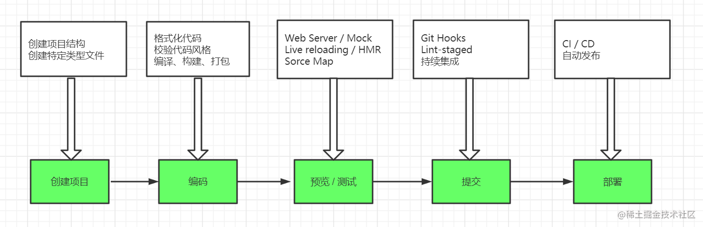
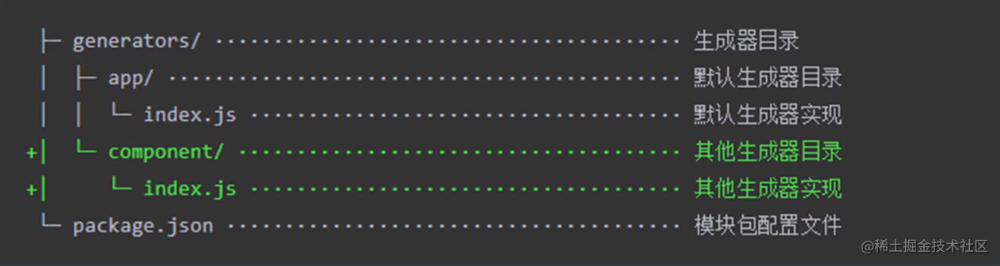

# 前端脚手架

## 一、前端工程化

#### 1、主要解决的问题

-   传统语言或语法的弊端
-   无法使用模块化、组件化
-   重复的机械工作
-   代码风格统一、质量保证
-   依赖后端服务接口支持
-   整体依赖后端项目

#### 2、前端工程化的表现

一切以提高效率、降低成本、质量保证为目的的手段都属于工程化。一切重复的工作都应该被自动化。  
创建项目（脚手架）-->编码（构建工具）-->预览/测试-->提交-->部署 每个环节的工程化表现图解：


#### 3、工程化与 Node.js

通俗的讲，`Node.js`对前端开发而言，不仅仅是提供一个`JavaScript`的运行平台，更是前端开发的一次"工业革命"。前端工程化所使用的工具几乎都是`node.js`开发，如最富盛名的`webpack`。
前端工程化主要体现在：脚手架工具开发、自动化构建系统、模块化打包、项目代码规范化、自动化部署，五个方面。

## 二、脚手架工具

前端工程化最早的发起者就是各种脚手架工具。它用于创建项目基础结构、提供项目规范和约定（组织结构、开发范式、模块依赖、工具配置、基础代码）。  
常用的脚手架工具：

-   `create-react-app`、`vue-cli`、`angular-cli`。根据特定的信息创建对应的项目基础结构，一般服务于特定的框架
-   `Yeoman`通用性的脚手架工具，更加灵活
-   `Plop`用于在项目中创建特定类型的文件

#### 1、Yeoman

`Yeoman`属于一个脚手架的运行平台，需要搭配不同的`generator`实现不同的功能。
全局安装`Yeoman`

-   `yarn global add yo`（推荐）或`npm i yo -g`
    安装相应的`generator`，如
-   `yarn global add generator-node`或`npm i generator-node -g`
    创建文件夹并通过`yeoman`运行`generator`，如
-   `cd workspace`、`mkdir project`
-   `yo node`之后回答命令行交互问题，最后生成项目基础结构

#### 2、Sub Generator

在已有的项目基础上创建一些特定类型的文件，如在项目中添加`reademe`、`eslint`、`git`等配置文件，可以用生成器自动生成。  
如`generator-node`创建的项目中添加有以下的子集生成器，但并不是所有的 generator 都有子集生成器。

-   `node:boilerplate`
-   `node:cli`
-   `node:editorconfig`
-   `node:eslint`
-   `node:git`
-   `node:readme`

#### 3、Yeoman 使用步骤总结

-   明确需求
-   找到合适的`Generator`
-   全局范围安装找到的`Generator`
-   通过`yo`运行对应的`Generator`
-   通过命令行交互填写选项
-   生成你所需要的项目结构
-   找到对应`Generator`
    例如：创建一个网页应用`webapp`

```
yarn global add generator-webapp
yo webapp
```

#### 4、自定义 Generator

基于`Yeoman`搭建自己的脚手架，本质上`Generator`就是一个`NPM`模块
自定义`Generator`的基本结构(含`component`子生成器)：

注意：自定义`Generator`的名称命名必须是`generator-xxx`

#### 5、接收用户输入数据

通过命令行交互的方式询问使用者，从而得到使用者想要的项目脚手架

```js
// 此文件作为Generator的核心入口
// 需要导出一个继承自Yoeman Generator的类型
// Yoeman Generator在工作时会自动调用我们在此类型中定义的一些生命周期方法
// 我们在这些方法中可以通过调用父类提供的一些工具方法实现一些功能，例如文件写入
const Generator = require("yeoman-generator");

module.exports = class extends Generator {
    prompting() {
        // Yeoman在询问用户环节会自动调用此方法
        // 在此方法可以调用父类的prompt()方法发出对用户命行询问
        return this.prompt([
            {
                type: "input",
                name: "title",
                message: "Your project title",
                default: this.appname, // appname为项目生成目录名称
            },
        ]).then((answers) => {
            // answers => { name : 'user input value' }
            this.answers = answers;
        });
    }
    writing() {
        // // Yoeman自动在生成文件阶段调用此方法
        // // 我们这里尝试往项目目录中写入文件
        // this.fs.write(
        //     this.destinationPath('temp.txt'),
        //     Math.random().toString()
        // )

        // 通过模板方式写入文件到目标目录
        // 模板文件路径
        const tmpl = this.templatePath("foo.txt");
        // 输出目标路径
        const output = this.destinationPath("foo.txt");
        // 模板数据上下文
        // const context = { title: 'Hello Ton', success: false }
        const context = { ...this.answers, success: false };
        this.fs.copyTpl(tmpl, output, context);
    }
};
```

#### 6、发布 Generator

`Generator`作为一个`NPM`模块，发布`Generator`就是发布一个`NPM`模块。

-   发布要注册 npm 账号，并邮箱验证
-   发布命令 yarn publish，输入 npm 账号密码,输入错误 yarn logout 可以重新填写
-   运行失败解决：yarn publish --registry=https://registry.yarnpkg.com
-   发布到的地址：https://www.npmjs.com/package/xxx

#### 7、Plop

`Plop`用于在项目中创建特定类型的文件的脚手架工具，类似`Yeoman`中的`Sub Generator`,提高创建重复文件的效率。在项目中的基本使用如下：

-   `yarn add plop --dev`
-   在根目录创建`plopfile.js`入口文件
    `plopfile.js`编写：
-   `plopfile`需要导出一个函数，从函数接收一个`plop`对象，用于创建生成器任务

```js
// 此函数接收一个plop对象，用于创建生成器任务
module.exports = (plop) => {
    plop.setGenerator("component", {
        description: "create a component",
        prompts: [
            // 命令行交互询问
            {
                type: "input",
                name: "name", // 键
                message: "component name", // 问题
                default: "MyComponent", // 默认答案
            },
        ],
        actions: [
            // 生成器动作，即将要生成文件的配置
            {
                type: "add", // 代表添加文件
                path: "src/components/{{name}}/{{name}}.js",
                templateFile: "plop-templates/component.hbs",
            },
        ],
    });
};
```

-   `yarn plop component`(生成器名称)执行`plop`命令，生成文件

#### 8、脚手架的工作原理

脚手架工具的本质是`node cli`应用，以下是`cli`应用的使用过程：

1. `yarn init`初始化项目的`package.json`
2. 在`package.json`添加添加`bin`字段指定`cli`应用的入口文件`cli.js`
3. `cli`应用的入口文件需要特定的文件头`#!/usr/bin/env node`
4. `cli.js`文件中添加脚手架的工作过程
5. 将当前模块通过`yarn link`的方式链接到全局，就可以使用该脚手架。

## 三、自动化构建

一切重复工作本应自动化，构建即转换，通俗的讲是将开发阶段的源代码通过自动化构建转换为生产阶段的代码，一般称这一过程为自动化构建工作流。可以让我们使用：

-   ECMAscript Next
-   Sass
-   模板引擎
    常见的自动化构建工具：
-   Grunt:最早的前端构建工具之一，缺点是每一步都进行磁盘读写，构建速度慢，插件完善。
-   Gulp：应用最广泛的构建工具，解决了 Grunt 构建速度慢的问题，插件完善。
-   FIS：百度内部构建工具，相比与前两个，它更像绑定套餐，拥有高度集成的特点（已经不维护）

#### 1、Grunt

1. 基本使用

-   安装`yarn add grunt`
-   `code gruntfile.js`编辑入口文件

```js
/**
 * Grunt的入口文件
 * 用于定义一些需要 Grunt 自动执行的任务
 * 需要导出一个函数
 * 此函数接收一个 grunt 的形参，内部提供一些创建任务时可以用到的 API
 */

module.exports = (grunt) => {
    grunt.registerTask("foo", () => {
        //注册一个任务 任务发生自动执行函数 yarn grunt foo
        console.log("hello grunt");
    });
};
```

2. 不同任务的配置

```js
grunt.initConfig({
    foo: {
        // 对象的key建议为任务名
        log: "hello grunt!",
    },
    build: {
        // 为build任务添加多个目标（子任务）
        options: {
            // 为多个目标添加默认配置选项
            maxSize: 1000,
        },
        css: {
            options: {
                // 目标的配置选项
                maxSize: 500,
            },
        },
        js: "1",
    },
    clean: {
        // grunt-contrib-clean插件配置
        temp: "temp/**",
    },
    sass: {
        // grunt-sass插件配置
        options: {
            sourceMap: true,
            implementation: sass,
        },
        main: {
            files: {
                "dist/css/main.css": "src/scss/main.scss",
            },
        },
    },
    babel: {
        options: {
            presets: ["@babel/preset-env"],
            sourceMap: true,
        },
        main: {
            files: {
                "dist/js/app.js": "src/js/app.js",
            },
        },
    },
    watch: {
        js: {
            files: ["src/js/*.js"],
            tasks: ["babel"],
        },
        css: {
            files: ["src/scss/*.scss"],
            tasks: ["sass"],
        },
    },
});
```

3. 一般任务

```js
grunt.registerTask("foo", () => {
    console.log(grunt.config("foo.log"));
});
```

4. 失败任务

```js
grunt.registerTask("bar", "任务描述", () => {
    // 失败任务
    console.log("other task!"); //标记任务失败,如果在任务列表中，它的失败会阻止后续任务运行
});
```

5. 异步任务

```js
grunt.registerTask("async-task", function () {
    // 异步任务
    const done = this.async(); // 添加异步任务完成的回调函数
    setTimeout(() => {
        console.log("async task working");
        done();
    }, 1000);
});
```

6. 多目标任务

```js
// 可以让任务根据配置形成多个子任务
grunt.registerMultiTask("build", function () {
    console.log(this.options());
    console.log(`target: ${this.target}, data: ${this.data}`);
});
```

7. 默认任务

```js
grunt.registerTask("default", ["sass", "babel", "watch"]);
```

#### 2、Grunt 中插件的使用

1. `yarn`安装插件
2. `gruntfile`中载入插件
3. 根据插件添加配置选项
   例如插件  `yarn add grunt-contrib-clean`  大部分插件都是 `yarn add grunt-contrib-xxx`

```js
module.exports = (grunt) => {
    //yarn grunt clean
    grunt.initConfig({
        clean: {
            temp: "temp/app.js",
            // temp:'temp/*.txt',
            // temp:'temp/**'  //包含temp文件夹的子目录和子目录所有文件
        },
    });
    grunt.loadNpmTasks("grunt-contrib-clean");
};
```

#### 3. 常用的 Grunt 插件

1. `yarn add grunt-sass sass --dev`

```js
const sass = require("sass");

module.exports = (grunt) => {
    grunt.initConfig({
        sass: {
            options: {
                sourceMap: true,
                implementation: sass, //Fatal error: The implementation option must be passed to the Sass task
            },
            main: {
                //任务目标
                files: {
                    "dist/css/main.css": "src/scss/main.scss",
                },
            },
        },
    });

    grunt.loadNpmTasks("grunt-sass");
};
```

2.  `yarn add grunt-babel @bable/core @babel/preset-env --dev`  核心模块，预设
    `yarn add load-grunt-tasks --dev`解决每次都要引入一个 loadNpmTasks 的问题, 使用`yarn grunt babel`  编译 es6

```js
const loadGruntTasks = require("load-grunt-tasks"); //引入

module.exports = (grunt) => {
    grunt.initConfig({
        babel: {
            options: {
                //preset把需要转的特性打了个包 preset-evn根据最新的es6特性进行转换
                presets: ["@babel/preset-env"],
                sourceMap: true,
            },
            main: {
                files: {
                    "dist/js/app.js": "src/js/app.js", //输出目录，输入目录
                },
            },
        },
    });

    // grunt.loadNpmTasks('grunt-contrib-clean')

    // grunt.loadNpmTasks('grunt-sass')

    // grunt.loadNpmTasks('grunt-babel')//引入load-grunt-tasks包解决每个插件都要引入一次的问题

    loadGruntTasks(grunt); //自动加载所有的grunt 插件中的任务
};
```

3. `yarn add grunt-contrib-watch`  自动编译, 使用`yarn grunt watch`监视文件变化

```js
const loadGruntTasks = require("load-grunt-tasks");

module.exports = (grunt) => {
    grunt.initConfig({
        watch: {
            //配置监视
            js: {
                files: ["src/js/*.js"],
                tasks: ["babel"], //监视到files文件内的内容改变，则执行对应插件
            },
            css: {
                files: ["src/scss/*.scss"],
                tasks: ["sass"],
            },
        },
    });

    loadGruntTasks(grunt); //自动加载所有的grunt 插件中的任务

    grunt.registerTask("default", ["sass", "babel", "watch"]); //注册默认任务，在监视前先执行一次
};
```

#### 4、Gulp

1. gulp 的基本使用

-   `Gulp`安装  `yarn add gulp --dev`
-   `code gulpfile.js` `gulp`入口文件,编写需要`gulp`执行的构建任务
-   `yarn gulp 任务名`  执行`gulp`构建
-   `gulpfile.js`文件时`gulp`的入口文件
    在最新的`gulp`中约定每个任务都是异步任务，因此我们需要标记任务完成通过`done`参数

```js
exports.foo = (done) => {
    console.log("foo task working~");

    done(); //标识任务完成
};

//默认任务
exports.default = (done) => {
    console.log("default task working~");
    done();
};

//gulp 4.0以前注册一个任务通过,不推荐，推荐上面导出函数成员方式
const gulp = require("gulp");
gulp.task("bar", (done) => {
    console.log("bar working~");
    done();
});
```

2. gulp 组合任务
   例如编译`css`和`js`，他们是互不干扰的，这两个任务可以并行处理，提高构建效。
   例如部署，部署的任务需要先执行编译任务，需要通过串行执行任务。

```js
const { series, parallel } = require("gulp");

const task1 = (done) => {
    setTimeout(() => {
        console.log("task1 working~");
        done();
    }, 1000);
};

const task2 = (done) => {
    setTimeout(() => {
        console.log("task2 working~");
        done();
    }, 1000);
};

exports.foo = series(task1, task2); //串行依次执行
exports.bar = parallel(task1, task2); //并行执行
```

3. gulp 异步任务的写法

```js
// 1、回调函数
exports.callback = (done) => {
    console.log("callback task~");
    done();
};
exports.callback_error = (done) => {
    console.log("callback task~");
    done(new Error("task failed~"));
};

// 2、promise方式
exports.promise = () => {
    console.log("promise task~");
    return Promise.resolve();
};
exports.promise_error = () => {
    console.log("promise task~");
    return Promise.reject(new Error("task failed~"));
};

// 3、async/await的方式
const timeout = (time) => {
    return new Promise((resolve) => {
        setTimeout(resolve, time);
    });
};
exports.async = async () => {
    await timeout(1000);
    console.log("async task~");
};

// 4、任务流式写法
exports.stream = () => {
    const readStream = fs.createReadStream("package.json");
    const writeStream = fs.createWriteStream("temp.txt");
    readStream.pipe(writeStream);
    return readStream; // 默认流式操作的结束事件触发后后会回调done()方法
};
```

4、Gulp 构建过程核心工作原理

-   读取流，转换流，写入流
-   the streaming build system 基于流的构建系统

```js
const { Transform } = require("stream"); // gulp的模块
exports.core_work = () => {
    // 文件读取流
    const read = fs.createReadStream("src/normalize.css");
    // 文件写入流
    const write = fs.createWriteStream("normalize.min.css");
    // 文件转换流
    const transform = new Transform({
        transform: (chunk, encoding, callback) => {
            // 核心转换过程实现
            // chunk => 读取流中读取到的内容（Buffer）
            const input = chunk.toString();
            const output = input
                .replace(/\s+/g, "")
                .replace(/\/\*.+?\*\//g, "");
            callback(null, output);
        },
    });

    // 把读取出来的文件流经过转换后写入文件流
    read.pipe(transform).pipe(write);
    return read;
};
```

5.Gulp 文件操作 API  
文件操作 API+插件一起使用，相比于底层 nodeAPI，gulpAPI 更强大，也更容易使用。  
转换流一般都是通过插件提供`src().pipe(转换流).pipe(dest(目标目录))`

```js
const { src, dest } = require("gulp");
const cleanCss = require("gulp-clean-css");
const rename = require("gulp-rename");

exports.default = () => {
    return src("src/*.css") //创建文件读取流
        .pipe(cleanCss())
        .pipe(rename({ extname: ".min.css" })) //重命名扩展名
        .pipe(dest("dist")); //导出到dest写入流中  参数写入目标目录
};
//yarn gulp    文件dist下多出一个css
//相比于nodeapi，gulp更强大，可以添加通配符
//yarn add gulp-clean-css --dev 压缩css代码的转换流
//yarn add gulp-rename --dev 重命名文件转换流
```

#### 5、FIS

-   `yarn`安装  `yarn add fis3 --dev`
-   执行`fus3 release -d output`  指定生成的根目录，但是没有转换而是直接输出
-   添加 fis 配置文件  `fis-conf.js`

```js
//资源定位
fis.match("*.{js,scss,png}", {
    release: "/assets/$0", //当前文件原始目录结构
});
//编译压缩
//yarn global add fis-parser-node-sass
fis.match("**/*.scss", {
    rExt: ".css",
    parser: fis.plugin("node-sass"),
    optimizer: fis.plugin("clean-css"),
});

//yarn global add fis-parser-babel-6.x
fis.match("**/*.js", {
    parser: fis.plugin("babel-6.x"),
    optimizer: fis.plugin("uglify-js"),
});
```

-   执行`fis3 release -d output`
-   `fis3 inspect`查看转换文件
