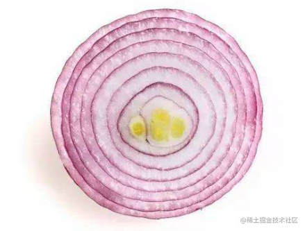
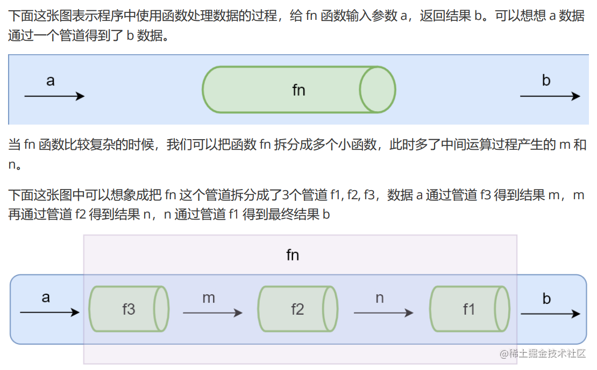

# 函数组合

## 背景问题

纯函数和柯里化很容易写出洋葱代码 h(g(f(x)))


## 举个例子

场景：获取数组的最后一个元素再转换成大写字母

```js
_.toUpper(_.first(_.reverse(array)));
```

是否有一种方案可以解决这种嵌套代码？？
函数组合可以让我们把细粒度的函数重新组合生成一个新的函数

## 管道

首先了解一下概念

那依据管道的思想是否可以将上面的嵌套代码改造为：

```js
// 伪代码
const fn = compose(reverse, first, toUpper);
const b = fn("abc");
```

## 函数组合

如果一个函数要经过多个函数处理才能得到最终值，这个时候可以把中间过程的函数合并成一个函数,这就是函数的组合。  
函数组合默认是从右到左执行。如下：

```js
function compose(f, g) {
    return function (value) {
        return f(g(value));
    };
}

const reverse = (arr) => arr.reverse();
const first = (arr) => arr[0];

const last = compose(first, reverse);
console.log(f(["one", "two", "three"])); // three
```

现在的 compose 函数有什么问题？如果我们传入的参数无限增加怎么办？  
因此我们需要对 compose 函数改造，让它支持不定量的函数参数。

```js
const compose =
    (...args) =>
    (value) =>
        // args 是传入的函数集合
        args.reduce((acc, fn) => {
            // acc 为传入每个函数的参数
            return fn(acc);
        }, value);

const reverse = (arr) => arr.reverse();
const first = (arr) => arr[0];
const toUpper = (s) => s.toUpperCase();

const f = compose(reverse, first, toUpper); // 从左到右运行
console.log(f(["one", "two", "three"])); // THREE
```

如果我们需要改变函数组合的顺序，可以使用结合律。

```js
const f = compose(reverse, compose(first, toUpper)); // 从左到右运行
console.log(f(["one", "two", "three"])); // THREE
```

## flow() 与 flowRight()

-   lodash 中组合函数 flow() 或者 flowRight()，他们都可以组合多个函数
-   flow() 是从左到右运行
-   flowRight() 是从右到左运行（更常使用）

## 函数组合-调试

我们可以使用函数组合了，但是如果其中某个函数报错了，该如何调试呢？  
思路：我们可以在函数组合中，添加调试函数，打印日志信息。  
贴代码：

```js
const _ = require("lodash");
const trace = _.curry((tag, v) => {
    console.log(tag, v);
    return v;
});
const split = _.curry((sep, str) => _.split(str, sep));
const join = _.curry((sep, array) => _.join(array, sep));
const map = _.curry((fn, array) => _.map(array, fn));
const f = _.flowRight(
    join("-"),
    trace("map 之后"),
    map(_.toLower),
    trace("split 之后"),
    split(" ")
);
console.log(f("NEVER SAY DIE"));
```

上面的使用和我们常规的组合函数定义有什么区别呢？  
lodash 中定义的*.split、*.join、 \_.map 虽然是平常经常使用的方法，但并不适合在函数组合中使用,如果非要使用需要进行**柯里化处理**。因为函数组合中需要的是一元函数
