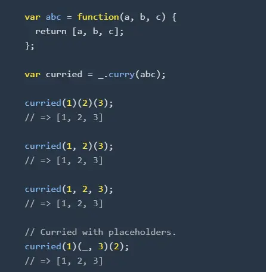

# 柯里化

## 概念

-   柯里化（Currying）是一种关于函数的高阶技术
-   柯里化是一种函数的转换,将函数从 f(a, b, c) 转换为 f(a)(b)(c)
-   柯里化不会调用函数

举个例子: 我们将创建一个辅助函数 curry(f)，该函数将对两个参数的函数 f 执行柯里化

```js
function curry(f) {
    // curry(f) 执行柯里化转换
    return function (a) {
        return function (b) {
            return f(a, b);
        };
    };
}

// 用法
function sum(a, b) {
    return a + b;
}

let curriedSum = curry(sum);
alert(curriedSum(1)(2)); // 3
```

## 柯里化优势

举个例子: 工作中我们需要正则校验电话号码、校验邮箱，于是我们封装一个通用函数 checkByRegExp 如下

```js
function checkByRegExp(regExp, string) {
    return regExp.test(string);
}

checkByRegExp(/^1\d{10}$/, "18642838455"); // 校验电话号码
checkByRegExp(/^(\w)+(\.\w+)*@(\w)+((\.\w+)+)$/, "test@163.com"); // 校验邮箱
```

这样看貌似没问题，但如果需要校验多个电话号码或者个邮箱呢？于是可能会这样做

```js
checkByRegExp(/^1\d{10}$/, "18642838455"); // 校验电话号码
checkByRegExp(/^1\d{10}$/, "13109840560"); // 校验电话号码
checkByRegExp(/^1\d{10}$/, "13204061212"); // 校验电话号码

checkByRegExp(/^(\w)+(\.\w+)*@(\w)+((\.\w+)+)$/, "test@163.com"); // 校验邮箱
checkByRegExp(/^(\w)+(\.\w+)*@(\w)+((\.\w+)+)$/, "test@qq.com"); // 校验邮箱
checkByRegExp(/^(\w)+(\.\w+)*@(\w)+((\.\w+)+)$/, "test@gmail.com"); // 校验邮箱
```

那这会导致什么问题？工作效率低下...反思 checkByRegExp 函数本身是一个工具函数并没有任何意义。
过段时间回头看这个函数，并不知道他具体在干嘛（校验的是电话号码还是邮箱？）。  
此时，柯里化登场对 checkByRegExp 函数进行封装，以简化代码书写，提高代码可读性。

```js
//进行柯里化
let _check = curry(checkByRegExp);
//生成工具函数，验证电话号码
let checkCellPhone = _check(/^1\d{10}$/);
//生成工具函数，验证邮箱
let checkEmail = _check(/^(\w)+(\.\w+)*@(\w)+((\.\w+)+)$/);

checkCellPhone("18642838455"); // 校验电话号码
checkCellPhone("13109840560"); // 校验电话号码
checkCellPhone("13204061212"); // 校验电话号码

checkEmail("test@163.com"); // 校验邮箱
checkEmail("test@qq.com"); // 校验邮箱
checkEmail("test@gmail.com"); // 校验邮箱
```

那么这时在使用感觉怎样？简洁又直观

> 总结：经过柯里化的工具函数比原函数 checkByRegExp，通用性降低了，但适用性提升了。因此柯里化的优势是参数复用。

## 实践一下

需求：获取以下数据中所有的 name 属性。

```js
let list = [
    {
        name: "lucy",
        age: 10,
    },
    {
        name: "jack",
        age: 21,
    },
];
```

常规思路，我们可能会这样实现：

```js
let names = list.map(function (item) {
    return item.name;
});
```

但如果又要获取所有 age、gender 属性呢？反思能否实现一个 prop()函数获取属性值。  
那么我们如何用柯里化的思维来实现呢？

```js
let prop = curry(function (key, obj) {
    return obj[key];
});
let names = list.map(prop("name"));
let ages = list.map(prop("age"));
```

实际工作中 prop 实现一次就可以多次使用的，我们可以将它封装到底层，降低业务代码的复杂度。  
因此我们实际的代码可以理解为只有一行 let names = list.map(prop('name'))。  
是不是变得更精简了，可读性更高了呢。

## 封装柯里化工具函数

接下开思考怎么实现一个 curry 函数呢？  
先回想使用，在函数柯里化中，先接收一部分参数，返回一个函数接收剩余的参数，依次重复，直到接收到足够的参数，执行原函数。
那么我们如何确定何时达到足够的参数呢？

-   通过函数的 length 属性，获取函数形参的个数，形参的个数等于所需的参数个数
-   在调用柯里化工具函数时，手动指定所需的参数个数

```js
/**
 * 将函数柯里化
 * @param fn    待柯里化的原函数
 * @param len   所需的参数个数，默认为原函数的形参个数
 */
function curry(fn, len = fn.length) {
    return _curry.call(this, fn, len);
}

/**
 * 中转函数
 * @param fn    待柯里化的原函数
 * @param len   所需的参数个数
 * @param args  已接收的参数列表
 */
function _curry(fn, len, ...args) {
    return function (...params) {
        let _args = [...args, ...params];
        if (_args.length >= len) {
            return fn.apply(this, _args);
        } else {
            return _curry.call(this, fn, len, ..._args);
        }
    };
}
```

那先验证下功能

```js
let _fn = curry(function (a, b, c, d, e) {
    console.log(a, b, c, d, e);
});

_fn(1, 2, 3, 4, 5); // print: 1,2,3,4,5
_fn(1)(2)(3, 4, 5); // print: 1,2,3,4,5
_fn(1, 2)(3, 4)(5); // print: 1,2,3,4,5
_fn(1)(2)(3)(4)(5); // print: 1,2,3,4,5
```

## lodash 的 curry 方法

loadsh 增加了 placeholder 功能，通过占位符的方式来改变传入参数的顺序。  
我们传入一个占位符，本次调用传递的参数略过占位符， 占位符所在的位置由下次调用的参数来填充。  
如图：


接下来思考如何实现占位符功能？  
思路：使用占位符，目的是改变参数传递的顺序，所以在 curry 函数实现中，每次需要记录是否使用了占位符，并且记录占位符所代表的参数位置。  
贴代码：

```js
/**
 * @param  fn           待柯里化的函数
 * @param  length       需要的参数个数，默认为函数的形参个数
 * @param  holder       占位符，默认当前柯里化函数
 * @return {Function}   柯里化后的函数
 */
function curry(fn, length = fn.length, holder = curry) {
    return _curry.call(this, fn, length, holder, [], []);
}
/**
 * 中转函数
 * @param fn            柯里化的原函数
 * @param length        原函数需要的参数个数
 * @param holder        接收的占位符
 * @param args          已接收的参数列表
 * @param holders       已接收的占位符位置列表
 * @return {Function}   继续柯里化的函数 或 最终结果
 */
function _curry(fn, length, holder, args, holders) {
    return function (..._args) {
        //将参数复制一份，避免多次操作同一函数导致参数混乱
        let params = args.slice();
        //将占位符位置列表复制一份，新增加的占位符增加至此
        let _holders = holders.slice();
        //循环入参，追加参数 或 替换占位符
        _args.forEach((arg, i) => {
            //真实参数 之前存在占位符 将占位符替换为真实参数
            if (arg !== holder && holders.length) {
                let index = holders.shift();
                _holders.splice(_holders.indexOf(index), 1);
                params[index] = arg;
            }
            //真实参数 之前不存在占位符 将参数追加到参数列表中
            else if (arg !== holder && !holders.length) {
                params.push(arg);
            }
            //传入的是占位符,之前不存在占位符 记录占位符的位置
            else if (arg === holder && !holders.length) {
                params.push(arg);
                _holders.push(params.length - 1);
            }
            //传入的是占位符,之前存在占位符 删除原占位符位置
            else if (arg === holder && holders.length) {
                holders.shift();
            }
        });
        // params 中前 length 条记录中不包含占位符，执行函数
        if (
            params.length >= length &&
            params.slice(0, length).every((i) => i !== holder)
        ) {
            return fn.apply(this, params);
        } else {
            return _curry.call(this, fn, length, holder, params, _holders);
        }
    };
}
```

验证功能

```js
let fn = function (a, b, c, d, e) {
    console.log([a, b, c, d, e]);
};

let _ = {}; // 定义占位符
let _fn = curry(fn, 5, _); // 将函数柯里化，指定所需的参数个数，指定所需的占位符

_fn(1, 2, 3, 4, 5); // print: 1,2,3,4,5
_fn(_, 2, 3, 4, 5)(1); // print: 1,2,3,4,5
_fn(1, _, 3, 4, 5)(2); // print: 1,2,3,4,5
_fn(1, _, 3)(_, 4, _)(2)(5); // print: 1,2,3,4,5
_fn(1, _, _, 4)(_, 3)(2)(5); // print: 1,2,3,4,5
_fn(_, 2)(_, _, 4)(1)(3)(5); // print: 1,2,3,4,5
```
