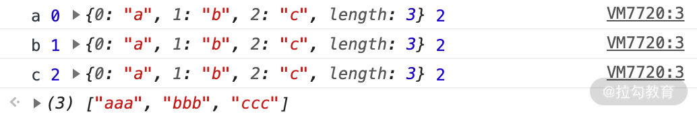
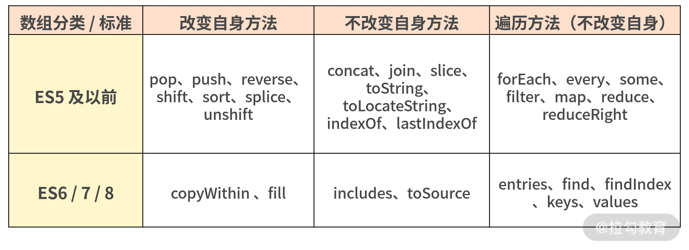

# 梳理数组 API

## 数组概念的探究

截至 ES7 规范，数组共包含 33 个标准的 API 方法和一个非标准的 API 方法，使用场景和使用方案纷繁复杂，其中还有不少坑。为了方便你可以循序渐进地学习这部分的内容，下面我将从数组的概念开始讲起。

由于数组的 API 较多，很多相近的名字也容易导致混淆，所以在这里我按照“会改变自身值的”“不会改变自身值的”“遍历方法”这三种类型分开讲解，让你对这些 API 形成更结构化的认识。

## Array 的构造器

Array 构造器用于创建一个新的数组。通常，我们推荐使用对象字面量的方式创建一个数组，例如 var a = [] 就是一个比较好的写法。但是，总有对象字面量表述乏力的时候，比如，我想创建一个长度为 6 的空数组，用对象字面量的方式是无法创建的，因此只能写成下述代码这样。

```js
// 使用 Array 构造器，可以自定义长度
var a = Array(6); // [empty × 6]

// 使用对象字面量
var b = [];
b.length = 6; // [undefined × 6]
```

## ES6 新增的构造方法

鉴于数组的常用性，ES6 专门扩展了数组构造器 Array ，新增了 2 个方法：Array.of、Array.from。其中，Array.of 整体用得比较少；而 Array.from 具有灵活性，你在平常开发中应该会经常使用。那么关于两者的使用细节你真的了解吗？下面展开来聊下这两个方法。

1. Array.of

Array.of 用于**将参数依次转化为数组中的一项，然后返回这个新数组**，而不管这个参数是数字还是其他。它基本上与 Array 构造器功能一致，**唯一的区别就在单个数字参数的处理上**。

比如，在下面的这几行代码中，你可以看到区别：当参数为两个时，返回的结果是一致的；当参数是一个时，Array.of 会把参数变成数组里的一项，而构造器则会生成长度和第一个参数相同的空数组。

```js
Array.of(8.0); // [8]
Array(8.0); // [empty × 8]
Array.of(8.0, 5); // [8, 5]
Array(8.0, 5); // [8, 5]
Array.of('8'); // ["8"]
Array('8'); // ["8"]
```

2. Array.from

Array.from 的设计初衷是**快速便捷地基于其他对象创建新数组**，准确来说就是从一个类似数组的可迭代对象中创建一个新的数组实例。其实就是，只要一个对象有迭代器，Array.from 就能把它变成一个数组（注意：**是返回新的数组，不改变原对象**）。

从语法上看，Array.from 拥有 3 个参数：

-   类似数组的对象，必选；
-   加工函数，新生成的数组会经过该函数的加工再返回；
-   this 作用域，表示加工函数执行时 this 的值。

这三个参数里面第一个参数是必选的，后两个参数都是可选的。我们通过一段代码来看看它的用法

```js
var obj = { 0: 'a', 1: 'b', 2: 'c', length: 3 };

Array.from(
    obj,
    function (value, index) {
        console.log(value, index, this, arguments.length);
        return value.repeat(3); //必须指定返回值，否则返回 undefined
    },
    obj
);
```

结果如下图所示。


结果中可以看出 console.log(value, index, this, arguments.length) 对应的四个值，并且看到 return 的 value 重复了三遍，最后返回的数组为 ["aaa","bbb","ccc"]。

这表明了通过 Array.from 这个方法可以自己定义加工函数的处理方式，从而返回想要得到的值；如果不确定返回值，则会返回 undefined，最终生成的也是一个包含若干个 undefined 元素的空数组。

实际上，如果这里不指定 this 的话，加工函数完全可以是一个箭头函数。上述代码可以简写为如下形式。

```js
Array.from(obj, (value) => value.repeat(3));
//  控制台返回 (3) ["aaa", "bbb", "ccc"]
```

除了上述 obj 对象以外，拥有迭代器的对象还包括 String、Set、Map 等，Array.from 统统可以处理，请看下面的代码。

```js
// String
Array.from('abc'); // ["a", "b", "c"]
// Set
Array.from(new Set(['abc', 'def'])); // ["abc", "def"]
// Map
Array.from(
    new Map([
        [1, 'ab'],
        [2, 'de'],
    ])
);
// [[1, 'ab'], [2, 'de']]
```

关于数组构造器 Array 新增的两个方法就讲解到这，下面接着介绍如何进行 Array 的判断。

## Array 的判断

Array.isArray 用来判断一个变量是否为数组类型。在 ES5 提供该方法之前，我们至少有如下 5 种方式去判断一个变量是否为数组。

```js
var a = [];

// 1.基于instanceof
a instanceof Array;

// 2.基于constructor
a.constructor === Array;

// 3.基于Object.prototype.isPrototypeOf
Array.prototype.isPrototypeOf(a);

// 4.基于getPrototypeOf
Object.getPrototypeOf(a) === Array.prototype;

// 5.基于Object.prototype.toString
Object.prototype.toString.apply(a) === '[object Array]';
```

ES6 之后新增了一个 Array.isArray 方法，能直接判断数据类型是否为数组，但是如果 isArray 不存在，那么 Array.isArray 的 polyfill 通常可以这样写：

```js
if (!Array.isArray) {
    Array.isArray = function (arg) {
        return Object.prototype.toString.call(arg) === '[object Array]';
    };
}
```

## 改变自身的方法

基于 ES6，会改变自身值的方法一共有 9 个，分别为 pop、push、reverse、shift、sort、splice、unshift，以及两个 ES6 新增的方法 copyWithin 和 fill。

接下来我们看一段代码，快速了解这些方法最基本的用法。

```js
// pop方法
var array = ['cat', 'dog', 'cow', 'chicken', 'mouse'];
var item = array.pop();
console.log(array); // ["cat", "dog", "cow", "chicken"]
console.log(item); // mouse

// push方法
var array = ['football', 'basketball', 'badminton'];
var i = array.push('golfball');
console.log(array);
// ["football", "basketball", "badminton", "golfball"]
console.log(i); // 4

// reverse方法
var array = [1, 2, 3, 4, 5];
var array2 = array.reverse();
console.log(array); // [5,4,3,2,1]
console.log(array2 === array); // true

// shift方法
var array = [1, 2, 3, 4, 5];
var item = array.shift();
console.log(array); // [2,3,4,5]
console.log(item); // 1

// unshift方法
var array = ['red', 'green', 'blue'];
var length = array.unshift('yellow');
console.log(array); // ["yellow", "red", "green", "blue"]
console.log(length); // 4

// sort方法
var array = ['apple', 'Boy', 'Cat', 'dog'];
var array2 = array.sort();
console.log(array); // ["Boy", "Cat", "apple", "dog"]
console.log(array2 == array); // true

// splice方法
var array = ['apple', 'boy'];
var splices = array.splice(1, 1);
console.log(array); // ["apple"]
console.log(splices); // ["boy"]

// copyWithin方法
var array = [1, 2, 3, 4, 5];
var array2 = array.copyWithin(0, 3);
console.log(array === array2, array2); // true [4, 5, 3, 4, 5]

// fill方法
var array = [1, 2, 3, 4, 5];
var array2 = array.fill(10, 0, 3);
console.log(array === array2, array2);
// true [10, 10, 10, 4, 5], 可见数组区间[0,3]的元素全部替换为10
```

下面为了让你对这些 API 方法有更深刻的印象，我结合 Leetcode 中的第 88 题 《合并两个有序数组》，带你看下如何利用数组的多个改变自身的方法来解决这道题，题目是这样的：

```
给你两个有序整数数组 nums1 和 nums2，请你将 nums2 合并到 nums1 中，使 nums1 成为一个有序数组。

输入:
nums1 = [1,2,3,0,0,0]； m = 3
nums2 = [2,5,6]；       n = 3
输出: [1,2,2,3,5,6]
```

可以思考下，既然要求不能新开数组，那么就需要利用数组改变自身的方法完成这个题目，应该怎么做呢？你可以试着先将想法写下来，之后再来看我提供的答案。

答案就是巧妙地利用数组的 API 中的 splice、push、sort 这三个方法，在原数组上进行操作，最终完成如下代码：

```js
var merge = function (nums1, m, nums2, n) {
    nums1.splice(m);
    nums2.splice(n);
    nums1.push(...nums2);
    nums1.sort((a, b) => a - b); // nums1从小到大排列，所以是a-b
};
```

## 不改变自身的方法

基于 ES7，不会改变自身的方法也有 9 个，分别为 concat、join、slice、toString、toLocaleString、indexOf、lastIndexOf、未形成标准的 toSource，以及 ES7 新增的方法 includes。

我们还是通过代码，快速了解这些方法的最基本用法。

```js
// concat方法
var array = [1, 2, 3];
var array2 = array.concat(4, [5, 6], [7, 8, 9]);
console.log(array2); // [1, 2, 3, 4, 5, 6, 7, 8, 9]
console.log(array); // [1, 2, 3], 可见原数组并未被修改

// join方法
var array = ['We', 'are', 'Chinese'];
console.log(array.join()); // "We,are,Chinese"
console.log(array.join('+')); // "We+are+Chinese"

// slice方法
var array = ['one', 'two', 'three', 'four', 'five'];
console.log(array.slice()); // ["one", "two", "three","four", "five"]
console.log(array.slice(2, 3)); // ["three"]

// toString方法
var array = ['Jan', 'Feb', 'Mar', 'Apr'];
var str = array.toString();
console.log(str); // Jan,Feb,Mar,Apr

// tolocalString方法
var array = [{ name: 'zz' }, 123, 'abc', new Date()];
var str = array.toLocaleString();
console.log(str); // [object Object],123,abc,2016/1/5 下午1:06:23

// indexOf方法
var array = ['abc', 'def', 'ghi', '123'];
console.log(array.indexOf('def')); // 1

// includes方法
var array = [-0, 1, 2];
console.log(array.includes(+0)); // true
console.log(array.includes(1)); // true

var array = [NaN];
console.log(array.includes(NaN)); // true
```

上面我把不会改变数组的几个方法大致做了一个回顾，其中 includes 方法需要注意的是，如果元素中有 0，那么在判断过程中不论是 +0 还是 -0 都会判断为 True，这里的 includes 忽略了 +0 和 -0。

另外还有一个值得强调的是**slice 不改变自身，而 splice 会改变自身**，你还是需要注意不要记错了。

slice 的语法是：arr.slice([start[, end]])，
splice 的语法是：arr.splice(start,deleteCount[, item1[, item2[, …]]])。
我们可以看到从第二个参数开始，二者就已经有区别了:

-   splice 第二个参数是删除的个数，而 slice 的第二个参数是 end 的坐标（可选）

lastIndexOf 和 indexOf 基本功能差不多，不过 lastIndexOf 是从后面寻找元素的下标。

## 数组遍历的方法

基于 ES6，不会改变自身的遍历方法一共有 12 个，分别为 forEach、every、some、filter、map、reduce、reduceRight，以及 ES6 新增的方法 entries、find、findIndex、keys、values。

我们还是先看一段代码，快速了解它们的基本用法。

```js
// forEach方法
var array = [1, 3, 5];
var obj = { name: 'cc' };
var sReturn = array.forEach(function (value, index, array) {
    array[index] = value;
    console.log(this.name); // cc被打印了三次, this指向obj
}, obj);

console.log(array); // [1, 3, 5]
console.log(sReturn); // undefined, 可见返回值为undefined

// every方法
var o = { 0: 10, 1: 8, 2: 25, length: 3 };
var bool = Array.prototype.every.call(
    o,
    function (value, index, obj) {
        return value >= 8;
    },
    o
);

console.log(bool); // true

// some方法
var array = [18, 9, 10, 35, 80];
var isExist = array.some(function (value, index, array) {
    return value > 20;
});

console.log(isExist); // true

// map 方法
var array = [18, 9, 10, 35, 80];
array.map((item) => item + 1);
console.log(array); // [19, 10, 11, 36, 81]

// filter 方法
var array = [18, 9, 10, 35, 80];
var array2 = array.filter(function (value, index, array) {
    return value > 20;
});

console.log(array2); // [35, 80]

// reduce方法
var array = [1, 2, 3, 4];
var s = array.reduce(function (previousValue, value, index, array) {
    return previousValue * value;
}, 1);

console.log(s); // 24

// ES6写法更加简洁
array.reduce((p, v) => p * v); // 24

// reduceRight方法 (和reduce的区别就是从后往前累计)
var array = [1, 2, 3, 4];
array.reduceRight((p, v) => p * v); // 24

// entries方法
var array = ['a', 'b', 'c'];
var iterator = array.entries();
console.log(iterator.next().value); // [0, "a"]
console.log(iterator.next().value); // [1, "b"]
console.log(iterator.next().value); // [2, "c"]
console.log(iterator.next().value); // undefined, 迭代器处于数组末尾时, 再迭代就会返回undefined

// find & findIndex方法
var array = [1, 3, 5, 7, 8, 9, 10];
function f(value, index, array) {
    return value % 2 == 0; // 返回偶数
}

function f2(value, index, array) {
    return value > 20; // 返回大于20的数
}

console.log(array.find(f)); // 8
console.log(array.find(f2)); // undefined
console.log(array.findIndex(f)); // 4
console.log(array.findIndex(f2)); // -1

// keys方法
[...Array(10).keys()]; // [0, 1, 2, 3, 4, 5, 6, 7, 8, 9]
[...new Array(10).keys()]; // [0, 1, 2, 3, 4, 5, 6, 7, 8, 9]

// values方法
var array = ['abc', 'xyz'];
var iterator = array.values();
console.log(iterator.next().value); //abc
console.log(iterator.next().value); //xyz
```
其中，要注意有些遍历方法不会返回处理之后的数组，比如 forEach；有些方法会返回处理之后的数组，比如 filter。这个细节你需要牢记，这样才会在面试过程中正确作答。

reduce 方法也需要重点关注，其参数复杂且多，通常一些复杂的逻辑处理，其实使用 reduce 很容易就可以解决。我们重点看一下，reduce 到底能解决什么问题呢？先看下 reduce 的两个参数。

首先是 callback（一个在数组的每一项中调用的函数，接受四个参数）：
- previousValue（上一次调用回调函数时的返回值，或者初始值）
- currentValue（当前正在处理的数组元素）
- currentIndex（当前正在处理的数组元素下标）
- array（调用 reduce() 方法的数组）

然后是 initialValue（可选的初始值，作为第一次调用回调函数时传给 previousValue 的值）。

光靠文字描述其实看着会比较懵，我们还是通过一个例子来说明 reduce 的功能到底有多么强大。
```js
/* 题目：数组 arr = [1,2,3,4] 求数组的和：*/

// 第一种方法：
var arr = [1,2,3,4];
var sum = 0;
arr.forEach(function(e){sum += e;}); // sum = 10

// 第二种方法
var arr = [1,2,3,4];
var sum = 0;
arr.map(function(obj){sum += obj});

// 第三种方法
var arr = [1,2,3,4];
arr.reduce(function(pre,cur){return pre + cur});
```
从上面代码可以看出，我们分别用了 forEach 和 map 都能实现数组的求和，其中需要另外新定义一个变量 sum，再进行累加求和，最后再来看 sum 的值，而 reduce 不仅可以少定义一个变量，而且也会直接返回最后累加的结果

那么我们结合一道题目来看看 reduce 怎么用。

题目： var arr = [ {name: 'brick1'}, {name: 'brick2'}, {name: 'brick3'} ]

希望最后返回到 arr 里面每个对象的 name 拼接数据为 'brick1, brick2 & brick3' ，如果用 reduce 如何实现呢？
```js
var arr =  [ {name: 'one'}, {name: 'two'}, {name: 'three'} ];

arr.reduce(function(prev, current, index, array){
  if (index === 0){
    return current.name;
  } else if (index === array.length - 1){
    return prev + ' & ' + current.name;
  } else {
    return prev + ', ' + current.name;
  }
}, '');
// 返回结果 "one, two & three"
```
从上面的答案也可以看出来，用 reduce 就能很轻松地对数组进行遍历，然后进行一些复杂的累加处理操作即可。

## 总结：
下面我将令人“眼花缭乱”的数组的基础 API 简单做了个总结表格：


以上，数组的各方法基本讲解完毕，这些方法之间存在很多共性，如下：
- 所有插入元素的方法，比如 push、unshift 一律返回数组新的长度；
- 所有删除元素的方法，比如 pop、shift、splice 一律返回删除的元素，或者返回删除的多个元素组成的数组；
- 部分遍历方法，比如 forEach、every、some、filter、map、find、findIndex，它们都包含 function(value,index,array){} 和 thisArg 这样两个形参。