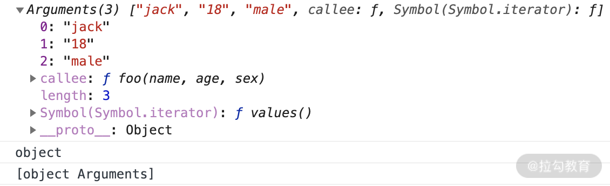
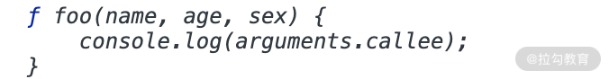
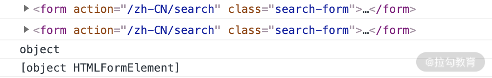
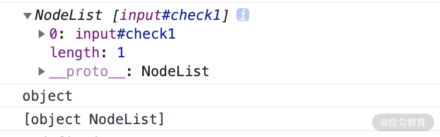

# JS 中的类数组
我们先来看看在 JavaScript 中有哪些情况下的对象是类数组呢？主要有以下几种：
- 函数里面的参数对象 arguments；
- 用 getElementsByTagName/ClassName/Name 获得的 HTMLCollection；
- 用 querySelector 获得的 NodeList。

在课程开始前请你先思考几个问题：
- 类数组是否能使用数组的方法呢？
- 类数组有哪些方式可以转换成数组？

如果你不能准确地回答出这两个问题，那么就要认真学习了，下面开始进入我们的课程。

## 类数组基本介绍
#### 1. arguments

先来重点讲讲 arguments 对象，我们在日常开发中经常会遇到各种类数组对象，最常见的便是在函数中使用的 arguments，它的对象只定义在函数体中，包括了函数的参数和其他属性。我们通过一段代码来看下 arguments 的使用方法，如下所示。
```js
function foo(name, age, sex) {
    console.log(arguments);
    console.log(typeof arguments);
    console.log(Object.prototype.toString.call(arguments));
}

foo('jack', '18', 'male');
```
这段代码比较容易，就是直接将这个函数的 arguments 在函数内部打印出来，那么我们看下这个 arguments 打印出来的结果，请看控制台的这张截图。


从结果中可以看到，typeof 这个 arguments 返回的是 object，通过 Object.prototype.toString.call 返回的结果是 '[object arguments]'，可以看出来返回的不是 '[object array]'，说明 arguments 和数组还是有区别的。

length 属性很好理解，它就是函数参数的长度，我们从打印出的代码也可以看得出来。另外可以看到 arguments 不仅仅有一个 length 属性，还有一个 callee 属性，我们接下来看看这个 callee 是干什么的，代码如下所示。
```js
function foo(name, age, sex) {
    console.log(arguments.callee);
}

foo('jack', '18', 'male');
```
请看这段代码的执行结果。

从控制台可以看到，输出的就是函数自身，如果在函数内部直接执行调用 callee 的话，那它就会不停地执行当前函数，直到执行到内存溢出，有兴趣的话你可以自己试一下。

接下来我们再看看下面这种类数组。

#### 2. HTMLCollection

HTMLCollection 简单来说是 HTML DOM 对象的一个接口，这个接口包含了获取到的 DOM 元素集合，返回的类型是类数组对象，如果用 typeof 来判断的话，它返回的是 'object'。它是及时更新的，当文档中的 DOM 变化时，它也会随之变化。

描述起来比较抽象，还是通过一段代码来看下 HTMLCollection 最后返回的是什么，我们先随便找一个页面中有 form 表单的页面，在控制台中执行下述代码。
```js
var elem1, elem2;

// document.forms 是一个 HTMLCollection
elem1 = document.forms[0];
elem2 = document.forms.item(0);

console.log(elem1);
console.log(elem2);
console.log(typeof elem1);
console.log(Object.prototype.toString.call(elem1));
```
在这个有 form 表单的页面执行上面的代码，得到的结果如下。


可以看到，这里打印出来了页面第一个 form 表单元素，同时也打印出来了判断类型的结果，说明打印的判断的类型和 arguments 返回的也比较类似，typeof 返回的都是 'object'，和上面的类似。

另外需要注意的一点就是 **HTML DOM 中的 HTMLCollection 是即时更新的，当其所包含的文档结构发生改变时，它会自动更新**。下面我们再看最后一个 NodeList 类数组。

#### 3. NodeList

NodeList 对象是节点的集合，通常是由 querySlector 返回的。NodeList 不是一个数组，也是一种类数组。虽然 NodeList 不是一个数组，但是可以使用 for...of 来迭代。在一些情况下，NodeList 是一个实时集合，也就是说，如果文档中的节点树发生变化，NodeList 也会随之变化。我们还是利用代码来理解一下 Nodelist 这种类数组。
```js
var list = document.querySelectorAll('input[type=checkbox]');

for (var checkbox of list) {
  checkbox.checked = true;
}

console.log(list);
console.log(typeof list);
console.log(Object.prototype.toString.call(list));
```
从上面的代码执行的结果中可以发现，我们是通过有 CheckBox 的页面执行的代码，在结果可中输出了一个 NodeList 类数组，里面有一个 CheckBox 元素，并且我们判断了它的类型，和上面的 arguments 与 HTMLCollection 其实是类似的，执行结果如下图所示。


## 类数组应用场景
我在这里为你介绍三种场景，这些也是最常见的。

#### 1. 遍历参数操作

我们在函数内部可以直接获取 arguments 这个类数组的值，那么也可以对于参数进行一些操作，比如下面这段代码，我们可以将函数的参数默认进行求和操作。
```js
function add() {
    var sum =0,
        len = arguments.length;
    for(var i = 0; i < len; i++){
        sum += arguments[i];
    }
    return sum;
}

add()                           // 0
add(1)                          // 1
add(1，2)                       // 3
add(1,2,3,4);                   // 10
```
#### 2. 传递参数使用

我在第 4 讲中已经介绍过了 apply 和 call 的使用访问，结合这一讲的内容，我们来研究一下，如果再结合 arguments，还能实现什么？可以借助 arguments 将参数从一个函数传递到另一个函数，请看下面这个例子
```js
// 使用 apply 将 foo 的参数传递给 bar
function foo() {
    bar.apply(this, arguments);
}

function bar(a, b, c) {
   console.log(a, b, c);
}

foo(1, 2, 3)   //1 2 3
```
上述代码中，通过在 foo 函数内部调用 apply 方法，用 foo 函数的参数传递给 bar 函数，这样就实现了借用参数的妙用。

## 如何将类数组转换成数组
在互联网大厂的面试中，类数组转换成数组这样的题目经常会问，也会问你 arguments 的相关问题，那么结合本讲的内容，下面我带你思考一下如何将类数组转换为数组。大致的实现方式有两种，我将依次讲解。

#### 1. 类数组借用数组方法转数组

apply 和 call 方法之前我们有详细讲过，类数组因为不是真正的数组，所以没有数组类型上自带的那些方法，我们就需要利用下面这几个方法去借用数组的方法。比如借用数组的 push 方法，请看下面的一段代码。
```js
var arrayLike = { 
  0: 'java',
  1: 'script',
  length: 2
} 

Array.prototype.push.call(arrayLike, 'jack', 'lily'); 
console.log(typeof arrayLike); // 'object'
console.log(arrayLike);
// {0: "java", 1: "script", 2: "jack", 3: "lily", length: 4}
```
从中可以看到，arrayLike 其实是一个对象，模拟数组的一个类数组，从数据类型上说它是一个对象，新增了一个 length 的属性。从代码中还可以看出，用 typeof 来判断输出的是 'object'，它自身是不会有数组的 push 方法的，这里我们就用 call 的方法来借用 Array 原型链上的 push 方法，可以实现一个类数组的 push 方法，给 arrayLike 添加新的元素。

从控制台的结果可以看出，数组的 push 方法满足了我们想要实现添加元素的诉求。我们再来看下 arguments 如何转换成数组，请看下面这段代码。
```js
function sum(a, b) {
  let args = Array.prototype.slice.call(arguments);
 // let args = [].slice.call(arguments); // 这样写也是一样效果
  console.log(args.reduce((sum, cur) => sum + cur));
}
sum(1, 2);  // 3

function sum(a, b) {
  let args = Array.prototype.concat.apply([], arguments);
  console.log(args.reduce((sum, cur) => sum + cur));
}

sum(1, 2);  // 3
```
这段代码中可以看到，还是借用 Array 原型链上的各种方法，来实现 sum 函数的参数相加的效果。一开始都是将 arguments 通过借用数组的方法转换为真正的数组，最后都又通过数组的 reduce 方法实现了参数转化的真数组 args 的相加，最后返回预期的结果。

#### 2. ES6 的方法转数组

对于类数组转换成数组的方式，我们还可以采用 ES6 新增的 Array.from 方法以及展开运算符的方法。那么还是围绕上面这个 sum 函数来进行改变，我们看下用 Array.from 和展开运算符是怎么实现转换数组的，请看下面一段代码的例子。
```js
function sum(a, b) {
  let args = Array.from(arguments);
  console.log(args.reduce((sum, cur) => sum + cur));
}
sum(1, 2);    // 3

function sum(a, b) {
  let args = [...arguments];
  console.log(args.reduce((sum, cur) => sum + cur));
}
sum(1, 2);    // 3

function sum(...args) {
  console.log(args.reduce((sum, cur) => sum + cur));
}
sum(1, 2);    // 3
```
从代码中可以看出，Array.from 和 ES6 的展开运算符，都可以把 arguments 这个类数组转换成数组 args，从而实现调用 reduce 方法对参数进行累加操作。其中第二种和第三种都是用 ES6 的展开运算符，虽然写法不一样，但是基本都可以满足多个参数实现累加的效果。

## 总结
综上你可以看到，类数组这节课的知识点与第 4 讲中 apply、call 还是有紧密联系的，你可以通过下面的表格再重新梳理一下类数组和数组的异同点。
 

在前端工作中，开发者往往会忽视对类数组的学习，其实在高级 JavaScript 编程中经常需要将类数组向数组转化，尤其是一些比较复杂的开源项目，经常会看到函数中处理参数的写法，例如：[].slice.call(arguments) 这行代码。