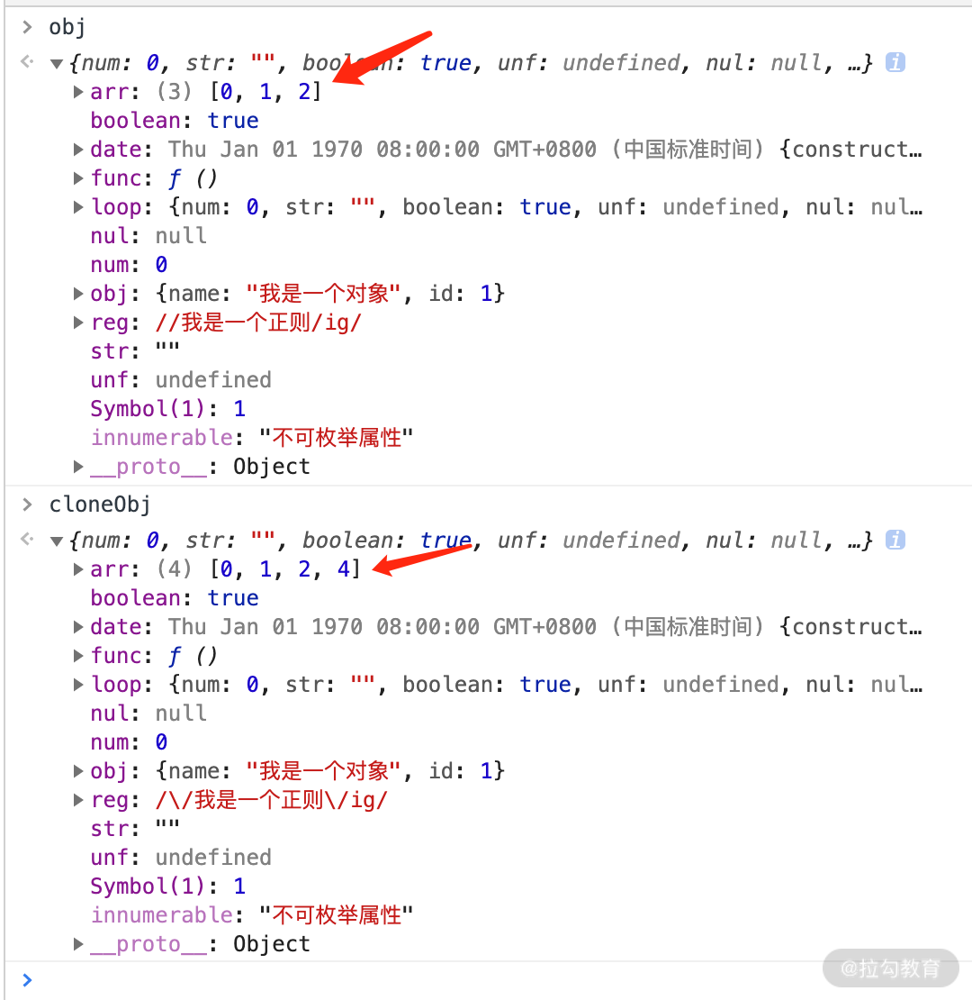
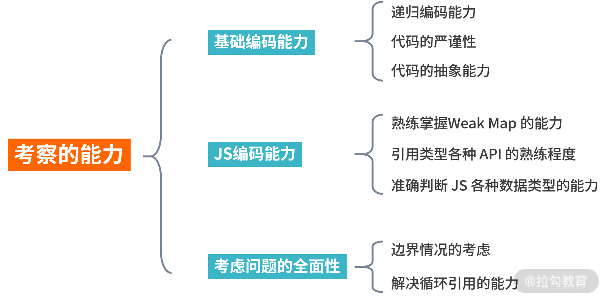

# 实现一个深浅拷贝

在开始之前，我先抛出来两个问题，你可以思考一下。

-   拷贝一个很多嵌套的对象怎么实现？
-   在面试官眼中，写成什么样的深拷贝代码才能算合格？

带着这两个问题，我们先来看下浅拷贝的相关内容。

## 浅拷贝的原理和实现

对于浅拷贝的定义我们可以初步理解为：

> 自己创建一个新的对象，来接受你要重新复制或引用的对象值。如果对象属性是基本的数据类型，复制的就是基本类型的值给新对象；但如果属性是引用数据类型，复制的就是内存中的地址，如果其中一个对象改变了这个内存中的地址，肯定会影响到另一个对象。

下面我总结了一些 JavaScript 提供的浅拷贝方法，一起来看看哪些方法能实现上述定义所描述的过程。

#### 方法一：object.assign

object.assign 是 ES6 中 object 的一个方法，该方法可以用于 JS 对象的合并等多个用途，其中一个用途就是可以进行浅拷贝。该方法的第一个参数是拷贝的目标对象，后面的参数是拷贝的来源对象（也可以是多个来源）。

> object.assign 的语法为：Object.assign(target, ...sources)

object.assign 的示例代码如下：

```js
let target = {};
let source = { a: { b: 1 } };
Object.assign(target, source);
console.log(target); // { a: { b: 1 } };
```

从上面的代码中可以看到，通过 object.assign 我们的确简单实现了一个浅拷贝，“target”就是我们新拷贝的对象，下面再看一个和上面不太一样的例子。

```js
let target = {};
let source = { a: { b: 2 } };
Object.assign(target, source);
console.log(target); // { a: { b: 10 } };
source.a.b = 10;
console.log(source); // { a: { b: 10 } };
console.log(target); // { a: { b: 10 } };
```

但是使用 object.assign 方法有几点需要注意：

-   它不会拷贝对象的继承属性；
-   它不会拷贝对象的不可枚举的属性；
-   可以拷贝 Symbol 类型的属性。

#### 方法二：扩展运算符方式

我们也可以利用 JS 的扩展运算符，在构造对象的同时完成浅拷贝的功能。

> 扩展运算符的语法为：let cloneObj = { ...obj };
> 代码如下所示

```js
/* 对象的拷贝 */
let obj = { a: 1, b: { c: 1 } };
let obj2 = { ...obj };
obj.a = 2;
console.log(obj); //{a:2,b:{c:1}} console.log(obj2); //{a:1,b:{c:1}}
obj.b.c = 2;
console.log(obj); //{a:2,b:{c:2}} console.log(obj2); //{a:1,b:{c:2}}
/* 数组的拷贝 */
let arr = [1, 2, 3];
let newArr = [...arr]; //跟arr.slice()是一样的效果
```

扩展运算符 和 object.assign 有同样的缺陷，也就是实现的浅拷贝的功能差不多，但是如果属性都是基本类型的值，使用扩展运算符进行浅拷贝会更加方便。

#### 方法三：concat 拷贝数组

数组的 concat 方法其实也是浅拷贝，所以连接一个含有引用类型的数组时，需要注意修改原数组中的元素的属性，因为它会影响拷贝之后连接的数组。不过 concat 只能用于数组的浅拷贝，使用场景比较局限。代码如下所示。

```js
let arr = [1, 2, 3];
let newArr = arr.concat();
newArr[1] = 100;
console.log(arr); // [ 1, 2, 3 ]
console.log(newArr); // [ 1, 100, 3 ]
```

#### 方法四：slice 拷贝数组

slice 方法也比较有局限性，因为它仅仅针对数组类型。slice 方法会返回一个新的数组对象，这一对象由该方法的前两个参数来决定原数组截取的开始和结束时间，是**不会影响和改变原始数组的**。

> slice 的语法为：arr.slice(begin, end);
> 代码如下所示：

```js
let arr = [1, 2, { val: 4 }];
let newArr = arr.slice();
newArr[2].val = 1000;
console.log(arr); //[ 1, 2, { val: 1000 } ]
```

#### 手工实现一个浅拷贝

根据以上对浅拷贝的理解，如果让你自己实现一个浅拷贝，大致的思路分为两点：

-   对基础类型做一个最基本的一个拷贝；
-   对引用类型开辟一个新的存储，并且拷贝一层对象属性。

自己来实现一个浅拷贝吧，代码如下所示:

```js
const shallowClone = (target) => {
    if (typeof target === 'object' && target !== null) {
        const cloneTarget = Array.isArray(target) ? [] : {};
        for (let prop in target) {
            if (target.hasOwnProperty(prop)) {
                cloneTarget[prop] = target[prop];
            }
        }
        return cloneTarget;
    } else {
        return target;
    }
};
```

## 深拷贝的原理和实现

浅拷贝只是创建了一个新的对象，复制了原有对象的基本类型的值，而引用数据类型只拷贝了一层属性，再深层的还是无法进行拷贝。深拷贝则不同，对于复杂引用数据类型，其在堆内存中完全开辟了一块内存地址，并将原有的对象完全复制过来存放。

这两个对象是相互独立、不受影响的，彻底实现了内存上的分离。总的来说，深拷贝的原理可以总结如下：

> 将一个对象从内存中完整地拷贝出来一份给目标对象，并从堆内存中开辟一个全新的空间存放新对象，且新对象的修改并不会改变原对象，二者实现真正的分离。

现在原理你知道了，那么怎么去实现深拷贝呢？我也总结了几种方法分享给你。

#### 方法一：乞丐版（JSON.stringify）

JSON.stringify() 是目前开发过程中最简单的深拷贝方法，其实就是把一个对象序列化成为 JSON 的字符串，并将对象里面的内容转换成字符串，最后再用 JSON.parse() 的方法将 JSON 字符串生成一个新的对象。示例代码如下所示。

```js
let obj1 = { a:1, b:[1,2,3] }
let str = JSON.stringify(obj1)；
let obj2 = JSON.parse(str)；
console.log(obj2);   //{a:1,b:[1,2,3]}
obj1.a = 2；
obj1.b.push(4);
console.log(obj1);   //{a:2,b:[1,2,3,4]}
console.log(obj2);   //{a:1,b:[1,2,3]}
```

但是使用 JSON.stringify 实现深拷贝还是有一些地方值得注意，我总结下来主要有这几点：

-   拷贝的对象的值中如果有函数、undefined、symbol 这几种类型，经过 JSON.stringify 序列化之后的字符串中这个键值对会消失；
-   拷贝 Date 引用类型会变成字符串；
-   无法拷贝不可枚举的属性；
-   无法拷贝对象的原型链；
-   拷贝 RegExp 引用类型会变成空对象；
-   对象中含有 NaN、Infinity 以及 -Infinity，JSON 序列化的结果会变成 null；
-   无法拷贝对象的循环应用，即对象成环 (obj[key] = obj)。

#### 方法：改进版（改进后递归实现）

针对上面几个待解决问题，我先通过四点相关的理论告诉你分别应该怎么做。

-   针对能够遍历对象的不可枚举属性以及 Symbol 类型，我们可以使用 Reflect.ownKeys 方法；
-   当参数为 Date、RegExp 类型，则直接生成一个新的实例返回；
-   利用 Object 的 getOwnPropertyDescriptors 方法可以获得对象的所有属性，以及对应的特性，顺便结合 Object 的 create 方法创建一个新对象，并继承传入原对象的原型链；
-   利用 WeakMap 类型作为 Hash 表，因为 WeakMap 是弱引用类型，可以有效防止内存泄漏（你可以关注一下 Map 和 weakMap 的关键区别，这里要用 weakMap），作为检测循环引用很有帮助，如果存在循环，则引用直接返回 WeakMap 存储的值。

代码如下：

```js
const isComplexDataType = (obj) =>
    (typeof obj === 'object' || typeof obj === 'function') && obj !== null;
const deepClone = function (obj, hash = new WeakMap()) {
    if (obj.constructor === Date) return new Date(obj); // 日期对象直接返回一个新的日期对象
    if (obj.constructor === RegExp) return new RegExp(obj); //正则对象直接返回一个新的正则对象
    //如果循环引用了就用 weakMap 来解决
    if (hash.has(obj)) return hash.get(obj);
    let allDesc = Object.getOwnPropertyDescriptors(obj);
    //遍历传入参数所有键的特性
    let cloneObj = Object.create(Object.getPrototypeOf(obj), allDesc);
    //继承原型链
    hash.set(obj, cloneObj);
    for (let key of Reflect.ownKeys(obj)) {
        cloneObj[key] =
            isComplexDataType(obj[key]) && typeof obj[key] !== 'function'
                ? deepClone(obj[key], hash)
                : obj[key];
    }
    return cloneObj;
};

// 下面是验证代码
let obj = {
    num: 0,
    str: '',
    boolean: true,
    unf: undefined,
    nul: null,
    obj: { name: '我是一个对象', id: 1 },
    arr: [0, 1, 2],
    func: function () {
        console.log('我是一个函数');
    },
    date: new Date(0),
    reg: new RegExp('/我是一个正则/ig'),
    [Symbol('1')]: 1,
};

Object.defineProperty(obj, 'innumerable', {
    enumerable: false,
    value: '不可枚举属性',
});

obj = Object.create(obj, Object.getOwnPropertyDescriptors(obj));
obj.loop = obj; // 设置loop成循环引用的属性
let cloneObj = deepClone(obj);
cloneObj.arr.push(4);
console.log('obj', obj);
console.log('cloneObj', cloneObj);
```
我们看一下结果，cloneObj 在 obj 的基础上进行了一次深拷贝，cloneObj 里的 arr 数组进行了修改，并未影响到 obj.arr 的变化，如下图所示。


自己完整实现一个深拷贝，还是考察了不少的知识点和编程能力，总结下来大致分为这几点，请看下图
