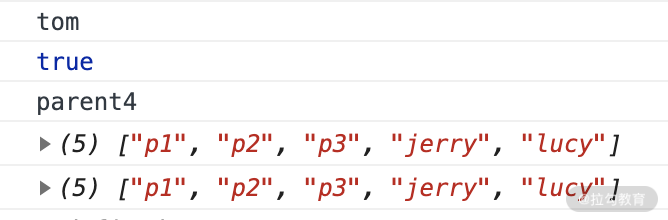
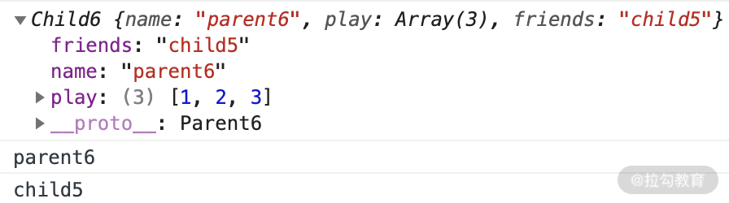
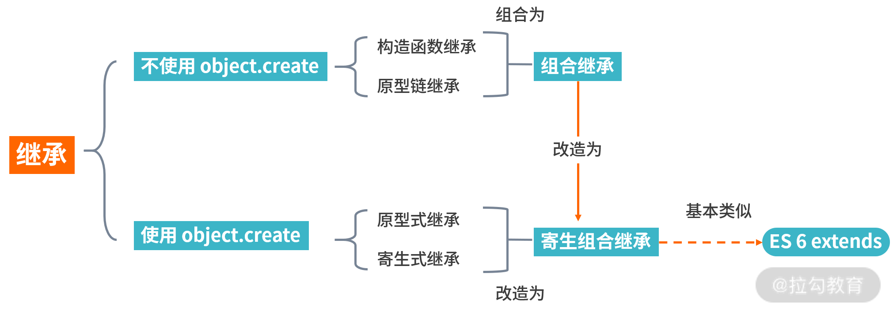

# JS 常见的 6 种继承方式

## 简述

继承是面向对象的，使用这种方式我们可以更好地复用以前的开发代码，缩短开发的周期、提升开发效率。

为了方便你更好地理解本讲的内容，在课程开始前请你先思考几个问题：

-   JS 的继承到底有多少种实现方式呢？
-   ES6 的 extends 关键字是用哪种继承方式实现的呢？

是不是这几个问题并不是那么容易地回答出来？那么我们带着思考，开始学习。

## JS 实现继承的几种方式

1. 原型链继承
   原型链继承是比较常见的继承方式之一，其中涉及的构造函数、原型和实例，三者之间存在着一定的关系，即每一个构造函数都有一个原型对象，原型对象又包含一个指向构造函数的指针，而实例则包含一个原型对象的指针。即是 实例 -->(指针) 原型对象 -->(指针) 构造函数  
   下面我们结合代码来了解一下。

```js
function Parent1() {
    this.name = 'parent1';
    this.play = [1, 2, 3];
}

function Child1() {
    this.type = 'child2';
}
Child1.prototype = new Parent1();

var s1 = new Child1();
var s2 = new Child2();

s1.play.push(4);
console.log(s1.play, s2.play); // 输出[1,2,3,4]  [1,2,3,4]
```

但其实有一个潜在的问题:

-   因为两个实例使用的是同一个原型对象。它们的内存空间是共享的，当一个发生变化的时候，另外一个也随之进行了变化，这就是使用原型链继承方式的一个缺点。

2. 组合继承（原型、构造函数）
   代码如下：

```js
function Parent3() {
    this.name = 'parent3';
    this.play = [1, 2, 3];
}

Parent3.prototype.getName = function () {
    return this.name;
};

function Child3() {
    // 第二次调用 Parent3()
    Parent3.call(this);
    this.type = 'child3';
}

// 第一次调用 Parent3()
Child3.prototype = new Parent3();

// 手动挂上构造器，指向自己的构造函数
Child3.prototype.constructor = Child3;

var s3 = new Child3();
var s4 = new Child3();
s3.play.push(4);
console.log(s3.play, s4.play); // 不互相影响 [1,2,3,4]  [1,2,3]
console.log(s3.getName()); // 正常输出'parent3'
console.log(s4.getName()); // 正常输出'parent3'
```

执行上面的代码，可以看到控制台的输出结果，之前两个实例使用的是同一个原型对象和父类原型对象中一旦存在父类之前自己定义的方法，那么子类将无法继承这些方法的问题都得以解决。

但是这里又增加了一个新问题：通过注释我们可以看到 Parent3 执行了两次，第一次是改变 Child3 的 prototype 的时候，第二次是通过 call 方法调用 Parent3 的时候，那么 Parent3 多构造一次就多进行了一次性能开销，

3. 原型式继承
   这里不得不提到的就是 ES5 里面的 Object.create 方法，这个方法接收两个参数：一是用作新对象原型的对象、二是为新对象定义额外属性的对象（可选参数）。

我们通过一段代码，看看普通对象是怎么实现的继承。

```js
let parent4 = {
    name: 'parent4',
    friends: ['p1', 'p2', 'p3'],
    getName: function () {
        return this.name;
    },
};

let person4 = Object.create(parent4);
person4.name = 'tom';
person4.friends.push('jerry');

let person5 = Object.create(parent4);
person5.friends.push('lucy');

console.log(person4.name);
console.log(person4.name === person4.getName());
console.log(person5.name);
console.log(person4.friends);
console.log(person5.friends);
```

从上面的代码中可以看到，通过 Object.create 这个方法可以实现普通对象的继承，不仅仅能继承属性，同样也可以继承 getName 的方法，请看这段代码的执行结果。


这种继承方式的缺点也很明显，多个实例的引用类型属性指向相同的内存，存在篡改的可能，接下来我们看一下在这个继承基础上进行优化之后的另一种继承方式——寄生式继承

4. 寄生组合式继承
   结合第四种中提及的继承方式，解决普通对象的继承问题的 Object.create 方法，我们在前面这几种继承方式的优缺点基础上进行改造，得出了寄生组合式的继承方式，这也是所有继承方式里面相对最优的继承方式，代码如下:

```js
function clone(parent, child) {
    // 这里改用 Object.create 就可以减少组合继承中多进行一次构造的过程
    child.prototype = Object.create(parent.prototype);
    child.prototype.constructor = child;
}

function Parent6() {
    this.name = 'parent6';
    this.play = [1, 2, 3];
}

Parent6.prototype.getName = function () {
    return this.name;
};

function Child6() {
    Parent6.call(this);
    this.friends = 'child5';
}

clone(Parent6, Child6);

Child6.prototype.getFriends = function () {
    return this.friends;
};

let person6 = new Child6();
console.log(person6);
console.log(person6.getName());
console.log(person6.getFriends());
```

通过这段代码可以看出来，这种寄生组合式继承方式，基本可以解决前几种继承方式的缺点，较好地实现了继承想要的结果，同时也减少了构造次数，减少了性能的开销，我们来看一下上面这一段代码的执行结果。

可以看到 person6 打印出来的结果，属性都得到了继承，方法也没问题，可以输出预期的结果。

整体看下来，这六种继承方式中，寄生组合式继承是这六种里面最优的继承方式。另外，ES6 还提供了继承的关键字 extends，我们再看下 extends 的底层实现继承的逻辑。

## ES6 的 extends 关键字实现逻辑

我们可以利用 ES6 里的 extends 的语法糖，使用关键词很容易直接实现 JavaScript 的继承，但是如果想深入了解 extends 语法糖是怎么实现的，就得深入研究 extends 的底层逻辑。

我们先看下用利用 extends 如何直接实现继承，代码如下。

```js
class Person {
    constructor(name) {
        this.name = name;
    }

    // 原型方法
    // 即 Person.prototype.getName = function() { }
    // 下面可以简写为 getName() {...}
    getName = function () {
        console.log('Person:', this.name);
    };
}

class Gamer extends Person {
    constructor(name, age) {
        // 子类中存在构造函数，则需要在使用“this”之前首先调用 super()。
        super(name);
        this.age = age;
    }
}

const asuna = new Gamer('Asuna', 20);
asuna.getName(); // 成功访问到父类的方法
```

因为浏览器的兼容性问题，如果遇到不支持 ES6 的浏览器，那么就得利用 babel 这个编译工具，将 ES6 的代码编译成 ES5，让一些不支持新语法的浏览器也能运行。

那么最后 extends 编译成了什么样子呢？我们看一下转译之后的代码片段。

```js
function _possibleConstructorReturn(self, call) {
    // ...
    return call && (typeof call === 'object' || typeof call === 'function')
        ? call
        : self;
}

function _inherits(subClass, superClass) {
    // 这里可以看到
    subClass.prototype = Object.create(superClass && superClass.prototype, {
        constructor: {
            value: subClass,
            enumerable: false,
            writable: true,
            configurable: true,
        },
    });
    if (superClass)
        Object.setPrototypeOf
            ? Object.setPrototypeOf(subClass, superClass)
            : (subClass.__proto__ = superClass);
}

var Parent = function Parent() {
    // 验证是否是 Parent 构造出来的 this
    _classCallCheck(this, Parent);
};

var Child = (function (_Parent) {
    _inherits(Child, _Parent);
    function Child() {
        _classCallCheck(this, Child);
        return _possibleConstructorReturn(
            this,
            (Child.__proto__ || Object.getPrototypeOf(Child)).apply(
                this,
                arguments
            )
        );
    }
    return Child;
})(Parent);
```
从上面编译完成的源码中可以看到，它采用的也是寄生组合继承方式，因此也证明了这种方式是较优的解决继承的方式。

## JavaScript 的继承方式总结的脑图

通过 Object.create 来划分不同的继承方式，最后的寄生式组合继承方式是通过组合继承改造之后的最优继承方式，而 extends 的语法糖和寄生组合继承的方式基本类似。