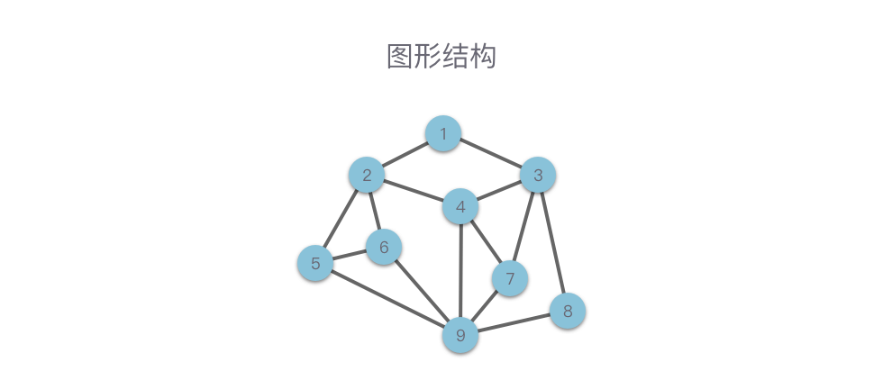

# 数据结构与算法

## 参考网址：

1. https://algo.itcharge.cn/00.Introduction/01.Data-Structures-Algorithms/
2. https://www.bilibili.com/video/BV1Kb41127fT/?vd_source=f4875da99acae7f42a1779b30f5a08bd
3. https://github.com/labuladong/fucking-algorithm
4. https://visualgo.net/zh
5. [堆的学习](https://leetcode.cn/leetbook/detail/heap/)

## 图解


> 数据结构是程序的骨架，而算法则是程序的灵魂。

在学习之前，首先我们要弄清楚什么是算法？什么是数据结构？为什么要学习算法和数据结构？

简单来说，算法（Algorithm） 就是解决问题的方法或者过程。如果我们把问题看成是函数，那么算法就是将输入转换为输出的过程。数据结构（Data Structure） 是数据的计算机表示和相应的一组操作。程序（Program） 则是算法和数据结构的具体实现。

如果我们把「程序设计」比作是做菜的话，那么「数据结构」就是食材和调料，「算法」则是不同的烹饪方式，或者可以看作是菜谱。不同的食材和调料，不同的烹饪方式，有着不同的排列组合。同样的东西，由不同的人做出来，味道自然也是千差万别。

至于为什么要学习算法和数据结构？

还是拿做菜举例子。我们做菜，讲究的是「色香味」俱全。程序设计也是如此，对于待解决的问题，我们追求的是：选择更加合适的「数据结构」，使用花费时间更少、占用空间更小的「算法」。

我们学习算法和数据结构，是为了学会在编程中从时间复杂度、空间复杂度方面考虑解决方案，训练自己的逻辑思维，从而写出高质量的代码，以此提升自己的编程技能，获取更高的工作回报。同样，掌握了算法和数据结构并不意味着你就会写程序。这需要不断的琢磨和思考，并持续学习，才能成为一名优秀的 厨师（程序员）。

## 数据结构

> 数据结构（Data Structure）：带有结构特性的数据元素的集合
> 简单而言：「数据结构」 指的是 数据的组织结构，用来组织、存储数据。

展开来讲：数据结构研究的是**数据的逻辑结构、物理结构以及它们之间的相互关系**，并对这种结构定义相应的运算，设计出相应的算法，并确保经过这些**运算以后所得到的新结构仍保持原来的结构类型**。

数据结构的作用，就是为了提高计算机硬件的利用率。比如说：操作系统想要查找应用程序 「Microsoft Word」 在硬盘中的哪一个位置存储。如果对硬盘全部扫描一遍的话肯定效率很低，但如果使用「B+ 树」作为索引，就能很容易的搜索到 Microsoft Word 这个单词，然后很快的定位到 「Microsoft Word」这个应用程序的文件信息，从而从文件信息中找到对应的磁盘位置。

而学习数据结构，就是为了帮助我们了解和掌握计算机中的数据是以何种方式进行组织、存储的。

对于数据结构，我们可以按照数据的 「逻辑结构」 和 「物理结构」 来进行分类。

#### 数据的逻辑结构

> 逻辑结构（Logical Structure）：数据元素之间的相互关系。

根据元素之间具有的不同关系，通常我们可以将数据的逻辑结构分为以下**4**种：

1. 集合结构

    > 数据元素同属于一个集合，除此之外无其他关系
    > 集合结构中的数据元素是无序的，并且每个数据元素都是唯一的，集合中没有相同的数据元素。集合结构很像数学意义上的「集合」


2. 线性结构

    > 数据元素之间是「1 对 1」关系
    > 线性结构中的数据元素（除了第一个和最后一个元素），左侧和右侧分别只有一个数据与其相邻。线性结构类型包括：数组、链表，以及由它们衍生出来的栈、队列、哈希表。


3. 树形结构

    > 数据元素之间是「一对多」的层次关系
    > 最简单的树形结构是二叉树。这种结构可以简单的表示为：根， 左子树， 右子树。 左子树和右子树又有自己的子树。当然除了二叉树，树形结构类型还包括：多叉树、字典树等。


4. 图形结构
    > 数据元素之间是「多对多」的关系
    > 图形结构是一种比树形结构更复杂的非线性结构，用于表示物件与物件之间的关系。一张图由一些小圆点（称为 顶点 或 结点）和连结这些圆点的直线或曲线（称为 边）组成。

在图形结构中，任意两个结点之间都可能相关，即结点之间的邻接关系可以是任意的。图形结构类型包括：无向图、有向图、连通图等。


#### 数据的物理结构

> 物理结构（Physical Structure）：数据的逻辑结构在计算机中的存储方式。
> 计算机内有多种存储结构，采用最多的是这两种结构：**顺序存储结构**、**链式存储结构**。

1. 顺序存储结构
    > 将数据元素存放在一片地址连续的存储单元里，数据元素之间的逻辑关系通过数据元素的存储地址来直接反映。
    > 

在顺序存储结构中，逻辑上相邻的数据元素在物理地址上也必然相邻 。

这种结构的优点是：**简单**、**易理解**，且实际**占用最少的存储空间**。  
缺点是：**需要占用一片地址连续的存储单元**；并且存储分配要事先进行；另外对于一些操作的时间效率较低（移动、删除元素等操作）

2. 链式存储结构
    > 将数据元素存放在任意的存储单元里，存储单元可以连续，也可以不连续.
    > 

链式存储结构中，逻辑上相邻的数据元素在物理地址上可能相邻，可也能不相邻。其在物理地址上的表现是**随机**的。链式存储结构中，一般将每个数据元素占用的若干单元的组合称为一个链结点。每个链结点不仅要存放一个数据元素的数据信息，还要存放一个指出这个数据元素在逻辑关系的直接后继元素所在链结点的地址，该地址被称为**指针**。换句话说，**数据元素之间的逻辑关系是通过指针来间接反映的**。

这种结构的优点是：存储空间不必事先分配，在需要存储空间的时候可以**临时申请**，**不会造成空间的浪费**；一些**操作的时间效率远比顺序存储结构高**（插入、移动、删除元素）。  
缺点是：不仅数据元素本身的数据信息要占用存储空间，指针也需要占用存储空间，**链式存储结构比顺序存储结构的空间开销大**。

#### 常见的数据结构

1. JS 实现一个**栈**的代码，它是比较典型的顺序存储方式

```js
class Stack {
    constructor() {
        this.items = [];
    }
    push(element) {
        this.items.push(element);
    }
    pop() {
        return this.items.pop();
    }
    get size() {
        return this.items.length;
    }
    get isEmpty() {
        return !this.items.length;
    }
    clear() {
        this.items = [];
    }
    print() {
        console.log(this.items.toString());
    }
}
var s = new Stack();
s.push(1);
s.push(2);
s.push(3);
s.push(4);
console.log(s);
console.log(s.isEmpty);
console.log(s.size);
```

2. 另一个顺序存储的结构，**队列**

```js
class Queue {
    constructor() {
        this.items = [];
    }
    enqueue(element) {
        this.items.push(element);
    }
    shift() {
        return this.items.shift();
    }
    get size() {
        return this.items.length;
    }
    get isEmpty() {
        return !this.items.length;
    }
    clear() {
        this.items = [];
    }
    print() {
        console.log(this.items.toString());
    }
}
var s = new Queue();
s.enqueue(1);
s.enqueue(2);
s.enqueue(3);
s.enqueue(4);
console.log(s);
console.log(s.isEmpty);
console.log(s.size);
```

从上面的两种数据结构的实现方式可以看出，队列和栈都是顺序存储结构，是用数组来模拟实现的，但是两者唯一的区别就在于**栈是先进后出，队列是先进先出**。

这两个数据结构模拟起来都比较简单，我们再看看较为复杂的链式存储、二叉树和链表等，都是怎么用 JavaScript 来描述的。   

3. 最基本的**链表**的 JS 实现逻辑（链式存储最典型的例子）

```js
class Node {
	constructor(element) {
		this.element = element 
        this.next = null
	}
}
class LinkedList {
	constructor() {
		this.head = null 
        this.length = 0
	}
	append(element) {
		const node = new Node(element) 
        let current = null
		if (this.head == null) {
			this.head = node
		} else {
			current = this.head
			while (current.next) {
				current = current.next
			}
			current.next = node
		}
		this.length++
	}
	insert(position, element) {
		if (position < 0 && position > this.length) {
			return false
		} else {
			const node = new Node(element)
            let current = this.head
            let previous = null
            let index = 0
			if (position === 0) {
				this.head = node
                node.next = current
			} else {
				while (index++<position) {
					previous = current
                    current = current.next
				}
				node.next = current
                previous.next = node
			}
			this.length++
			return true
		}
	}
	removeAt(position) {
		if (position < 0 && position > this.length) {
			return false
		} else {
			let current = this.head 
            let previous = null 
            let index = 0
			if (position === 0) {
				this.head = current.next
			} else {
				while (index++<position) {
					previous = current
                    current = current.next
				}
				previous.next = current.next
			}
			this.length--
			return true
		}
	}
	findIndex(element) {
		let current = this.head 
        let index = -1
		while (current) {
			if (current.element === element) {
				return index + 1
			}
			index++
            current = current.next
		}
		return - 1
	}
	remove(element) {
		const index = this.findIndex(element)
        return this.removeAt(index)
	}
	get size() {
		return this.length
	}
	get isEmpty() {
		return ! this.length
	}
	toString() {
		let current = this.head 
        let slink = ''
		while (current) {
			slink += `$ {current.element} - `
            current = current.next
		}
		return slink
	}
}
var s = new LinkedList()
s.append(1)
s.append(2)
s.append(3)
s.append(4)
console.log(s)
console.log(s.isEmpty)
console.log(s.size)
```

这段代码同样用 ES6 比较简明的语法实现了链表的数据结构，只要你基本了解数据结构链表的思路，那么对上面的代码理解起来不是很难。

4. 稍微复杂一些的**二叉树**的 JS 代码（链式存储）

```js
class Node {
	constructor(element) {
		this.element = element
        this.left = null
        this.right = null
	}
}
class BinarySearchTree {
	constructor() {
		this.root = null
	}
	insert(element) {
		const temp = new Node(element)
        var insertNode = function(root, node) {
			if (node.element > root.element) {
				if (root.right === null) {
					root.right = node
				} else {
					insertNode(root.right, node)
				}
			} else {
				if (root.left === null) {
					root.left = node
				} else {
					insertNode(root.left, node)
				}
			}
		}
		if (!this.root) {
			this.root = temp
		} else {
			insertNode(this.root, temp)
		}
	}
	inOrderTraverse(callback) {
		const inOrderTraverseNode = (node, callback) => {
			if (node !== null) {
				inOrderTraverseNode(node.left, callback)
                callback(node.element)
                inOrderTraverseNode(node.right, callback)
			}
		}
		inOrderTraverseNode(this.root, callback)
	}
	preOrderTraverse(callback) {
		const preOrderTraverseNode = (node, callback) => {
			if (node !== null) {
				callback(node.element)
                preOrderTraverseNode(node.left, callback)
                preOrderTraverseNode(node.right, callback)
			}
		}
		preOrderTraverseNode(this.root, callback)
	}
	postOrderTraverse(callback) {
		const postOrderTraverseNode = (node, callback) => {
			if (node !== null) {
				postOrderTraverseNode(node.left, callback)
                postOrderTraverseNode(node.right, callback)
                callback(node.element)
			}
		}
		postOrderTraverseNode(this.root, callback)
	}
	min() {
		const minNode = node => {
			return node ? (node.left ? minNode(node.left) : node) : null
		}
		return minNode(this.root)
	}
	max() {
		const maxNode = node => {
			return node ? (node.right ? maxNode(node.right) : node) : null
		}
		return maxNode(this.root)
	}
	search(key) {
		const searchNode = (node, key) => {
			if (node === null) return
            if (node.element === key) {
				console.log(node) return node
			} else {
				return searchNode((key < node.element) ? node.left: node.right, key)
			}
		}
		searchNode(this.root, key)
	}
}
const tree = new BinarySearchTree()
tree.insert(11)
tree.insert(7)
tree.insert(5)
tree.insert(3)
tree.insert(9)
tree.insert(8)
tree.insert(10)
tree.insert(13)
tree.insert(12)
tree.insert(14)
tree.insert(20)
tree.insert(18)
tree.insert(25)
console.log(tree)
var m = tree.min()
console.log(m.element)
var max = tree.max()
console.log(max)
var r = tree.search(12)
console.log(r)
```
到这里是不是发现二叉树要比上面栈、队列以及链表要复杂一些了呢？仔细看二叉树的核心实现逻辑，不管是前、中、后序遍历，还是获取最值以及查找，本质上都是算法中一个比较重要的思想，那就是递归。递归调用自身的方法不断地往下遍历，这是二叉树相关题目比较重要的一个思路，你需要好好掌握，以便能轻松解决一系列二叉树的相关算法题目。

## 算法

> 解决特定问题求解步骤的准确而完整的描述，在计算机中表现为一系列指令的集合，算法代表着用系统的方法描述解决问题的策略机制。

简单而言：「算法」 指的就是解决问题的方法。

展开来讲：算法是某一系列运算步骤，它表达解决某一类计算问题的一般方法，对这类方法的任何一个输入，它可以按步骤一步一步计算，最终产生一个输出。它不依赖于任何一种语言.

1. 算法的基本特性
   算法其实就是一系列的运算步骤，这些运算步骤可以解决特定的问题。除此之外，算法 应必须具备以下特性。

-   输入： 一个算法可以有多个输入，也可以没有输入。比如例二是对固定问题的求解，就可以看做没有输入。
-   输出：算法是为了解决问题存在的，最终总需要返回一个结果
-   有穷性：算法必须在有限的步骤内结束，并且应该在一个可接受的时间内完成
-   确定性：算法的每一个步骤都必须准确定义而无歧义。
-   可行性：算法的每一步操作必须具有可执行性，在当前环境条件下可以通过有限次运算实现

2. 算法追求的目标
   研究算法的作用，就是为了使解决问题的方法变得更加高效。对于给定的问题，我们往往会有多种算法来解决。而不同算法的 成本 也是不同的。总体而言，一个优秀的算法至少应该追求以下两个目标。

-   所需运行时间更少（时间复杂度更低）
-   占用内存空间更小（空间复杂度更低）

## 算法复杂度

要比较两个算法的优劣通常有两种方法

-   事后统计：将两个算法各编写一个可执行程序，交给计算机执行，记录下各自的运行时间和占用存储空间的实际大小，从中挑选出最好的算法。
-   预先估算：在算法设计出来之后，根据算法中包含的步骤，估算出算法的运行时间和占用空间。比较两个算法的估算值，从中挑选出最好的算法

大多数情况下，我们会选择第 2 种方式。因为第 1 种方式的工作量实在太大，得不偿失。另外，即便是同一个算法，用不同的语言实现，在不同的计算机上运行，所需要的运行时间都不尽相同。所以我们一般采用预先估算的方法来衡量算法的好坏

采用预先估算的方式下，编译语言、计算机运行速度都不是我们所考虑的对象。我们只关心随着问题规模 n 扩大时，时间开销、空间开销的增长情况。

这里的 「问题规模 n」 指的是：算法问题输入的数据量大小。对于不同的算法，定义也不相同。

-   排序算法中：n 表示需要排序的元素数量。
-   查找算法中：n 表示查找范围内的元素总数：比如数组大小、二维矩阵大小、字符串长度、二叉树节点数、图的节点数、图的边界点等。
-   二进制计算相关算法中：n 表示二进制的展开宽度。

一般来说，问题的输入规模越接近，相应的计算成本也越接近。而随着问题输入规模的扩大，计算成本也呈上升趋势。

接下来，我们将具体讲解「时间复杂度」和「空间复杂度」

#### 时间复杂度简介

> 在问题的输入规模为 n 的条件下，算法运行所需要花费的时间，可以记作为 T(n)。

我们将 基本操作次数 作为时间复杂度的度量标准。换句话说，时间复杂度跟算法中基本操作次数的数量正相关。

-   基本操作 ：算法执行中的每一条语句。每一次基本操作都可在常数时间内完成。

基本操作是一个运行时间不依赖于操作数的操作。

比如两个整数相加的操作，如果两个数的规模不大，运行时间不依赖于整数的位数，则相加操作就可以看做是基本操作。

反之，如果两个数的规模很大，相加操作依赖于两个数的位数，则两个数的相加操作不是一个基本操作，而每一位数的相加操作才是一个基本操作。

下面通过一个具体例子来说明一下如何计算时间复杂度。

```
def algorithm(n):
    fact = 1
    for i in range(1, n + 1):
        fact *= i
    return fact
```


关于时间复杂度，我们说的更多的是通过 O(nlogn) 以及 O(n) 等来衡量。其实大多数时候我们对此并未建立形象的认知，到底哪一种算法更快、更好呢？下面是一张时间复杂度的曲线图（来源于 https://gitee.com/webfrontup/javascript-algorithms），方便你来理解。


图中用颜色区分了最优的、一般的以及比较差的时间复杂度，可以看到有这几种分类：Excellent、Good、Fair、Bad、Horrible，通过这张图可以一目了然。因此你在面试或者日常工作中编写代码的时候，要努力将代码的时间复杂度维持在 O(nlogn) 以下，要知道凡是超过 n 平方的时间复杂度都是难以接受的。


#### 渐进符号

「渐进符号」 实际上是专门用来刻画函数的增长速度的。简单来说，渐进符号只保留了 **最高阶幂**，忽略了一个函数中增长较慢的部分，比如 低阶幂、系数、常量。因为当问题规模变的很大时，这几部分并不能左右增长趋势，所以可以忽略掉。

经常用到的渐进符号有三种： 渐进紧确界符号、渐进上界符号、渐进下界符号

#### 时间复杂度计算

渐进符号可以渐进地描述一个函数的上界、下界，同时也可以描述算法执行时间的增长趋势。

在计算时间复杂度的时候，我们经常使用 渐进上界符号。因为我们关注的通常是算法用时的上界，而不用关心其用时的下界。

那么具体应该如何计算时间复杂度呢？

求解时间复杂度一般分为以下几个步骤：

-   找出算法中的基本操作（基本语句）：算法中执行次数最多的语句就是基本语句，通常是最内层循环的循环体部分。
-   计算基本语句执行次数的数量级：只需要计算基本语句执行次数的数量级，即保证函数中的最高次幂正确即可。像最高次幂的系数和低次幂可以忽略。
-   用大 O 表示法表示时间复杂度：将上一步中计算的数量级放入 O 渐进上界符号中。

同时，在求解时间复杂度还要注意一些原则：

-   加法原则：总的时间复杂度等于量级最大的基本语句的时间复杂度。
-   乘法原则：循环嵌套代码的复杂度等于嵌套内外基本语句的时间复杂度乘积。

1. 常数 O(1)
   一般情况下，只要算法中不存在循环语句、递归语句，其时间复杂度都为 O(1) 。

O(1)只是常数阶时间复杂度的一种表示方式，并不是指只执行了一行代码。只要代码的执行时间不随着问题规模 n 的增大而增长，这样的算法时间复杂度都记为 O(1)

```
def algorithm(n):
    a = 1
    b = 2
    res = a * b + n
    return res
```

上述代码虽然有 4 行，但时间复杂度也是 O(1)，而不是 O(3)

2. 线性 O(n)
   一般含有非嵌套循环，且单层循环下的语句执行次数为 n 的算法涉及线性时间复杂度。这类算法随着问题规模 n 的增大，对应计算次数呈线性增长。

```
def algorithm(n):
    sum = 0
    for i in range(n):
        sum += 1
    return sum
```

上述代码中 sum += 1 的执行次数为 n 次，所以这段代码的时间复杂度为 O(n)

3. 平方 O(n^2)
   一般含有双层嵌套，且每层循环下的语句执行次数为 n 的算法涉及平方时间复杂度。这类算法随着问题规模 n 的增大，对应计算次数呈平方关系增长。

```
def algorithm(n):
    res = 0
    for i in range(n):
        for j in range(n):
            res += 1
    return res
```

上述代码中，res += 1 在两重循环中，根据时间复杂度的乘法原理，这段代码的执行次数为 n^2 次，所以其时间复杂度为 O(n^2)

4. 阶乘 O(n!)
   阶乘时间复杂度一般出现在与「全排列」、「旅行商问题暴力解法」相关的算法中。这类算法随着问题规模 n 的增大，对应计算次数呈阶乘关系增长。

```
def permutations(arr, start, end):
    if start == end:
        print(arr)
        return

    for i in range(start, end):
        arr[i], arr[start] = arr[start], arr[i]
        permutations(arr, start + 1, end)
        arr[i], arr[start] = arr[start], arr[i]
```

上述代码中实现「全排列」使用了递归的方法。则整个算法的 for 循环中基本语句的执行次数为 n! 次，所以对应时间复杂度为 O(n!)

5. 对数 O(log2n)
   对数时间复杂度一般出现在「二分查找」、「分治」这种一分为二的算法中。这类算法随着问题规模 n 的增大，对应的计算次数呈对数关系增长。

```
def algorithm(n):
    cnt = 1
    while cnt < n:
        cnt *= 2
    return cnt
```

上述代码中 cnt = 1 的时间复杂度为 O(1) 可以忽略不算。while 循环体中 cnt 从 1 开始，每循环一次都乘以 2。当大于 n 时循环结束。变量 cnt 的取值是一个等比数列. 根据 2^x = n , 可以得出这段循环体的执行次数为 。所以这段代码的时间复杂度为 O(log2n) 6. 线性对数 O(nlog2n)
线性对数一般出现在排序算法中，例如「快速排序」、「归并排序」、「堆排序」等。这类算法随着问题规模 n 的增大，对应的计算次数呈线性对数关系增长。

```
def algorithm(n):
    cnt = 1
    res = 0
    while cnt < n:
        cnt *= 2
        for i in range(n):
            res += 1
    return res
```

上述代码中外层循环的时间复杂度为 O(log2n) 内层循环的时间复杂度为 O(n) 且两层循环相互独立，则总体时间复杂度为 O(nlog2n)

7. 常见时间复杂度关系
   

#### 最佳、最坏、平均时间复杂度

时间复杂度是一个关于输入问题规模 n 的函数。但是因为输入问题的内容不同，习惯将「时间复杂度」分为「最佳」、「最坏」、「平均」三种情况。这三种情况的具体含义如下：

-   最佳时间复杂度：每个输入规模下用时最短的输入所对应的时间复杂度。
-   最坏时间复杂度：每个输入规模下用时最长的输入所对应的时间复杂度。
-   平均时间复杂度：每个输入规模下所有可能的输入所对应的平均用时复杂度（随机输入下期望用时的复杂度）。

## 空间复杂度

> 在问题的输入规模为 n 的条件下，算法所占用的空间大小，可以记作为 S(n)。一般将 算法的辅助空间 作为衡量空间复杂度的标准。

除了执行时间的长短，算法所需储存空间的多少也是衡量性能的一个重要方面。而在「2. 时间复杂度」中提到的渐进符号，也同样使用于空间复杂度的度量。空间复杂度的函数可以表示为 S(n) = O(f(n))，它表示的是随着问题规模 n 的增大，算法所占空间的增长趋势跟 F(n) 相同。

相比于算法的时间复杂度计算来说，算法的空间复杂度更容易计算，主要包括「局部变量（算法范围内定义的变量）所占用的存储空间」和「系统为实现递归（如果算法是递归的话）所使用的堆栈空间」两个部分。

以两个例子来说明。

#### 空间复杂度计算

1. 常数 O(1)

```
def algorithm(n):
    a = 1
    b = 2
    res = a * b + n
    return res
```

上述代码中使用 a、b、res 3 个局部变量，其所占空间大小并不会随着问题规模 n 的在增大而增大，所以该算法的空间复杂度为 O(1)

2. 线性 O(n)

```
def algorithm(n):
    if n <= 0:
        return 1
    return n * algorithm(n - 1)
```

上述代码采用了递归调用的方式。每次递归调用都占用了 1 个栈帧空间，总共调用了 n 次，所以该算法的空间复杂度为 O(n)

3. 常见空间复杂度关系
   

## 算法复杂度总结


## 学习路线

#### LeetCode 前期准备

如果你是一个对基础算法和数据结构完全不懂的小白，那么在刷 LeetCode 之前，建议先学习一下基础的 「数据结构」 和 「算法」 知识，这样在开始刷题的时候才不会那么痛苦。

基础的 「数据结构」 和 「算法」 知识包括：

-   常考的数据结构：数组、字符串、链表、树（如二叉树） 等。
-   常考的算法：分治算法、贪心算法、穷举算法、回溯算法、动态规划 等。
    这个阶段推荐看一些经典的算法基础书来进行学习。这里推荐一下我看过的感觉不错的算法书：
-   【书籍】「 算法（第 4 版）- 谢路云 译」
-   【书籍】「 大话数据结构 - 程杰 著」
-   【书籍】「 趣学算法 - 陈小玉 著」
-   【书籍】「 算法图解 - 袁国忠 译」
-   【书籍】「 算法竞赛入门经典（第 2 版） - 刘汝佳 著」
-   【书籍】「 数据结构与算法分析 - 冯舜玺 译」
-   【书籍】「 算法导论（原书第 3 版） - 殷建平 / 徐云 / 王刚 / 刘晓光 / 苏明 / 邹恒明 / 王宏志 译」

当然，也可以直接看我写的「算法通关手册」，欢迎指正和提出建议，万分感谢。

-   「算法通关手册」GitHub 地址： https://github.com/itcharge/LeetCode-Py
-   「算法通关手册」电子书网站地址： https://algo.itcharge.cn

#### LeetCode 刷题顺序

LeetCode 官方网站上就有整理好的题目不错的刷题清单。链接为： https://leetcode.cn/leetbook/。可以先刷这里边的题目卡片。我这里也做了一个整理。

推荐刷题顺序和目录如下：

1. [初级算法](https://leetcode.cn/leetbook/read/top-interview-questions-easy/x2i30g/)
2. [数组类算法](https://leetcode.cn/leetbook/detail/all-about-array/)
3. [数组和字符串](https://leetcode.cn/leetbook/detail/array-and-string/)
4. [链表类算法](https://leetcode.cn/leetbook/detail/linked-list/)
5. [哈希表](https://leetcode.cn/leetbook/detail/lc-class-hash/)
6. [队列 & 栈](https://leetcode.cn/leetbook/detail/queue-stack/)
7. [递归]()
8. [二分查找](https://leetcode.cn/leetbook/detail/binary-search/)
9. [二叉树](https://leetcode.cn/leetbook/detail/data-structure-binary-tree/)
10. [中级算法](https://leetcode.cn/leetbook/detail/top-interview-questions-medium/)
11. [高级算法]()
12. [算法面试题汇总](https://leetcode.cn/leetbook/detail/top-interview-questions/)

当然还可以通过官方新推出的「 [学习计划 - 力扣]()」按计划每天刷题。
