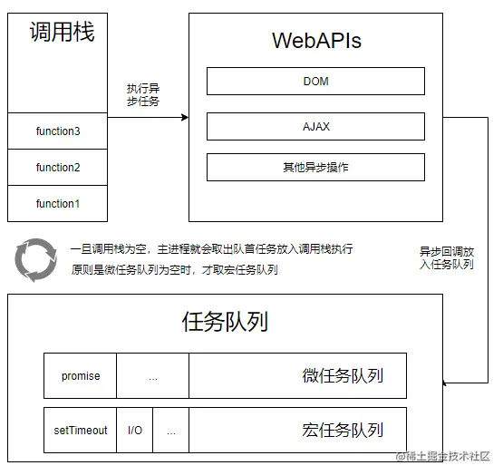
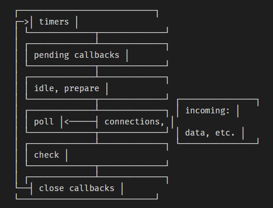
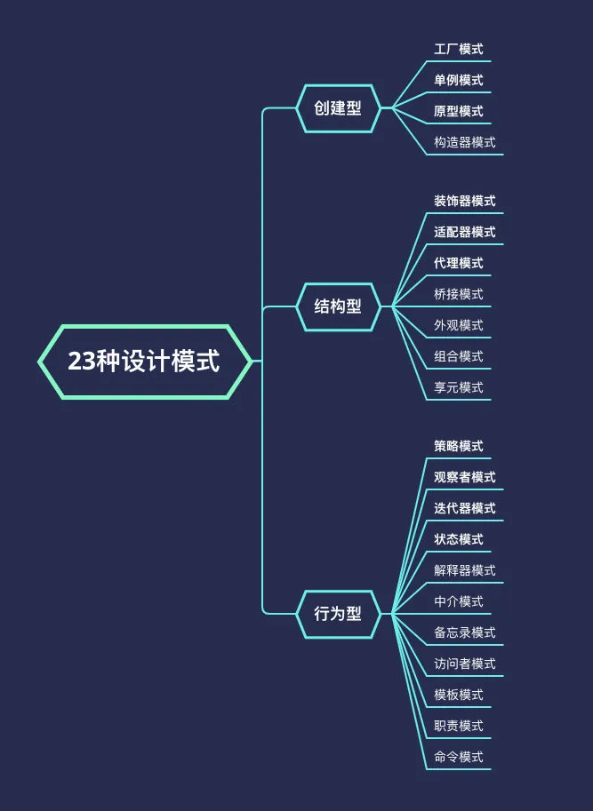

# Q&A

## 1、 闭包是什么?核心原理？用途?优缺点?

#### 简答

-   闭包：由函数以及声明该函数的词法环境组合而成的。
-   闭包核心原理：将所需的数据，构成 Closure 对象储存在堆（Heap）上，然后函数引用这个对象，不会随着函数调用结束而被回收。
-   闭包用途：解决命名空间污染问题（立即执行函数 + 闭包）、模拟类的私有属性或方法、高阶函数、函数柯里化、节流防抖、有状态的函数等
-   闭包优点：
    -   1、Closure 对象是私有的，不影响全局，可以用作私有变量。
    -   2、可以外部读取局部变量。
    -   3、让变量的值始终保持在内存中
-   闭包缺点：处理速度和内存消耗方面对脚本的性能有负面的影响。 由于数据被 Closure 对象引用，无法被释放回收，也容易出现内存泄漏的问题。

#### 详细介绍

-   [阮一峰讲闭包](http://www.ruanyifeng.com/blog/2009/08/learning_javascript_closures.html)

## 2、 如何避免闭包引起的内存泄漏？

#### 简答

-   在退出函数前，将不使用的局部变量赋值为 null。
-   将闭包函数赋值为 null，解除引用关系

#### 详细介绍

-   在退出函数前，将不使用的局部变量赋值为 null。

```js
//  这段代码会导致内存泄露
window.onload = function () {
    var el = document.getElementById("id");
    el.onclick = function () {
        alert(el.id);
    };
};
// 解决方法为
window.onload = function () {
    var el = document.getElementById("id");
    var id = el.id; //解除循环引用
    el.onclick = function () {
        alert(id);
    };
    el = null; // 将闭包引用的外部函数中活动对象清除
};
```

-   将闭包函数赋值为 null，解除引用关系

```js
function foo() {
    var name = "foo";
    function bar() {
        console.log(name);
    }
    return bar;
}

var fn = foo();
fn();
fn = null;
```

## 3、简述一下事件循环的原理

#### 简答

-   JavaScript 有一个基于事件循环的并发模型，事件循环负责执行代码、收集和处理事件以及执行队列中的子任务。



#### 详细介绍

-   [MDN](https://developer.mozilla.org/zh-CN/docs/Web/JavaScript/EventLoop)
-   [知乎](https://zhuanlan.zhihu.com/p/46068171)

## 4、Nodejs 异步 IO 模型及 libuv？

#### 简答

-   异步 IO 的目的：可以从用户体验和资源分配这两个方面说起。
-   用户体验：JS 单线程执行，与 UI 渲染共用一个线程。JS 执行时，UI 渲染和响应是处于停滞的状态。
-   资源分配：计算机将组件抽象，分为 I/O 设备和计算设备。
-   对比单/多线程：
    -   多线程的代价在于创建线程和执行期线程上下文切换的开销较大，另外，在复杂的业务中，多线程编程经常面临锁、状态同步等问题。但是多线程在多核 CPU 上能够有效提升 CPU 的利用率。
    -   单线程顺序执行任务，比较符合编程人员按顺序思考的思维方式。但是串行执行的缺点在于性能，任意一个略慢的任务都会导致后续执行代码被阻塞。计算机资源中，通常 I/O 与 CPU 计算之间是可以并行进行的。
-   Node 的方案：利用单线程，远离多线程死锁、状态同步等问题;利用异步 I/O，让单线程远离阻塞，以更好地使用 CPU。Node 提供了类似前端浏览器中 WebWorkers 的子进程，该子进程可以通过工作进程高效地利用 CPU 和 I/O。
-   node 中实现异步 IO：完成整个异步 I/O 环节的有事件循环、观察者、线程池和请求对象等。
    -   事件循环：Node 会创建一个类似于 while(true)的循环，每一次循环体称为 Tick。每个 Tick 的过程就是查看是否有事件待处理，如果有就取出事件和执行关联的回调函数。然后进入下次循环。
    -   观察者：每个事件循环中有一个或者多个观察者，而判断是否有事件要处理的过程就是向这些观察者询问是否有要处理的事件。在 Node 中，事件主要来源于网络请求、文件 I/O，观察者有文件 I/O 观察者、网络 I/O 观察者等。事件循环是一个典型的生产者/消费者模型。异步 I/O、网络请求等则是事件的生产者，源源不断为 Node 提供不同类型的事件，这些事件被传递到对应的观察者那里，事件循环则从观察者那里取出事件并处理。
    -   先看这张图，大致了解一下 node 中异步 io 的实现。

#### 详细介绍

-   [51CT0-“异步 IO” 有九问](https://www.51cto.com/article/667063.html)

## 5、Nodejs 中的 libuv？

#### 简答

-   Nodejs：对 js 功能的拓展，提供了网络、文件、dns 解析、进程线程等功能，利用 v8 提供接口。
-   libuv - 一个跨平台异步 IO 库。Nodejs 把 IO 操作交给 libuv，保证主线程可以继续处理其他事情。 - 利用系统提供的事件驱动模块解决网络异步 IO，利用线程池解决文件 IO。另外还实现了定时器，对进程，线程等使用进行了封装。
    
-   nodejs 中的事件循环根据不同的操作系统可能存在特殊的阶段，但总体是可以分为以下 6 个阶段
    -   timer 阶段： 执行所有通过计时器函数（即 setTimeout 和 setInterval）注册的回调函数。
    -   pending callbacks 阶段： 虽然大部分 I/O 回调都是在 poll 阶段被立即执行，但是会存在一些被延迟调用的 I/O 回调函数。那么此阶段就是为了调用之前事件循环延迟执行的 I/O 回调函数。
    -   idle prepare 阶段： 仅用于 nodejs 内部模块使用。
    -   poll（轮询）阶段： 此阶段有两个主要职责：
        -   1. 计算当前轮询需要阻塞后续阶段的时间；
        -   2. 处理事件回调函数。
    -   check 阶段： 用于在 poll 阶段的回调函数队列为空时，使用 setImmediate 实现调度执行特定代码片段。
    -   close 回调函数阶段，执行所有注册 close 事件的回调函数。
-   nodejs 的事件循环核心对应 libuv 中的 [uv_run 函数](https://github.com/libuv/libuv/blob/v1.35.0/src/unix/core.c#L365-L400)
-   与浏览器实现对比
    -   在 nodejs 中事件循环不再是由单一个 task queue 和 micro-task queue 组成，而是由多个 阶段 phase 的多个回调函数队列 callbacks queues 组成一次事件循环 tick
    -   在每一个单独的阶段都存在一个单独的 回调函数 FIFO 队列。
-   libuv 的运行原理
    -   libuv 的架构 [!image](../../image/libuv.png)
        -   从左往右可分为两部分，Network I/O 的相关请求，另一部分 File I/O，DNS Ops 和 User Code 组成。

#### 详细介绍：

-   https://cloud.tencent.com/developer/article/1453103
-   https://set.sh/post/200317-how-nodejs-event-loop-works
-   https://www.cnblogs.com/peiyu1988/p/8520968.html

## 6、webscoket 的连接原理

#### 简答

-   WebSocket: HTML5 出的东西（新协议),实现了浏览器与服务器全双工通信。应用层协议、基于 TCP、全双工通信、一次 HTTP 握手、持久连接、双向数据传输。
-   WebSocket 解决的问题： http 请求头信息多，带宽浪费。支持服务端主动推送消息，更好的实时通信。
-   WebSocket 的特点：
    -   建立在 TCP 协议之上
    -   与 HTTP 协议有良好的兼容性，默认端口 80（ws）、443（wss）,并且握手阶段采用 HTTP 协议
    -   较少的控制开销：创建连接后，ws 客户端与服务端进行数据交换时，协议控制的数据包头部较小。
    -   可以发送文本，也可以发送二进制数据
    -   没有同源策略的限制，客户端与任意服务器通信
    -   支持扩展：ws 协议定义了扩展，用户可以扩展协议，或者实现自定义的子协议（比如支持自定义压缩算法等）

#### 详细介绍：

-   [掘金](https://juejin.cn/post/7086021621542027271)
-   [知乎](https://www.zhihu.com/question/20215561)
-   [segmentfault](https://segmentfault.com/a/1190000040793931)

## 7、react16.3+ 生命周期

#### 简答

-   挂载阶段：
    -   constructor： 在 React 组件挂载之前被调用，在为 React.Component 子类实现构造函数时使用。
    -   getDerivedStateFromProps(nextProps, prevState)： 在调用 render 方法之前调用，在初始化和后续更新都会被调用。返回值：返回一个对象来更新 state, 如果返回 null 则不更新任何内容。
    -   render：方法必须返回 reactDOM。不要在 render 里面 setState, 否则会触发死循环导致内存崩溃
    -   componentDidMount： 在组件挂载后 (插入 DOM 树后) 立即调用。是发送网络请求、启用事件监听方法的好时机，并且可以在 此钩子函数里直接调用 setState()
-   更新：
    -   getDeriveStateFromProps
    -   shouldComponentUpdate：在组件更新之前调用，可以控制组件是否进行更新， 返回 true 时组件更新， 返回 false 则不更新。建议可以使用内置 PureComponent 组件替代。
    -   render
    -   getSnapshotBeforeUpdate：它可以使组件在 DOM 真正更新之前捕获一些信息（例如滚动位置）
    -   componentDidUpdate：在更新后会被立即调用。首次渲染不会执行
-   卸载：
    -   comonentWillUnmount：在组件即将被卸载或销毁时进行调用。是取消网络请求、移除监听事件、清理 DOM 元素、清理定时器等操作的好时机。
-   从生命周期对比 16.3 以前版本，React 废弃了 componentWillMount、componentWillReaceiveProps、componentWillUpdate 这三个函数
-   废弃的原因：由于 React15 同步更新导致主线程长时间被占用，有页面性能问题。React 采用 Filer 机制，利用 requestIdleCallback 机制，可将中断的任务进行分片处理，每个分片运行时间很短，这样主线程不会被长期占用。由于 Fiber Reconciliation 这个过程有可能暂停然后继续执行，所以挂载和更新之前的生命周期钩子就有可能不执行或者多次执行；因此废弃他们。

#### 详细介绍：

-   https://juejin.cn/post/6914112105964634119
-   https://zhuanlan.zhihu.com/p/38030418

## 8、async await 的原理是什么?

#### 简答

-   基本原理：async / await 本质上就是 generator 的语法糖，内置执行器，无需手动执行 next() 方法。
-   Generator 函数：通过 yield 关键字，把函数的执行流挂起，通过 next()方法可以切换到下一个状态，为改变执行流程提供了可能，为异步编程提供解决方案。
-   对比 Generator 与 async / await
    -   Generator 返回的是生成器对象，需要手动调用 next()才能执行下一步。
    -   async 函数返回值是 Promise 对象，自带执行器，不需要手动调用 next()就能自动执行。

#### 详细介绍：

-   [掘金-7 张图，20 分钟就能搞定的 async/await 原理](https://juejin.cn/post/7007031572238958629)
-   [掘金-对 async/await 的理解，以及内部原理](https://juejin.cn/post/6967260930862219272)
-   [掘金-async/await 的实现](https://juejin.cn/post/7142782211308142599)

## 9、虚拟列表怎么实现?（按需显示思路的一种实现）

#### 简答

-   定义：虚拟列表是一种根据滚动容器元素的可视区域来渲染长列表数据中某一个部分数据的技术。
-   实现「虚拟列表」可以简单理解为就是在列表发生滚动时，改变「可视区域」内的渲染元素。大概的文字逻辑步骤如下：
    -   根据单个元素高度计算出滚动容器的可滚动高度，并撑开滚动容器；
    -   根据可视区域计算总挂载元素数量；
    -   根据可视区域和总挂载元素数量计算头挂载元素（初始为 0）和尾挂载元素；
    -   当发生滚动时，根据滚动差值和滚动方向，重新计算头挂载元素和尾挂载元素。
-   代码实现：https://github.com/maicFir/lessonNote/blob/master/javascript/08-%E8%99%9A%E6%8B%9F%E5%88%97%E8%A1%A8/index.js

#### 详细介绍：

-   [GitHub-浅说虚拟列表的实现原理](https://github.com/dwqs/blog/issues/70)
-   [掘金-浅谈虚拟列表实现与原理分析](https://juejin.cn/post/6877507011769008135)
-   [掘金-剖析虚拟列表实现原理](https://juejin.cn/post/7095958383336882183)
-   [掘金-如何实现一个高度自适应的虚拟列表](https://juejin.cn/post/6948011958075392036)
-   [博客-剖析无限滚动虚拟列表的实现原理 ](https://lkangd.com/post/virtual-infinite-scroll/)

## 10、 Node 是怎么部署的? pm2 守护进程的原理?Node 开启子进程的方法有哪些?进程间如何通信?

#### 简答

-

## 11、require 和 import 的区别

#### 简答

-   用法：

    -   在 ES6 中，import 用于导入模块，export 导出接口
    -   在 Node 中 require 用于引入模块，module.exports/exports 导出接口（exports 不可直接赋值）

-   遵循规范：

    -   require 是[AMD 规范](https://github.com/amdjs/amdjs-api/wiki/require)引入的
    -   import 是 ES6 的一个语法标准，若要兼容浏览器必须转为 ES5 语法

-   调用时间：

    -   require 是运行时调用，理论上可以运用在代码的任何地方
    -   import 是编译时调用，必须放在文件开头
    -   ES6 中还新增了一个函数 `import(params)` 类似于 Node 的 `require`方法，区别在于前者是异步加载，后者是同步加载

-   本质：

    -   **require 是赋值过程**。module.exports 后面的内容就是 require 的结果，如对象、数字、字符串、函数等，然后将 require 的结果赋值给某个变量。require 引入基础数据类型时，属于复制该变量。通过 require 引入复杂数据类型时，属于浅拷贝该对象
    -   **import 是解构过程**。目前所有的引擎都没实现 import，node 也是使用 babel 转为 ES5 再执行。import 语法实际也是转码为 require 去执行的（证据：模块导出时使用 module.exports，在引入模块时使用 import 依然有效）

-   模块化原理：

    -   自执行函数也是前端模块化的实现方案之一
    -   node 模块化顶层有一个自执行的函数， 函数中包含 `exports`, `require`, `module`, `__filename`, `__dirname`这些常用的全局变量

#### 详细介绍

-   [博客园--ES6 中的 export 和 import](https://www.cnblogs.com/wenxuehai/p/14246989.html)
-   [陈三博客--区别 module.exports 与 exports](https://blog.zfanw.com/differences-between-exports-module-dot-exports/)
-   [阮一峰--require 源码解读](https://www.ruanyifeng.com/blog/2015/05/require.html)
-   [github--mini-require](https://github.com/YIngChenIt/mini-require)
-   [博客-- 关于 ES6 中的 import 的原理和使用](https://ciaozz.github.io/2020/03/24/import/)
-   [MDN--import](https://developer.mozilla.org/zh-CN/docs/Web/JavaScript/Reference/Statements/import)

## 12、vite vs webpack 区别？

#### 简答

-   Vite 优势：

    -   vite 服务器启动速度极快。vite 启动时不需要打包、分析模块依赖、编译，因此开发环境启动极快。当浏览器请求需要模块时，在进行编译，这种按需动态编译模式，极大缩短了编译时间。
    -   vite 热更新(HMR)更快。当某个模块改变后，vite 让浏览器重新请求该模块，而 webpack 则将该模块的所有依赖重新编译。
    -   vite 预构建依赖更快。vite 使用 esbuild(Go 编写)并行构建依赖，而 webpack 基于 nodejs，大概快 10-100 倍。
    -   vite 开箱即用：Vite 内置大量默认处理，比如支持 jsx 和 tsx，样式预处理库支持 less、sass 和 CSS module，而 webpack 需要大量配置项。
    -   vite 自带缓存机制：解析后的依赖请求会以 HTTP 头 `max-age=31536000,immutable` 强缓存，以提高开发时的页面重载性能，而 webpack5+之前是没有文件缓存的。

-   vite 缺点：

    -   生态不及 webpack，加载器、插件不够丰富（通过 Rollup 插件来拓展 Vite 的功能）
    -   vite 打包到生产环境时，使用的传统的 rollup 打包，生产环境 esbuild 构建对于 css 和代码分割不够友好。
    -   项目的开发浏览器要支持 ESmodule，而且不能识别 commonjs 语法。
    -   生产环境集成 `Rollup`打包，与开发环境最终执行的代码不一致。
    -   兼容性不好。可使用官方插件@vitejs/plugin-legacy，转义成传统版本和相对应的 polyfill

-   webpack 优势：

    -   支持的模块规范：ES Modules，CommonJS 和 AMD Modules，浏览器兼容性比较好。
    -   vite 对 ssr 的支持还在试验阶段，webpack 比较成熟。如：主流的 ssr 框架 Next.js 采用的是 webpack 构建。

#### 详细介绍

[csdn-vite 和 webpack 的区别及优势](https://blog.csdn.net/xiasohuai/article/details/123017321)
[张鑫旭-万岁，浏览器原生支持 ES6 export 和 import 模块啦](https://www.zhangxinxu.com/wordpress/2018/08/browser-native-es6-export-import-module/)

## 13、vite 实现原理？

#### 简答

-   核心原理：拦截浏览器对 import 模块的请求，并返回处理后的结果。
-   启动 KOA 服务：http 服务加载了一些插件对不同类型的文件做不同的逻辑处理。
-   核心插件：模块路径重写（moduleRewritePlugin）、模块路径引入（moduleResolvePlugin）、静态文件处理（koa-static）、vue 文件处理（vueCompilePlugin）
-   Vite 热更新: Vite 的是通过 `WebSocket` 来实现的热更新通信，建立浏览器和服务器的通信。Vite 的 WS 客户端监听各类消息，进行重新加载相关的链接。组件变更基本都是利用 `timestamp` 刷新缓存重新执行的方法来达到更新的目。

#### 详细介绍

[简书-vue3 和 vite 不得不说的事](https://www.jianshu.com/p/07960e4bbb01)
[掘金-Vite 原理浅析](https://juejin.cn/post/6844904146915573773)

## 14、对前端工程化的理解？

#### 简答

-   总结：前端工程化是使用软件工程的技术和方法来进行前端开发流程、技术、工具、经验等的规范化、标准化。其主要的目的是提高开发效率和降低成本（减少重复工作时间）
-   前端工程化是为了让前端开发可以“自成体系”，主要从**模块化**、**组件化**、**规范化**、**自动化**四个方面思考。
-   模块化：将大文件拆分成相互依赖的小文件，再进行同一的拼装和加载。
    -   JS 模块化：import 引入规范化，webpack+babel 将所有模块打包成一个文件同步加载，也可以打包成多个 chunk 异步加载
    -   CSS 模块化：SASS、LESS 等预处理器实现 CSS 的文件拆分，CSS Modules 来管理 css。原理是通过每个 class 名后带一个独一无二的 hash 值，这样就不存在命名冲突问题了。
    -   资源模块化：Webpack 使所有的资源都可以模块化，
-   组件化：组件化是一种分治思想，是一种按照模板(HTML)+样式(CSS)+逻辑(JS)三位一体的形式对面向对象的进一步抽象。除了封装组件本身，还要合理处理组件之间的关系。
-   规范化：项目初期规范制定的好坏会直接影响到后期的开发质量。
    -   目录结构的制定
    -   编码规范
    -   前后端接口规范
    -   文档规范
    -   组件管理
    -   Git 分支管理
    -   Commit 描述规范
    -   定期 codeReview
    -   视觉图标规范
-   自动化：任何简单机械的重复劳动都应该让机器去完成。例如持续集成、自动化构建、自动化部署、自动化测试等等

#### 详细介绍

[简书-前端工程化的理解](https://www.jianshu.com/p/88ed70476adb)
[博客-谈谈你对前端工程化的理解？](https://xjl271314.github.io/docs/open/module.html)
[github-第 79 题：谈谈你对前端工程化的理解](https://github.com/noxussj/Interview-Questions/issues/79)

## 15. 前端性能优化都做了哪些工作？

#### 简答：

-   **体验优化**
    -   1，首屏渲染优化，请求少、加载体积小、善用缓存
    -   2，动画优化，避免某些动画造成页面的卡顿
    -   3，优化用户的操作感官，提升视觉反馈，比如 hover 小手，让用户一眼就知道是否可操作
    -   4，长列表复用 dom，优化滚动效果及页面卡顿现象，减少页面一次性渲染的数量
    -   5，骨架屏的使用
    -   6，组件的预加载，懒加载
-   **提升页面性能**
    -   减少 http 请求 和 冗余数据
    -   组件，路由懒加载
    -   配置 nginx 优化
    -   优化 webpack 打包机制
    -   使用 CDN
    -   预渲染
    -   SSR
    -   图片转 base64
    -   后台分布式部署，负载均衡
-   **首页加载优化**（减少白屏时间）
    -   cdn 分发：通过在多台服务器部署相同的副本，当用户访问时，服务器根据用户跟哪台服务器地理距离小或者哪台服务器此时的压力小，来决定哪台服务器去响应这个请求。
    -   后台在业务层的缓存：数据库查询缓存是可以设置缓存的，这个对于高频率的请求很有用。值得注意的是，接口也是可以设置缓存的，比如获取一定时间内不会变的资源，设置缓存会很有用。
    -   静态文件缓存方案：这个最常看到。现在流行的方式是文件 hash + 强缓存 的一个方案。比如 hash + cache control：max-age=1 年。
    -   前端的资源动态加载：
        -   a. 路由动态加载，最常用的做法，以页面为单位，进行动态加载。
        -   b. 组件动态加载（offScreen Component），对于不在当前视窗的组件，先不加载。
        -   c. 图片懒加载(offScreen Image)，同上。值得庆幸的是，越来越多的浏览器支持原生的懒加载，通过给 img 标签加上 loading="lazy" 来开启懒加载模式。
    -   利用好 async 和 defer 这两个属性：如果是独立功能的 js 文件，可以加入 async 属性。如果是优先级低且没有依赖的 js，我们可以加入 defer 属性。
    -   渲染的优先级：浏览器有一套资源的加载优先级策略，也可以通过 js 来自己控制请求的顺序和渲染的顺序。一般我们不需要这么细粒度的控制，而且控制的代码也很不好写。
    -   前端做一些接口缓存：前端也可以做接口缓存，缓存的位置有两个，一个是内存，即保存给变量，另一个是 localStorage。比如用户的签到日历（展示用户是否签到），我们可以缓存这样的接口到 localStorage ，有效期是当天。或者有个列表页，我们总是缓存上次的列表内容到本地，下次加载时，我们先从本地读取缓存，并同时发起请求到服务器获取最新列表。
    -   页面使用骨架屏：意思是在首屏加载完成之前，通过渲染一些简单元素进行占位。骨架屏虽然不能提高首屏加载速度，但可以减少用户在首屏等待的急躁情绪。这点很有效，在很多成熟的网站都有大量应用。
    -   使用 SSR 渲染：服务器性能一般都很好，那么可以先在服务器先把 vdom 计算完成后，再输出给前端，这样可以节约的时间为：计算量 / (服务器计算速度 - 客户端计算速度) 。第二个是服务器可以把首屏的 ajax 请求在服务端阶段就完成，这样可以省去和客户端通过 tcp 传输的时间。
    -   引入 http2.0：http2.0 对比 http1.1，最主要的提升是传输性能，特别是在接口小而多的时候。
    -   选择先进的图片格式：使用 JPEG 2000，JPEG XR，and WebP 的图片格式来代替现有的 jpeg 和 png ，当页面图片较多时，这点作用非常明显。把部分大容量的图片从 BaseLine JPEG 切换成 Progressive JPEG （理解这两者的差别）也能缩小体积。
        利用好 http 压缩：使用 http 压缩的效果非常明显。

#### 详细介绍

[掘金-工作中如何进行前端性能优化(23 种优化+10 种定位方式)](https://juejin.cn/post/6904517485349830670)
[掘金-你知道的前端性能优化手段有哪些)](https://juejin.cn/post/7109100914882904095)
[博客-前端性能优化之旅](https://github.com/alienzhou/fe-performance-journey)
[知乎-常见的前端性能优化手段都有哪些？都有多大收益？](https://www.zhihu.com/question/40505685)
[博客-我们为什么要做前端性能优化？](https://cloud.tencent.com/developer/article/1953685)
[CSDN-平时在项目开发中都做过哪些前端性能优化](https://blog.csdn.net/zimeng303/article/details/113853928)

## 16. 前端设计模式？

#### 简答：

-   设计模式，相信知道的同学都会脱口而出，五大基本原则（SOLID）和 23 种设计模式。SOLID 所指的五大基本原则分别是：单一功能原则、开放封闭原则、里式替换原则、接口隔离原则和依赖反转原则。概括为六个字，即“高内聚，低耦合”。
-   策略模式： 当各判断条件下的策略相互独立且可复用，策略内部逻辑复杂，策略需要灵活组合的时候，比较适用。如权限验证、表单验证
-   发布-订阅模式：当各模块相互独立，存在一对多的依赖关系，依赖模块不稳定，依赖关系不稳定，各模块由不同的人员、团队开发。
-   装饰器模式：为一个函数赋能，增强它的某种能力，他能动态的添加对象的行为。
-   适配器模式：为了解决不兼容的问题，把一个类的接口转换成我们想要的接口。
-   代理模式：为其它对象提供一种代理以控制这个对象的访问，具体执行的功能还是这个对象本身。
-   责任链模式：避免请求发送者与接收者耦合在一起，让多个对象都有可能接收请求，将这些对象连接成一条链，并且沿着这条链传递请求，直到有对象处理它为止。（各环节可复用、有执行顺序、可重组）
-   图片总结：
    

#### 详细介绍

-   [掘金-渣渣设计模式](https://juejin.cn/post/6844904138707337229)
-   [infoq-微医](https://www.infoq.cn/article/mw4xigornmhttzylzpow)
-   [segmentfault](https://segmentfault.com/a/1190000040987075)

## 17、前端组件如何设计

#### 详细介绍

-   [掘金-前端组件设计之实践篇](https://juejin.cn/post/7098847243771314206)

## 18、Web 前端常见的安全问题介绍及解决方案

#### 详细介绍

-   [博客-Web 前端常见的安全问题介绍及解决方案](https://quincychen.cn/frontend-security-1/)
