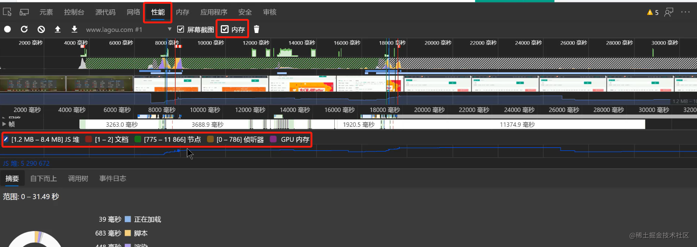
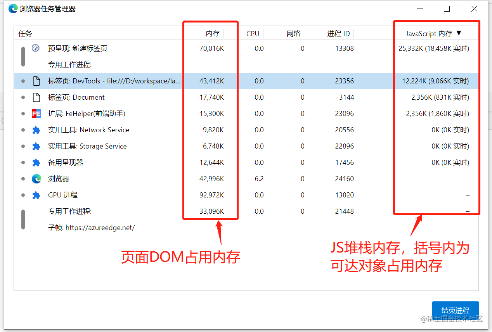
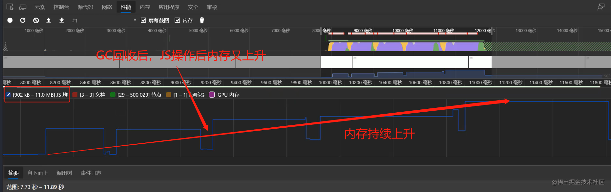
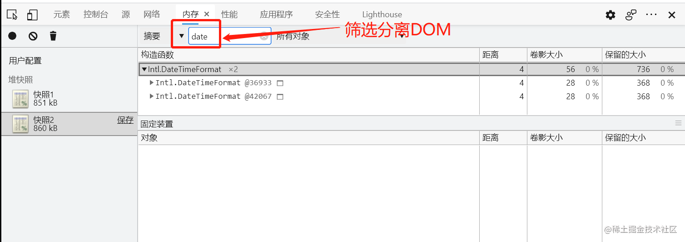

# JS 性能检测

## Performance 工具

了解垃圾回收策略，但是如何判断程序中 是否存在内存泄漏等性能问题，可以借助浏览器`Performance`工具。GC 的目的是为了实现内存空间的良性循环。但是否能实现良性循环需要程序合理使用内存，因此需要`Performance`工具监控程序的内存空间，从而发现问题。图示：

#### 1、内存问题的外在表现（假定网络正常）

-   页面加载延迟或经常性暂停（一般伴有频繁的垃圾回收，可能是某些代码让内存瞬间爆表）
-   页面持续性出现糟糕的性能（一般伴有内存膨胀，可能是为了达到性能要求，申请超出设备可提供的内存）
-   页面的性能随着时间的延长越来越差（一般伴有内存泄漏，存在不可回收的内存空间持续增长）

#### 2、内存问题及监控

-   内存泄漏：内存使用持续升高
-   内存膨胀：在多数设备上都存在性能问题
-   频繁的垃圾回收：通过内存变化图进行分析

#### 3、监控内存的方式

-   浏览器任务管理器（在浏览器界面按下`Shift` + `Esc`调出）
    
-   `timeline`时序图记录
    
-   堆快照查找分离`DOM`
    什么是分离 DOM？DOM 节点已经从 DOM 中移除，但在 JS 中还在引用。
    
-   判断是否存在频繁的垃圾回收
    页面不活动时，`Timeline`中频繁`JS Heap`的内存线上下波动。任务管理器中`JS`堆栈内存频繁的增加减少。
