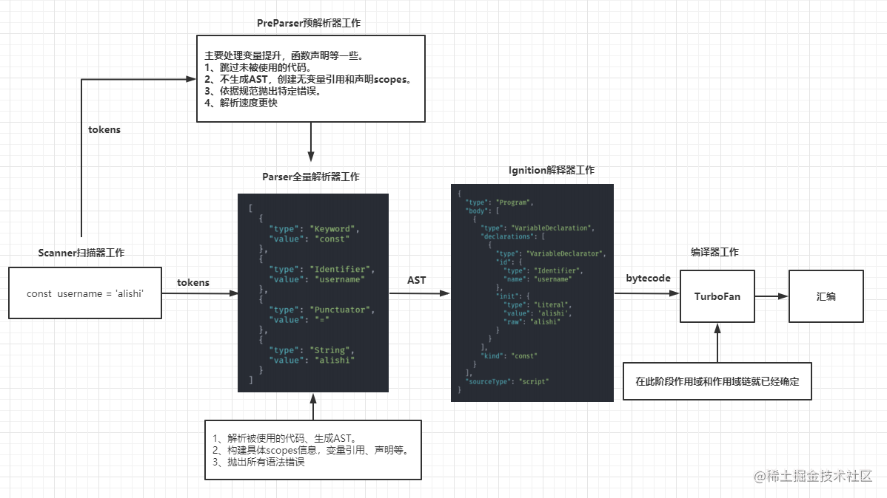
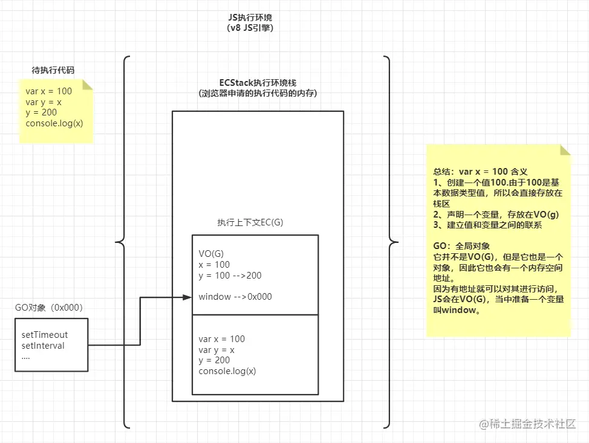
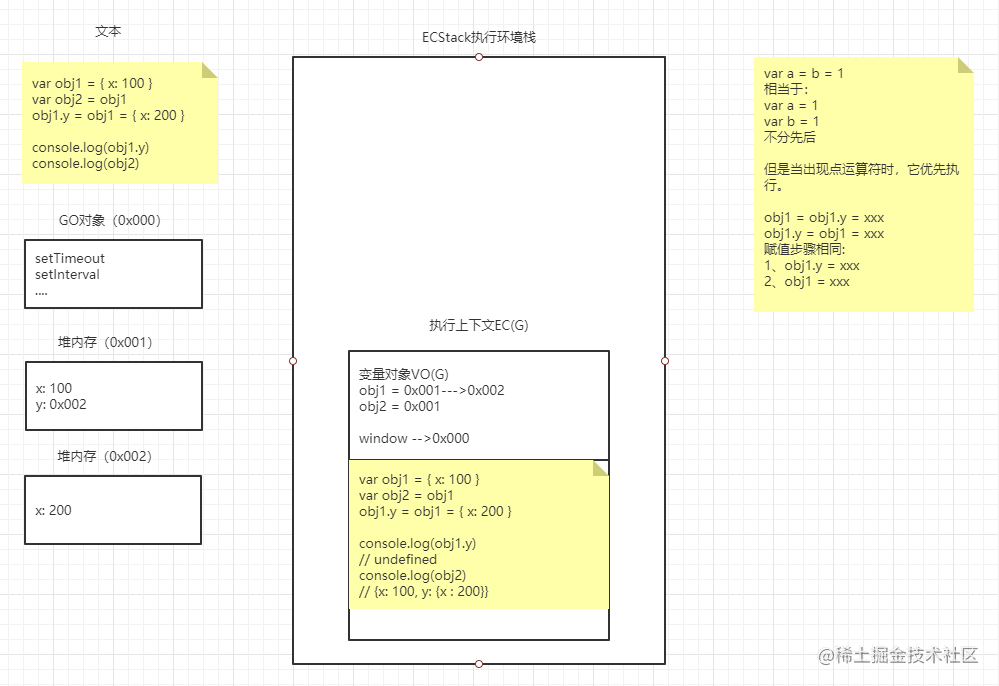
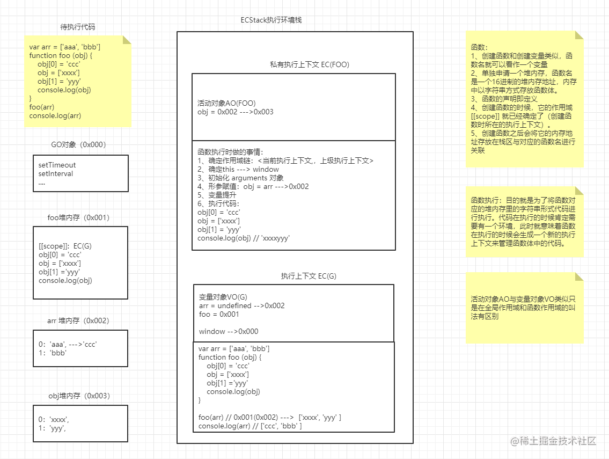
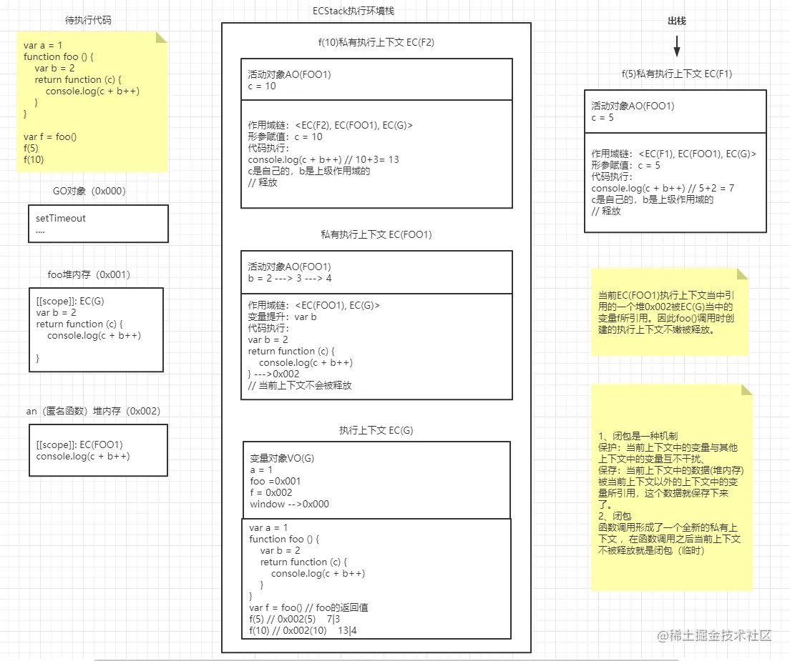
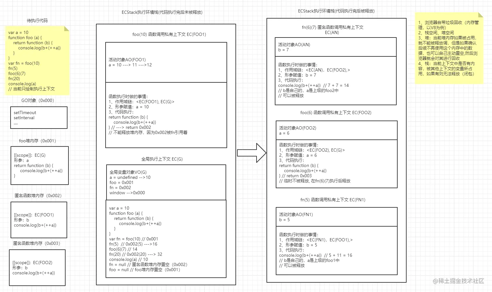

# JS 代码执行

## V8 引擎的工作流程

首先通过一张图整体理解一下：


## 基本的堆栈处理



## 引用类型堆栈处理


这里插入一道练习题检测是否理解：

```js
var a, b, c, d;
a = b = c = d = { a: 1 };
a.x = a = b.y = b = c.z = c = {};
console.log(a, b, c, d);
console.log(a === b, b === c, c === d, c === d.x, d.x === d.y, d.y === d.z);
```

解析：

1. 声明 a、b、c、d，均为 undefined。
2. a、b、c、d 被赋值，均指向对象 Object_1，现在为{a:1}。
3. 对象 Object_1 被声明属性 x，现在为{a:1, x:undefined}，a.x 即为 Object_1.x。
4. 对象 Object_1 被声明属性 y，现在为{a:1, x:undefined, y:undefined}，b.y 即为 Object_1.y。
5. 对象 Object_1 被声明属性 z，现在为{a:1, x:undefined, y:undefined, z:undefined}，c.z 即为 Object_1.z。
6. c 被赋值，指向对象 Object_2，现在为{}。
7. c.z 即 Object_1.z，被赋值，指向对象 Object_2。
8. b 被赋值，指向对象 Object_2。
9. b.y 即 Object_1.y，被赋值，指向对象 Object_2。
10. a 被赋值，指向对象 Object_2。
11. a.x 即 Object_1.x，被赋值，指向对象 Object_2。
12. 此时 a、b、c、d.x、d.y、d.z 均指向对象 Object_2，现在为{}。d 指向 Object_1，现在为{a:1, x:{}, y:{}, z:{}}。

## 函数堆栈处理



## 闭包堆栈处理



## 闭包与垃圾回收


