# JS 性能优化

## 循环添加事件

场景需求：给多个 button 元素添加点击事件

-   基础代码：

```js
var abtns = document.querySelectorAll("button");
for (var i = 0; i < abtns.length; i++) {
    abtns[i].onclick = function () {
        console.log(`当前的索引值${i}`);
    };
}
// 最后点击button后，输出i的值都是3，期望是当前点击button索引的值
```

那为什么每次点击 button,都会输出 3 呢？
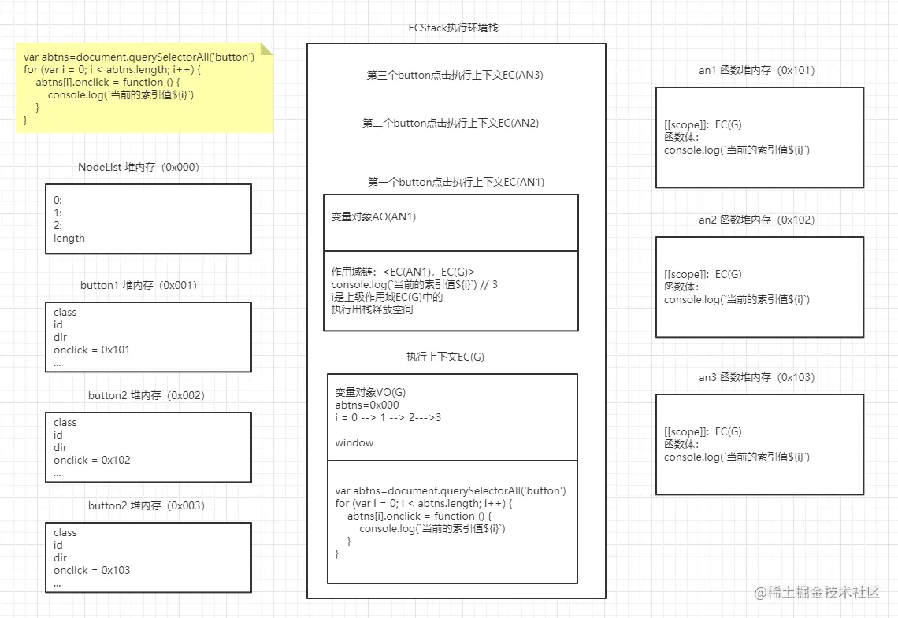

-   改造一：使用立即执行函数的方式

```js
var abtns = document.querySelectorAll("button");
for (var i = 0; i < abtns.length; i++) {
    (function (i) {
        abtns[i].onclick = function () {
            console.log(`当前的索引值${i}`);
        };
    })(i);
}
```

图解代码的堆栈执行情况：
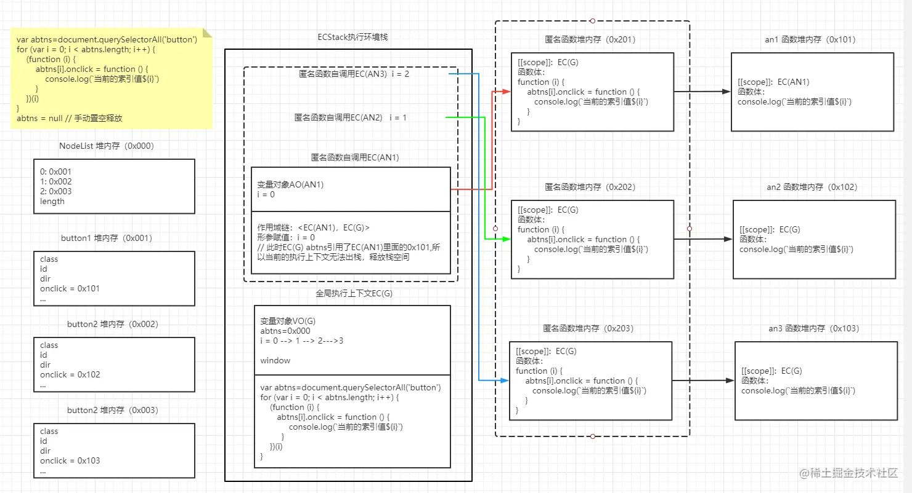
这种方式存在缺陷：图中被虚线框住的部分匿名函数创建、执行产生了闭包，无法出栈释放，因此消耗了更多的空间  
为了避免内存的泄露，当在 button 不再被点击时，需要手动将 abtns 置空，这个 GC 就会释放闭包中堆栈占用内存  
那如何才能尽量少开辟新的内存空间，也避免内存无法自动释放的问题呢？

-   改造二：使用自定义属性的方式

```js
var abtns = document.querySelectorAll("button");
for (var i = 0; i < abtns.length; i++) {
    abtns[i].myIndex = i;
    abtns[i].onclick = function () {
        console.log(`当前的索引值${this.myIndex}`);
    };
}
```

图解代码的堆栈执行情况：
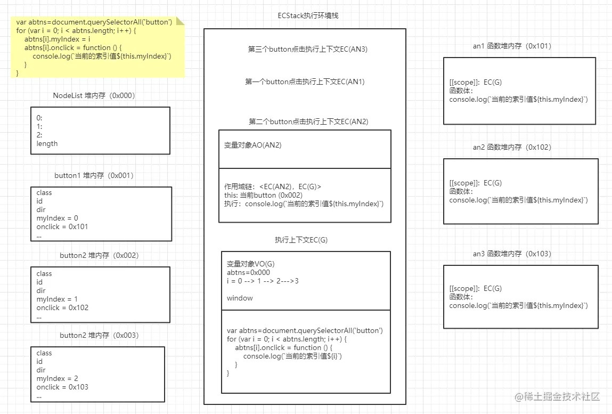

-   改造三：采用事件委托的方式

```js
document.body.onclick = function (ev) {
    var target = ev.target,
        targetDom = target.tagName;
    if (targetDom === "BUTTON") {
        var index = target.getAttribute("index");
        console.log(`当前点击的时第${index}个`);
    }
};
```

图解代码的堆栈执行情况：
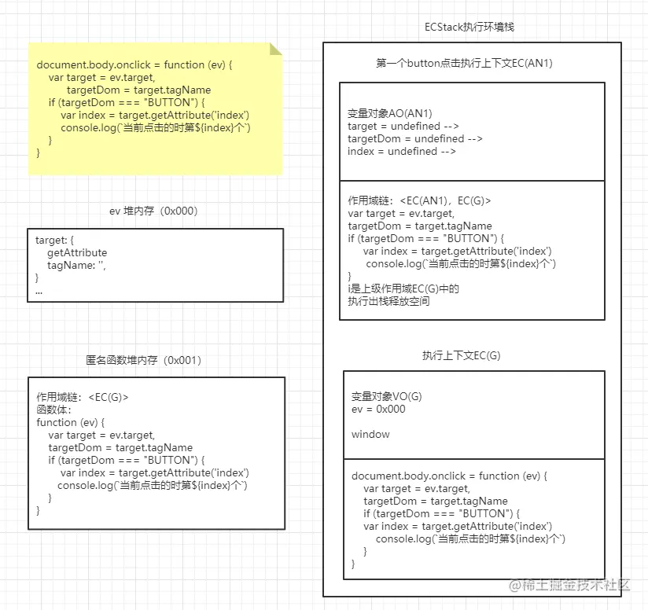

## JSBench 对 JS 性能测试

[JSBench 网址](https://jsbench.me/)
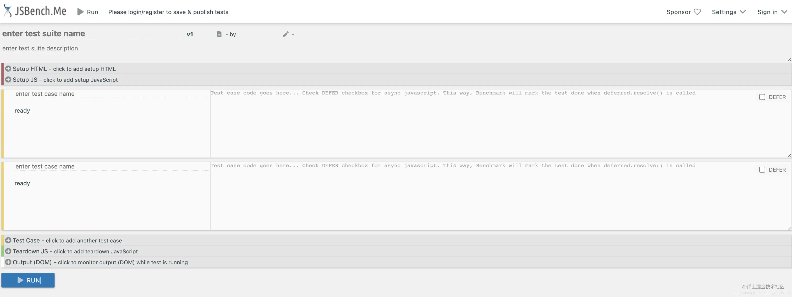
**模块介绍**：  
带 Setup 的都是填写一些前置初始化的代码。  
Test case 是添加测试用例，我们需要比对的 JS 代码填写在这个版块。  
Teardown 和 Setup 是相对的，可以理解为 Teardown 是做收尾的工作。好比链接完数据库之后，操作完数据，把连接给释放掉。这部分都是一样的，那我们可以不写在测试用例里面，而是把它抽离出来，写到 Teardown 中去。  
**使用介绍**：  
我们在 Test Case 中红框地方填写我们需要测试的代码，然后点击 RUN 之后，蓝框地方会输出结果。因为单位是 ops/s 也就是每秒钟的操作数，所以前面那个数值越大越好。
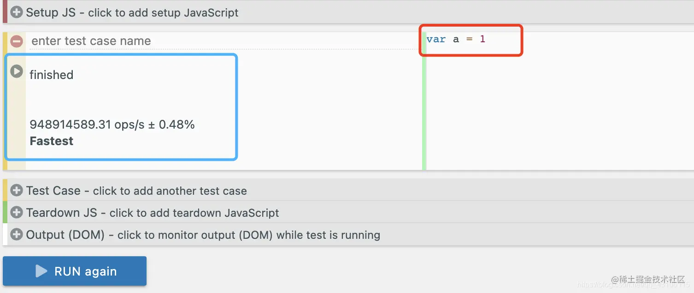
**使用建议**：

1. 使用性能测试的时候，建议浏览器只打开一个标签页，因为开启过多标签页会抢占资源，测试结果不那么准确。
2. 还有就是在运行的时候尽量保持在这个页面上，不要什么最小化页面去做别的事情，因为有可能会被我们的系统挂起，那么测试的结果不一定准确。
3. 不能执行完一遍之后得到的结论就觉得是最终的答案，应该多执行几次取出现几率最高的结果。
4. 不应该纠结于代码的执行时间，对于性能测试而言，关注的并不是只有时间。

## 变量局部化

建议将变量局部化（全局-->局部），提高代码的执行效率，减少了数据访问时需要查找的路径。

```js
// var i, str = ''
// function packageDom () {
//     for (var i = 0; i < 1000; i++) {
//         str += i
//     }
// }
// packageDom()

function packageDom() {
    let str = "";
    for (let i = 0; i < 1000; i++) {
        str += i;
    }
}
packageDom();
```

## 缓存数据

对于需要多次使用的数据进行提前保存，后续进行使用

```js
var oBox = document.getElementById("skip");
// function hasClassName(ele, cls) {
//     // 假设在当前的函数体中需要对className的值进行多次使用，那么我们就可以将它提前缓存起来
//     console.log(ele.className)
//     return ele.className == cls
// }

function hasClassName(ele, cls) {
    var clsName = ele.className;
    console.log(clsName);
    return clsName == cls;
}
console.log(hasClassName(oBox, "skip"));
```

总结:

-   减少声明和语句数
-   缓存数据（作用域链查找变快）

## 减少访问层级

在访问对象属性时，为了减少访问的层级，可以将方法或变量缓存起来，或者将对象扁平化处理后再访问。

## 防抖与节流

**为什么需要防抖与节流？**  
在一些高频率事件触发的场景下，我们不希望对应的事件处理函数多次执行。  
**场景：**

-   滚动事件
-   输入的模糊匹配
-   轮播图切换
-   点击操作
-   ......
    **根源：** 浏览器默认情况下都会有自己的监听事件间隔（4~6ms）,如果检测到多次事件的监听执行，那么就会造成不必要的资源浪费。  
    **前置场景：** 界面上有一个按钮，我们可以连续多次点击  
    **防抖：** 对于高频操作，我们只希望识别一次点击，可以人为设置是第一次或者最后一次。

```html
<button id="btn">点击</button>
```

```js
var oBtn = document.getElementById("btn");

// handle 最终需要执行的事件监听
// wait 事件触发之后多久开始执行
// imediate 控制执行第一次还是最后一次， false 执行最后一次
function myDebounce(handle, wait, immediate) {
    // 1、参数类型判断以及默认值处理
    if (typeof handle !== "function")
        throw new Error("handle must be an function");
    if (typeof wait === "undefined") wait = 300;
    if (typeof wait === "boolean") {
        immediate = wait;
        wait = 300;
    }
    if (typeof immediate !== "boolean") immediate = false;
    // 所谓的防抖效果，我们想要实现的是有一个'人'可以管理handle的执行次数
    // 如果想要执行最后一次，那就意味着无论当前我们点击了多少次，前面的N-1次都无用
    let timer = null;
    return function proxy(...args) {
        let self = this,
            init = immediate && !timer;
        // 当前点击清除上一次的定时器，疯狂点击间隔小于waits时，只有最后一次执行
        clearTimeout(timer);
        timer = setTimeout(() => {
            // 每次定时器回调函数执行，置空timer,为下次有效点击做准备
            timer = null;
            !immediate ? handle.call(self, ...args) : null;
        }, wait);

        // 如果当前传递进来的immediate是true，则立即执行handle
        init ? handle.call(self, ...args) : null;
    };
}

// 定义事件的执行函数
function btnClick(ev) {
    console.log("点击了", this, ev);
}
oBtn.onclick = myDebounce(btnClick, 200, true);
// 考虑以前的点击事件中含有当前点击对象event以及this
// oBtn.onclick = myDebounce(event)
```

**节流：** 对于高频操作，我们可以自己设置频率，让本来会执行很多次的事件触发，按着我们定义的频率减少触发的次数。

```js
// 节流：指的是在自定义的一段时间内让事件进行触发
function myThrottle(handle, wait) {
    if (typeof handle !== "function")
        throw new Error("handle must be function");
    if (typeof wait === undefined) wait = 400;

    let previous = 0; // 定义变量记录上一次执行的时刻时间点
    let timer = null; // 用它来管理时间

    return function proxy(...args) {
        let self = this;
        let now = new Date(); // 定义变量记录当前次执行的时刻时间点
        let interval = wait - (now - previous); // 计算自定义间隔与当前次操作与上次操作间隔的差值
        if (interval <= 0) {
            // 此时说明是一个非高频操作，可以直接执行handle,，然后更新上一次执行的时刻时间点
            clearTimeout(timer);
            timer = null;
            handle.call(self, ...args);
            previous = new Date();
        } else if (!timer) {
            // 当属于高频触发时，如果系统中已经有一个定时器了，那就不需要再开启定时器了。
            // 此时说明这次操作发生在我们定义的频次时间范围内，就不应该执行handle
            // 此时需要我们自定义一个定时器，让handle 在 interval之后去执行
            timer = setTimeout(() => {
                // 这个操作只是将系统中的定时器清除，但是 timer 的值还在，值是定时器的序列号
                clearTimeout(timer);
                timer = null;
                handle.call(self, ...args);
                previous = new Date();
            }, interval);
        }
    };
}

// 定义滚动事件监听
function scrollFn() {
    console.log("滚动了");
}

// window.onscroll = scrollFn
window.onscroll = myThrottle(scrollFn, 600);
```

图解以上代码的实现逻辑：
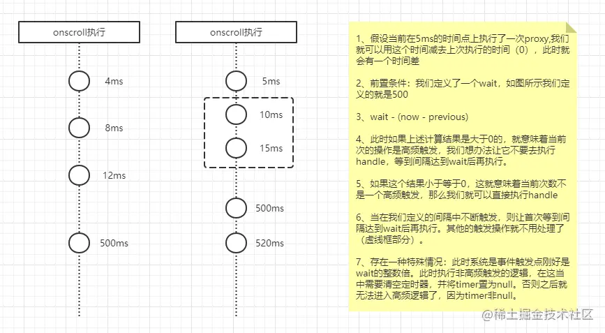

## 减少判断层级

场景需求：当不同的用户登录课程系统后，访问某个章节的某节课，判断权限逻辑。  
多层判断层级的实现：

```js
function doSomeThing(part, chap) {
    const parts = ["ES6", "工程化", "VUE", "React", "Node"];
    if (part) {
        if (parts.includes(part)) {
            console.log("属于当前章节");
            if (chap > 5) {
                console.log("您需要VIP 身份");
            }
        }
    } else {
        console.log("请确认模块信息");
    }
}

doSomeThing("ES6", 6);
```

减少判断层级的实现

```js
function doSomeThing(part, chap) {
    const parts = ["ES6", "工程化", "VUE", "React", "Node"];
    if (!part) {
        console.log("请确认模块信息");
        return;
    }
    if (!parts.includes(part)) return;
    console.log("属于当前章节");
    if (chap > 5) {
        console.log("您需要VIP 身份");
    }
}

doSomeThing("ES6", 6);
```

对比性能提升：
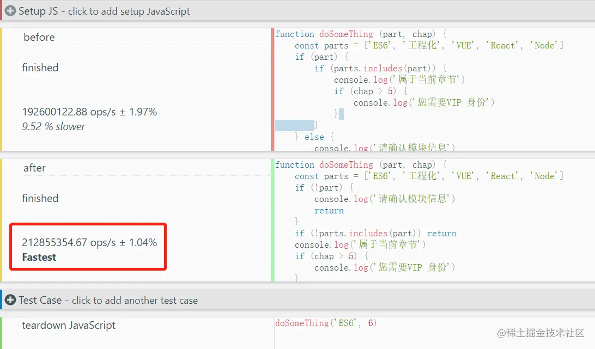
总结编程思想：

-   当我们在进行多层区间判断的时候(`if...else...`),可以根据需求将多层嵌套扁平化处理，对异常情况优先处理并返回，正常流程滞后处理。
-   当我们在进行多个可枚举判断条件时，尽量使用`switch` 语句，因为`if...else...`主要用于区间判断。
-   易于维护的代码并不代表性能最优，需要我们在可维护和高性能之间取舍和平衡。

## 减少循环体活动

思路：循环体中是我们需要多次重复执行的代码，一般循环体越多，执行效率越低，因此我们要对循环体进行优化。

```js
// var test = () => { // 一般写法
//     var i
//     var arr = ['aaa', 'bbb', 123]
//     for (i = 0; i < arr.length; i++) {
//         console.log(arr[i])
//     }
// }

// var test = () => { // 缓存循环体不变量
//     var i
//     var arr = ['aaa', 'bbb', 123]
//     var len = arr.length // 缓存循环体中的不变量
//     for (i = 0; i < len; i++) {
//         console.log(arr[i])
//     }
// }

var test = () => {
    // // 缓存循环体不变量，同时减少条件判断
    var arr = ["aaa", "bbb", 123];
    var len = arr.length; // 缓存循环体中的不变量
    while (len--) {
        // 采用while条件自减方式，减少条件判断
        console.log(arr[len]);
    }
};

test();
```

对比性能(执行时间)提升：
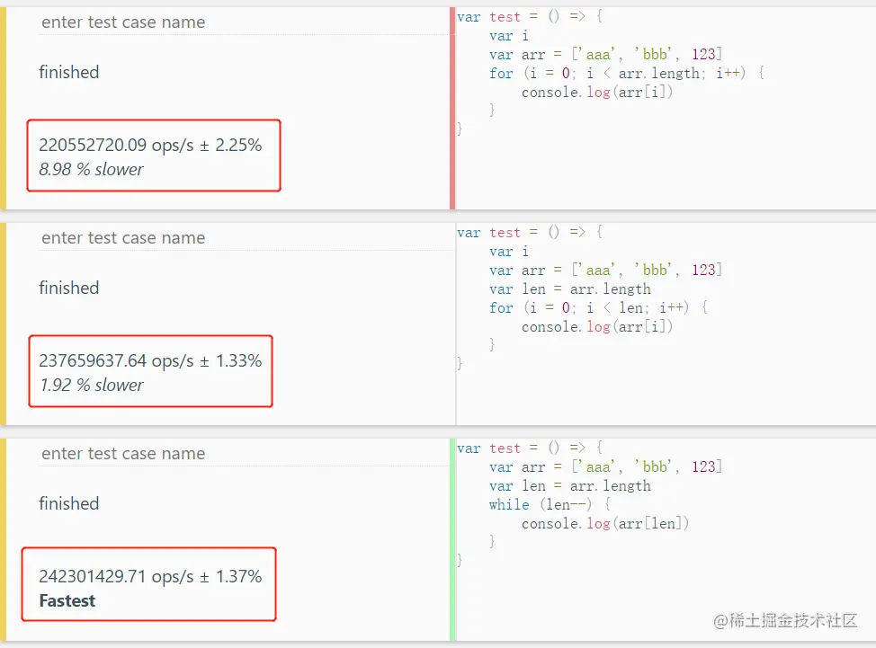
总结编程思想：

-   对循环体中的不变量，避免通过查找的方式取值，可以提前进行缓存。
-   对于循环体输出内容顺序没要求时，可以采用 while 循环判断条件后自减的方式，减少条件判断次数。

## 字面量与构造式

思考：不同的变量声明方式在性能方面有什么差别呢？
**引用类型的字面量与构造式的定义：**

```js
// var test = () => {
//     let obj = new Object() // 调用了Object函数
//     obj.name = 'aaa'
//     obj.age = 20
//     obj.slogan = 'xxxxxxxxxxxx'
//     return obj
// }

var test = () => {
    let obj = {
        name: "aaa",
        age: 20,
        slogan: "xxxxxxxxxxxx",
    };
    return obj;
};

console.log(test());
```

对比性能(执行时间)提升：
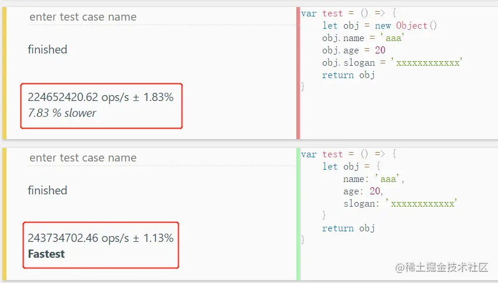
分析：两者有一些差异，第一种方式因为执行 new Object()调用了 Object 函数导致时间多了。  
**基本类型的字面量与构造式的定义：**

```js
var str1 = "xxxxxxxxxxxx";
var str2 = new String("xxxxxxxxxxxx");
console.log(str1);
console.log(str2);
```

对比性能(执行时间)提升：
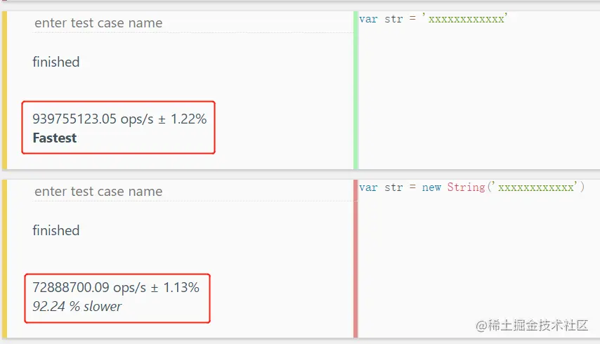
分析：基本类型字面量定义相比于构造式定义，执行时间有极大的提升。原因是 new String() 会开辟堆内存，将值与原型对象存储起来。字面量的方式 str1 也是 String 对象的一个实例，按照原型链也可以找到 scice 等方法
