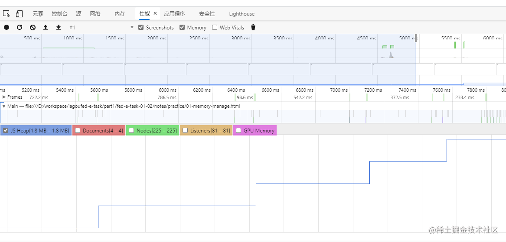
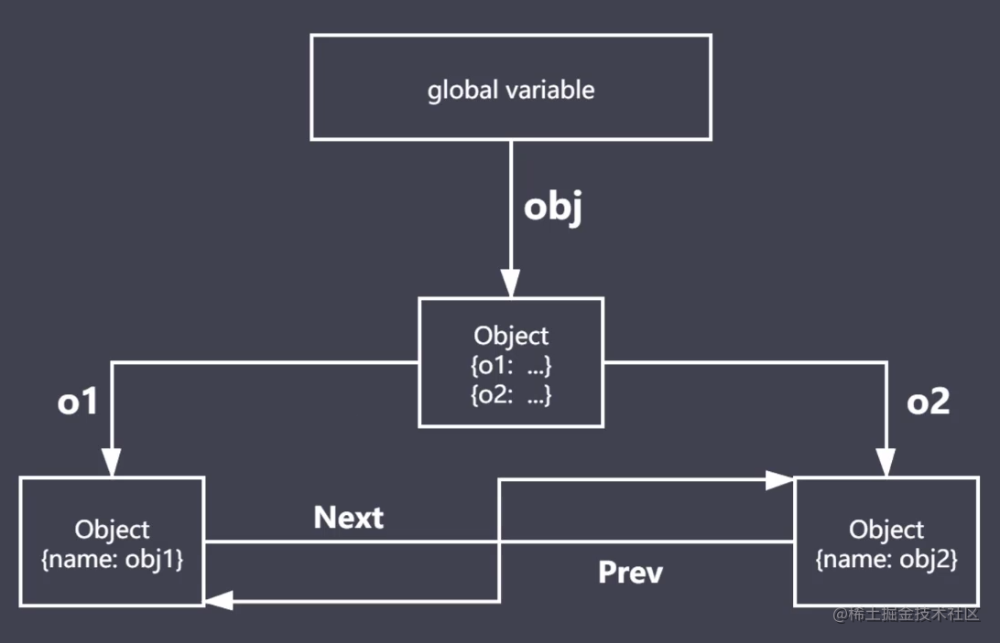
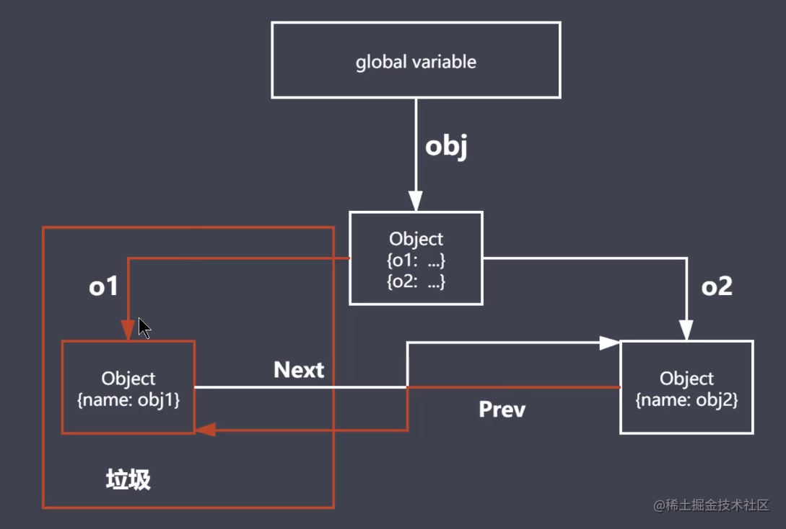
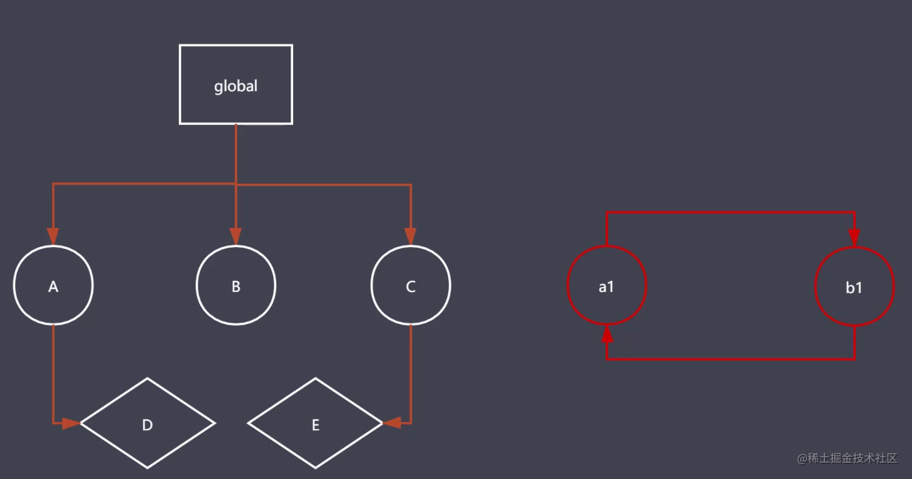
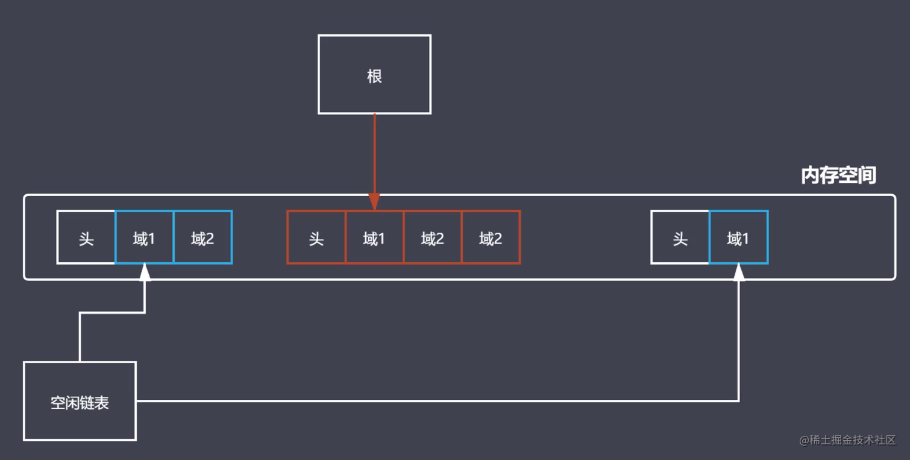
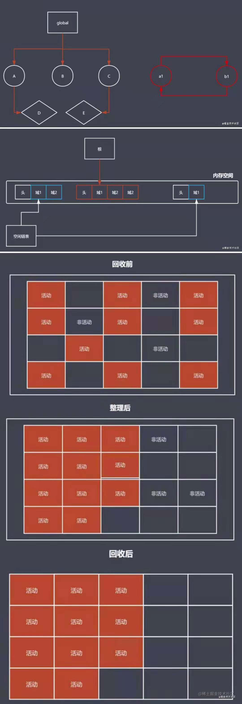
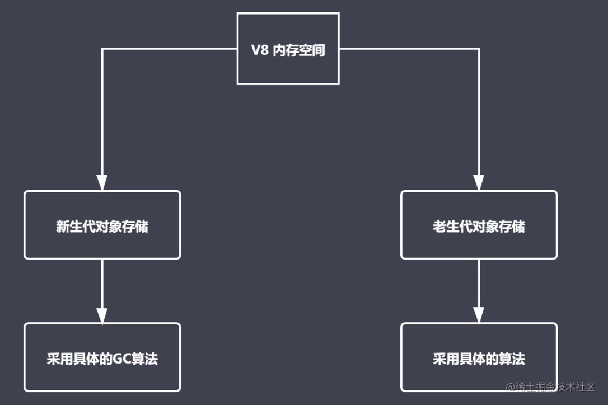
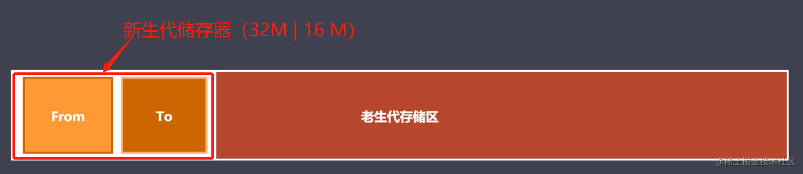
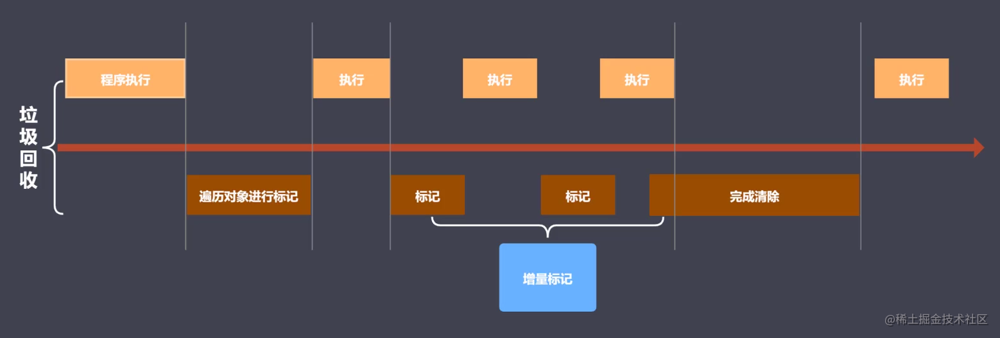

# JS 内存管理及回收

## JavaScript 内存管理

目前大部分的高级编程语言都由内存垃圾回收机制，但与 C++等语言不同的是 JS 中的垃圾回收是由 JS 引擎(一般指 V8 引擎)自动回收的。那么了解 JS 的内存管理有什么意义呢？下面通过一个例子来说明
当我们不了解内存的申请、使用、释放的流程时，有可能写出以下类似的代码：

```js
function fn() {
    arrList = [];
    arrList[1000000] = "It is too long";
}
document.getElementById("btn").addEventListener("click", fn);
```

每次点击都会导致内存急剧上升，如图：


明确了内存管理的意义，就需要了解内存管理的流程。内存管理可以拆分为两部分：

-   内存：由可读写的单元组成，表示一片可操作的空间
-   管理：这里指人为的去操作一片空间的申请、使用、释放
    下面通过一段代码演示内存申请->使用->释放的流程

```js
// 内存申请
let obj = {};
// 内存使用
obj.name = "Tom";
// 内存释放
obj = null;
```

## JavaScript 中的垃圾回收

`Javascript`中的内存管理是自动的，自然也会自动进行内存的垃圾回收。但首先应明确什么样的内存空间被`JavaScript`认为是垃圾？ **不可达对象就是垃圾。**  
那需要理解`Javascript`中的可达对象的依据：从全局变量对象出发,通过引用或作用域链能够找到的对象。  
下面通过一段代码加深对可达对象的理解：

```js
function objGroup(obj1, obj2) {
    obj1.next = obj2;
    obj2.prev = obj1;
    return {
        o1: obj1,
        o2: obj2,
    };
}
let obj = objGroup({ name: "obj1" }, { name: "obj2" });
console.log(obj);
// {
//     o1: { name: 'obj1', next: { name: 'obj2', prev: [Circular] } },
//     o2: { name: 'obj2', prev: { name: 'obj1', next: [Circular] } }
// }
```

图解以上代码的可达对象：



然后我们执行一下这个代码：

```js
obj.o1 = null;
console.log(obj);
// {
//     o1: null,
//     o2: { name: 'obj2', prev: { name: 'obj1', next: [Circular] } }
// }
```

再次图解以上代码的可达对象：


o1 对象就变成了不可达对象，成为了垃圾。等到 JS 引擎的垃圾回收工作时，它就会被回收。  
那么，它是如何被 JS 引擎回收的呢？那要接着谈它回收的算法了。

## GC 算法

`GC (garbage collection)`就是垃圾回收机制的简写。算法是工作时查找和回收所遵守的规则。常见的`GC`算法有：

-   引用计数：核心思想是利用引用计数器设置引用数，当引用关系改变时修改引用数字，当引用数字为`0`时立即回收。

```js
const user1 = { age: 11 };
const nameList = [user1.age];
function fn() {
    const num1 = 1;
    console.log(num1);
}
fn();
```

当`fn`函数执行完，`num1`的引用次数变为`0`,立即被回收。`user1`的引用次数为 1，不能被回收。  
优点：发现垃圾立即回收；最大限度减少程序的暂停。  
缺点：无法回收循环引用的对象；由于需要管理引用计数器，时间开销大。

-   标记清除核心思想是：
    - 第一步遍历所有的对象标记活动对象，
    - 第二步遍历所有对象清除没有标记的对象，回收相应的空间, 并清除阶段一的标记。
    
通过一个图解帮助理解：


左侧为可达对象的标记，右侧为函数内部的相互引用。第一步找到了活动对象（橙色线条），第二步清除没有标记的对象（红色线条），回收空间。  
优点：解决了循环引用的对象不可回收问题。  
缺点：空间回收后，造成空间碎片化，不利于内存的自由分配，不会立即回收垃圾对象。  
针对缺点，我们配一张图帮助理解：


当前图中红色区域空间存放着可达对象，当蓝色区域被回收后，留下头部元信息将内存空间分割多段。一旦这些碎片增多后，就不利于空间的自由分配了。

-   标记整理：标记整理是标记清除的增强，两者在操作阶段一致。只是清除阶段，标记整理会先执行整理，移动对象的位置，在进行清除。
    具体含义，我们配一张图帮助理解：
    
-   分代回收
    略，参见后续 v8 引擎

## V8 垃圾回收策略

#### 1、什么是 V8？

-   V8 是一款主流的 Javascript 执行引擎
-   V8 采用即时编译（由 JS 源码直接编译为机器码执行，其他引擎是源码-->字节码-->机器码再执行）
-   V8 内存设限制（64 位 OS 1.5G、32 位 OS 800M ）,考虑到最大内存空间对于网页应用足够以及垃圾回收效率。

#### 2、V8 垃圾回收策略

采用分代回收的思想。将内存分为新生代、老生代，针对不同的对象采用不同的 GC 算法。配图加深印象：

V8 中常见的 GC 算法：分代回收、空间复制、标记清除、标记整理、标记增量。

#### 3、V8 如何回收新生代对象？

新生代指的是存活时间较短的对象（如函数内的局部作用域变量，当函数执行完后，就成为垃圾了）。新生代、老生代对象的内存空间分配如下：


#### 4、新生代对象的回收实现

-   回收过程采用 标记整理 + 复制算法
-   新生代内存区分为两个等大的空间
-   使用空间为`From`, 空闲空间为`To`
-   当申请内存后的活动对象都储存在`From`空间，当达到一定量后触发`GC`回收
-   经过标记整理后，将活动对象拷贝到`To`空间，然后将`From`空间内存释放
-   将`From`和`To`交换空间，再次执行第`4`条，依次循环  
    注意：在对象的拷贝过程中可能会出现对象的晋升，即一轮`GC`还存活的新生代需要晋升到老年代，此外当`To`空间使用率超过`25%`时，本次拷贝的活动对象都会被移动到老年代。

#### 5、V8 如何回收老生代对象？

老生代对象就是指存活时间较长的对象，存放在右侧老生代区域，一般空间大小，64 位`OS`是`1.4G`, 32 位`OS`是`700M`。

-   主要采用标记清除、标记整理、增量标记算法回收。
-   首先标记清除完成垃圾空间的回收
-   采用标记整理进行空间优化
-   采用增量标记进行效率优化
    对比新生代对象和老年代对象的回收：
-   新生代区域垃圾回收使用空间换时间，由于空间小，活动对象状态变换频繁。
-   老生代区域垃圾回收不适合复制算法
    增量标记如何进行垃圾回收优化的？
    
    程序执行和垃圾回收交替执行，让用户无感知，体验更好。当 V8 内存达到最大时，采用非增量标记回收的时间小于 1S。
