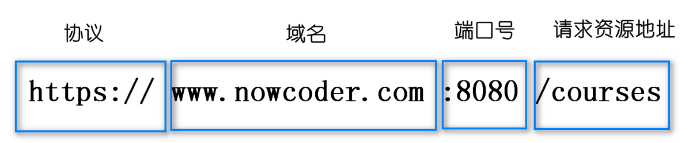
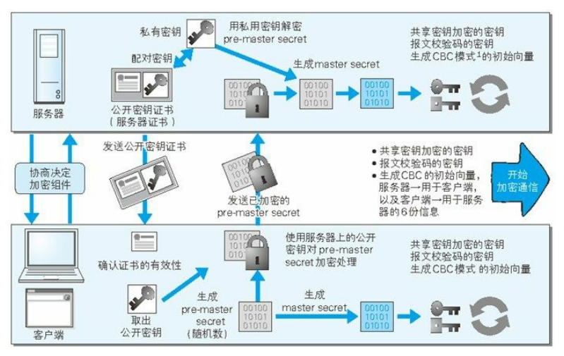
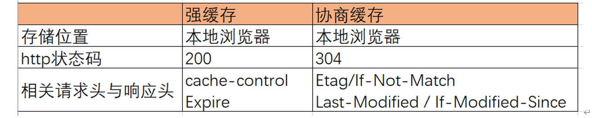
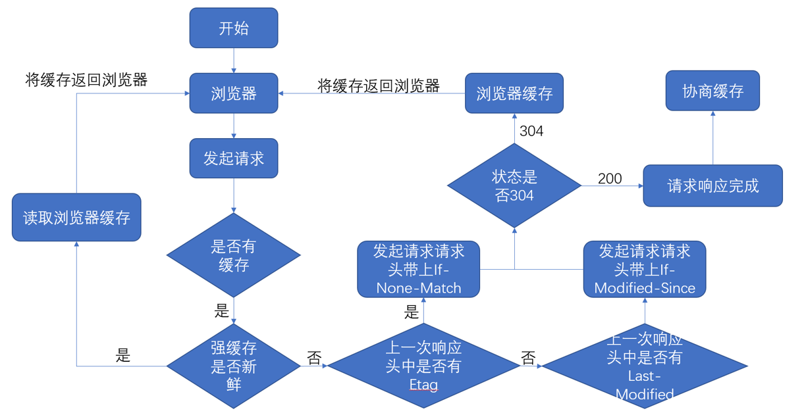

# 网络传输

参考：  
https://www.nowcoder.com/issue/tutorial?tutorialId=96&uuid=6b04165463a84068a931f70c14cdf0c4

## 跨域是什么？如何解决跨域？

什么是同源策略及其限制内容？  
同源策略是一种约定，它是浏览器最核心也最基本的安全功能，如果缺少了同源策略，浏览器很容易受到 XSS、CSRF 等攻击。所谓同源是指"协议+域名+端口"三者相同，即便两个不同的域名指向同一个 ip 地址，也非同源。  


同源策略限制内容有：

-   Cookie、LocalStorage、IndexedDB 等存储性内容
-   DOM 节点
-   AJAX 请求发送后，结果被浏览器拦截了

但是有三个标签是允许跨域加载资源：

```html

<link href='xxx'>
<script src='xxx'>
```

跨域并不是请求发不出去，请求能发出去，服务端能收到请求并正常返回结果，只是结果被浏览器拦截了。

跨域解决方案:

-   jsonp、
-   cors、
-   postMessage、
-   websocket、
-   Node 中间件代理(两次跨域)、
-   nginx 反向代理、
-   window.name + iframe、
-   location.hash + iframe、
-   document.domain + iframe

**CORS 支持所有类型的 HTTP 请求，是跨域 HTTP 请求的根本解决方案**，JSONP 只支持 GET 请求，JSONP 的优势在于支持老式浏览器，以及可以向不支持 CORS 的网站请求数据。不管是 Node 中间件代理还是 nginx 反向代理，主要是通过同源策略对服务器不加限制。日常工作中，用得比较多的跨域方案是**cors 和 nginx 反向代理**

#### 1. jsonp

-   JSONP 原理
    -   利用`<script>`标签没有跨域限制的漏洞，网页可以得到从其他来源动态产生的 JSON 数据。JSONP 请求一定 需要对方的服务器做支持才可以
-   JSONP 优缺点
    -   优点是简单兼容性好，可用于解决主流浏览器的跨域数据访问的问题。缺点是仅支持 get 方法具有局限性, 不安全可能会遭受 XSS 攻击
-   JSONP 的实现流程
    -   声明一个回调函数，其函数名(如 show)当做参数值，要传递给跨域请求数据的服务器，函数形参为要获取目 标数据(服务器返回的 data)。
        创建一个``标签，把那个跨域的 API 数据接口地址，赋值给 script 的 src,还要在这个地址中向服务器传递该函数 名（可以通过问号传参:?callback=show）。
        服务器接收到请求后，需要进行特殊的处理：把传递进来的函数名和它需要给你的数据拼接成一个字符串,例 如：传递进去的函数名是 show，它准备好的数据是 show('我不爱你')。
        最后服务器把准备的数据通过 HTTP 协议返回给客户端，客户端再调用执行之前声明的回调函数（show），对 返回的数据进行操作。

#### 2. cors

CORS 需要浏览器和后端同时支持。IE 8 和 9 需要通过 XDomainRequest 来实现。  
浏览器会自动进行 CORS 通信，实现 CORS 通信的关键是后端。只要后端实现了 CORS，就实现了跨域。  
服务端设置 Access-Control-Allow-Origin 就可以开启 CORS。 该属性表示哪些域名可以访问资源，如果设置通配符则表示所有网站都可以访问资源。

#### 3. postMessage

postMessage 是 HTML5 XMLHttpRequest Level 2 中的 API，且是为数不多可以跨域操作的 window 属性之一，它可用于解决以下方面的问题：

-   页面和其打开的新窗口的数据传递
-   多窗口之间消息传递
-   页面与嵌套的 iframe 消息传递
-   上面三个场景的跨域数据传递

**postMessage()方法允许来自不同源的脚本采用异步方式进行有限的通信，可以实现跨文本档、多窗口、跨域消息传递。**

#### 4. websocket

Websocket 是 HTML5 的一个持久化的协议，它实现了浏览器与服务器的全双工通信，同时也是跨域的一种解决方案。WebSocket 和 HTTP 都是应用层协议，都基于 TCP 协议。但是 WebSocket 是一种双向通信协议，在建立连接之后，WebSocket 的 server 与 client 都能主动向对方发送或接收数据。同时，WebSocket 在建立连接时需要借助 HTTP 协议，连接建立好了之后 client 与 server 之间的双向通信就与 HTTP 无关了。

原生 WebSocket API 使用起来不太方便，我们使用 Socket.io，它很好地封装了 webSocket 接口，提供了更简单、灵活的接口，也对不支持 webSocket 的浏览器提供了向下兼容

#### 5. Node 中间件代理(两次跨域)

实现原理：同源策略是浏览器需要遵循的标准，而如果是服务器向服务器请求就无需遵循同源策略。 代理服务器，需要做以下几个步骤：

-   接受客户端请求 。
-   将请求 转发给服务器。
-   拿到服务器 响应 数据。
-   将 响应 转发给客户端

#### 6. nginx 反向代理

实现原理类似于 Node 中间件代理，需要你搭建一个中转 nginx 服务器，用于转发请求。  
使用 nginx 反向代理实现跨域，是最简单的跨域方式。只需要修改 nginx 的配置即可解决跨域问题，支持所有浏览器，支持 session，不需要修改任何代码，并且不会影响服务器性能。  
实现思路：通过 nginx 配置一个代理服务器（域名与 domain1 相同，端口不同）做跳板机，反向代理访问 domain2 接口，并且可以顺便修改 cookie 中 domain 信息，方便当前域 cookie 写入，实现跨域登录。

#### 7. window.name + iframe

window.name 属性的独特之处：name 值在不同的页面（甚至不同域名）加载后依旧存在，并且可以支持非常长的 name 值（2MB）。  
总结：通过 iframe 的 src 属性由外域转向本地域，跨域数据即由 iframe 的 window.name 从外域传递到本地域。这个就巧妙地绕过了浏览器的跨域访问限制，但同时它又是安全操作。

#### 8. location.hash + iframe

实现原理： a.html 欲与 c.html 跨域相互通信，通过中间页 b.html 来实现。 三个页面，不同域之间利用 iframe 的 location.hash 传值，相同域之间直接 js 访问来通信。  
具体实现步骤：一开始 a.html 给 c.html 传一个 hash 值，然后 c.html 收到 hash 值后，再把 hash 值传递给 b.html，最后 b.html 将结果放到 a.html 的 hash 值中。 同样的，a.html 和 b.html 是同域的，都是 `http://localhost:3000`;而 c.html 是 `http://localhost:4000`

#### 9. document.domain + iframe

该方式只能用于二级域名相同的情况下，比如 a.test.com 和 b.test.com 适用于该方式。 只需要给页面添加 document.domain ='test.com'表示二级域名都相同就可以实现跨域。  
实现原理：两个页面都通过 js 强制设置 document.domain 为基础主域，就实现了同域。

## jsonp 原理

利用`<script>`标签没有跨域限制的漏洞，网页可以得到从其他来源动态产生的 JSON 数据。JSONP 请求一定 需要对方的服务器做支持才可以。

1. JSONP 和 AJAX 对比

JSONP 和 AJAX 相同，都是客户端向服务器端发送请求，从服务器端获取数据的方式。但 AJAX 属于同源策略，JSONP 属于非同源策略（跨域请求）

2. JSONP 优缺点

JSONP 优点是简单兼容性好，可用于解决主流浏览器的跨域数据访问的问题。缺点是仅支持 get 方法具有局限性,不安全可能会遭受 XSS 攻击。

3. JSONP 的实现流程

声明一个回调函数，其函数名(如 show)当做参数值，要传递给跨域请求数据的服务器，函数形参为要获取目标数据(服务器返回的 data)。
创建一个``标签，把那个跨域的 API 数据接口地址，赋值给 script 的 src,还要在这个地址中向服务器传递该函数名（可以通过问号传参:?callback=show）。
服务器接收到请求后，需要进行特殊的处理：把传递进来的函数名和它需要给你的数据拼接成一个字符串,例如：传递进去的函数名是 show，它准备好的数据是 show('我不爱你')。
最后服务器把准备的数据通过 HTTP 协议返回给客户端，客户端再调用执行之前声明的回调函数（show），对返回的数据进行操作。

在开发中可能会遇到多个 JSONP 请求的回调函数名是相同的，这时候就需要自己封装一个 JSONP 函数。

```js
// index.html
function jsonp({ url, params, callback }) {
    return new Promise((resolve, reject) => {
        let script = document.createElement('script');
        window[callback] = function (data) {
            resolve(data);
            document.body.removeChild(script);
        };
        params = { ...params, callback }; // wd=b&callback=show
        let arrs = [];
        for (let key in params) {
            arrs.push(`${key}=${params[key]}`);
        }
        script.src = `${url}?${arrs.join('&')}`;
        document.body.appendChild(script);
    });
}
jsonp({
    url: 'http://localhost:3000/say',
    params: { wd: 'Iloveyou' },
    callback: 'show',
}).then((data) => {
    console.log(data);
});
```

上面这段代码相当于向 `http://localhost:3000/say?wd=Iloveyou&callback=show` 这个地址请求数据，然后后台返回 show('我不爱你')，最后会运行 show()这个函数，打印出'我不爱你'

```js
// server.js
let express = require('express');
let app = express();
app.get('/say', function (req, res) {
    let { wd, callback } = req.query;
    console.log(wd); // Iloveyou
    console.log(callback); // show
    res.end(`${callback}('我不爱你')`);
});
app.listen(3000);
```

jQuery 的 jsonp 形式:  
JSONP 都是 GET 和异步请求的，不存在其他的请求方式和同步请求，且 jQuery 默认就会给 JSONP 的请求清除缓存。

```js
$.ajax({
    url: 'http://crossdomain.com/jsonServerResponse',
    dataType: 'jsonp',
    type: 'get', //可以省略
    jsonpCallback: 'show', //->自定义传递给服务器的函数名，而不是使用jQuery自动生成的，可省略
    jsonp: 'callback', //->把传递函数名的那个形参callback，可省略
    success: function (data) {
        console.log(data);
    },
});
```

## websocket 的原理

Websocket 是 HTML5 的一个持久化的协议，它实现了浏览器与服务器的全双工通信，同时也是跨域的一种解决方案。WebSocket 和 HTTP 都是应用层协议，都基于 TCP 协议。但是 WebSocket 是一种双向通信协议，在建立连接之后，WebSocket 的 server 与 client 都能主动向对方发送或接收数据。同时，WebSocket 在建立连接时需要借助 HTTP 协议，连接建立好了之后 client 与 server 之间的双向通信就与 HTTP 无关了。

原生 WebSocket API 使用起来不太方便，我们使用 Socket.io，它很好地封装了 webSocket 接口，提供了更简单、灵活的接口，也对不支持 webSocket 的浏览器提供了向下兼容。

我们先来看个例子：本地文件 socket.html 向 `localhost:3000` 发生数据和接受数据

```html
// socket.html
<script>
    let socket = new WebSocket('ws://localhost:3000');
    socket.onopen = function () {
        socket.send('我爱你'); //向服务器发送数据
    };
    socket.onmessage = function (e) {
        console.log(e.data); //接收服务器返回的数据
    };
</script>
```

```js
// server.js
let express = require('express');
let app = express();
let WebSocket = require('ws'); //记得安装ws
let wss = new WebSocket.Server({ port: 3000 });
wss.on('connection', function (ws) {
    ws.on('message', function (data) {
        console.log(data);
        ws.send('我不爱你');
    });
});
```

## 保持前后端实时通信?

实现保持前后端实时通信的方式有以下几种

-   WebSocket： IE10 以上才支持，Chrome16, FireFox11,Safari7 以及 Opera12 以上完全支持，移动端形势大
-   event-source: IE 完全不支持（注意是任何版本都不支持），Edge76，Chrome6,Firefox6,Safari5 和 Opera 以上支持， 移动端形势大好
-   AJAX 轮询： 用于兼容低版本的浏览器
-   永久帧（ forever iframe）可用于兼容低版本的浏览器
-   flash socket 可用于兼容低版本的浏览器

这几种方式的优缺点

1. WebSocket  
   优点：  
    WebSocket 是 HTML5 开始提供的一种在单个 TCP 连接上进行全双工通讯的协议，可从 HTTP 升级而来，浏览器和服务器只需要一次握手，就可以进行持续的，双向的数据传输，因此能显著节约资源和带宽  
   缺点：  
    （1）兼容性问题:不支持较低版本的 IE 浏览器（IE9 及以下）  
    （2）不支持断线重连，需要手写心跳连接的逻辑  
    （3）通信机制相对复杂
2. server-sent-event（event-source）  
   优点：  
    （1）只需一次请求，便可以 stream 的方式多次传送数据，节约资源和带宽  
    （2）相对 WebSocket 来说简单易用  
    （3）内置断线重连功能(retry)  
   缺点：  
    （1）是单向的，只支持服务端->客户端的数据传送，客户端到服务端的通信仍然依靠 AJAX，没有”一家人整整齐齐“的感觉  
    （2）兼容性令人担忧，IE 浏览器完全不支持
3. AJAX 轮询  
   优点：兼容性良好，对标低版本 IE  
   缺点：请求中有大半是无用的请求，浪费资源
4. Flash Socket  
   优点： 兼容低版本浏览器  
   缺点：  
    （1）浏览器开启时 flash 需要用户确认，  
    （2）加载时间长，用户体验较差  
    （3）大多数移动端浏览器不支持 flash，为重灾区
5. 永久帧（ forever iframe）  
   优点：兼容低版本 IE 浏览器  
   缺点： iframe 会产生进度条一直存在的问题，用户体验差

综上，综合兼容性和用户体验的问题，我在项目中选用了 WebSocket ->server-sent-event -> AJAX 轮询这三种方式做从上到下的兼容

## 常见 http status

1XX 系列：指定客户端应相应的某些动作，代表请求已被接受，需要继续处理。由于 HTTP/1.0 协议中没有定义任何 1xx 状态码，所以除非在某些试验条件下，服务器禁止向此类客户端发送 1xx 响应。

2XX 系列：代表请求已成功被服务器接收、理解、并接受。这系列中最常见的有 200、201 状态码。

3XX 系列：代表需要客户端采取进一步的操作才能完成请求，这些状态码用来重定向，后续的请求地址（重定向目标）在本次响应的 Location 域中指明。这系列中最常见的有 301、302 状态码。

4XX 系列：表示请求错误。代表了客户端看起来可能发生了错误，妨碍了服务器的处理。常见有：401、404 状态码。

5xx 系列：代表了服务器在处理请求的过程中有错误或者异常状态发生，也有可能是服务器意识到以当前的软硬件资源无法完成对请求的处理。常见有 500、503 状态码。

**2 开头 （请求成功）表示成功处理了请求的状态代码。**

-   200 （成功） 服务器已成功处理了请求。 通常，这表示服务器提供了请求的网页。
-   201 （已创建） 请求成功并且服务器创建了新的资源。
-   202 （已接受） 服务器已接受请求，但尚未处理。
-   203 （非授权信息） 服务器已成功处理了请求，但返回的信息可能来自另一来源。
-   204 （无内容） 服务器成功处理了请求，但没有返回任何内容。
-   205 （重置内容） 服务器成功处理了请求，但没有返回任何内容。
-   206 （部分内容） 服务器成功处理了部分 GET 请求。

**3 开头 （请求被重定向）表示要完成请求，需要进一步操作。 通常，这些状态代码用来重定向。**

-   300 （多种选择） 针对请求，服务器可执行多种操作。 服务器可根据请求者 (user agent) 选择一项操作，或提供操作列表供请求者选择。
-   301 （永久移动） 请求的网页已永久移动到新位置。 服务器返回此响应（对 GET 或 HEAD 请求的响应）时，会自动将请求者转到新位置。
-   302 （临时移动） 服务器目前从不同位置的网页响应请求，但请求者应继续使用原有位置来进行以后的请求。
-   303 （查看其他位置） 请求者应当对不同的位置使用单独的 GET 请求来检索响应时，服务器返回此代码。
-   304 （未修改） 自从上次请求后，请求的网页未修改过。 服务器返回此响应时，不会返回网页内容。
-   305 （使用代理） 请求者只能使用代理访问请求的网页。 如果服务器返回此响应，还表示请求者应使用代理。
-   307 （临时重定向） 服务器目前从不同位置的网页响应请求，但请求者应继续使用原有位置来进行以后的请求。

**4 开头 （请求错误）这些状态代码表示请求可能出错，妨碍了服务器的处理。**

-   400 （错误请求） 服务器不理解请求的语法。
-   401 （未授权） 请求要求身份验证。 对于需要登录的网页，服务器可能返回此响应。
-   403 （禁止） 服务器拒绝请求。
-   404 （未找到） 服务器找不到请求的网页。
-   405 （方法禁用） 禁用请求中指定的方法。
-   406 （不接受） 无法使用请求的内容特性响应请求的网页。
-   407 （需要代理授权） 此状态代码与 401（未授权）类似，但指定请求者应当授权使用代理。
-   408 （请求超时） 服务器等候请求时发生超时。
-   409 （冲突） 服务器在完成请求时发生冲突。 服务器必须在响应中包含有关冲突的信息。
-   410 （已删除） 如果请求的资源已永久删除，服务器就会返回此响应。
-   411 （需要有效长度） 服务器不接受不含有效内容长度标头字段的请求。
-   412 （未满足前提条件） 服务器未满足请求者在请求中设置的其中一个前提条件。
-   413 （请求实体过大） 服务器无法处理请求，因为请求实体过大，超出服务器的处理能力。
-   414 （请求的 URI 过长） 请求的 URI（通常为网址）过长，服务器无法处理。
-   415 （不支持的媒体类型） 请求的格式不受请求页面的支持。
-   416 （请求范围不符合要求） 如果页面无法提供请求的范围，则服务器会返回此状态代码。
-   417 （未满足期望值） 服务器未满足"期望"请求标头字段的要求。

**5 开头（服务器错误）这些状态代码表示服务器在尝试处理请求时发生内部错误。 这些错误可能是服务器本身的错误，而不是请求出错。**

-   500 （服务器内部错误） 服务器遇到错误，无法完成请求。
-   501 （尚未实施） 服务器不具备完成请求的功能。 例如，服务器无法识别请求方法时可能会返回此代码。
-   502 （错误网关） 服务器作为网关或代理，从上游服务器收到无效响应。
-   503 （服务不可用） 服务器目前无法使用（由于超载或停机维护）。 通常，这只是暂时状态。
-   504 （网关超时） 服务器作为网关或代理，但是没有及时从上游服务器收到请求。
-   505 （HTTP 版本不受支持） 服务器不支持请求中所用的 HTTP 协议版本。

## http 和 https

1. HTTP 和 HTTPS 的基本概念

HTTP：是互联网上应用最为广泛的一种网络协议，是一个客户端和服务器端请求和应答的标准（TCP），用于从 WWW 服务器传输超文本到本地浏览器的传输协议，它可以使浏览器更加高效，使网络传输减少。  
HTTPS：是以安全为目标的 HTTP 通道，简单讲是 HTTP 的安全版，即 HTTP 下加入 TLS 层，HTTPS 的安全基础是 TLS，因此加密的详细内容就需要 TLS。  
HTTPS 协议的主要作用可以分为两种：一种是建立一个信息安全通道，来保证数据传输的安全；另一种就是确认网站的真实性。

2. HTTP 与 HTTPS 有什么区别？

HTTP 协议传输的数据都是未加密的，也就是明文的，因此使用 HTTP 协议传输隐私信息非常不安全，为了保证 这些隐私数据能加密传输，于是网景公司设计了 TLS（Secure Sockets Layer）协议用于对 HTTP 协议传输的数据进行加密，从而就诞生了 HTTPS。简单来说，HTTPS 协议是由 TLS+HTTP 协议构建的可进行加密传输、身份认证的网络协议，要比 http 协议安全。

HTTPS 和 HTTP 的区别主要如下：

-   1、https 协议需要到 ca 申请证书，一般免费证书较少，因而需要一定费用。
-   2、http 是超文本传输协议，信息是明文传输，https 则是具有安全性的 tls 加密传输协议。
-   3、http 和 https 使用的是完全不同的连接方式，用的端口也不一样，前者是 80，后者是 443。
-   4、http 的连接很简单，是无状态的；HTTPS 协议是由 TLS+HTTP 协议构建的可进行加密传输、身份认证的网络协议，比 http 协议安全。

## http1.x 和 http2.x 区别

http1.x 和 http2.x 主要有以下 4 个区别：

1. HTTP2 使用的是二进制传送，HTTP1.X 是文本（字符串）传送。

二进制传送的单位是帧和流。帧组成了流，同时流还有流 ID 标示

2. HTTP2 支持多路复用

因为有流 ID，所以通过同一个 http 请求实现多个 http 请求传输变成了可能，可以通过流 ID 来标示究竟是哪个流从而定位到是哪个 http 请求

3. HTTP2 头部压缩

HTTP2 通过 gzip 和 compress 压缩头部然后再发送，同时客户端和服务器端同时维护一张头信息表，所有字段都记录在这张表中，这样后面每次传输只需要传输表里面的索引 Id 就行，通过索引 ID 查询表头的值

4. HTTP2 支持服务器推送

HTTP2 支持在未经客户端许可的情况下，主动向客户端推送内容

## http 请求方式

http 请求方式有以下 8 种，其中 get 和 post 是最常用的：

1、OPTIONS

返回服务器针对特定资源所支持的 HTTP 请求方法，也可以利用向 web 服务器发送‘\*’的请求来测试服务器的功能性

2、HEAD

向服务器索与 GET 请求相一致的响应，只不过响应体将不会被返回。这一方法可以再不必传输整个响应内容的情况下，就可以获取包含在响应小消息头中的元信息。

3、GET

向特定的资源发出请求。注意：GET 方法不应当被用于产生“副作用”的操作中，例如在 Web Application 中，其中一个原因是 GET 可能会被网络蜘蛛等随意访问。Loadrunner 中对应 get 请求函数：web_link 和 web_url

4、POST

向指定资源提交数据进行处理请求（例如提交表单或者上传文件）。数据被包含在请求体中。POST 请求可能会导致新的资源的建立和/或已有资源的修改。 Loadrunner 中对应 POST 请求函数：web_submit_data,web_submit_form

5、PUT

向指定资源位置上传其最新内容

6、DELETE

请求服务器删除 Request-URL 所标识的资源

7、TRACE

回显服务器收到的请求，主要用于测试或诊断

8、CONNECT

HTTP/1.1 协议中预留给能够将连接改为管道方式的代理服务器。

## HTTPS 如何保证安全

HTTPS（全称：Hypertext Transfer Protocol over Secure Socket Layer），是以安全为目标的 HTTP 通道，简单讲是 HTTP 的安全版。HTTPS = HTTP + SSL/TLS，如今 SSL 已废弃，所以现在只关注 HTTP + TLS。为了解决 HTTP 协议的问题，HTTPS 引入了数据加密和身份验证机制。在开始传输数据之前，通过安全可靠的 TLS 协议进行加密，从而保证后续加密传输数据的安全性。

TLS 协议：传输层安全性协议（Transport Layer Security，TLS）及其前身安全套接层（Secure Sockets Layer，SSL）是一种安全协议，目的是为了保证网络通信安全和数据完整性。

受 TLS 协议保护的通信过程：先对传输的数据进行了加密（使用对称加密算法）。并且对称加密的密钥是为每一个连接唯一生成的（基于 TLS 握手阶段协商的加密算法和共享密钥），然后发送的每条消息都会通过消息验证码（Message authentication code, MAC），来进行消息完整性检查，最后还可以使用公钥对通信双方进行身份验证

Https 的作用

-   内容加密 建立一个信息安全通道，来保证数据传输的安全；
-   身份认证 确认网站的真实性
-   数据完整性 防止内容被第三方冒充或者篡改

## 非对称加密和对称加密，具体怎么实现的

对称加密：在对称加密算法中，加密使用的密钥和解密使用的密钥是相同的。也就是说，加密和解密都是使用的同一个密钥。  
非对称加密：指加密和解密使用不同密钥的加密算法。非对称加密算法需要两个密钥：公钥（publickey）私钥（privatekey）。  
公钥与私钥是一对存在，如果用公钥对数据进行加密，只有用对应的私钥才能解密；如果用密钥对数据进行加密，那么只有用对应的公钥才能解密。因为加密和解密使用的是两个不同的密钥，所以这种算法叫作非对称加密算法。

1. 对称加密算法的缺点
   :::tip
   1、要求提供一条安全的渠道使通讯双方在首次通讯时协商一个共同的密钥。直接的面对面协商可能是不现实而且难于实施的，所以双方可能需要借助于邮件和电话等其它相对不够安全的手段来进行协商；
   2、密钥的数目难于管理。因为对于每一个合作者都需要使用不同的密钥，很难适应开放社会中大量的信息交流；
   3、对称加密算法一般不能提供信息完整性的鉴别。它无法验证发送者和接受者的身份；
   4、对称密钥的管理和分发工作是一件具有潜在危险的和烦琐的过程。对称加密是基于共同保守秘密来实现的，采用对称加密技术的贸易双方必须保证采用的是相同的密钥，保证彼此密钥的交换是安全可靠的，同时还要设定防止密钥泄密和更改密钥的程序。
   :::

2. 两种加密体制的特点
   非对称密码体制的特点：算法强度复杂、安全性依赖于算法与密钥但是由于其算法复杂，而使得加密解密速度没有对称加密解密的速度快。

对称密码体制中只有一种密钥，并且是非公开的，如果要解密就得让对方知道密钥，所以保证其安全性就是保证密钥的安全。而非对称密钥体制有两种密钥，其中一个是公开的，这样就可以不需要像对称密码那样传输对方的密钥了。这样安全性就大了很多。

假设两个用户要加密交换数据，双方交换公钥，使用时一方用对方的公钥加密，另一方即可用自己的私钥解密。

如果企业中有 n 个用户，企业需要生成 n 对密钥，并分发 n 个公钥。由于公钥是可以公开的，用户只要保管好自己的私钥即可，因此加密密钥的分发将变得 十分简单。同时，由于每个用户的私钥是唯一的，其他用户除了可以通过"信息发送者的公钥"来验证信息的来源是否真实，还可以确保发送者无法否认曾发送过该信息。非对称加密的缺点是加解密速度要远远慢于对称加密，在某些极端情况下，甚至能比对称加密慢上 1000 倍。
:::tip
非对称的好处显而易见，非对称加密体系不要求通信双方事先传递密钥或有任何约定就能完成保密通信，并且密钥管理方便，可实现防止假冒和抵赖，因此，更适合网络通信中的保密通信要求。
:::

## HTTPS 通信的整个过程



在以上流程中，应用层发送数据时会附加一种叫做 MAC（Message Authentication Code）的报文摘要。MAC 能够查知报文是否遭到篡改，从而保护报文的完整性。

## 讲解一下 option 请求方式

除了 post 和 get 还有 6 种请求方式分别是：OPTIONS、HEAD、PUT、DELETE、TRACE、CONNECT

HTTP 的 OPTIONS 方法 用于获取目的资源所支持的通信选项。客户端可以对特定的 URL 使用 OPTIONS 方法，也可以对整站（通过将 URL 设置为“\*”）使用该方法

作用：

-   检测服务器所支持的请求方法

可以使用 OPTIONS 方法对服务器发起请求，以检测服务器支持哪些 HTTP 方法：

```
curl -X OPTIONS http://example.org -i
```

-   CORS 中的预检请求

在 CORS 中，可以使用 OPTIONS 方法发起一个预检请求，以检测实际请求是否可以被服务器所接受。预检请求报文中的 Access-Control-Request-Method 首部字段告知服务器实际请求所使用的 HTTP 方法；Access-Control-Request-Headers 首部字段告知服务器实际请求所携带的自定义首部字段。服务器基于从预检请求获得的信息来判断，是否接受接下来的实际请求。

## tcp 三次握手，为什么需要三次

两个目的：

-   确保建立可靠连接
-   避免资源浪费

三次握手的目的是“为了防止已经失效的连接请求报文段突然又传到服务端，因而产生错误”，这种情况是：一端(client)A 发出去的第一个连接请求报文并没有丢失，而是因为某些未知的原因在某个网络节点上发生滞留，导致延迟到连接释放以后的某个时间才到达另一端(server)B。本来这是一个早已失效的报文段，但是 B 收到此失效的报文之后，会误认为是 A 再次发出的一个新的连接请求，于是 B 端就向 A 又发出确认报文，表示同意建立连接。如果不采用“三次握手”，那么只要 B 端发出确认报文就会认为新的连接已经建立了，但是 A 端并没有发出建立连接的请求，因此不会去向 B 端发送数据，B 端没有收到数据就会一直等待，这样 B 端就会白白浪费掉很多资源。如果采用“三次握手”的话就不会出现这种情况，B 端收到一个过时失效的报文段之后，向 A 端发出确认，此时 A 并没有要求建立连接，所以就不会向 B 端发送确认，这个时候 B 端也能够知道连接没有建立

## https 加密解密流程

分成以下 8 个步骤：

-   客户端发起 HTTPS 请求 这个没什么好说的，就是用户在浏览器里输入一个 HTTPS 网址，然后连接到服务端的 443 端口。

-   服务端的配置 采用 HTTPS 协议的服务器必须要有一套数字证书，可以自己制作，也可以向组织申请。区别就是自己颁发的证书需要客户端验证通过，才可以继续访问，而使用受信任的公司申请的证书则不会弹出提示页面。这套证书其实就是一对公钥和私钥。如果对公钥不太理解，可以想象成一把钥匙和一个锁头，只是世界上只有你一个人有这把钥匙，你可以把锁头给别人，别人可以用这个锁把重要的东西锁起来，然后发给你，因为只有你一个人有这把钥匙，所以只有你才能看到被这把锁锁起来的东西。

-   传送证书 这个证书其实就是公钥，只是包含了很多信息，如证书的颁发机构，过期时间等等。

-   客户端解析证书 这部分工作是由客户端的 SSL/TLS 来完成的，首先会验证公钥是否有效，比如颁发机构，过期时间等等，如果发现异常，则会弹出一个警示框，提示证书存在的问题。如果证书没有问题，那么就生成一个随机值。然后用证书（也就是公钥）对这个随机值进行加密。就好像上面说的，把随机值用锁头锁起来，这样除非有钥匙，不然看不到被锁住的内容。

-   传送加密信息 这部分传送的是用证书加密后的随机值，目的是让服务端得到这个随机值，以后客户端和服务端的通信就可以通过这个随机值来进行加密解密了。

-   服务端解密信息 服务端用私钥解密后，得到了客户端传过来的随机值，然后把内容通过该随机值进行对称加密，将信息和私钥通过某种算法混合在一起，这样除非知道私钥，不然无法获取内容，而正好客户端和服务端都知道这个私钥，所以只要加密算法够彪悍，私钥够复杂，数据就够安全。

-   传输加密后的信息 这部分信息就是服务端用私钥加密后的信息，可以在客户端用随机值解密还原。

-   客户端解密信息 客户端用之前生产的私钥解密服务端传过来的信息，于是获取了解密后的内容。整个过程第三方即使监听到了数据，也束手无策。

## TCP vs UDP

TCP(传输控制协议)和 UDP（用户数据报协议）

TCP 是一种面向连接的、可靠的、基于字节流的传输层通信协议，是专门为了在不可靠的网络中提供一个可靠的端对端字节流而设计的，面向字节流。
UDP（用户数据报协议）是 iso 参考模型中一种无连接的传输层协议，提供简单不可靠的非连接传输层服务，面向报文

区别：

-   TCP 是面向连接的，可靠性高；UDP 是基于非连接的，可靠性低
-   由于 TCP 是连接的通信，需要有三次握手、重新确认等连接过程，会有延时，实时性差，同时过程复杂，也使其易于攻击；UDP 没有建立连接的过程，因而实时性较强，也稍安全
-   在传输相同大小的数据时，TCP 首部开销 20 字节；UDP 首部开销 8 字节，TCP 报头比 UDP 复杂，故实际包含的用户数据较少。TCP 在 IP 协议的基础上添加了序号机制、确认机制、超时重传机制等，保证了传输的可靠性，不会出现丢包或乱序，而 UDP 有丢包，故 TCP 开销大，UDP 开销较小
-   每条 TCP 连接只能时点到点的；UDP 支持一对一、一对多、多对一、多对多的交互通信

应用场景选择

-   对实时性要求高和高速传输的场合下使用 UDP;在可靠性要求低，追求效率的情况下使用 UDP;
-   需要传输大量数据且对可靠性要求高的情况下使用 TCP

## 301 和 302 的含义

参考答案：

301 和 302 都是重定向的状态码，重定向（Redirect）是指通过各种方法将客户端的网络请求重新定义或指定一个新方向转到其他位置（重定向包括网页重定向、域名重定向）。

-   301 redirect: 301 代表永久性转移(Permanently Moved)
-   302 redirect: 302 代表暂时性转移(Temporarily Moved )

相同点：都表示重定向，就是说浏览器在拿到服务器返回的这个状态码后会自动跳转到一个新的 URL 地址，这个地址可以从响应的 Location 首部中获取（用户看到的效果就是他输入的地址 A 瞬间变成了另一个地址 B）

不同点：

-   301 表示旧地址 A 的资源已经被永久地移除了（这个资源不可访问了），搜索引擎在抓取新内容的同时也将旧的网址交换为重定向之后的网址；
-   302 表示旧地址 A 的资源还在（仍然可以访问），这个重定向只是临时地从旧地址 A 跳转到地址 B，搜索引擎会抓取新的内容而保存旧的网址。
-   302 会出现“网址劫持”现象，从 A 网址 302 重定向到 B 网址，由于部分搜索引擎无法总是抓取到目标网址，或者 B 网址对用户展示不够友好，因此浏览器会仍旧显示 A 网址，但是所用的网页内容却是 B 网址上的内容。

应用场景

-   301：域名需要切换、协议从 http 变成 https；
-   302：未登录时访问已登录页时跳转到登录页面、404 后跳转首页

## http 缓存有几种？

http 缓存的分类：  
根据是否需要重新向服务器发起请求来分类，可分为(强制缓存，协商缓存) 根据是否可以被单个或者多个用户使用来分类，可分为(私有缓存，共享缓存) 强制缓存如果生效，不需要再和服务器发生交互，而协商缓存不管是否生效，都需要与服务端发生交互。下面是强制缓存和协商缓存的一些对比：


1. 强制缓存
   强制缓存在缓存数据未失效的情况下（即 Cache-Control 的 max-age 没有过期或者 Expires 的缓存时间没有过期），那么就会直接使用浏览器的缓存数据，不会再向服务器发送任何请求。强制缓存生效时，http 状态码为 200。这种方式页面的加载速度是最快的，性能也是很好的，但是在这期间，如果服务器端的资源修改了，页面上是拿不到的，因为它不会再向服务器发请求了。这种情况就是我们在开发种经常遇到的，比如你修改了页面上的某个样式，在页面上刷新了但没有生效，因为走的是强缓存，所以 Ctrl + F5 一顿操作之后就好了。 跟强制缓存相关的 header 头属性有（Pragma/Cache-Control/Expires）， Pragma 和 Cache-control 共存时，Pragma 的优先级是比 Cache-Control 高的。

2. 协商缓存
   当第一次请求时服务器返回的响应头中没有 Cache-Control 和 Expires 或者 Cache-Control 和 Expires 过期还或者它的属性设置为 no-cache 时(即不走强缓存)，那么浏览器第二次请求时就会与服务器进行协商，与服务器端对比判断资源是否进行了修改更新。如果服务器端的资源没有修改，那么就会返回 304 状态码，告诉浏览器可以使用缓存中的数据，这样就减少了服务器的数据传输压力。如果数据有更新就会返回 200 状态码，服务器就会返回更新后的资源并且将缓存信息一起返回。跟协商缓存相关的 header 头属性有（ETag/If-Not-Match 、Last-Modified/If-Modified-Since）请求头和响应头需要成对出现

3. 私有缓存（浏览器级缓存）
   私有缓存只能用于单独的用户：Cache-Control: Private

4. 共享缓存（代理级缓存）
   共享缓存可以被多个用户使用: Cache-Control: Public

## 协商缓存原理，谁跟谁协商，如何协商？

协商缓存: 向服务器发送请求，服务器会根据这个请求的 request header 的一些参数来判断是否命中协商缓存，如果命中，则返回 304 状态码并带上新的 response header 通知浏览器从缓存中读取资源；

服务器和请求协商，根据请求头携带的参数进行协商

## GET 和 POST 区别

-   get 用来获取数据，post 用来提交数据
-   get 参数有长度限制（受限于 url 长度，具体的数值取决于浏览器和服务器的限制，最长 2048 字节），而 post 无限制
-   get 请求的数据会附加在 url 之 ，以 " ？ "分割 url 和传输数据，多个参数用 "&"连接，而 post 请求会把请求的数据放在 http 请求体中。
-   get 是明文传输，post 是放在请求体中，但是开发者可以通过抓包工具看到，也相当于是明文的。
-   get 请求会保存在浏览器历史记录中，还可能保存在 web 服务器的日志中

## OSI 七层协议

OSI（Open System Interconnect），即开放式系统互联。 一般都叫 OSI 参考模型，是 ISO（国际标准化组织）组织在 1985 年研究的网络互连模型。ISO 为了更好的使网络应用更为普及，推出了 OSI 参考模型。其含义就是推荐所有公司使用这个规范来控制网络。这样所有公司都有相同的规范，就能互联了。

OSI 定义了网络互连的七层框架（物理层、数据链路层、网络层、传输层、会话层、表示层、应用层），即 ISO 开放互连系统参考模型。

## keep-alive 是什么？

什么是 KeepAlive

-   KeepAlive 可以简单理解为一种状态保持或重用机制，比如当一条连接建立后，我们不想它立刻被关闭，如果实现了 KeepAlive 机制，就可以通过它来实现连接的保持
-   HTTP 的 KeepAlive 在 HTTP 1.0 版本默认是关闭的，但在 HTTP1.1 是默认开启的；操作系统里 TCP 的 KeepAlive 默认也是关闭，但一般应用都会修改设置来开启。因此网上 TCP 流量中基于 KeepAlive 的是主流
-   HTTP 的 KeepAlive 和 TCP 的 KeepAlive 有一定的依赖关系，名称又一样，因此经常被混淆，但其实是不同的东西，下面具体分析一下

TCP 为什么要做 KeepAlive

-   我们都知道 TCP 的三次握手和四次挥手。当两端通过三次握手建立 TCP 连接后，就可以传输数据了，数据传输完毕，连接并不会自动关闭，而是一直保持。只有两端分别通过发送各自的 FIN 报文时，才会关闭自己侧的连接。

-   这个关闭机制看起来简单明了，但实际网络环境千变万化，衍生出了各种问题。假设因为实现缺陷、突然崩溃、恶意攻击或网络丢包等原因，一方一直没有发送 FIN 报文，则连接会一直保持并消耗着资源，为了防止这种情况，一般接收方都会主动中断一段时间没有数据传输的 TCP 连接，比如 LVS 会默认中断 90 秒内没有数据传输的 TCP 连接，F5 会中断 5 分钟内没有数据传输的 TCP 连接

-   但有的时候我们的确不希望中断空闲的 TCP 连接，因为建立一次 TCP 连接需要经过一到两次的网络交互，且由于 TCP 的 slow start 机制，新的 TCP 连接开始数据传输速度是比较慢的，我们希望通过连接池模式，保持一部分空闲连接，当需要传输数据时，可以从连接池中直接拿一个空闲的 TCP 连接来全速使用，这样对性能有很大提升

-   为了支持这种情况，TCP 实现了 KeepAlive 机制。KeepAlive 机制并不是 TCP 规范的一部分，但无论 Linux 和 Windows 都实现实现了该机制。TCP 实现里 KeepAlive 默认都是关闭的，且是每个连接单独设置的，而不是全局设置

另外有一个特殊情况就是，当某应用进程关闭后，如果还有该进程相关的 TCP 连接，一般来说操作系统会自动关闭这些连接

## 常用的 http 请求头以及响应头详

一、常用的 http 请求头

1. Accept

Accept: text/html 浏览器可以接受服务器回发的类型为 text/html。
Accept: _/_ 代表浏览器可以处理所有类型,(一般浏览器发给服务器都是发这个)。 2. Accept-Encoding

Accept-Encoding: gzip, deflate 浏览器申明自己接收的编码方法，通常指定压缩方法，是否支持压缩，支持什么压缩方法（gzip，deflate），（注意：这不是只字符编码）。 3. Accept-Language

Accept-Language:zh-CN,zh;q=0.9 浏览器申明自己接收的语言。 4. Connection

Connection: keep-alive 当一个网页打开完成后，客户端和服务器之间用于传输 HTTP 数据的 TCP 连接不会关闭，如果客户端再次访问这个服务器上的网页，会继续使用这一条已经建立的连接。
Connection: close 代表一个 Request 完成后，客户端和服务器之间用于传输 HTTP 数据的 TCP 连接会关闭， 当客户端再次发送 Request，需要重新建立 TCP 连接。 5. Host（发送请求时，该报头域是必需的）

Host： 请求报头域主要用于指定被请求资源的 Internet 主机和端口号，它通常从 HTTP URL 中提取出来的。 6. Referer

Referer: 当浏览器向 web 服务器发送请求的时候，一般会带上 Referer，告诉服务器我是从哪个页面链接过来的，服务器籍此可以获得一些信息用于处理。 7. User-Agent

User-Agent:Mozilla/5.0 (Windows NT 6.1; Win64; x64) AppleWebKit/537.36 (KHTML, like Gecko) Chrome/70.0.3538.110 Safari/537.36 告诉 HTTP 服务器， 客户端使用的操作系统和浏览器的名称和版本。 8. Cache-Control

Cache-Control:private 默认为 private 响应只能够作为私有的缓存，不能再用户间共享
`\Cache-Control:public** `\*\*响应会被缓存，并且在多用户间共享。正常情况, 如果要求 HTTP 认证,响应会自动设置为 private.
Cache-Control:must-revalidate 响应在特定条件下会被重用，以满足接下来的请求，但是它必须到服务器端去验证它是不是仍然是最新的。
Cache-Control:no-cache 响应不会被缓存,而是实时向服务器端请求资源。
Cache-Control:max-age=10 设置缓存最大的有效时间，但是这个参数定义的是时间大小（比如：60）而不是确定的时间点。单位是[秒 seconds]。
Cache-Control:no-store 在任何条件下，响应都不会被缓存，并且不会被写入到客户端的磁盘里，这也是基于安全考虑的某些敏感的响应才会使用这个。 9. Cookie

Cookie 是用来存储一些用户信息以便让服务器辨别用户身份的（大多数需要登录的网站上面会比较常见），比如 cookie 会存储一些用户的用户名和密码，当用户登录后就会在客户端产生一个 cookie 来存储相关信息，这样浏览器通过读取 cookie 的信息去服务器上验证并通过后会判定你是合法用户，从而允许查看相应网页。当然 cookie 里面的数据不仅仅是上述范围，还有很多信息可以存储是 cookie 里面，比如 sessionid 等。

10.Range（用于断点续传）

Range:bytes=0-5 指定第一个字节的位置和最后一个字节的位置。用于告诉服务器自己想取对象的哪部分。

二、常用的 http 响应头

1. Cache-Control（对应请求中的 Cache-Control）

Cache-Control:private 默认为 private 响应只能够作为私有的缓存，不能再用户间共享
\Cache-Control:public\*\* 浏览器和缓存服务器都可以缓存页面信息。
Cache-Control:must-revalidate 对于客户机的每次请求，代理服务器必须想服务器验证缓存是否过时。
Cache-Control:no-cache 浏览器和缓存服务器都不应该缓存页面信息。
Cache-Control:max-age=10 是通知浏览器 10 秒之内不要烦我，自己从缓冲区中刷新。
Cache-Control:no-store 请求和响应的信息都不应该被存储在对方的磁盘系统中。
2.Content-Type

Content-Type：text/html;charset=UTF-8 告诉客户端，资源文件的类型，还有字符编码，客户端通过 utf-8 对资源进行解码，然后对资源进行 html 解析。通常我们会看到有些网站是乱码的，往往就是服务器端没有返回正确的编码。 3. Content-Encoding

Content-Encoding:gzip 告诉客户端，服务端发送的资源是采用 gzip 编码的，客户端看到这个信息后，应该采用 gzip 对资源进行解码。 4. Date

Date: Tue, 03 Apr 2018 03:52:28 GMT 这个是服务端发送资源时的服务器时间，GMT 是格林尼治所在地的标准时间。http 协议中发送的时间都是 GMT 的，这主要是解决在互联网上，不同时区在相互请求资源的时候，时间混乱问题。 5. Server

Server：Tengine/1.4.6 这个是服务器和相对应的版本，只是告诉客户端服务器信息。 6. Transfer-Encoding

Transfer-Encoding：chunked 这个响应头告诉客户端，服务器发送的资源的方式是分块发送的。一般分块发送的资源都是服务器动态生成的，在发送时还不知道发送资源的大小，所以采用分块发送，每一块都是独立的，独立的块都能标示自己的长度，最后一块是 0 长度的，当客户端读到这个 0 长度的块时，就可以确定资源已经传输完了。 7. Expires

Expires:Sun, 1 Jan 2000 01:00:00 GMT 这个响应头也是跟缓存有关的，告诉客户端在这个时间前，可以直接访问缓存副本，很显然这个值会存在问题，因为客户端和服务器的时间不一定会都是相同的，如果时间不同就会导致问题。所以这个响应头是没有 Cache-Control：max-age=\*这个响应头准确的，因为 max-age=date 中的 date 是个相对时间，不仅更好理解，也更准确。 8. Last-Modified

Last-Modified: Dec, 26 Dec 2015 17:30:00 GMT 所请求的对象的最后修改日期(按照 RFC 7231 中定义的“超文本传输协议日期”格式来表示) 9. Connection

Connection：keep-alive 这个字段作为回应客户端的 Connection：keep-alive，告诉客户端服务器的 tcp 连接也是一个长连接，客户端可以继续使用这个 tcp 连接发送 http 请求。 10. Etag

ETag: "737060cd8c284d8af7ad3082f209582d" 就是一个对象（比如 URL）的标志值，就一个对象而言，比如一个 html 文件，如果被修改了，其 Etag 也会别修改，所以，ETag 的作用跟 Last-Modified 的作用差不多，主要供 WEB 服务器判断一个对象是否改变了。比如前一次请求某个 html 文件时，获得了其 ETag，当这次又请求这个文件时，浏览器就会把先前获得 ETag 值发送给 WEB 服务器，然后 WEB 服务器会把这个 ETag 跟该文件的当前 ETag 进行对比，然后就知道这个文件有没有改变了。 11. Refresh

_Refresh: _ 用于重定向，或者当一个新的资源被创建时。默认会在 5 秒后刷新重定向。 12. Access-Control-Allow-Origin

Access-Control-Allow-Origin: \* 号代表所有网站可以跨域资源共享，如果当前字段为那么 Access-Control-Allow-Credentials 就不能为 true
Access-Control-Allow-Origin: www.baidu.com 指定哪些网站可以跨域资源共享 13. Access-Control-Allow-Methods

Access-Control-Allow-Methods：GET,POST,PUT,DELETE 允许哪些方法来访问 14. Access-Control-Allow-Credentials

Access-Control-Allow-Credentials: true 是否允许发送 cookie。默认情况下，Cookie 不包括在 CORS 请求之中。设为 true，即表示服务器明确许可，Cookie 可以包含在请求中，一起发给服务器。这个值也只能设为 true，如果服务器不要浏览器发送 Cookie，删除该字段即可。如果 access-control-allow-origin 为\*，当前字段就不能为 true 15. Content-Range

Content-Range: bytes 0-5/7877 指定整个实体中的一部分的插入位置，他也指示了整个实体的长度。在服务器向客户返回一个部分响应，它必须描述响应覆盖的范围和整个实体长度。

## http 缓存策略

1. http 缓存策略

浏览器每次发起请求时，先在本地缓存中查找结果以及缓存标识，根据缓存标识来判断是否使用本地缓存。如果缓存有效，则使用本地缓存；否则，则向服务器发起请求并携带缓存标识。根据是否需向服务器发起 HTTP 请求，将缓存过程划分为两个部分：
强制缓存和协商缓存，强缓优先于协商缓存。

-   强缓存，服务器通知浏览器一个缓存时间，在缓存时间内，下次请求，直接用缓存，不在时间内，执行比较缓存策略。
-   协商缓存，让客户端与服务器之间能实现缓存文件是否更新的验证、提升缓存的复用率，将缓存信息中的 Etag 和 Last-Modified
    通过请求发送给服务器，由服务器校验，返回 304 状态码时，浏览器直接使用缓存。
    HTTP 缓存都是从第二次请求开始的：
-   第一次请求资源时，服务器返回资源，并在 response header 中回传资源的缓存策略；
-   第二次请求时，浏览器判断这些请求参数，击中强缓存就直接 200，否则就把请求参数加到 request header 头中传给服务器，看是否击中协商缓存，击中则返回 304，否则服务器会返回新的资源。这是缓存运作的一个整体流程图：
    

2. 强缓存

-   强缓存命中则直接读取浏览器本地的资源，在 network 中显示的是 from memory 或者 from disk
-   控制强制缓存的字段有：Cache-Control（http1.1）和 Expires（http1.0）
-   Cache-control 是一个相对时间，用以表达自上次请求正确的资源之后的多少秒的时间段内缓存有效。
-   Expires 是一个绝对时间。用以表达在这个时间点之前发起请求可以直接从浏览器中读取数据，而无需发起请求
-   Cache-Control 的优先级比 Expires 的优先级高。前者的出现是为了解决 Expires 在浏览器时间被手动更改导致缓存判断错误的问题。如果同时存在则使用 Cache-control。

3. 强缓存-expires

-   该字段是服务器响应消息头字段，告诉浏览器在过期时间之前可以直接从浏览器缓存中存取数据。
-   Expires 是 HTTP 1.0 的字段，表示缓存到期时间，是一个绝对的时间 (当前时间+缓存时间)。在响应消息头中，设置这个字段之后，就可以告诉浏览器，在未过期之前不需要再次请求。
-   由于是绝对时间，用户可能会将客户端本地的时间进行修改，而导致浏览器判断缓存失效，重新请求该资源。此外，即使不考虑修改，时差或者误差等因素也可能造成客户端与服务端的时间不一致，致使缓存失效。
-   优势特点
    -   HTTP 1.0 产物，可以在 HTTP 1.0 和 1.1 中使用，简单易用。
    -   以时刻标识失效时间。
-   劣势问题
    -   时间是由服务器发送的(UTC)，如果服务器时间和客户端时间存在不一致，可能会出现问题。
    -   存在版本问题，到期之前的修改客户端是不可知的。

4. 强缓存-cache-control

-   已知 Expires 的缺点之后，在 HTTP/1.1 中，增加了一个字段 Cache-control，该字段表示资源缓存的最大有效时间，在该时间内，客户端不需要向服务器发送请求。
-   这两者的区别就是前者是绝对时间，而后者是相对时间。下面列举一些 Cache-control 字段常用的值：(完整的列表可以查看 MDN)
    -   max-age：即最大有效时间。
    -   must-revalidate：如果超过了 max-age 的时间，浏览器必须向服务器发送请求，验证资源是否还有效。
    -   no-cache：不使用强缓存，需要与服务器验证缓存是否新鲜。
    -   no-store: 真正意义上的“不要缓存”。所有内容都不走缓存，包括强制和对比。
    -   public：所有的内容都可以被缓存 (包括客户端和代理服务器， 如 CDN)
    -   private：所有的内容只有客户端才可以缓存，代理服务器不能缓存。默认值。
-   Cache-control 的优先级高于 Expires，为了兼容 HTTP/1.0 和 HTTP/1.1，实际项目中两个字段都可以设置。
-   该字段可以在请求头或者响应头设置，可组合使用多种指令：
    -   可缓存性
        -   public：浏览器和缓存服务器都可以缓存页面信息
        -   private：default，代理服务器不可缓存，只能被单个用户缓存
        -   no-cache：浏览器器和服务器都不应该缓存页面信息，但仍可缓存，只是在缓存前需要向服务器确认资源是否被更改。可配合 private，
        -   过期时间设置为过去时间。
        -   only-if-cache：客户端只接受已缓存的响应
    -   到期
        -   max-age=：缓存存储的最大周期，超过这个周期被认为过期。
        -   s-maxage=：设置共享缓存，比如 can。会覆盖 max-age 和 expires。
        -   max-stale[=]：客户端愿意接收一个已经过期的资源
        -   min-fresh=：客户端希望在指定的时间内获取最新的响应
        -   stale-while-revalidate=：客户端愿意接收陈旧的响应，并且在后台一部检查新的响应。时间代表客户端愿意接收陈旧响应的时间长度。
        -   stale-if-error=：如新的检测失败，客户端则愿意接收陈旧的响应，时间代表等待时间。
    -   重新验证和重新加载
        -   must-revalidate：如页面过期，则去服务器进行获取。
        -   proxy-revalidate：用于共享缓存。
        -   immutable：响应正文不随时间改变。
    -   其他
        -   no-store：绝对禁止缓存
        -   no-transform：不得对资源进行转换和转变。例如，不得对图像格式进行转换。
-   优势特点
    -   HTTP 1.1 产物，以时间间隔标识失效时间，解决了 Expires 服务器和客户端相对时间的问题。
    -   比 Expires 多了很多选项设置。
-   劣势问题
    -   存在版本问题，到期之前的修改客户端是不可知的。

5. 协商缓存

-   协商缓存的状态码由服务器决策返回 200 或者 304
-   当浏览器的强缓存失效的时候或者请求头中设置了不走强缓存，并且在请求头中设置了 If-Modified-Since 或者 If-None-Match 的时候，会将这两个属性值到服务端去验证是否命中协商缓存，如果命中了协商缓存，会返回 304 状态，加载浏览器缓存，并且响应头会设置 Last-Modified 或者 ETag 属性。
-   对比缓存在请求数上和没有缓存是一致的，但如果是 304 的话，返回的仅仅是一个状态码而已，并没有实际的文件内容，因此 在响应体体积上的节省是它的优化点。
-   协商缓存有 2 组字段(不是两个)，控制协商缓存的字段有：Last-Modified/If-Modified-since（http1.0）和 Etag/If-None-match（http1.1）
-   Last-Modified/If-Modified-since 表示的是服务器的资源最后一次修改的时间；Etag/If-None-match 表示的是服务器资源的唯一标
    识，只要资源变化，Etag 就会重新生成。
-   Etag/If-None-match 的优先级比 Last-Modified/If-Modified-since 高。

6. 协商缓存-协商缓存-Last-Modified/If-Modified-since

- 服务器通过Last-Modified字段告知客户端，资源最后一次被修改的时间，例如Last-Modified: Mon, 10 Nov 2018 09:10:11 GMT
- 浏览器将这个值和内容一起记录在缓存数据库中。
- 下一次请求相同资源时时，浏览器从自己的缓存中找出“不确定是否过期的”缓存。因此在请求头中将上次的Last-Modified的值写入到请求头的If-Modified-Since字段
- 服务器会将If-Modified-Since的值与Last-Modified字段进行对比。如果相等，则表示未修改，响应 304；反之，则表示修改了，响应 200 状态码，并返回数据。
- 优势特点
    - 不存在版本问题，每次请求都会去服务器进行校验。服务器对比最后修改时间如果相同则返回304，不同返回200以及资源内容。
- 劣势问题
    - 只要资源修改，无论内容是否发生实质性的变化，都会将该资源返回客户端。例如周期性重写，这种情况下该资源包含的数据实际上一样的。
    - 以时刻作为标识，无法识别一秒内进行多次修改的情况。 如果资源更新的速度是秒以下单位，那么该缓存是不能被使用的，因为它的时间单位最低是秒。
    - 某些服务器不能精确的得到文件的最后修改时间。
    - 如果文件是通过服务器动态生成的，那么该方法的更新时间永远是生成的时间，尽管文件可能没有变化，所以起不到缓存的作用。

7. 协商缓存-Etag/If-None-match

- 为了解决上述问题，出现了一组新的字段Etag和If-None-Match
- Etag存储的是文件的特殊标识(一般都是 hash 生成的)，服务器存储着文件的Etag字段。之后的流程和Last-Modified一致，只是Last-Modified字段和它所表示的更新时间改变成了Etag字段和它所表示的文件 hash，把If-Modified-Since变成了If-None-Match。服务器同样进行比较，命中返回 304, 不命中返回新资源和 200。
- 浏览器在发起请求时，服务器返回在Response header中返回请求资源的唯一标识。在下一次请求时，会将上一次返回的Etag值赋值给If-No-Matched并添加在Request Header中。服务器将浏览器传来的if-no-matched跟自己的本地的资源的ETag做对比，如果匹配，则返回304通知浏览器读取本地缓存，否则返回200和更新后的资源。
- Etag 的优先级高于 Last-Modified。
- 优势特点
    - 可以更加精确的判断资源是否被修改，可以识别一秒内多次修改的情况。
    - 不存在版本问题，每次请求都回去服务器进行校验。
- 劣势问题
    - 计算ETag值需要性能损耗。
    - 分布式服务器存储的情况下，计算ETag的算法如果不一样，会导致浏览器从一台服务器上获得页面内容后到另外一台服务器上进行验证时现ETag不匹配的情况。

## no-store 和 no-cache 的区别

no-cache 和 no-store 都是 HTTP 协议头 Cache-Control 的值。

区别是：
- no-store: 彻底禁用缓冲，所有内容都不会被缓存到缓存或临时文件中。
- no-cache: 在浏览器使用缓存前，会往返对比 ETag，如果 ETag 没变，返回 304，则使用缓存。

## 什么是粘包问题，如何解决？


默认情况下，TCP 连接会采用延迟传送算法（Nagle 算法），在数据发送之前缓存他们。如果短时间有多个数据发送，会缓冲到一起作一次发送（缓冲大小是socket.bufferSize），这样可以减少 IO 消耗提高性能。（TCP 会出现这个问题，HTTP 协议解决了这个问题）

解决方法:
- 多次发送之前间隔一个等待时间：处理简单，但是影响传输效率；
- 关闭 Nagle 算法：消耗资源高，整体性能下降；
- 封包/拆包：使用一些有标识来进行封包拆包（类似 HTTP 协议头尾）；