# AI绘图入门


从零开始，手把手教你Window本地化部署stable diffusion AI绘图

## 一、前言

#### 1.为什么要本地部署

因为没有生成数量的限制，不用花钱，不用被nsfw约束，生成时间快，不用排队，自由度高很多，可以调试和个性化的地方也更多。

如果说，会用各大在线的AI绘图平台来生成图像的话，算是ai绘画的小学生级别。

那么，如果会使用本地化部署来运行ai绘画的话，那就已经算得上是高中毕业，进入成年啦。

等你能够使用AI绘图指哪打哪，想怎么画怎么画，那就已经是大学毕业，学成归来的牛逼人物啦。

#### 2.本地化部署的要求

本地化部署运行虽然很好，但是也有一些基本要求

（1）需要拥有NVIDIA显卡，GT1060起，显存4G以上。（已经不需要3080起，亲民不少）

（2）操作系统需要win10或者win11的系统。

MacOS平台本地化请见《如何在mac电脑上运行stable diffusion来做AI绘画》

（3）电脑内存16G或者以上。

（4）最好会魔法上网，否则网络波动，有些网页打不开，有时下载很慢。

（5）耐心，多尝试，多搜索。这个教程我已经重复过2次，因此很多问题基本上都踩坑并写出来了。所以请放心，能跑通的。

我的电脑配置供大家参考，Win11，I5，NVIDIA GT1060 5G，16G

生成一张20step的图大概20-30s（若使用更高性能的电脑，生成速度更快。）


#### 3.使用的项目Stable diffusion WebUI项目

Stable diffusion大家都知道了，是当前最多人使用且效果最好的开源AI绘图软件之一，属于当红炸子鸡了。

不过，stable diffusion项目本地化的部署，是纯代码界面，使用起来对于非程序员没那么友好。

而stable diffusion webui，是基于stable diffusion 项目的可视化操作项目。

通过可视化的网页操作，更方便调试prompt，及各种参数。

同时也附加了很多功能，比如img2img功能，extra放大图片功能等等。

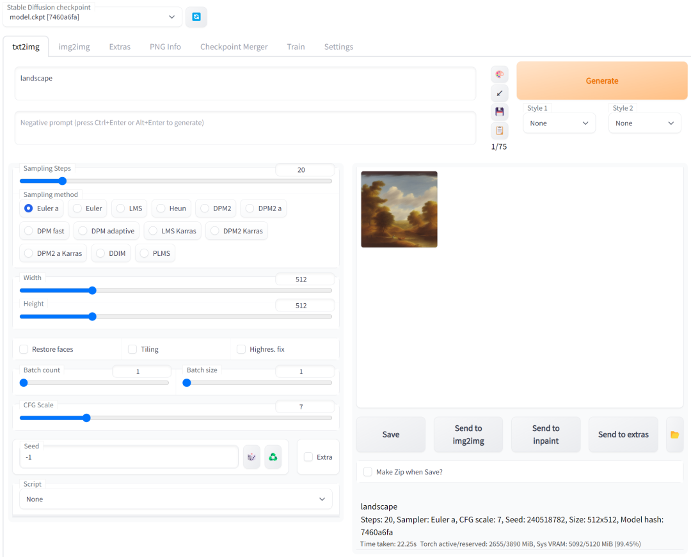

（本地webui版AI绘图界面）

因此stable diffusion webui项目是很多人部署到本地的首选。

我们本教程就是以stable diffusion webui项目为例来操作的。

## 二、电脑环境配置

#### 1.安装miniconda

这个是用来管理python版本的，他可以实现python的多版本切换。

下载地址：docs.conda.io/en/latest/miniconda.html

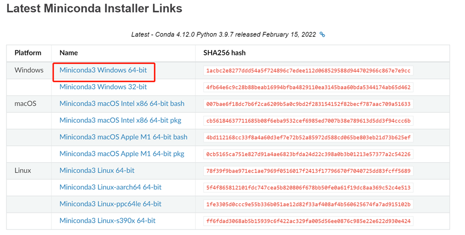
（miniconda下载截图）

安装时按默认的一路next就行。


#### 2.打开miniconda，输入conda -V 弹出版本号即为正确安装

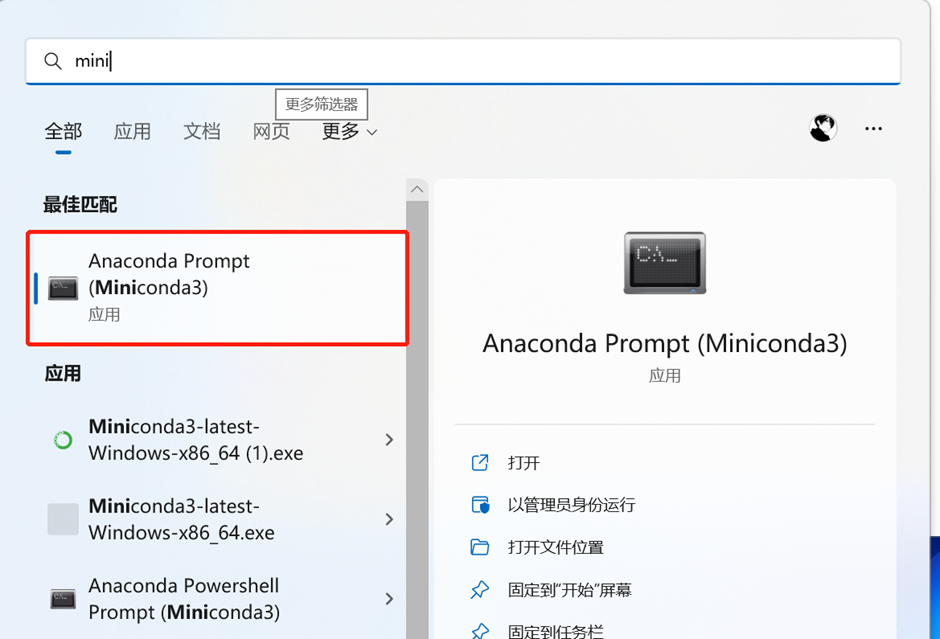


（开始-输入mini-找到miniconda3打开）

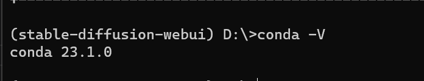
（显示conda版本，那就对了）


#### 3.配置库包下载环境，加快网络速度（替换下载库包地址为国内的清华镜像站）

执行下面
```
conda config --set show_channel_urls yes 
```
生成.condarc 文件

在我的电脑/此电脑-C盘-users-你的账号名下用记事本打开并修改.condarc文件。（如我的路径是C:\Users\Administrator。）

把下面的内容全部复制进去，全部覆盖原内容，ctrl+s保存，关闭文件。
```
show_channel_urls: true
auto_activate_base: false
channel_priority: flexible
channels:
  - defaults
default_channels:
  - https://mirrors.tuna.tsinghua.edu.cn/anaconda/pkgs/main
  - https://mirrors.tuna.tsinghua.edu.cn/anaconda/pkgs/free
  - https://mirrors.tuna.tsinghua.edu.cn/anaconda/pkgs/r
custom_channels:
  conda-forge: https://mirrors.tuna.tsinghua.edu.cn/anaconda/cloud
  msys2: https://mirrors.tuna.tsinghua.edu.cn/anaconda/cloud
  bioconda: https://mirrors.tuna.tsinghua.edu.cn/anaconda/cloud
  menpo: https://mirrors.tuna.tsinghua.edu.cn/anaconda/cloud
  pytorch: https://mirrors.tuna.tsinghua.edu.cn/anaconda/cloud
  simpleitk: https://mirrors.tuna.tsinghua.edu.cn/anaconda/cloud
```

运行conda clean -i 清除索引缓存，以确保使用的是镜像站的地址。

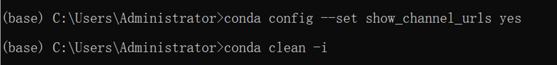


#### 4.切换成其他盘来创建python环境

如果继续操作，会把整个项目创建在c盘，而很多人c盘容量紧张，可以创建在其他盘，比如D盘。

输入D: 然后回车。

（后来才发现这一步并不能把项目装在d盘，他仍然是在c盘，不过没关系，他很小，不会占用太多空间，那咱继续往下操作）

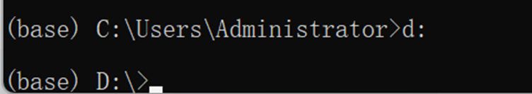

#### 5.创建python 3.10.6版本的环境

运行下面语句，创建环境。
```
conda create --name stable-diffusion-webui python=3.10.6
```
系统可能会提示y/n, 输入y，按回车即可。

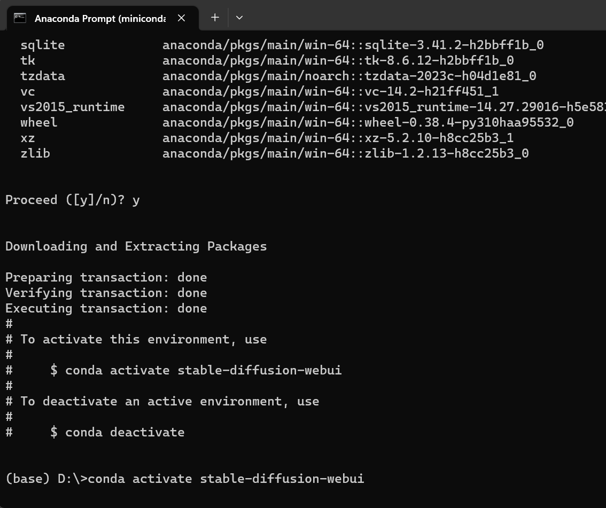

显示done，那就完成了。

在你的C:\ProgramData\Miniconda3\envs\stable-diffusion-webui已经创建了一个新的项目。

#### 6.激活环境

输入conda activate stable-diffusion-webui 回车。

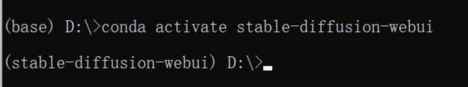

#### 7.升级pip，并设置pip的默认库包下载地址为清华镜像。

每一行输入后回车，等执行完再输入下一行，再回车。
```
python -m pip install --upgrade pip
pip config set global.index-url https://pypi.tuna.tsinghua.edu.cn/simple
```
不报错就是完成了。

#### 8.安装git，用来克隆下载github的项目，比如本作中的stable diffusion webui

前往git官网git-scm.com/download/win


#### 9.安装cuda

cuda是NVIDIA显卡用来跑算法的依赖程序，所以我们需要它。

打开NVIDIA cuda官网，developer.nvidia.com/cuda-toolkit-archive

（这里有人可能会打不开网页，如果打不开，请用魔法上网。）

你会发现有很多版本，下载哪个版本呢？

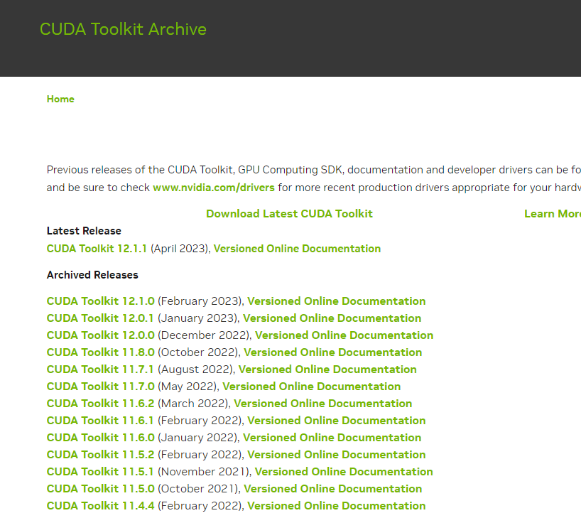

回到一开始的miniconda的小窗，输入nvidia-smi，查看你的cuda版本

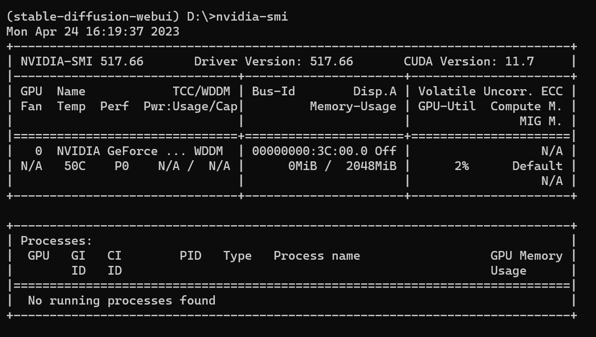

比如我的是11.7的版本，我就下载11.7.0的链接，

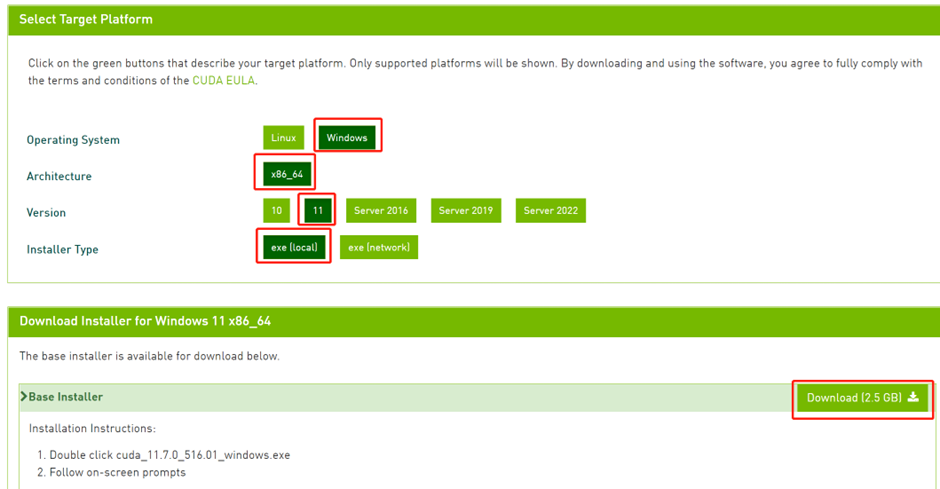

然后安装自己的系统选择win10或者11，exe local，download

下载完后安装，这个软件2个G，可以安装在c盘以外的地方。比如D盘。

好了，完成这步，电脑的基础环境设置终于完事了。

下面开始正式折腾stable diffusion了。


## 三、stable diffusion环境配置

#### 1.下载stable diffusion源码

确认你的miniconda黑色小窗显示的是
```
（stable-diffusion-weibui）D:\>
```
如果不是，则输入D: 按回车。（当然你也可以放在其他你想放的盘的根目录里面。

不建议放在c盘，因为这个项目里面有一些模型包，都是几个G几个G的，很容易你的C盘就满了，其他盘容量在10G以上的就都行。

放其他盘，则输入比如e: f: g: 等，然后回车即可。）

再来克隆stable diffusion webui项目（下面简称sd-webui）

接着执行
```
git clone https://github.com/AUTOMATIC1111/stable-diffusion-webui.git
```
直到显示done即可。

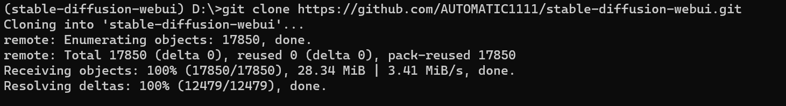

注意，现在克隆的本地地址，就是下面经常提到的“项目根目录”。比如，我的项目根目录是D:\stable-diffusion-webui

#### 2.下载stable diffusion的训练模型

在huggingface.co/CompVis/stable-diffusion-v-1-4-original/tree/main

点击file and versions选项卡，下载sd-v1-4.ckpt训练模型。

（需要注册且同意协议，注册并同意协议之后即可下载）

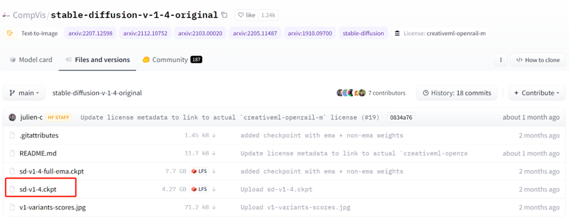

注：这个模型是用于后续生成AI绘图的绘图元素基础模型库。

后面如果要用waifuai或者novelai，其实更换模型放进去sd-webui项目的模型文件夹即可。

我们现在先用stable diffusion 1.4的模型来继续往下走。

#### 3.下载好之后，请把模型更名成model.ckpt
然后放置在sd-webui的models/stable-diffusion目录下。比如我的路径是D:\stable-diffusion-webui\models\Stable-diffusion

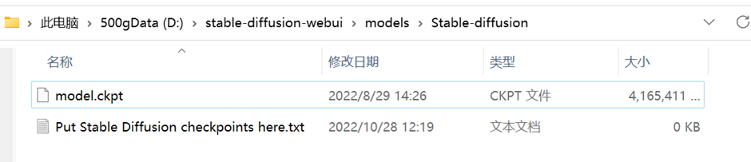

#### 4. 安装GFPGAN

这是腾讯旗下的一个开源项目，可以用于修复和绘制人脸，减少stable diffusion人脸的绘制扭曲变形问题。

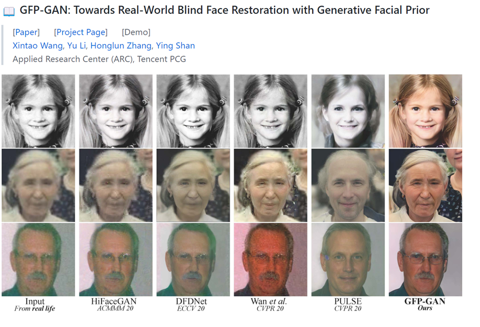

打开github.com/TencentARC/GFPGAN

把网页往下拉，拉到readme.md部分，找到V1.4 model，点击蓝色的1.4就可以下载。

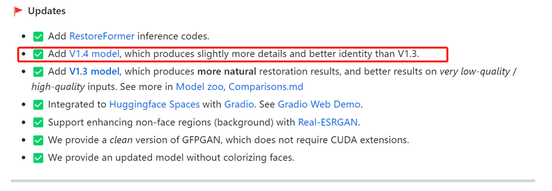

下载好之后，放在sd-webui项目的根目录下面即可，比如我的根目录是D:\stable-diffusion-webui

#### 5. 在miniconda的黑色小窗，准备开启运行ai绘图程序sd-webui

输入
```
cd stable-diffsion-webui
```
进入项目的根目录。

如果你安装在其他地方，也是同理。

输入盘符名称加上冒号（如c: d: e:）即可进入磁盘根目录。

输入cd..即可退出至上一级目录，

输入cd + abc即可进入abc文件夹。（如cd stable-diffusion-webui，前提是你有相应的文件夹，否则会报错）

总之，要进入sd-webui的项目根目录后，才能执行下面的指令，否则会报错。

（这个根目录是上面git clone 指令时候创建的stable-diffusion-webui根目录，不是在c盘miniconda里面的那个stable-diffusion-webui根目录。）

```
webui-user.bat
```
然后回车，等待系统自动开始执行。

直到系统提示，running on local URL: http://127.0.0.1:7860

这就代表，你可以开始正式使用AI画画啦~

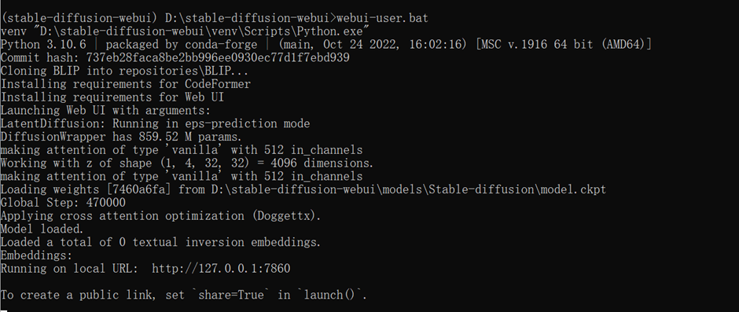

注意：

这一步可能经常各种报错，需要耐心和时间多次尝试。

不要关闭黑色小窗，哪怕它几分钟没有任何变化。

如果提示连接错误，可能需要开启或者关闭魔法上网，再重新执行webui-user.bat命令。

如果不小心退出了黑色窗口，则重新点击：开始菜单-程序-打开miniconda窗口，输入
```
conda activate stable-diffusion-webui
```
并进入sd-webui项目根目录再执行
```
webui-user.bat
```

## 四、开始作画和调试

#### 1.在浏览器，（比如谷歌浏览器），打开http://127.0.0.1:7860（注意，不要关闭miniconda的黑色窗口）

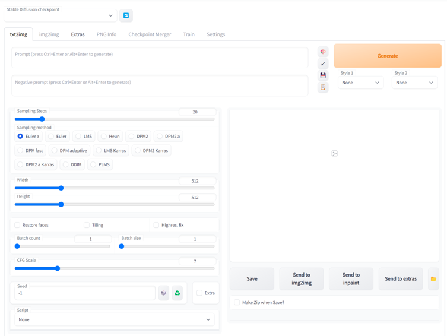

#### 2.在prompt区域输入相关指令，比如beautiful landscape，然后点击右边的generate，即可生成第一张图片啦。

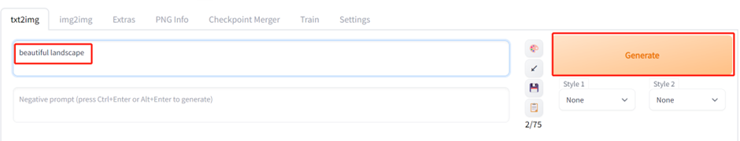

#### 3.生成的状态和操作

网页会显示进度条，miniconda的黑色小窗也会显示进度条。

等进度条跑满，就能看到你生成的图啦。

如果不想生成了，可以点击interrupt停止生成，就会返回你目前为止已经生成的图片。（比如你要生成10张，已经生成了3张，点击interrupt，就会返回3张图片）

如果点击skip，就会跳过本张图片的生成，比如你想生成10张图，现在生成第3张，点击skip，第三张就不生成了，直接开始生成第四张，最后返回9张图片。

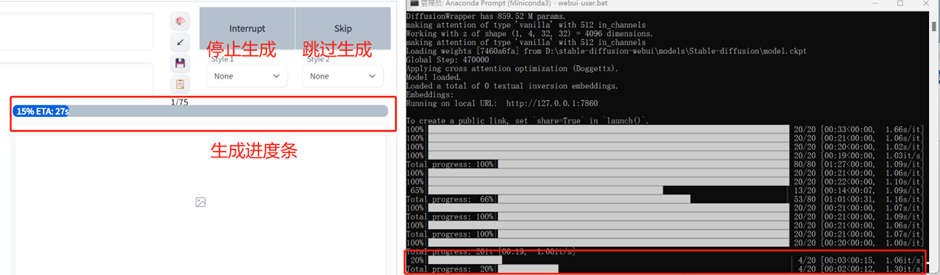

#### 4.修改batch count数值，一次性生成多张图片

默认是1，一次性生成1张，建议一次性生成4张或者以上，这样获得满意的图片概率会大一些，可以最多一次性生成最多100张。

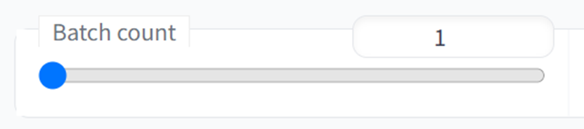

但写得越大，一次性生成花费的时间越长，假设一张图30秒，设置10张就是300s，5分钟，100张则是3000s，50分钟。

#### 5.好了，那现在就本地化部署完毕了，可以开始愉快地玩耍啦，祝你玩得开心~

## 五、其他

#### 1.至于其他的功能，由于篇幅限制，我们就后面再说啦。

但不得不说，现在sd-webui这个项目，比之前纯代码的交互，真的是好用多了，还加了很多新功能。

比如img2img功能，你可以对生成图片的一部分不满意的地方进行重新生成，比如嘴巴鼻子眼睛等。

甚至可以直接通过重新生成一部分内容的方式来换衣服。

还可以直接用extras功能放大生成的图片，最多放大4倍。（512*512 放大4倍= 2048*2048）

#### 2.执行本教程，可能会遇到非常多的问题

我自己都是操作了2天，尝试了2-3个教程，才终于跑通，所以遇到问题很正常。

但是做好之后，真的是超开心的。

看着这个界面跳出来，眼睛都快湿润了。

原本弄了两天，昨天傍晚跑通，赶一下是可以发出来教程的，但是我觉得太好玩了，于是自己鼓捣了一晚上，生成了几百张图片，这才发出来教程。

如果你不是程序员，能一路顺风毫无阻碍，1小时之内，从0到打开可视化绘图界面，那么我会给你比一个大拇指，并由衷地赞一声，牛~

遇到问题，建议直接把问题放在搜索引擎搜索，基本上都会有答案。

技术问题建议优先选择谷歌，其次是必应，再其次是百度。

如果还是有问题的，可以直接在这篇文章下面留言，看到我都会回复，无偿，但不保证响应时间，因为还有好多其他事。

如果需要一对一指导的，请私我，可以手把手帮忙，非无偿，毕竟挺花时间的。

好了，今天先聊到这里，下次见~

## 参考资料

1. AI绘图画出超真实细节感 
[用AI画画，画出你的人生](https://mp.weixin.qq.com/s?__biz=MzI2NTQ0MjY5Nw==&mid=2247484631&idx=1&sn=cc627810f6862baf99d0e8084050c3f9&chksm=ea9c0031ddeb89278f5623560761d3d585e96eb768a15e11ccc7c24de817865056b68fc9e93a&scene=21#wechat_redirect)

https://zhuanlan.zhihu.com/p/610149293

## 问题解决
1. loading stable diffusion model: outofmemoryerror

https://github.com/AUTOMATIC1111/stable-diffusion-webui/issues/8336

