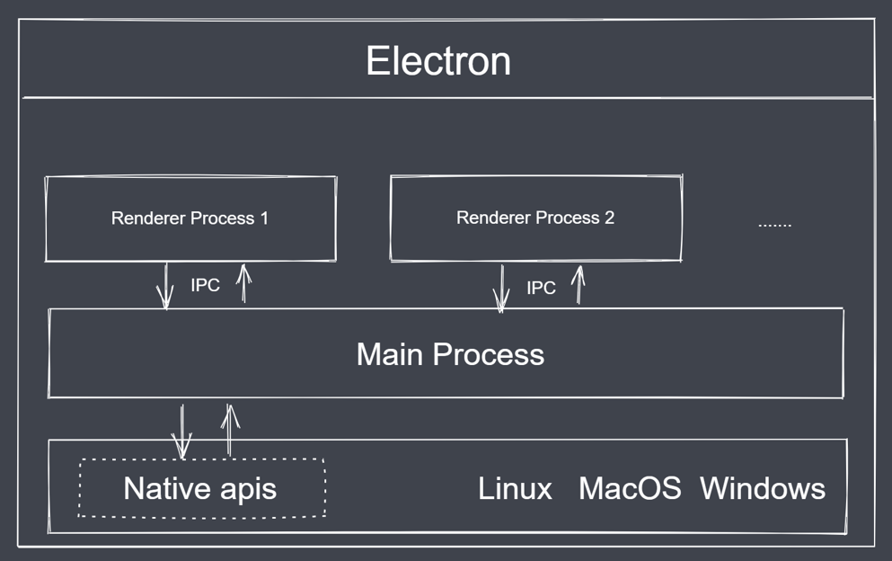
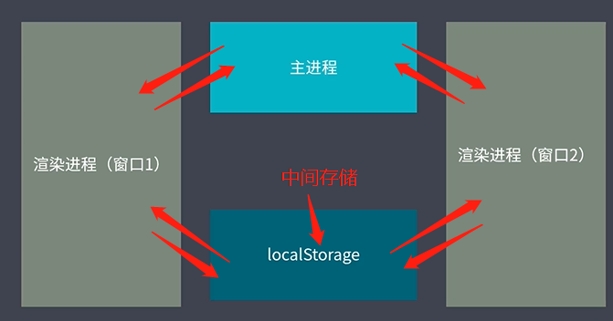

# Electron 基础

## 概念

[Electron](https://www.electronjs.org/zh/docs/latest/) 是一个使用 JavaScript、HTML 和 CSS 构建桌面应用程序的框架。 嵌入 Chromium 和 Node.js 到 二进制的 Electron 允许您保持一个 JavaScript 代码代码库并创建 在Windows上运行的跨平台应用 macOS和Linux——不需要本地开发 经验。

技术架构：
- Chromium：支持最新特性的浏览器
- Node.js：javascript 运行时，可实现文件读写等
- Native APIs: 提供统一的原生界面能力

[Electron 备忘清单](https://wangchujiang.com/reference/docs/electron.html)

[基于 electron-vue 构造 electron 应用程序的样板代码](https://simulatedgreg.gitbooks.io/electron-vue/content/cn/)

## 工作流程

贴图：


1. 主进程
- 可以看做是 package.json 中 main 属性对应的文件
- 一个应用只会有一个主进程
- 只有主进程可以进行 GUI 的 API 操作
- 主进程可以管理所有的web界面和对应的渲染进程

2. 渲染进程（渲染 web 界面、支持 DOM 操作、Node API 的调用操作）
- Windows 中展示的界面通过渲染进程表现
- 一个应用可以有多个渲染进程
- 渲染进程可以通过主进程去调用原生 的API

## 环境搭建

参考[官网的步骤](https://www.electronjs.org/zh/docs/latest/tutorial/quick-start)创建项目

## 生命周期

以下事件依次发生：
- ready: app 初始化完成 （一般用于加载窗口的初始化操作）
- dom-ready: 一个窗口中的文本加载完成（可以执行后续的 DOM 操作了）
- did-finsh-load: 导航完成时触发（由 webContent 调用）
- window-all-closed:  所有窗口都被关闭时触发（定义退出前的操作，会影响后续的事件）
- before-quit:  在关闭窗口之前触发
- will-quit: 在窗口关闭并且应用退出时触发
- quit: 当所有窗口被关闭时触发
- closed: 当窗口关闭时触发，此时应删除窗口引用

```js
// 模块来控制应用程序生命周期和创建本机浏览器窗口
const {app, BrowserWindow} = require('electron')
const path = require('path')

// 创建一个窗口，加载一个界面，界面通过 web 技术实现的，界面运行在渲染进程中
function createWindow () {
  // 创建浏览器窗口
  const mainWin = new BrowserWindow({
    width: 800,
    height: 600,
    webPreferences: {
      preload: path.join(__dirname, 'preload.js')
    }
  })

  // 加载应用的 index.html
  mainWin.loadFile('index.html')

  // 打开 DevTools
  // mainWin.webContents.openDevTools()

  mainWin.webContents.on('dom-ready', () => {
    console.log('222 dom-ready...')
  })

  mainWin.webContents.on('did-finish-load', () => {
    console.log('333 did-finish-load...')
  })

  mainWin.on('close', () => {
    console.log('888 close...')
    // mainWin = null
  })
}

// 当 Electron 完成时，该方法将被调用（app 启动完成）
// 初始化并准备创建浏览器窗口。
// 某些api只能在此事件发生后使用。
app.whenReady().then(() => {
  createWindow()
  console.log('111 ready...')

  app.on('activate', function () {
    // On macOS it's common to re-create a window in the app when the
    // dock icon is clicked and there are no other windows open.
    if (BrowserWindow.getAllWindows().length === 0) createWindow()
  })
})

// 当所有窗口都关闭时退出
app.on('window-all-closed', function () {
  console.log('444 window-all-closed...')
  if (process.platform !== 'darwin') app.quit()
})

app.on('before-quit', () => {
  console.log('555 before-quit...')
})

app.on('will-quit', () => {
  console.log('666 will-quit...')
})

app.on('quit', () => {
  console.log('777 quit...')
})

/* 
  在这个文件中，你可以包含你的应用程序的其他特定的主进程代码。
  您还可以将它们放在单独的文件中，并在这里要求它们。
*/
```
## 窗口操作

#### 窗口尺寸
```js
function createWindow () {
  // 创建浏览器窗口
  const mainWin = new BrowserWindow({
    x: 100,
    y: 100,  // 设置窗口显示的位置，相对于当前屏幕的左上角
    show: false,  // 默认情况下创建一个窗口对象之后就会显示，设置为false 就不会显示了
    width: 800,
    height: 400,
    maxHeight: 600,
    maxWidth: 1000,
    minHeight: 200,
    minWidth: 300,  // 可以通过 min max 来设置当前应用窗口的最大和最小尺寸
    resizable: false  // 是否允许缩放应用的窗口大小 
    webPreferences: {
      preload: path.join(__dirname, 'preload.js')
    }
  })

  // 加载应用的 index.html
  mainWin.loadFile('index.html')

  mainWin.on('ready-to-show', () => {
    mainWin.show()
  })
}
```

#### 窗口标题及环境

> ctrl + shift + i 打开窗口的控制台

代码库：  
- [Electron 新建窗口](https://github.com/attraction11/electron-study/tree/v1.1-new-window)

关于报错可以参考：
- [electron12起，如何解决require is not defined的问题？](https://newsn.net/say/electron-require-is-not-defined-2.html)
- [Electron 12.0.0 'Require' is not defined](https://github.com/electron/electron-quick-start/issues/463)
- [Electron V14 Electron Remote模块用法](https://www.vsay.net/web/167.html)
- [Electron 点击按钮打开新窗口](https://www.cnblogs.com/wzf-Learning/p/17255094.html)

#### 自定义窗口

代码库：  
- [Electron 自定义窗口](https://github.com/attraction11/electron-study/tree/v2.1-custom-window)

关于报错可以参考：
- [引入css矢量库报错？](https://www.cnblogs.com/longronglang/p/16467829.html)

## 自定义菜单

代码库：  
- [Electron 自定义菜单](https://github.com/attraction11/electron-study/tree/v3.1-custom-menu)

## 进程间通信

> shell指令：chcp 65001 修改字符编码

代码库：  
- [Electron 主进程与渲染进程间通信](https://github.com/attraction11/electron-study/tree/v4.0-ipc)
- [Electron 渲染进程间通信](https://github.com/attraction11/electron-study/tree/v4.1-ipc)

基于本地存储的渲染进程通信（图解）：


## dialog 模块

代码库：  
- [dialog 模块使用](https://github.com/attraction11/electron-study/tree/v5.0-dialog)

##  shell 与 iframe

代码库：  
- [dialog 模块使用](https://github.com/attraction11/electron-study/tree/v6.0-shell-iframe)

##  消息通知

代码库：  
- [dialog 模块使用](https://github.com/attraction11/electron-study/tree/v7.0-notification)

##  快捷键注册

代码库：  
- [dialog 模块使用](https://github.com/attraction11/electron-study/tree/v8.0-globalShortcut)

##  剪切板

代码库：  
- [dialog 模块使用](https://github.com/attraction11/electron-study/tree/v9.0-clipboard)