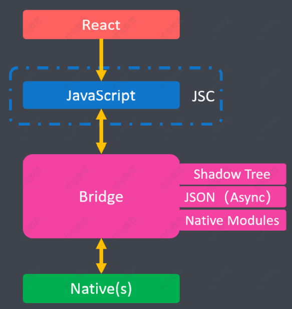
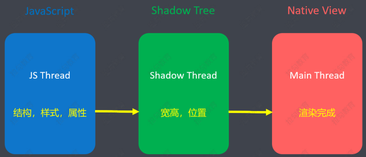
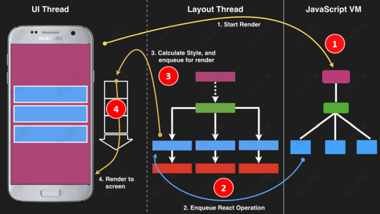
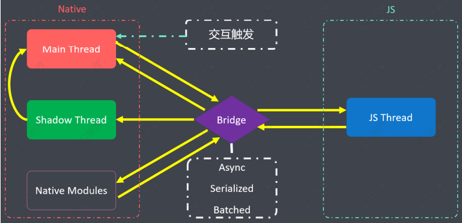
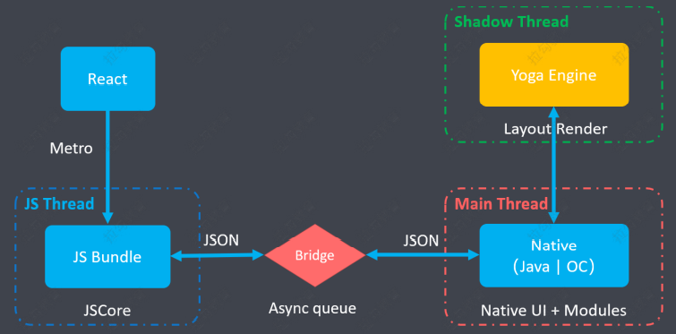
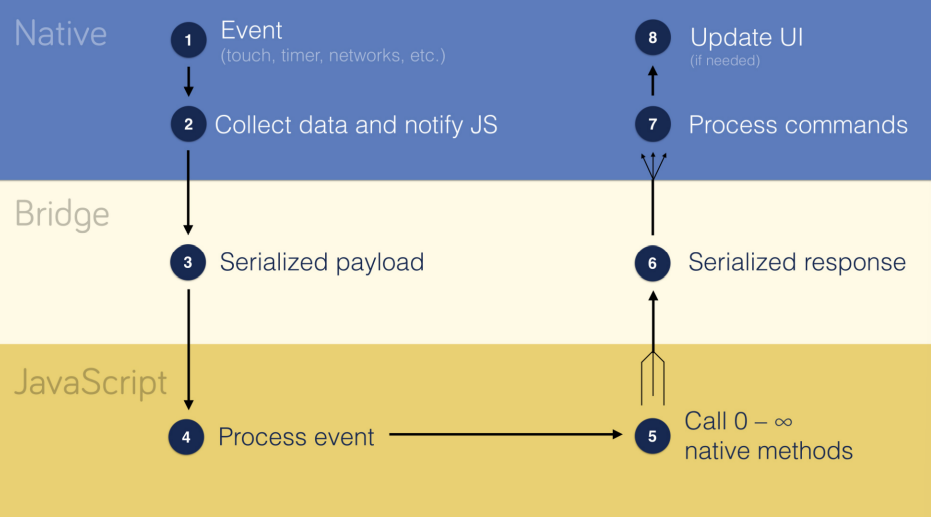
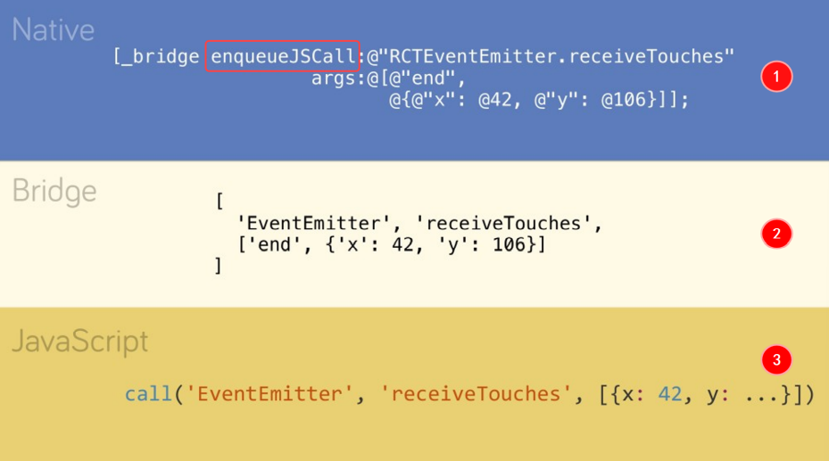
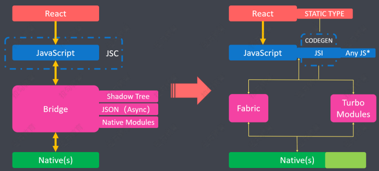
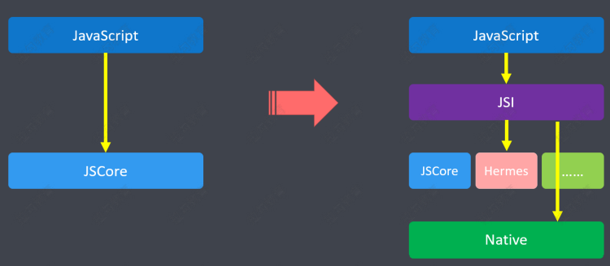
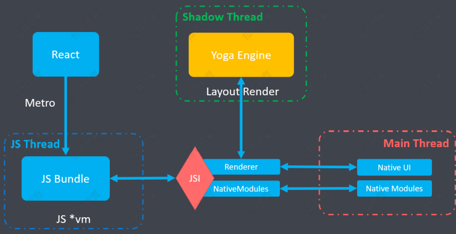

# 架构原理

## 简述

为了更好的理解 React Native，我们需要了解 RN 的架构原理。这里主要介绍两个内容

-   现有架构: 当前 RN 正在使用的架构
-   新架构: 2018 年 6 月，Facebook 推出了 RN 的重构计划,下一代 RN 的架构原理

## 现有架构

#### 架构模型

基本架构模型如下：

-   Native 是原生部分，例如：IOS 原生或 Android 原生
-   JS 端主要是 React 语法
-   Bridge 用于 Native 和 JS 的通信（由于 Native 和 JS 相对独立，彼此通信是通过桥接器-Bridge 来实现）

详细一点的架构模型：

-   最上层提供类 React 支持，运行在 JSC（JS Core 运行引擎） 提供的 JavaScript 运行时环境中。
-   Bridge 层将 JavaScript 与 Native 原生连接起来。
    -   Shadow Tree 用于定义 UI 效果及交互功能
    -   Native Modules 提供 Native 功能（比如：蓝牙）
-   二者之间通过 JSON 消息相互通信（异步）

#### 线程模型

-   JS 线程：JS 代码的执行线程，将源码通过 Metro 打包后生成 bundle 文件，传给 JS 引擎进行解析。
-   Main 线程（UI 线程、原生线程、主线程）：主要负责原生渲染（Native UI）和调用原生模块（Native Modules）
-   Shadow 线程（Layout 线程）
    -   创建 Shadow Tree 来模拟 React 结构树（类似虚拟 DOM）
    -   再由 Yoga 引擎将 Flexbox 等样式，解析成原生平台的布局方式

> RN 使用 Flexbox 布局，但是原生是不支持，Yoga 用于将 Flexbox 布局转化为原生平台的布局方式。

#### 渲染机制

-   JS 线程将视图信息（结构、样式、属性等）传递给 Shadow 线程
-   Shadow 线程创建出用于布局计算的 Shadow Tree,布局计算好之后，再将完整的视图信息（宽高、位置等）传递给主线程。
-   Main 线程据此创建 Native View（UI）

也可以通过下图，来理解渲染过程：

解析：

-   点击启动 App 之后，原生会触发一个事件调用 JS（此阶段会准备 React 相关的结构树）
-   JS 线程会将结构树发给 Shadow 线程（Layout 线程）。
-   Shadow 线程会计算样式，并将样式添加到 React 结构树中，并最终生成一个新的 Shadow Tree。
-   Shadow 线程会将新的 Shadow Tree 放到渲染队列当中，并最终传给主线程（UI 线程）。
-   Main 线程做最终的计算，将 Flexbox 布局转化为原生平台的布局方式。

#### 线程间通信

解析：

-   首先点击了 App 中的菜单，触发了 Main 线程。
-   Main 线程接收到事件后，会收集相关的数据，然后把数据以 JSON 的方式传递给 Bridge。
-   Bridge 再将数据以 JSON 的方式传递给 JS 线程，JS 线程会做出响应以 JSON 的方式返给 Bridge，最终传递给 Main 线程。
-   如果涉及 UI 的渲染，Bridge 拿到的内容，还会传递给 Shadow 线程。Shadow 线程通过各种计算生成 Shadow Tree 传递给 Main 线程。Main 线程再根据 Shadow Tree 做最终的渲染。
-   如果涉及调用原生模块的调用（比如：蓝牙），调用原生模块时也有响应的返回信息。通过 Bridge 再将返回信息传递给 Main 线程。
-   Bridge 具有 3 个特点：Async(异步)、Serialized(序列化)、Batched(批量处理消息，提高 Bridge 沟通性能)

#### 启动过程

解析：

-   首先 React 源代码经过 Metro 的打包后，生成 JS Bundle 文件。
-   JS Bundle 文件需要 JS Core 引擎去解析，解析后生成 JSON 文件传递给 Bridge（异步队列）。
-   Bridge 收到消息后，会将 JSON 序列传递给 Main 线程。Main 线程中主要涉及 UI 渲染和原生模块。
-   若涉及 UI 渲染，则会调用 Shadow 线程，采用 Yoga 解析引擎，将 React 样式布局转换为原生的布局方式。

#### 应用过程

解析：

-   原生层收集事件和相关数据，传递给 JS，JS 进行相关的处理。处理后将数据传递给原生层，可能会触发 UI 的更新。

## 新架构

#### 新架构重构背景

-   之前版本，存在诸多性能问题
-   受 Flutter 等新的跨端开发框架的压力
-   2018 年 6 月，提出重构计划

##### 现有架构的问题

-   JS 与 Native 的沟通都是通过 Bridge 完成的，一旦 Bridge 有问题，沟通的环节就会被打断。比如在高并发的场景下，消息比较多，此时消息就会积压在 Bridge 的两侧，会导致严重的性能问题。因此重构的一大方向是让 JS 与 Native 直接沟通。
-   新架构通过

#### 新旧架构对比

#### 新架构的主要改动

-   JavaScript 层：
    -   支持 React 16+ 的新特征
    -   增强 JS 静态类型检查（CodeGen）
    -   引入 JSI，允许替换不同的 JavaScript 引擎。支持 JS 与 Native 直接通信
-   Bridge 层：
    -   划分成 Fabric 和 TurboModules 两部分，分别负责 UI 管理与 Native 模块
-   Native 层：
    -   精简核心模块，将非核心部分拆分出去，作为社区模块，独立更新维护

#### 增强类型检查

-   CodeGen 是 FaceBook 推出的代码生成工具
    -   通过 CodeGen，自动将 Flow 或者 TypeScript 等有静态类型的 JS 代码翻译成 Fabric 和
        TurboModules 使用的接口文件。
-   加入类型约束后的作用：
    -   减少了数据类型错误
    -   减少了数据验证的次数，提高了通信性能

> 举个例子：JS 中的数字经常被引号引起来，从而将数字类型转成了字符串。将转换后的数字传递
> 给 bridge 的时候，通常 iOS 下会静默失败，而 Android 会崩溃。
> 另外。类型约束对通信性能也有一定提升。因为，在加入类型约束之前，每次通信都需要进行数据
> 验证。加载类型约束之后，我们就没有必要每次通信都进行数据验证了。减少了数据验证的次数，
> 就会提高通信性能。

#### JSI（JavaScript Interface）

不同于之前直接将 JavaScript 代码输入给 JSC，新的架构中引入了一层 JSI（JavaScript Interface），作为 JSC 之上的抽象。

JSI 是一个用 C++写成的轻量级框架。其作用主要有 2 个：

-   通过 JSI，可以实现 JS 引擎的更换
-   通过 JSI，可以通过 JS 直接调用 Native
    -   JS 对象可以直接获得 C++ 对象(Host Objects)引用，从而允许 JS 与 Native 的直接调用
    -   减少不必要的线程通信
    -   省去了序列化和反序列化的成本
    -   减轻了通信压力，提高了通信性能

#### 优化 Bridge 层

-   Fabric
    -   简化了 UI 渲染

> Fabric 简化了 React Native 渲染，简化之前渲染流程中，有复杂跨线程交互（React 结构树 -> Native ->Shadow Tree -> Native UI）。优化之后，直接在 C++ 层创建 JavaScript 与 Native 共享的 Shadow Tree，并通过 JSI 层将 UI 操作接口暴露给 JS，允许 JS 直接控制高优先级的 UI 操作，甚至允许同步调用（应对列表快速滚动、页面切换、手势处理等场景）。这样避免了跨线程的操作，极大地提高了 UI 的响应速度。

-   Turbo Modules
    -   通过 JSI，可以让 JS 直接调用 Native 模块，实现同步操作
    -   实现 Native 模块按需加载，减少启动时间，提高性能

> 之前所有 Native Modules（无论是否需要用到）都要在应用启动时进行初始化，因为 Native 不知
> 道 JS 将会调用哪些功能模块。而新的 Turbo Modules 允许按需加载 Native 模块，并在模块初始
> 化之后直接持有其引用，不再依靠消息通信来调用模块功能。因此，应用的启动时间也会有所提升

#### 精简核心

-   将 react-native 核心包进行瘦身

    -   RN 自 2015 年推出已多年，其核心包太过臃肿
    -   有些包在项目中用不到，每次也要引入，造成资源浪费

-   非必要的包，移到社区模块，单独维护（例如：AsyncStorage、WebView 等）

#### 新架构启动流程

解析：

-   首先 React 源代码经过 Metro 的打包后，生成 JS Bundle 文件。
-   JS Bundle 文件在某个 JS 引擎上运行。
-   然后传递文件到 JSI,JSI 中包含 Renderer(渲染器)和 NativeModules(调用原生模块)两部分。
-   JSI 的渲染器会调用 Shadow 线程使用 Yoga 引擎解析 Shadow Tree，并最终呈现一个 Native UI
-   JSI 的调用原生模块部分用于调用原生模块。
