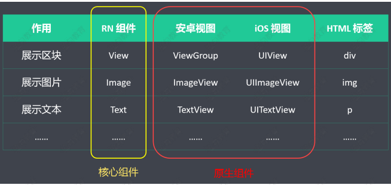

# 组件和 API

## 简介

在 React Native 项目中，所有展示的界面，都可以看做是一个组件（Component），只是功能和逻辑
上的复杂程度不同。

## 原生组件

在 Android 开发中是使用 Kotlin 或 Java 来编写视图；在 iOS 开发中是使用 Swift 或 Objective-C 来编写
视图。在 React Native 中，则使用 React 组件通过 JavaScript 来调用这些视图。在运行时，React
Native 为这些组件创建相应的 Android 和 iOS 视图。由于 React Native 组件就是对原生视图的封装，

-   因此使用 React Native 编写的应用外观、感觉和性能与其他任何原生应用一样。我们将这些平台支持的
    组件称为原生组件。
    

> React Native 允许您为 Android 和 iOS 构建自己的 Native Components（原生组件）。

## 核心组件

React Native 还包括一组基本的，随时可用的原生组件，您可以使用它们来构建您的应用程序。这些是
React Native 的 核心组件。（来自 react-native 的组件叫核心组件）


## 第三方组件

不在 react-native 中的，需要单独安装，然后才能使用的组件

## 自定义组件

一般指，具有特定功能的，由工程师自己写的，在项目中需要重复使用的组件。

## 常用组件

#### View

相当于 HTML 中的 div，用来展示内容

#### SafeAreaView

用法与 View 一致，只是 SafeAreaView 可以避开 刘海（挖空屏幕）  


#### Text

用来展示文本信息（RN 中所有的文本，必须包含在 Text 标签中）

```js
    import { Text } from 'react-native'
    <Text>文本内容</Text>
    <Text
        style={[styles.newsItemHeader]} // 样式
        numberOfLines={2} // 文本显示的行数
        ellipsizeMode="tail" // 从文本的末尾进行截断
        onPress={() => alert('点击')}
        onLongPress={() => alert('长按点击')}
    > 文本内容 </Text>
```


#### Button

不能使用 style 属性

```js
import { Button } from "react-native";
<Button onPress={onPressLearnMore} title="Learn More" color="#841584" />;
```

#### Alert

提示窗口(三个按钮)

```js
Alert.alert("更新提醒", "发现新版本，是否现在更新", [
    {
        text: "稍后再说",
        onPress: () => console.log("Ask me later pressed"),
    },
    {
        text: "取消",
        onPress: () => console.log("Cancel Pressed"),
        style: "cancel",
    },
    { text: "确认", onPress: () => console.log("OK Pressed") },
]);
```


#### Switch

开关按钮，类似 HTML 中的 CheckBox

```js
import { Switch } from "react-native";
<Switch
    trackColor={{ false: "#999", true: "#666" }} // 背景色
    thumbColor={this.state.hideStatusBar ? "red" : "white"} // 前景色
    ios_backgroundColor="#3e3e3e"
    value={this.state.hideStatusBar}
    onValueChange={this.toggleStatusBar} // 开关处理函数
/>;
```

#### StatusBar

状态栏位于手机的顶部，一般用来显示网络信号，时间，电量等信息。在 RN 可以通过 StatusBar 来控制状态栏

```js
import { StatusBar } from "react-native";
<StatusBar
    backgroundColor="blue" // 设置背景色，仅在 Android 下有效
    animated={false}
    hidden={this.state.hideStatusBar} // 是否隐藏 StatusBar
/>;
```

#### ActivityIndicator

活动指示器

```js
import { ActivityIndicator } from 'react-native'
<ActivityIndicator size="large" color="#0000ff" />
<ActivityIndicator size="small" color="#00ff00" />
<ActivityIndicator size={70} color="#00d0ff" />
<ActivityIndicator size={100} color="red" />
```

Android VS iOS 下的效果（使用数字来声明大小，仅在 Android 下有效。）


#### Image

用来展示图片。图片路径有三种情况

```js
- <Image style={styles.slideItem} source={require("../../images/1.jpg")} /> // 不支持地址变量拼接
<Image
    style={styles.mediumLogo}
    source={{
        uri: "https://reactnative.dev/img/tiny_logo.png",
    }}
/>;
<Image
    style={styles.logo}
    source={{
        uri:'data:image/png;base64,iVBORw0KGgoAAAANSUhEUgAAADMAAAAzCAYAAAA6oTAqAAAAEXRF
        WHRTb2Z0d2FyZQBwbmdjcnVzaEB1SfMAAABQSURBVGje7dSxCQBACARB+2/ab8BEeQNhFi6WSYzYLYud
        DQYGBgYGBgYGBgYGBgYGBgZmcvDqYGBgmhivGQYGBgYGBgYGBgYGBgYGBgbmQw+P/eMrC5UTVAAAAABJ
        RU5ErkJggg==',
    }}
/>
```

#### TextInput

RN 中的 TextInput 支持多种表单类型，例如：普通输入框，密码框，文本域等。不同类型的表单是通过不同的属性来实现的。

```js
export default class index extends Component {
    constructor() {
        super();

        this.state = {
            username: "",
            password: "",
        };
    }

    doLogin = () => {
        alert(this.state.username);
    };

    render() {
        return (
            <View style={[styles.container]}>
                <TextInput
                    style={[styles.input]}
                    placeholder="请输入用户名"
                    value={this.state.username}
                    onChangeText={(val) => {
                        this.setState({
                            username: val,
                        });
                    }}
                />

                <TextInput
                    style={[styles.input]}
                    placeholder="请输入密码"
                    value={this.state.password}
                    secureTextEntry={true}
                    onChangeText={(val) => {
                        this.setState({
                            password: val,
                        });
                    }}
                />

                <TextInput
                    style={[styles.input]}
                    placeholder="手机号"
                    keyboardType="number-pad"
                    // value={this.state.password}
                    // onChangeText={(val) => {
                    //   this.setState({
                    //     password: val
                    //   })
                    // }}
                />

                <TextInput
                    style={[styles.input]}
                    placeholder="请输入自我介绍"
                    multiline={true}
                    numberOfLines={5}
                    textAlignVertical="top"
                />

                <View style={[styles.btn]}>
                    <Button title="登陆" onPress={this.doLogin} />
                </View>
            </View>
        );
    }
}
```

#### Touchable

触碰插件一般与事件一起使用

```js
import React from "react";
import {
    Text,
    StyleSheet,
    View,
    TouchableHighlight,
    TouchableOpacity,
    TouchableWithoutFeedback,
} from "react-native";

export default function index() {
    return (
        <View style={[styles.container]}>
            <TouchableHighlight onPress={() => console.log("触碰高亮显示")}>
                <View style={[styles.item]}>
                    <Text>触碰高亮</Text>
                </View>
            </TouchableHighlight>

            <TouchableOpacity onPress={() => console.log("触碰透明度变化")}>
                <View style={[styles.item]}>
                    <Text>触碰透明度变化</Text>
                </View>
            </TouchableOpacity>

            <TouchableWithoutFeedback onPress={() => console.log("触碰无响应")}>
                <View style={[styles.item]}>
                    <Text>触碰无响应</Text>
                </View>
            </TouchableWithoutFeedback>
        </View>
    );
}

const styles = StyleSheet.create({
    container: {
        flex: 1,
        justifyContent: "center",
        alignItems: "center",
    },
    item: {
        marginBottom: 20,
        padding: 10,
        borderWidth: 1,
        borderColor: "red",
    },
});
```

#### ScrollView

View 没有滚动功能。当内容超出可视区域后。就无法正常显示。此时，我们可以用滚动视图（ScrollView）来显示内容。

```js
    ScrollView
    style={{backgroundColor: '#dfb'}} // 指定样式
    horizontal={true} // 是否水平方向滚动。默认是垂直方向
    contentContainerStyle={{margin: 30}} // 设置内容样式
    showsVerticalScrollIndicator={false} // 是否展示垂直方向的滚动条
    showsHorizontalScrollIndicator={false} // 是否显示水平方向的滚动条
    >
    </ScrollView>
```

#### SectionList

将列表分成若干个章节，每个章节有一个标题。支持下面这些常用的功能

-   完全跨平台。
-   行组件显示或隐藏时可配置回调事件。
-   支持单独的头部组件。
-   支持单独的尾部组件。
-   支持自定义行间分隔线。
-   支持分组的头部组件。
-   支持分组的分隔线。
-   支持多种数据源结构
-   支持下拉刷新。
-   支持上拉加载

#### FlatList

用来渲染列表。具有如下特点：

-   完全跨平台
-   支持垂直（默认）和水平两个方向的列表
-   可配置显示或隐藏的回调事件
-   支持自定义 Header
-   支持自定义 Footer
-   支持自定义行与行之间的分割线
-   下拉刷新
-   上拉刷新
-   支持跳到指定行
-   支持多列显示

#### Animated

Animated 库旨在使动画变得流畅，强大并易于构建和维护。 Animated 侧重于输入和输出之间的声明性
关系，以及两者之间的可配置变换，此外还提供了简单的 start/stop 方法来控制基于时间的动画执
行。

#### WebView

WebView 相当于 RN 中的内置浏览器，我们写的 H5 的代码，可以直接在 WebView 中直接运行。该组
件之前在 RN 核心中。现在已经单独维护了。

-   安装

```js
yarn add react-native-webview
```

-   ~~链接原生代码: React Native 模块包括 Objective-C, Swift, Java, or Kotlin 等原生代码，我们必须将其”链接“，然后，编译器才会在应用中使用。~~  
    由于自动链接，链接和取消链接命令已在 React Native 0.69 中删除。以下命令适用于 React Native 0.69 之前版本

```js
react-native link react-native-webview
react-native unlink react-native-webview // 如果需要取消链接，执行此命令
```

-   iOS 应用：如果你在 iOS 下，请在 ios/ 或 macos/ 目录下运行

```js
cd ios && pod install && cd ../
```

-   Android 应用: 如果 react-native-webview 的版本 < 6，则无需任何操作。如果 react-native-webview 的版本 >= 6，请确保 AndroidX 在项目中已启动。具体做法是在 android/gradle.properties 中添加如下两行

```js
android.useAndroidX = true;
android.enableJetifier = true;
```

> 上述链接操作完成后，我们就可以启动应用了
> iOS：yarn ios
> Android：yarn android

-   使用示例

```js
import React, { Component } from 'react';
import { WebView } from 'react-native-webview';
class MyWeb extends Component {
    render() {
        return (
            <WebView
                {/* 直接填写网址 */}
                source={{ uri: 'https://infinite.red' }}
                style={{ marginTop: 20 }}
            />
        );
    }
}

import React, { Component } from 'react';
import { WebView } from 'react-native-webview';
class MyInlineWeb extends Component {
    render() {
        return (
            <WebView
                {/* 直接写 HTML 代码 */}
                source={{ html: '<h1>Hello world</h1>' }}
                originWhitelist={['*']}
            />
        );
    }
}
```

#### Picker

[Picker](https://github.com/react-native-picker/picker) 相当于 HTML 中的下拉框。react-native@0.60.0 之前在 RN 核心中。现在已经单独维护了

-   安装

```js
yarn add @react-native-picker/picker
```

-   在 iOS 下，还需要执行

```js
cd ios && pod install && cd ../
```

-   安卓没有额外操作
-   使用及效果展示

```js
import React, { useState } from "react";
import { StyleSheet, View } from "react-native";
import { Picker } from "@react-native-picker/picker";

export default function Index() {
    const [color, setColor] = useState("white");
    return (
        <View style={[styles.container, { backgroundColor: color }]}>
            <Picker
                selectedValue={color}
                style={{ height: 50, width: 100 }}
                mode={"dropdown"} // 只在 Android 下有效
                onValueChange={(itemValue, _itemIndex) => setColor(itemValue)}
            >
                <Picker.Item label="白色" value="white" />
                <Picker.Item label="红色" value="red" />
            </Picker>
        </View>
    );
}

const styles = StyleSheet.create({
    container: {
        flex: 1,
        justifyContent: "center",
        alignItems: "center",
    },
});
```


#### Swiper

在 React Native 中，实现轮播图常用的组件是 [react-native-swiper](https://github.com/leecade/react-native-swiper)

-   安装

```js
yarn add react-native-swiper --save
```

-   使用

```js
import React from "react";
import { StyleSheet, ScrollView, Image, Dimensions } from "react-native";
import Swiper from "react-native-swiper";

export default function Index() {
    return (
        <ScrollView>
            <Swiper
                style={[styles.wrapper]}
                showsButtons={true}
                autoplay={true}
            >
                <Image
                    style={[styles.slideImage]}
                    source={require("./images/1.jpg")}
                />
                <Image
                    style={[styles.slideImage]}
                    source={require("./images/2.jpg")}
                />
                <Image
                    style={[styles.slideImage]}
                    source={require("./images/3.jpg")}
                />
            </Swiper>
        </ScrollView>
    );
}

const styles = StyleSheet.create({
    wrapper: {
        height: 200,
    },
    slideImage: {
        height: 200,
        width: Dimensions.get("window").width,
    },
});
```

> 注意：Swiper 要放在 ScrollView 组件中，否则显示不正常

#### AsyncStorage

[AsyncStorage](https://github.com/react-native-async-storage/async-storage) 是一个简单的、异步的、持久化的 Key-Value 存储系统，它对于 App 来说是全局性的。
可用来代替 localStorage。  
我们推荐您在 AsyncStorage 的基础上做一层抽象封装，而不是直接使用 AsyncStorage。  
在 iOS 上， AsyncStorage 在原生端的实现是把较小值存放在序列化的字典中，而把较大值写入单独的文件。在 Android 上， AsyncStorage 会尝试使用 [RocksDB](http://rocksdb.org/)，或退而选择 SQLite。

-   安装

```js
yarn add @react-native-async-storage/async-storage
```

-   使用过程：我们主要掌握 增查删改 四种操作,详细[参考](https://reactnative.cn/docs/next/asyncstorage#%E6%96%B9%E6%B3%95)
    -   增：添加数据，我们使用 setItem()
        > 如果给定的 key 不存在，则 setItem(key, value) 用来添加数据；
        > 如果给定的 key 已存在，则 setItem(key, value) 用来更新数据；
    ```js
    // 字符串
    const storeData = async (value) => {
        try {
            await AsyncStorage.setItem("@storage_Key", value);
        } catch (e) {
            // saving error
        }
    };
    // AsyncStorage 中只能存储字符串,想要存储对象，需要通过 JSON.stringify
    const storeData = async (value) => {
        try {
            const jsonValue = JSON.stringify(value);
            await AsyncStorage.setItem("@storage_Key", jsonValue);
        } catch (e) {
            // saving error
        }
    };
    // 添加多条数据
    multiSet = async () => {
        const firstPair = ["@MyApp_user", "value_1"];
        const secondPair = ["@MyApp_key", "value_2"];
        try {
            await AsyncStorage.multiSet([firstPair, secondPair]);
        } catch (e) {
            //save error
        }
        console.log("Done.");
    };
    ```
    -   查：获取数据
    -   删：删除数据
    -   改：修改，合并数据

#### Geolocation

[Geolocation](https://github.com/react-native-geolocation/react-native-geolocation) 是 React Native 中用来定位的组件。

-   安装

```js
yarn add @react-native-community/geolocation
```

-   配置 Android：在 android/app/src/main/AndroidManifest.xml 下添加允许授权的配置。

```js
<uses-permission android:name="android.permission.ACCESS_FINE_LOCATION" />
```

-   配置 IOS
    对于 iOS 10+ 的环境，需要在 ios/项目名称/Info.plist 中添加
    NSLocationWhenInUseUsageDescription 和
    NSLocationAlwaysAndWhenInUseUsageDescription 等允许授权的配置。如果你的
    iOS 小于 10，还需要添加 NSLocationAlwaysUsageDescription

```js
<plist version="1.0">
    <dict>
        ...
        <key>NSLocationWhenInUseUsageDescription</key>
        <string>$(PRODUCT_NAME) use location once</string>
        <key>NSLocationAlwaysAndWhenInUseUsageDescription</key>
        <string>$(PRODUCT_NAME) always use location</string>
        <key>NSLocationAlwaysUsageDescription</key>
        <string>
            $(PRODUCT_NAME) always use location for ios10 and earlier
        </string>
    </dict>
</plist>
```

-   使用

```js
import Geolocation from "@react-native-community/geolocation";
Geolocation.getCurrentPosition((info) => console.log(info));
// 返回结果
{
"coords": {
"accuracy": 70.6677474975586,
"altitude": 0,
"heading": 0,
"latitude": 39.981797, // 纬度
"longitude": 116.300916, // 经度
"speed": 0
},
"mocked": false,
"timestamp": 1606213656508
}
```

#### Camera

[react-native-camera](https://react-native-camera.github.io/react-native-camera/) 是 React Native 中调用摄像头的模块。

#### ImagePicker

[react-native-image-picker](https://github.com/react-native-image-picker/react-native-image-picker/tree/2.3.4) 允许我们从设备中选择图片，或直接通过摄像头拍摄

#### AppRegistry

AppRegistry 是所有 React Native 应用的 JS 入口。应用的根组件应当通过
AppRegistry.registerComponent 方法注册自己，然后原生系统才可以加载应用的代码包并且在启动
完成之后通过调用 AppRegistry.runApplication 来真正运行应用。

```js
import { Text, AppRegistry } from "react-native";
const App = (props) => (
    <View>
        <Text>App1</Text>
    </View>
);
AppRegistry.registerComponent("Appname", () => App);
```

#### Dimensions

本模块用于获取设备屏幕的宽高

```js
import { Dimensions } from "react-native";
Dimensions.get("window").width;
Dimensions.get("window").height;
// 获取屏幕尺寸之后，我们可以根据屏幕尺寸做一些适配工作。例如：将屏幕三等分。
// width: Dimensions.get("window").width / 3;
```

#### Share

Share 模块用来完成分享功能

```js
import React, { Component } from "react";
import { Share, View, Button } from "react-native";
class ShareExample extends Component {
    onShare = async () => {
        try {
            const result = await Share.share({
                message:
                    "React Native | A framework for building native apps using React",
            });
            if (result.action === Share.sharedAction) {
                if (result.activityType) {
                    // shared with activity type of result.activityType
                } else {
                    // shared
                }
            } else if (result.action === Share.dismissedAction) {
                // dismissed
            }
        } catch (error) {
            alert(error.message);
        }
    };
    render() {
        return (
            <View style={{ marginTop: 50 }}>
                <Button onPress={this.onShare} title="Share" />
            </View>
        );
    }
}
export default ShareExample;
```

#### Platform

Platform 模块可以区分平台，来完成针对平台的定制代码。例如：Platform.OS 会返回 ios 或 android

```js
import { Platform, StyleSheet } from "react-native";
const styles = StyleSheet.create({
    height: Platform.OS === "ios" ? 200 : 100,
});
```
