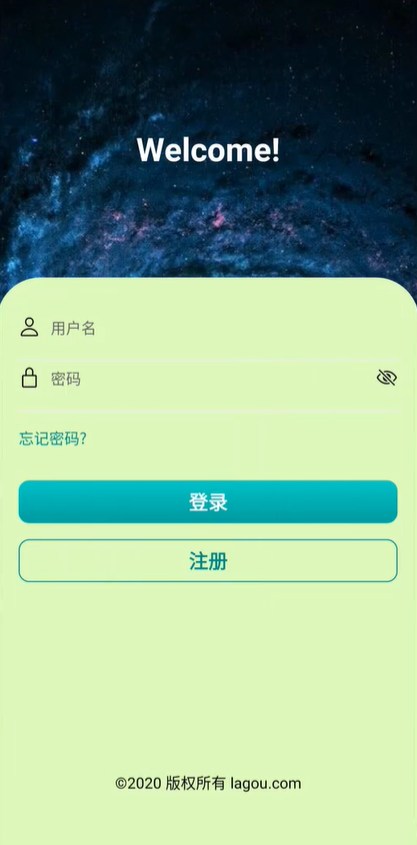
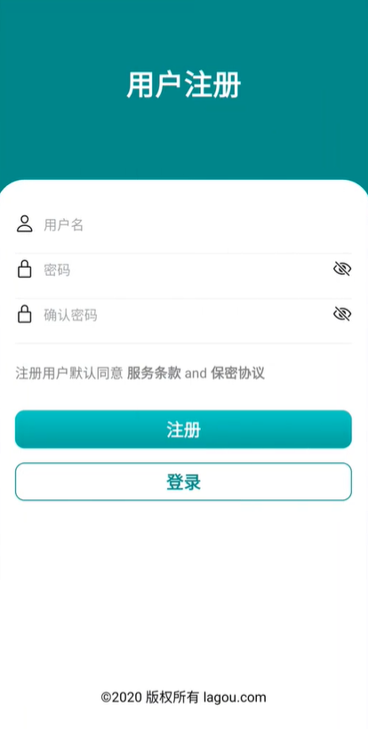
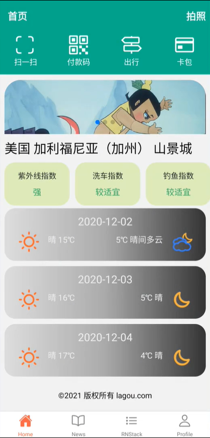
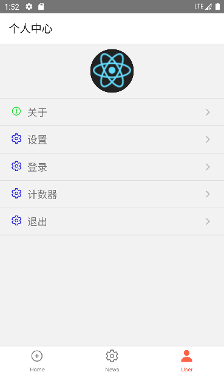
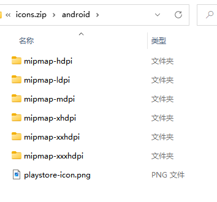
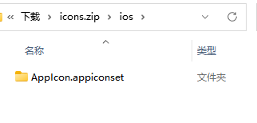

# RN 项目实践

## 项目规划

通过学过的 React Native 基础支持，完成一款接近实战的 App 开发。主要的功能点包括：

-   路由规划
-   数据接口
    -   申请数据接口
    -   调试数据接口
    -   调用数据接口
-   UI 界面
    -   首页
    -   获取地理位置，并根据地理位置调用相关接口
    -   新闻页
    -   调用新闻列表接口，并展示
    -   用户页
    -   用户登录，注册以及个人中心
-   状态管理
    -   Redux
    -   路由鉴权

## 数据接口

#### 申请接口

第三方接口的申请方式大同小异。这里，我们以和风天气为例。来申请第三方接口
和风天气提供了免费的天气预报相关的 API。但是，使用之前，需要[注册申请](https://dev.qweather.com/docs/start/#documentation)

#### 调试接口

根据接口（例如：和风天气接口）的使用规则，在 APIfox 中调试接口了。

#### 调用接口

React Native 提供了和 web 标准一致的 Fetch API，用于满足开发者访问网络的需求。

## UI 界面

UI 界面中用到的技术，大部分都是之前学习的。包括 RN 样式，RN 组件，RN 路由等。按照项目功能划
分。包括：

-   首页
    -   Tab 导航
    -   header 设置
    -   响应式效果（通过 Dimensions 完成）
    -   轮播图（react-native-swiper）
    -   和风天气接口（获取地理位置，调用接口，FlatList 展示，线性渐变展示等）
-   新闻页
    -   调用新闻接口，通过 FlatList 展示
    -   通过 WebView，展示新闻详情（路由声明，路由跳转，路由传参）
-   用户页
-   用户中心
    -   基本页面布局
    -   图标展示（Ionicons）
    -   路由声明与跳转
-   用户登录
    -   背景图（ImageBackground）
    -   动画效果（react-native-linear-gradient）
    -   表单（常用属性和方法，数据验证与提示）
-   用户注册 - 所用技术与用户登录页面一致









## 状态管理

Redux 是 React 中进行状态管理的工具。

## 路由鉴权

大多数应用都有用户鉴权的要求，用户鉴权通过之后，才能访问与之相关的私有数据。
典型的鉴权流是这样的

-   用户打开应用
-   应用获取鉴权状态
    -   初始会根据登录信息，从 Redux 中获取（此时可以将状态信息持久化存储）
    -   再次进入 App，从持久化存储（例如：AsyncStorage）中获取鉴权状态
-   当状态加载后，判断用户鉴权状态是否合法，合法跳转到首页，否则弹出鉴权页面
-   当用户退出应用后，我们清除鉴权状态，并跳回鉴权页面

## 项目优化

#### 使用第三方 UI 组件

RN 官方组件太过简单，而自己去写样式又太浪费时间。而选择一些成熟的，第三方 UI 组件库。会让我
们的项目开发事半功倍。
这里列出一些比较流行的

-   [NativeBase](https://github.com/GeekyAnts/NativeBase) 目前在 Github 上有 18.8k 个星
-   [react-native-paper](https://github.com/callstack/react-native-paper) 目前在 Github 上有 10.1k 个星

#### 修改应用 logo

应用图标对尺寸有要求，比较简单地方式是，准备一张 1024\*1024 的图片，然后 [在线生成](https://icon.wuruihong.com/)。生成之后，我们可以将生成的图标下载下来。解压后，我们会得到两个目录：

-   分别将上述目录，复制到 RN 项目对应的位置中
    
    

1. Android: 替换 android/app/src/main/res 下对应的内容。
2. iOS: 替换 ios/项目名称/Images.xcassets/AppIcon.appiconset 中的内容。

#### 修改应用名称

-   Android: 编辑 android/app/src/main/res/values/strings.xml

```js
<resources>
    <string name='app_name'>你的应用名称</string>
</resources>
```

-   iOS: 编辑 ios/项目名称/Info.plist 文件，定位到 CFBundleDisplayName

```js
<key>CFBundleDisplayName</key>
<string>你的应用名称</string>
...
```
