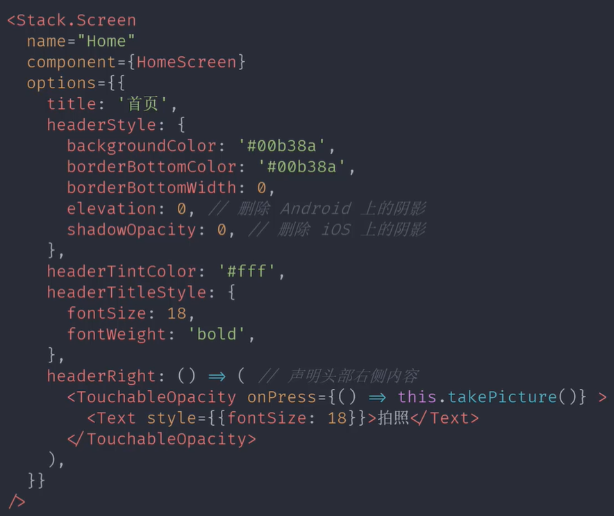
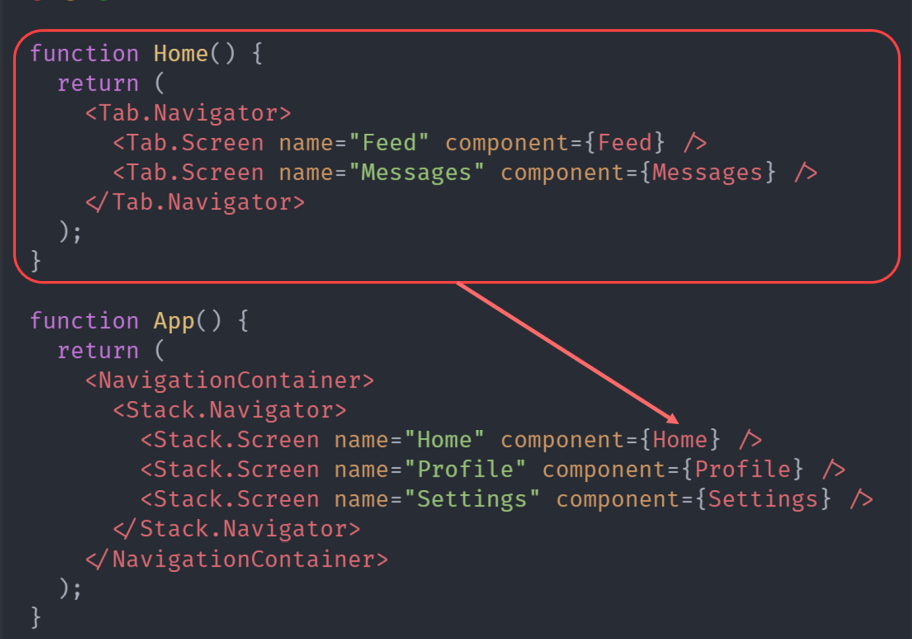
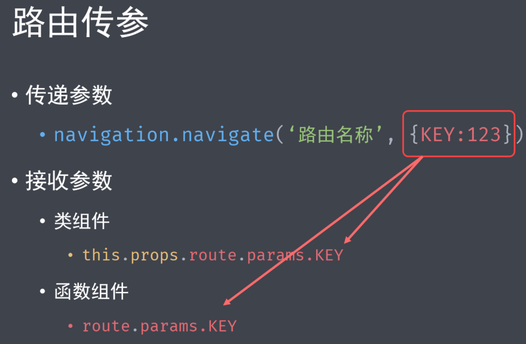

# 路由与导航

## 简介

#### 在 React 中实现路由

-   React-Router: 适用于 Web 项目。
-   React-Navigation: 没有像浏览器那样的内置导航 API （location 对象，history 对象）。
    -   React Native 中的导航是通过 [React-Navigation](https://github.com/react-navigation/react-navigation) 来完成的。
    -   React Native 把导航和路由都集中到了 ReactNavigation 中

#### 常用的四个组件

-   StackNavigator  
    栈导航器在 React Native 中的作用，相当于 BOM 中的 history 对象。用来跳转页面和传递参数。
    与浏览器端导航不同的是。 StackNavigator 还提供了路由之间的 手势 和 动画 。
    只有声明了栈导航之后，才能在 React Native 中执行跳转。
-   TabNavigator  
    标签导航器（例如：底部标签栏），用来区分模块。
-   DrawerNavigator  
    抽屉导航器，在 App 侧面划出的导航页面。
-   MaterialTopTabNavigator  
    支持左右滑动的 Tab 菜单

## 基础依赖的安装

```js
yarn add @react-navigation/native
```

使用原生栈导航器

```js
yarn add @react-navigation/native-stack
```

详细的教程可以参考[官方指导](https://reactnavigation.org/docs/getting-started/)

## NavigationContainer

现在，我们需要将整个应用程序包装在 中

```js
import * as React from 'react';
import { NavigationContainer } from '@react-navigation/native';

export default function App() {
    return (
        <NavigationContainer>{/* Rest of your app code */}</NavigationContainer>
    );
}
```

> 注意：在典型的 React Native 应用程序中，只能在您的应用程序中根目录使用一次。除非你有特定的用例，否则你不应该嵌套多个

## 举个例子

```js
function DetailsScreen() {
    return (
        <View
            style={{ flex: 1, alignItems: 'center', justifyContent: 'center' }}
        >
            <Text>Details Screen</Text>
        </View>
    );
}

const Stack = createNativeStackNavigator();

function App() {
    return (
        <NavigationContainer>
            <Stack.Navigator initialRouteName='Home'>
                <Stack.Screen
                    name='Home'
                    component={HomeScreen}
                    options={{ title: 'Overview' }}
                />
                <Stack.Screen name='Details' component={DetailsScreen} />
            </Stack.Navigator>
        </NavigationContainer>
    );
}
```

options: 可以在每个屏幕组件的 prop 中传递

## Stack.Screen 中 options 属性

基本属性展示参考下图：


## 底部标签导航器

效果如下（不支持滑动切换）：

<video autoplay muted width=210 src="./video/bottom-tabs-demo-1.mp4" />

代码使用如下：

```js
function HomeScreen(prop) {
    return (
        <View style={[styles.container]}>
            <Text style={[styles.text]}>Home Screen</Text>
        </View>
    );
}

function NewsScreen(prop) {
    return (
        <View style={[styles.container]}>
            <Text style={[styles.text]}>News Screen</Text>
        </View>
    );
}

{
    /* 创建底部标签导航器 */
}
const Tab = createBottomTabNavigator();

export default class index extends Component {
    render() {
        return (
            <Tab.Navigator
                screenOptions={({ route }) => ({
                    tabBarIcon: ({ focused, color, size }) => {
                        let iconName;

                        if (route.name === 'Home') {
                            iconName = focused
                                ? 'add-circle'
                                : 'add-circle-outline';
                        } else if (route.name === 'News') {
                            iconName = focused ? 'person' : 'person-outline';
                        }
                        return (
                            <Ionicons
                                name={iconName}
                                size={size}
                                color={color}
                            />
                        );
                    },
                })}
                tabBarOptions={{
                    activeTintColor: 'tomato',
                    inactiveTintColor: 'gray',
                }}
            >
                <Tab.Screen name='Home' component={HomeScreen} />
                <Tab.Screen name='News' component={NewsScreen} />
            </Tab.Navigator>
        );
    }
}
```

## 矢量图标组件库

[React-native-vector-icons](https://github.com/oblador/react-native-vector-icons) 是著名的图标组件，包含了世界各大公司的矢量图标。

-   安装 npm 包

```js
yarn add react-native-vector-icons --save
yarn add @types/react-native-vector-icons --save-dev
```

-   配置 Android：选项：使用 Gradle（推荐）
    这种方法的优点是在构建时从该模块复制字体，因此字体和 JS 始终保持同步，从而使升级变得轻松。编辑 android/app/build.gradle 并添加以下内容

```js
apply from: "../../node_modules/react-native-vector-icons/fonts.gradle"
```

    要自定义正在复制的文件，请添加以下内容:

```js
project.ext.vectoricons = [
    iconFontNames: [ 'MaterialIcons.ttf', 'EvilIcons.ttf' ] // Name of the font files you want to copy
]

apply from: "../../node_modules/react-native-vector-icons/fonts.gradle"
```

## 抽屉导航器

效果如下：

<video autoplay muted width=210 src="./video/drawer.mp4" />

要使用此导航器，请确保您具有 @react-navigation/native 和 它的依赖（[参考此文档](https://reactnavigation.org/docs/getting-started/)）

```js
yarn add @react-navigation/drawer
```

然后，您需要安装和配置抽屉导航器所需的库

```js
yarn add react-native-gesture-handler react-native-reanimated
```

最后，请在入口文件的顶部添加以下内容（确保它位于顶部，并且之前没有其他内容）如：index.js 或 App.js

```js
import 'react-native-gesture-handler';
```

#### 配置抽屉导航

```js
<Drawer.Navigator
    drawerPosition={'right'} // 菜单右侧显示
    drawerType='slide' // 设置抽屉菜单动画效果
    drawerStyle={{
        backgroundColor: '#cdb', // 设置抽屉菜单背景色
        width: 180, // 设置抽屉菜单宽度
    }}
    drawerContentOptions={{
        activeTintColor: '#e91e63', // 设置活跃字体颜色
        itemStyle: {
            // 设置菜单项样式
            marginVertical: 20, // 设置菜单的垂直外间距
        },
    }}
>
    <Drawer.Screen name='Feed' component={Feed} />
    <Drawer.Screen
        name='Notifications'
        component={Notifications}
        options={{
            title: '通知', // 菜单标题
            // drawerLabel:  // 替代 title,返回复杂的组件
            // drawerIcon:   // 返回图标的函数
            // headerShown:  // 是否显示 header  默认 false 不显示
            // headerLeft:   // 函数，声明 header 左侧的显示内容
            // headerRight:  // 函数，声明 header 右侧的显示内容
        }}
    />
</Drawer.Navigator>
```

## 材料顶部标签导航器

效果如下：

<video autoplay muted width=210 src="./video/material-top-tabs.mp4" />

生成可以左右滑动的 Tab 导航。屏幕顶部的材质设计主题标签栏，可让您通过点击选项卡或水平滑动来切换不同的路线。
首先安装 npm 包：

```js
yarn add @react-navigation/material-top-tabs react-native-tab-view
```

然后安装导航器所需的视图 react-native-pager-view

```js
yarn add react-native-pager-view
```

使用示例：

```js
import { createMaterialTopTabNavigator } from '@react-navigation/material-top-tabs';

const Tab = createMaterialTopTabNavigator();

function MyTabs() {
    return (
        <Tab.Navigator
            initialRouteName='Feed'
            screenOptions={{
                tabBarActiveTintColor: '#e91e63',
                tabBarLabelStyle: { fontSize: 12 },
                tabBarStyle: { backgroundColor: 'powderblue' },
            }}
        >
            <Tab.Screen
                name='Feed'
                component={Feed}
                options={{ tabBarLabel: 'Home' }}
            />
            <Tab.Screen
                name='Notifications'
                component={Notifications}
                options={{ tabBarLabel: 'Updates' }}
            />
            <Tab.Screen
                name='Profile'
                component={Profile}
                options={{ tabBarLabel: 'Profile' }}
            />
        </Tab.Navigator>
    );
}
```

## 路由与导航

在一个导航的内部，渲染另一个导航，如下所示：

关于使用注意事项，详见[官方文档](https://reactnavigation.org/docs/nesting-navigators)

## 路由传参

通过下图示意：

详见[官方文档](https://reactnavigation.org/docs/params/)
