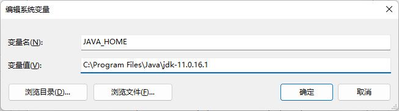
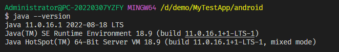
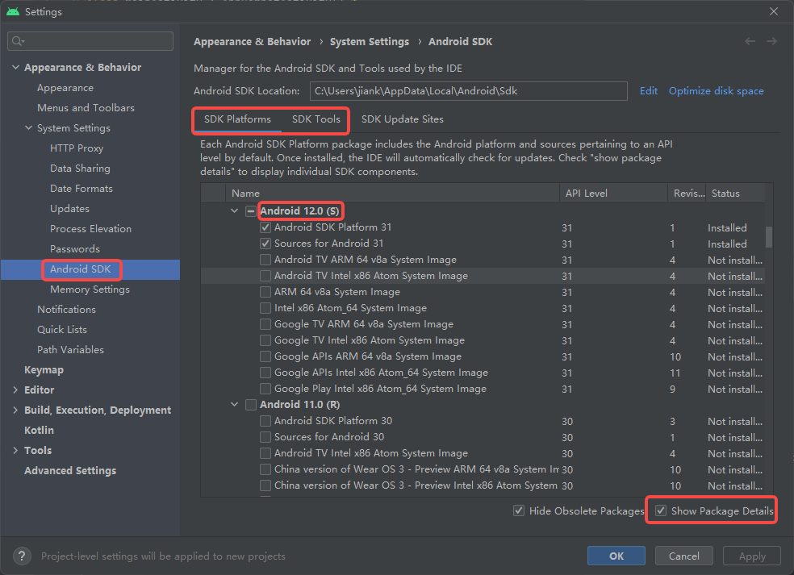
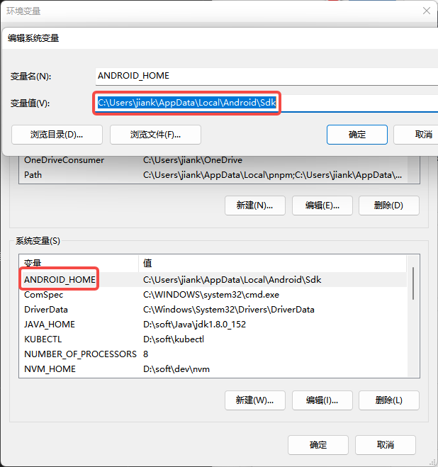
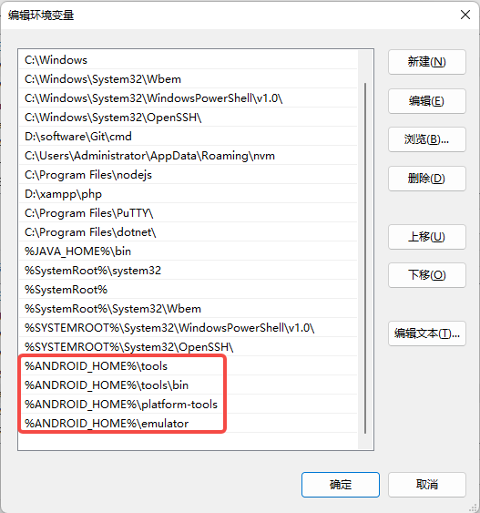
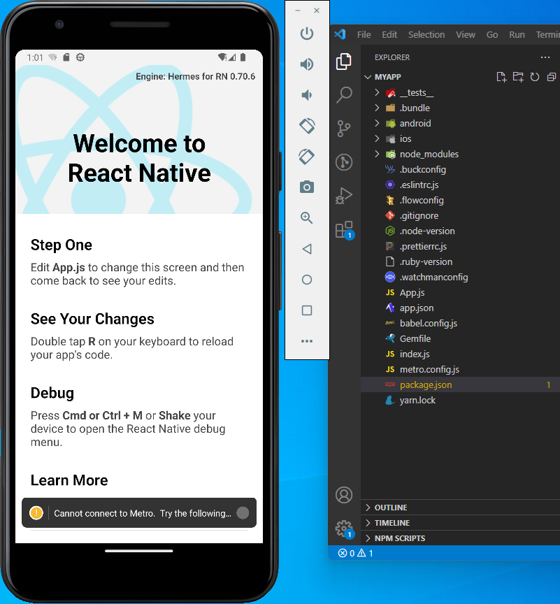
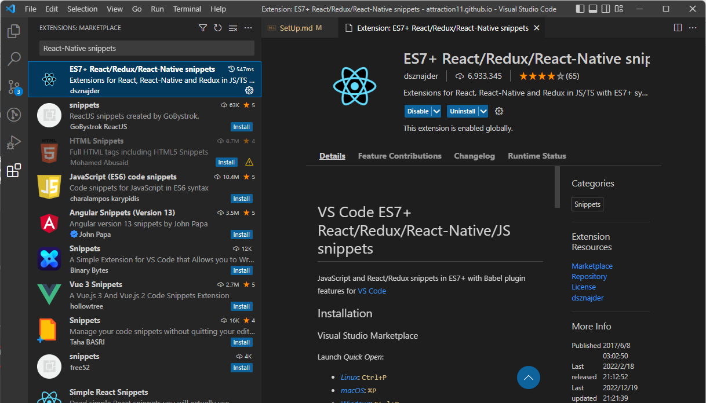
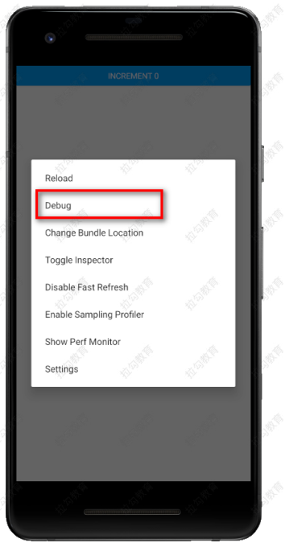

# React Native 环境搭建

## 基础环境搭建

-   "操作系统": "windows 11",
-   "node": "16.14.0",
-   "yarn": "1.22.17",
-   "react": "18.1.0",
-   "react-native": "0.70.6"
-   "Android JDK": "Android 12 （S）",
-   "java": "11.0.16.1",

## 搭建安卓环境

-   安装 Java JDK

    -   下载 JDK （Java SE Development Kit）11 版本
        -   https://www.oracle.com/java/technologies/javase/jdk11-archive-downloads.html
    -   下载时要求登陆（请先注册 Oracle 账号）
    -   解压 jdk-11.0.16.1_windows-x64_bin.zip 到某个文件目录
    -   配置系统环境变量
        
    -   命令行中，输入 java --version，验证安装是否成功
        

-   安装 Android Studio
    -   下载 Android Studio
        -   https://developer.android.com/studio/index.html
    -   安装 Android Studio（一直“下一步”）
    -   启动 Android Studio
        -   初次启动，需要安装组件（组件约 2 GB，安装后占用空间约 8 GB）
        -   安装组件的过程巨长巨长巨长，要有耐心
    -   创建项目
        -   安装 Android JDK
        -   配置环境变量
    -   cd 到项目的 Android 目录，执行 ./gradlew --version 查看应用的 java 版本
-   详细内容参考：[RN 安卓环境搭建](./files/RN%20%E5%AE%89%E5%8D%93%E7%8E%AF%E5%A2%83%E6%90%AD%E5%BB%BA.pdf)

## 安装 Android SDK

-   Android SDK 是针对安卓开发的套件
-   虽然 Android Studio 默认会安装最新版本的 Android SDK,但是，目前编译 React Native 0.70.6 应用需要的是 Android 12 （S）版本的 SDK
-   打开 Android Studio，在菜单 Tools 下找到＂SDK Manager



## 配置环境变量

-   打开 Android Studio，点击菜单 Tools→SDK Manager，找到 Appearance & Behavior →System Settings → Android SDK 查看 sdk 地址



-   配置跟 ANDROID_HOME 相关的环境变量（将平台工具添加到路径）



## 创建一个新的应用程序

-   React Native 有一个内置的命令行界面，你可以用它来生成一个新项目。npx 您无需使用 Node.js 附带的全局安装任何东西即可访问它。让我们创建一个名为“AwesomeProject”的新 React Native 项目

```js
npx react-native init MyTestApp
```

-   使用特定版本或模板,使用自定义 React Native 模板（例如 TypeScript）

```js
npx react-native init MyTestApp --version X.XX.X
npx react-native init MyTestApp --template react-native-template-typescript
```

-   进入项目并运行项目

```js
cd MyTestApp
yarn android
```



## 安装 Vscode 插件

推荐在 vscode 下安装插件：ES7 React/Redux/GraphQL/React-Native snippets。她具有很多有用的快捷命令。可以让我们快速，高效的写 RN 代码



-   rnc （react native class）

```js
import React, { Component } from 'react';
import { Text, View } from 'react-native';
export default class FileName extends Component {
    render() {
        return (
            <View>
                <Text> $2 </Text>
            </View>
        );
    }
}
```

-   rnf （react native function）

```js
import React from 'react';
import { View, Text } from 'react-native';
export default function $1() {
    return (
        <View>
            <Text> $2 </Text>
        </View>
    );
}
```

## 调试工具

调试 RN 一般有两种方式：

-   浏览器调试
    -   点击模拟器（让模拟器获取焦点）
    -   ctrl+m 快捷键，打开菜单，然后点选 debug
    -   然后会跳转到浏览器，在浏览器上你会看到如下效果。然后，在页面上右键，点“检查”。就可以调试了
    -   配置捕获网络请求 RN 发送的网络请求，默认是无法通过浏览器调试的。解决方案如下：在入口文件（ index.js 或 App.js）中加入这一行



```js
GLOBAL.XMLHttpRequest = GLOBAL.originalXMLHttpRequest || GLOBAL.XMLHttpRequest;
```

-   真机调试
    -   打开 USB 调试模式，通过 USB 线将电脑和手机连起来
    -   启动应用，在手机上安装应用
