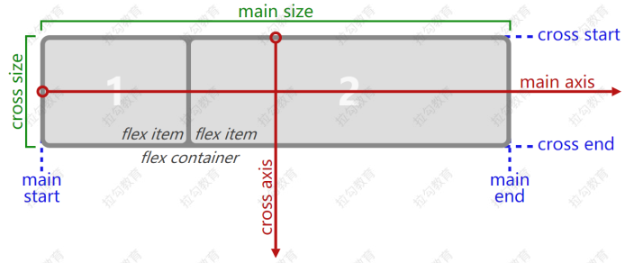
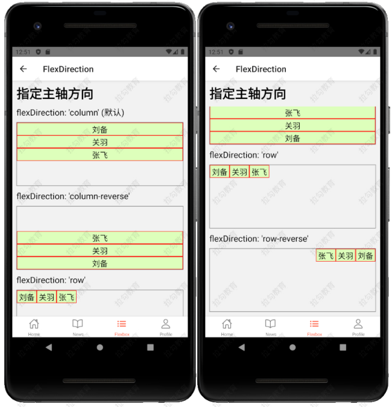
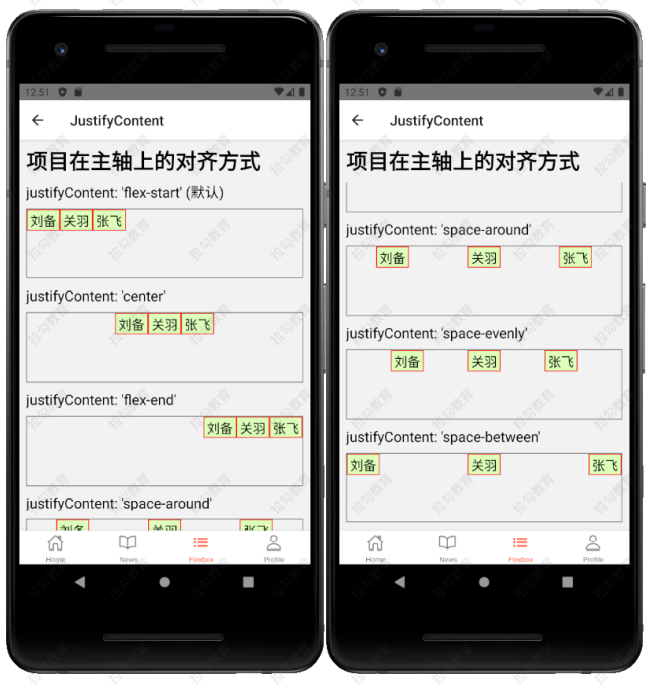
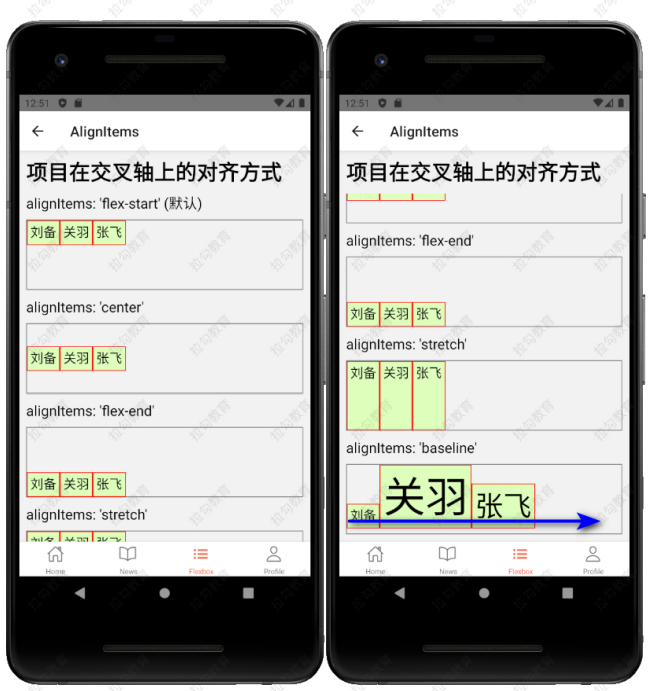
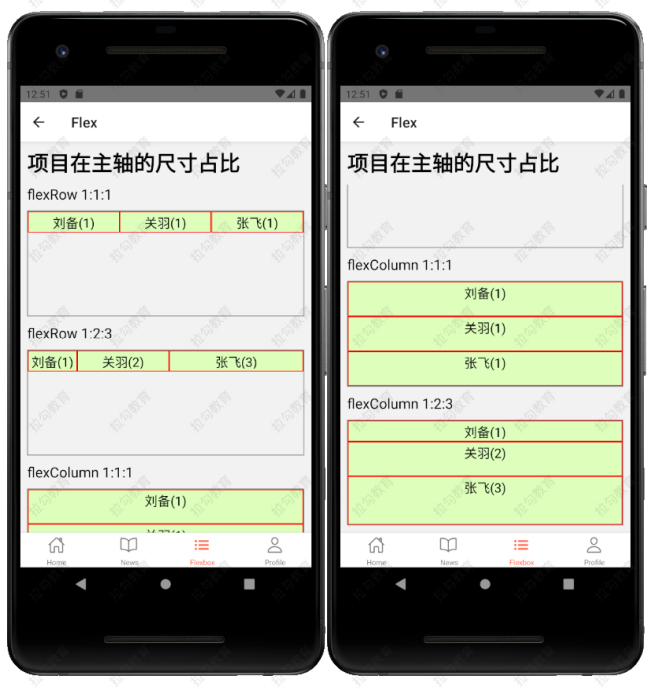

# StyleSheet

## RN 中的样式与 CSS 的区别

StyleSheet 是 RN 中用来声明样式的语法

-   RN 中的样式，没有继承性（子组件不能继承父组件的样式）
    -   CSS：Cascading Style Sheet（级联样式表）
    -   SS：Style Sheet（样式表）
-   样式名称使用小驼峰式命名
    -   例如：CSS 中的 font-size，在 RN 中写成 fontSize
-   所有尺寸都是没有单位
    -   例如：width: 100 这是因为 RN 中尺寸只有一个单位，dp（ 一种基于屏幕密度的抽象单位，默认省略。详情查看 [PixelRatio](https://reactnative.dev/docs/pixelratio))

```js
import { PixelRatio } from "react-native";
const dp2px = (dp) => PixelRatio.getPixelSizeForLayoutSize(dp);
const px2dp = (px) => PixelRatio.roundToNearestPixel(px);
// 按照下面的方式可实现 px 与 dp 之间的转换（比如 100px*200px 的 View）
<View
    style={{ width: px2dp(100), height: px2dp(200), backgroundColor: "red" }}
/>;
```

-   RN 中有些样式名的写法与 CSS 不同。例如：marginVertical

## RN 样式的声明方式

-   通过 style 属性直接声明

    -   属性值是对象

    ```js
    // 基本用法
    <Text style={{color: '#e33', fontSize: 30}}> Hello World </Text>
    // 越靠后的样式，优先级越高；下面字体显示为蓝色
    <Text style={{color: 'red', color: 'blue',}}> Hello World </Text>
    ```

    -   属性值是数组

    ```js
    // 数组元素是对象，这样可以传入多个样式对象，方便构造复杂的样式效果
    <Text style={[{ fontSize: 40 }, { color: "green" }]}> Hello World </Text>
    ```

-   通过 StyleSheet 声明（推荐）

    ```js
    // 引入 StyleSheet
    import { Text, StyleSheet } from "react-native";
    <View style={styles.container}>
        <Text style={styles.red}>Hello World</Text>
        {/* 数组中可以传入多个样式 */}
        <Text style={[styles.red, styles.fontLarge]}>Hello RN</Text>
        <Text style={[styles.red, styles.fontMedium]}>Hello RN</Text>
        <Text style={[styles.red, styles.fontSmall]}>Hello RN</Text>
    </View>;
    // 通过 StyleSheet.create({}) 创建样式，与组件内容分开（使用 StyleSheet 之前要先引入）
    const styles = StyleSheet.create({
        container: {
            marginTop: 50,
        },
        red: {
            color: "red",
        },
        fontLarge: {
            fontSize: 40,
        },
        fontMedium: {
            fontSize: 30,
        },
        fontSmall: {
            fontSize: 20,
        },
    });
    ```

-   在实际开发中。样式值还可以通过变量的方式指定，例如：
    ```js
    <View
        style={[
            styles.base,
            {
                width: this.state.width,
                height: this.state.width * this.state.aspectRatio,
            },
        ]}
    />
    ```

注意：RN 中的样式不支持 Less 或 Sass 中的 MIxin 特性（这也是一直被吐槽的）

## RN 中的 flexbox 布局

-   传统布局方式
    -   文档流布局：根据代码出现的先后顺序布局，先出现的在前，后出现的在后
    -   浮动：例如：左浮动，有浮动，清除浮动等；可以打破文档流的固有模式，实现更为丰富的布局
    -   定位：绝对定位，相对定位，固定定位
-   传统布局方式，对于那些特殊布局非常不方便，比如，垂直居中就不容易实现。

> 基于此，2009 年，W3C 提出了一种新的方案：Flex 布局，可以简便、完整、响应式地实现各种页面布局。
> Flexbox 规范详情：https://www.w3.org/TR/css-flexbox-1

## Flexbox 意为"弹性布局"

设为 Flex 布局以后，子元素的 float 、 clear 和 vertical-align 属性将失效

```css
div {
    display: flex;
}
```

-   术语
    -   容器：采用 Flex 布局的元素，称为 Flex 容器（flex container），简称"容器"。
    -   项目：它的所有子元素自动成为容器成员，称为 Flex 项目（flex item），简称"项目



> 容器默认存在两根轴：主轴（main axis）和交叉轴（cross axis）。
> 主轴的开始位置（与边框的交叉点）叫做 main start ，结束位置叫做 main end ；
> 交叉轴的开始位置叫做 cross start ，结束位置叫做 cross end
> 项目默认沿主轴排列。单个项目占据的主轴空间叫做 main size ，占据的交叉轴空间叫做 cross size

-   属性

    -   flexDirection 用来指定主轴方向（CSS 中对应的属性名是: flex-direction）

    

    -   justifyContent （CSS 中对应的属性名是 justify-content）用来指定项目在主轴上的对齐方式

    

    -   alignItems （CSS 中对应的属性名是 align-items）用来指定项目在交叉轴上的对齐方式

    

    -   flex 是以数字的方式，来声明项目在主轴上的尺寸占比

    
