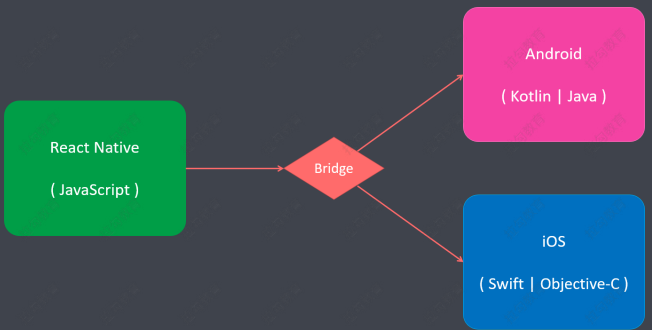
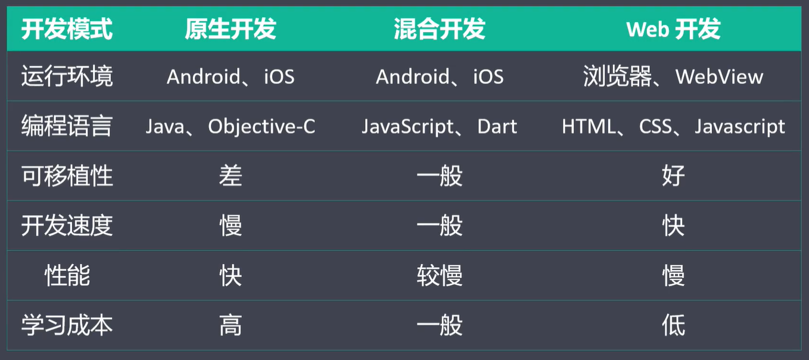
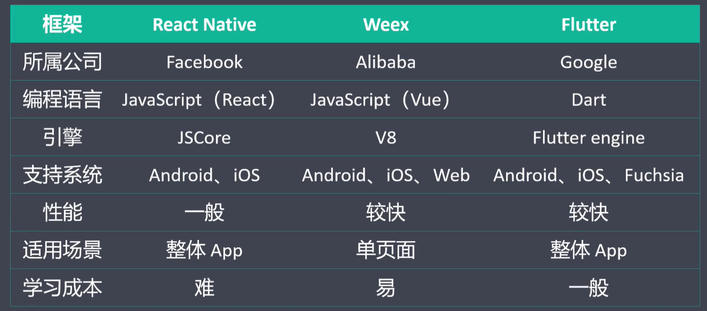

# React Native 介绍

## 简介

React Native ( 简称 RN ) 是 Facebook 于 2015 年 4 月开源的跨平台移动应用开发框架，是 Facebook 早
先开源的 JS 框架 React 在原生移动应用平台的衍生产物，支持 iOS 和 Android 两大平台。RN 使用
Javascript 语言，因此熟悉 Web 前端开发的技术人员，只需很少的学习就可以进入移动应用开发领域。

## 原理

RN 中的代码，经过转换后，会生成 Android 和 iOS 对应的原生代码。我们开发时，写的是
JavaScript，用的是 React 语法。项目编译后会生成两个环境下对应的代码。

## 移动 App 开发模式

一般移动 App 开发模式有原生开发、混合开发、H5 开发。 对比不同的开发模式：

目前常见的混合开发框架有 React Native、Weex、Flutter。各个框架之间的对比如下：

## React Native 的优势

-   开发体验好：用统一的代码规范开发移动端程序、不用关注移动端的差异
-   开发成本低：开发一次，可以生成 android 和 IOS 两个系统的 APP
-   学习成本低：只要掌握 JS 和 React，就可以进行移动端开发。

## React Native 的不足

-   目前还是不够成熟：版本更新维护频繁，学习成本高，试错成本高
-   性能差：整体性能仍不如原生
-   兼容性差：涉及底层功能，需要针对双端单独开发
