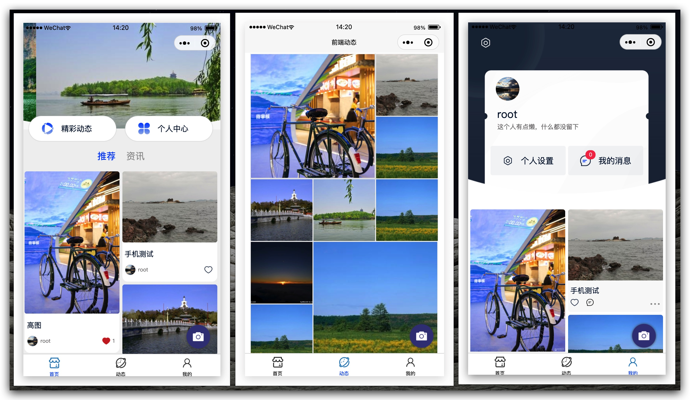
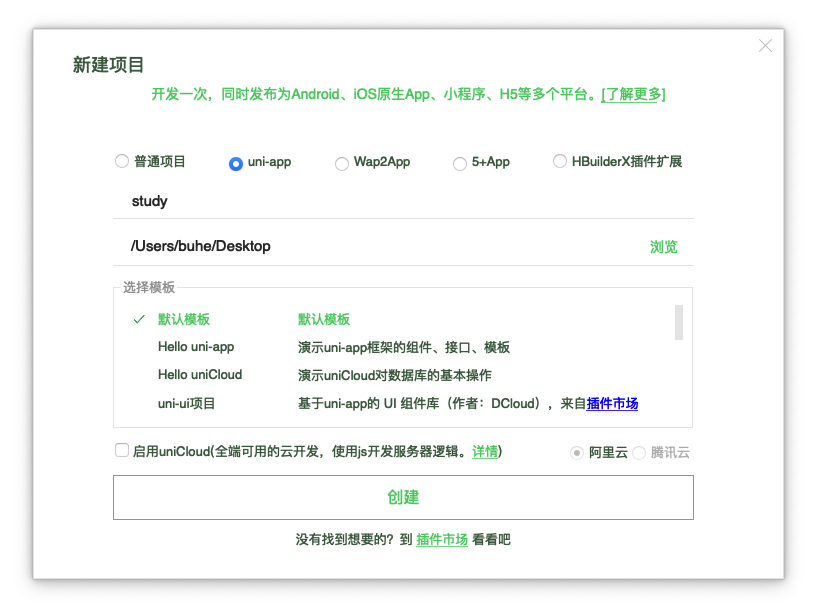
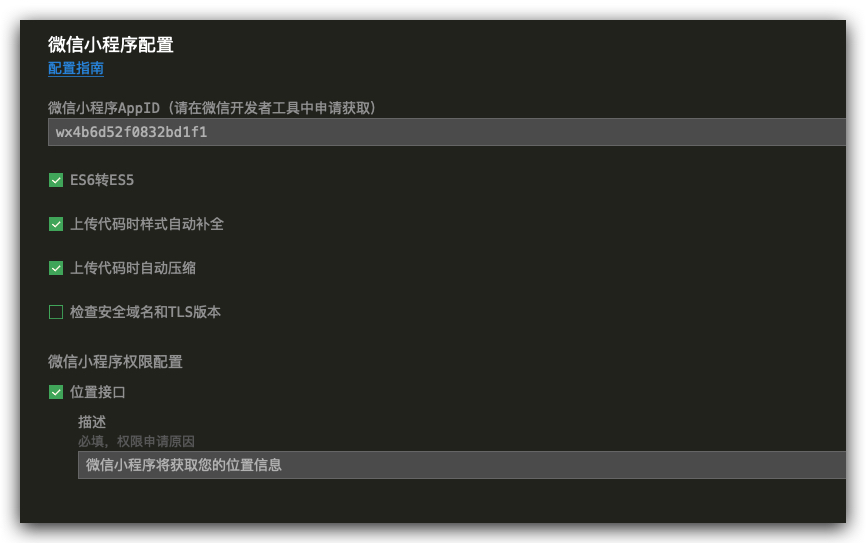
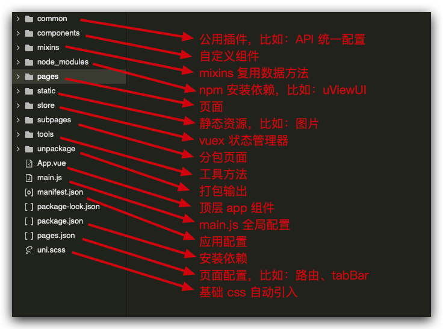
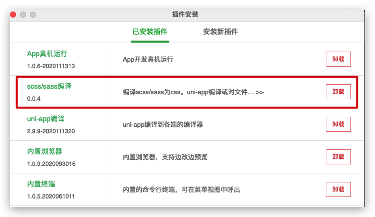

# 基于 UniAPP 社区论坛项目多端开发实战

> 学习目的：
>
> ​ 通过学习，基于 Vue 、微信小程序、uniapp 开发框架，对标企业级「大前端」开发实践标准，从零到一构建社区论坛类客户端应用项目全流程， 输出相关 H5、微信小程序、安卓、IOS 多客户端应用。

## 一、项目准备

### 1.1 项目业务逻辑介绍

> **相关文档**
>
> 1. API 接口文档，详情查阅《 ThinkSNS 社区服务接口文档.md 》
> 2. ThinkSNS 综合管理系统，开源代码 git 地址：https://gitee.com/joysapp/thinksns-plus
> 3. 客户端小程序源代码 git 地址：https://gitee.com/buhehpc/jxsns.git

> **ThinkSNS 简介**
>
> ThinkSNS 是智士软件旗下的开源微博、社交系统，含微博、论坛、资讯、频道、商城、活动、定位、找人、直播、问答等一系列功能。
>
> ThinkSNS 采用 PHP+MySQL 技术，核心（微博、用户系统）+ 多应用 + 多插件的产品模式，拥有 Web、H5、IOS、Android APP 以及微信、支付宝、百度等小程序多端服务场景。

> **ThinkSNS 服务**
>
> ThinkSNS 能够建立社交网站、微博平台、教育平台、商城系统、粉丝社区、知识社区、企业文化社区等多种互联网平台，是移动互联网创业的首选二次开发平台。

> **社区、论坛实践项目简介**
>
> 1. 基于 ThinkSNS 开源免费体系，搭建行业内基础 PGC、UGC 内容管理社区、论坛服务体系。
> 2. 商家运营人员可以发布管理 PGC 资讯，管理用户、动态、广告等操作
> 3. 客户端用户可以查阅、点赞、评论、分享相关动态资讯内容，可以自主发布、删除 UGC 内容、同步 UGC 内容审核
>
> 

### 1.2 使用 UniAPP 构建项目

> 1. 使用 Hbuilder uni-app 默认空白模板构建项目 ` study`
>
> 

> 2. 在 manifest.json 文件中配置微信小程序相关信息
>
> 

### 1.3 构建项目文件结构

> 1. 构建项目基础结构
>
> 

> 2. 初始化基础页面及配置 `pages.json` Pages 路由
>
> ```json
> "pages": [ //pages数组中第一项表示应用启动页，参考：https://uniapp.dcloud.io/collocation/pages
> 		{
> 			"path": "pages/index/index",
> 			"style": {
> 				// custorm 取消顶部的 navBar 显示
> 				"navigationStyle": "custom",
> 				"enablePullDownRefresh": true
> 			}
> 		}, {
> 			"path": "pages/feeds/feeds",
> 			"style": {
> 				"navigationBarTitleText": "前端动态",
> 				"enablePullDownRefresh": true
> 			}
>
> 		}, {
> 			"path": "pages/me/me",
> 			"style": {
> 				"navigationStyle": "custom",
> 				"enablePullDownRefresh": true
> 			}
>
> 		}, {
> 			"path": "pages/webview/webview",
> 			"style": {
> 				"navigationBarTitleText": "",
> 				"enablePullDownRefresh": false
> 			}
>
> 		}
> 	]
> ```

### 1.4 配置页面 TabBar 导航

> ```json
> "tabBar": {
> 		"color": "#000",
> 		"selectedColor": "#0050FF",
> 		"list": [{
> 				"iconPath": "/static/tabbar-icons/index.png",
> 				"selectedIconPath": "/static/tabbar-icons/index_s.png",
> 				"text": "首页",
> 				"pagePath": "pages/index/index"
> 			},
> 			{
> 				"iconPath": "/static/tabbar-icons/feeds.png",
> 				"selectedIconPath": "/static/tabbar-icons/feeds_s.png",
> 				"text": "动态",
> 				"pagePath": "pages/feeds/feeds"
> 			},
> 			{
> 				"iconPath": "/static/tabbar-icons/me.png",
> 				"selectedIconPath": "/static/tabbar-icons/me_s.png",
> 				"text": "我的",
> 				"pagePath": "pages/me/me"
> 			}
> 		]
> 	}
> ```

### 1.5 使用 npm 引入 uView UI 插件库

> 1. 使用 HBuilder 导入插件 [uViewUI](https://ext.dcloud.net.cn/plugin?id=1593) 或者使用 npm 安装相关依赖（推荐使用 npm 安装）
>
> ```js
> // 如果您的项目是HX创建的，根目录又没有package.json文件的话，请先执行如下命令：
> npm init -y
> // 安装
> npm install uview-ui
> // 更新
> npm update uview-ui
> ```
>
> 2. `main.js`引入 uView 库
>
> ```js
> // main.js
> import uView from 'uview-ui';
> Vue.use(uView);
> ```
>
> 3. 编辑器安装相关依赖 工具 — 插件安装 — scss 编译支持
>
> 
>
> 4. `App.vue`引入基础样式
>
> ```css
> /* App.vue */
> <style lang="scss">
> @import "uview-ui/index.scss";
> </style>
> ```
>
> 5. `uni.scss`引入全局 scss 变量文件
>
> ```css
> /* uni.scss */
> @import 'uview-ui/theme.scss';
> ```
>
> 6. `pages.json`配置 easycom 规则(按需引入)
>
> ```js
> // pages.json
> {
>     "easycom": {
>         // 下载安装的方式需要前面的"@/"，npm安装的方式无需"@/"
>         // "^u-(.*)": "@/uview-ui/components/u-$1/u-$1.vue"
>         // npm安装方式
>         "^u-(.*)": "uview-ui/components/u-$1/u-$1.vue"
>     },
>     // 此为本身已有的内容
>     "pages": [
>         // ......
>     ]
> }
> ```

## 二、首页功能实现

### 2.1 首页 header 广告位轮播图功能实现

> 关键技术点：
>
> 1. swiper 轮播器组件的使用
> 2. 使用 this.$u.get/post 异步请求数据
> 3. 使用 v-for 循环遍历渲染轮播内容

> ```vue
> <!-- 页面 header 相关部分 -->
> <view class="header-box">
> 		<!-- 顶部广告位轮播图 -->
> 		<swiper class="swiper" :indicator-dots="false" :autoplay="true" :interval="2500" :duration="500">
> 				<swiper-item v-for="item in swiperAdList" :key="item.id">
> 					<navigator open-type="navigate" :url=" '/pages/webview/webview?url='+item.link">
> 						<image class="banner-swiper-img" :src="item.image" mode="aspectFill" />
> 					</navigator>
> 				</swiper-item>
> 		</swiper>
> 		<!-- 遮罩使用弧形框 -->
> 		<image class="crile" src="@/static/crile.png" mode="aspectFill" />
> 		<!-- 两个选项按钮 -->
> 		<view class="card-header">
> 				<view class="card-one card-left" @tap="gotoFeeds('/pages/feeds/feeds')">
> 					<image class="img" src="@/static/coffee.png" mode="aspectFill" />
> 					<view class="iright">
> 						<view class="title">精彩动态</view>
> 					</view>
> 				</view>
> 				<view class="card-one card-right" @tap="gotoFeeds('/pages/me/me')">
> 					<image class="img" src="@/static/ran.png" mode="aspectFill" />
> 					<view class="iright">
> 						<view class="title">个人中心</view>
> 					</view>
> 				</view>
> 		</view>
> 			<!-- Tab 选项卡 -->
> 		<view class="tabs-box">
> 		<view class="one-nav" :class="currentSwiperIndex === 0 ? 'nav-actived' : '' " @tap="swiperChange(0)">推荐</view>
> 		<view class="one-nav" :class="currentSwiperIndex === 1 ? 'nav-actived' : '' " @tap="swiperChange(1)">资讯</view>
> 	</view>
> </view>
> <script>
> 			// 请求 广告轮播图信息
> 			async getAdverts() {
> 				let adverts = await this.$u.api.getAdvert({
> 					space: '1,2,3'
> 				})
> 				this.swiperAdList = adverts.data.map(item => {
> 					return {
> 						id: item.id,
> 						link: item.data.link,
> 						image: item.data.image
> 					}
> 				})
> 			}
> </script>
> ```

### 2.2 全局配置 WebView 展示第三方 web 页面

> 关键技术点：我们通常为整个应用的 Web H5 相关页面，构建一个专门用来展示的 webview 路由页面，但是要注意路由传参的时候，对应的 url 需要 decodeURI 、encodeURI

> ```vue
> <template>
>     <web-view :src="url" />
> </template>
> <script>
> export default {
>     data() {
>         return {
>             url: '',
>         };
>     },
>     // 接收传递过来的参数地址，将 web-view 相关页面展开集合到一个地方
>     onLoad(options) {
>         this.url = decodeURI(options.url);
>     },
> };
> </script>
> ```

### 2.3 uViewUI 网络 http 请求及 API 集中管理

> 1. 请求头、拦截、返回 `/common/http.interceptor.js` 相关配置
>
> ```js
> // 这里的vm，就是我们在vue文件里面的this，所以我们能在这里获取vuex的变量，比如存放在里面的token变量
> const install = (Vue, vm) => {
>     // 此为自定义配置参数，具体参数见上方说明
>     Vue.prototype.$u.http.setConfig({
>         baseUrl: 'http://47.115.83.135/api/v2', // 请求的本域名
>         dataType: 'json', // 设置为json，返回后会对数据进行一次JSON.parse()
>         showLoading: true, // 是否显示请求中的loading
>         loadingText: '请求中...', // 请求loading中的文字提示
>         loadingTime: 800, // 在此时间内，请求还没回来的话，就显示加载中动画，单位ms
>         originalData: true, // 是否在拦截器中返回服务端的原始数据
>         loadingMask: true, // 展示loading的时候，是否给一个透明的蒙层，防止触摸穿透
>         // 配置请求头信息
>         header: {
>             'content-type': 'application/json;charset=UTF-8',
>         },
>     });
>
>     // 请求拦截，配置Token等参数
>     Vue.prototype.$u.http.interceptor.request = (config) => {
>         // 引用token
>         // 方式一，存放在vuex的token，假设使用了uView封装的vuex方式
>         // 见：https://uviewui.com/components/globalVariable.html
>         // config.header.token = vm.token;
>
>         // 方式二，如果没有使用uView封装的vuex方法，那么需要使用$store.state获取
>         // config.header.token = vm.$store.state.token;
>
>         // 方式三，如果token放在了globalData，通过getApp().globalData获取
>         // config.header.token = getApp().globalData.username;
>
>         // 方式四，如果token放在了Storage本地存储中，拦截是每次请求都执行的
>         // 所以哪怕您重新登录修改了Storage，下一次的请求将会是最新值
>         // const token = uni.getStorageSync('token');
>         // config.header.token = token;
>         config.header.Token = 'xxxxxx';
>
>         // 可以对某个url进行特别处理，此url参数为this.$u.get(url)中的url值
>         // if(config.url == '/user/login') config.header.noToken = true;
>         // 最后需要将config进行return
>         return config;
>         // 如果return一个false值，则会取消本次请求
>         // if(config.url == '/user/rest') return false; // 取消某次请求
>     };
>
>     // 响应拦截，判断状态码是否通过
>     Vue.prototype.$u.http.interceptor.response = (res) => {
>         if (res.code == 401) {
>             // 如果返回false，则会调用Promise的reject回调，
>             // 并将进入this.$u.post(url).then().catch(res=>{})的catch回调中，res为服务端的返回值
>             vm.$u.toast('当前请求 API 接口不存在');
>             return false;
>         } else {
>             // res为服务端返回值，可能有code，result等字段
>             // 这里对res.result进行返回，将会在this.$u.post(url).then(res => {})的then回调中的res的到
>             // 如果配置了originalData为true，请留意这里的返回值
>             return res;
>         }
>     };
> };
>
> export default {
>     install,
> };
> ```

> 2. 请求 API 集中管理 `/common/http.api.js`
>
> ```js
> // 此处第二个参数vm，就是我们在页面使用的this，你可以通过vm获取vuex等操作，更多内容详见uView对拦截器的介绍部分：
> const install = (Vue, vm) => {
>     let api = {};
>     // 获取广告位列表信息
>     api.getAdvert = (params) =>
>         vm.$u.get('/advertisingspace/advertising', params);
>
>     // 获取动态列表信息
>     api.getFeeds = (params) => vm.$u.get('/feeds', params);
>
>     // 获取资讯列表信息
>     api.getNews = (params) => vm.$u.get('/news', params);
>
>     // 将各个定义的接口名称，统一放进对象挂载到vm.$u.api(因为vm就是this，也即this.$u.api)下
>     vm.$u.api = api;
> };
>
> export default {
>     install,
> };
> ```

> 3. 在 main.js 中配置，插件注册第二个参数 app 要传入到实例中去，所以要注意引入顺序
>
> ```js
> const app = new Vue({
>     ...App,
> });
> // http拦截器，此为需要加入的内容，如果不是写在common目录，请自行修改引入路径
> import httpInterceptor from '@/common/http.interceptor.js';
> // 这里需要写在最后，是为了等Vue创建对象完成，引入"app"对象(也即页面的"this"实例)
> Vue.use(httpInterceptor, app);
> // http接口API集中管理引入部分
> import httpApi from '@/common/http.api.js';
> Vue.use(httpApi, app);
> app.$mount();
> ```

### 2.4 首页推荐、资讯模块平滑切换效果实现

> 关键技术点：
>
> 1. 使用轮播器，不自动播放，来构建一个左右滑动切换页面的效果
> 2. 需要注意的是，轮播器的高度要设置一个固定值

> ```vue
> <!-- 内容轮播导航实现 -->
> <swiper class="swiper-box" style="height:1000upx" :current="0">
> 			<!-- 推荐动态实现 -->
> 			<swiper-item class="swiper-item sns-now">
> 					<view class="feeds-box">
> 						...动态页面瀑布流展示
> 					</view>
> 			</swiper-item>
> 			<!-- 资讯列表实现 -->
> 			<swiper-item class="swiper-item sns-news">
> 				<view v-for="(item, index) in newsList" :key="index">
> 					...资讯页面列表展示
> 				</view>
> 			</swiper-item>
> 		</swiper>
> ```

### 2.5 首页推荐瀑布流布局效果实现

> 瀑布流布局其核心是基于一个网格的布局，而且每行包含的项目列表高度是随机的（随着自己内容动态变化高度），同时每个项目列表呈堆栈形式排列，最为关键的是，堆栈之间彼此之间没有多余的间距差存大。
>
> 实现瀑布流的解决方案，可以使用 CSS3 布局来实现，也可以使用 JS 脚本来实现，使用 CSS3 实现代码如下：
>
> ```css
> /*
>   这里的关键属性是column-count，设置列数为2。然后是break-inside:avoid，为了控制文本块分解成单独的列，以免项目列表的内容跨列，破坏整体的布局，这样就实现了瀑布流布局。
> */
> .waterfall {
>     width: 80%;
>     margin: 0 auto;
>     /* 瀑布流容器内元素的间隔 */
>     column-gap: 10px;
>     /* 瀑布容器内排列的列数 */
>     column-count: 2;
> }
> .item {
>     padding: 10px;
>     margin-bottom: 10px;
>     /* avoid避免在主体框中插入任何中断（页面，列或区域） */
>     break-inside: avoid;
> }
> ```
>
> 使用 CSS3 实现瀑布流布局，性能高于 js，jq，缺点是用户体验差，比如：移除数据、更新数据会造成整个页面结构的复杂变化，让用户突然失去焦点的感觉非常不友好！所以使用 js 实现优势也是比较明显的，我们这里使用 uViewUI 的瀑布流插件来实现

> ```html
> <u-waterfall v-model="flowList" ref="uWaterfall">
>     <template v-slot:left="{leftList}">
>         <view v-for="(item, index) in leftList" :key="index">
>             <!-- 这里编写您的内容，item为您传递给v-model的数组元素 -->
>         </view>
>     </template>
>     <template v-slot:right="{rightList}">
>         <view v-for="(item, index) in rightList" :key="index">
>             <!-- 这里编写您的内容，item为您传递给v-model的数组元素 -->
>         </view>
>     </template>
> </u-waterfall>
> <script>
>     export default {
>         methods: {
>             remove(id) {
>                 this.$refs.uWaterfall.remove(id);
>             },
>             clear() {
>                 this.$refs.uWaterfall.clear();
>             },
>         },
>     };
> </script>
> ```

> PS ：swiper 实现 滑动切换页面的效果需要设置一个固定的高度值，但是咱们瀑布流的高度是未知的，那么该怎么办呢？iViewUI 中的 u-waterfall 源码分析，我们要通过全局事件设置的方式来动态的设置 高度，同时，咱们这个定制化的 u-waterfall 需要单独再拿出来进行使用，拓展咱们定制化的插件
>
> 1. 在 uViewUI 中创建一个自定义使用的 u-waterfall-sns.vue 插件，主要分为三步：
>
>     - 在 uViewUI 组件库 components 中找到 u-waterfall 文件，复制一份命名为 u-waterfall-sns
>     - 文件内 u-waterfall.vue 插件，复制一份命名为 u-waterfall-sns.vue 插件
>     - u-waterfall-sns.vue 插件内，name 属性更改为 u-waterfall-sns，就可以调用咱们拓展出来的插件了
>
> 2. 使用 uni.$on 设置全局事件，在 u-waterfall-sns.vue 插件内部瀑布流渲染完毕后触发这个事件，动态修改首页轮播切换页面内的 swiper 高度
>
>     ```js
>     		data() {
>     			return {
>     				// 轮播器高度
>     				swiperSliderHeight: '500px'
>     			}
>     		},
>     		async onLoad() {
>     			// 根据瀑布流计算的高度设置全局事件，动态修正页面滑动轮播器高度
>     			uni.$on('swiperHeightChange', height =>{
>     				console.log(height)
>     				this.swiperSliderHeight = height
>     			})
>     		},
>     ```
>
> 3. 设置 image 组件的 mode 属性为 widthFil ，让动态瀑布流错落有致的状态更友好

### 2.6 首页资讯页面高度动态设置及切换状态保存

> 关键技术点：切换 资讯、动态 的时候，轮播器切换页面的高度是需要动态调整的，我们需要监听行为进行调整

> ```js
> export default {
>     data() {
>         return {
>             // 当前 推荐 资讯 滑动位置
>             currentSwiperIndex: 0,
>             // 滑动页面轮播器的高度
>             swiperSliderHeight: '500px',
>             swiperSliderFeedsHeight: 0,
>             swiperSliderNewsHeight: 0,
>         };
>     },
>     async onLoad() {
>         // 在这里注册一个 uniAPP 的顶层事件，用来作为数据通信
>         uni.$on('swiperHeightChange', (height) => {
>             this.swiperSliderFeedsHeight = height;
>             this.swiperSliderHeight = height;
>         });
>
>         // 我们要在这里初始化请求相关数据
>         this.getAdverts();
>         this.getFeedsList();
>         this.getNewsList();
>     },
>     methods: {
>         // 请求 广告轮播图信息
>         async getAdverts() {},
>         // 请求 feeds 列表数据
>         async getFeedsList() {},
>         // 请求资讯列表数据
>         async getNewsList() {
>             let news = await this.$u.api.getNews();
>             let newsList = news.data.map((item) => {
>                 console.log(timeFrom(new Date(item.created_at)));
>                 return {
>                     ...item,
>                     cover: this.BaseFileURL + item.image.id,
>                 };
>             });
>
>             this.newsList = [...this.newsList, ...newsList];
>             this.swiperSliderNewsHeight =
>                 this.newsList.length * 95 + 100 + 'px';
>             this.swiperSliderHeight = this.swiperSliderNewsHeight;
>         },
>         // 页面滑动左右分页的时候实现的效果
>         swiperSlider(event) {
>             if (event.detail.current === 0) {
>                 this.swiperSliderHeight = this.swiperSliderFeedsHeight;
>             } else {
>                 this.swiperSliderHeight = this.swiperSliderNewsHeight;
>             }
>             this.currentSwiperIndex = event.detail.current;
>         },
>         // 点击按钮实现切换效果
>         swiperChange(index) {
>             if (index === 0) {
>                 this.swiperSliderHeight = this.swiperSliderFeedsHeight;
>             } else {
>                 this.swiperSliderHeight = this.swiperSliderNewsHeight;
>             }
>             this.currentSwiperIndex = index;
>         },
>     },
> };
> ```

### 2.7 首页滚动、切换动态设置顶部 NavBar 状态

> 1. 在插件市场找到一个功能比较丰富的 NavBar 插件
>
>     https://ext.dcloud.net.cn/plugin?id=813
>
>     PS：导入后，注意，不要被所谓的插件吓到，咱们改一改，让其更好阅读，查一查，看看是否能够全部兼顾，同时注意检索文件是否引入全面了
>
> ```html
> <!-- 顶部导航 -->
> <uni-nav-bar v-if="navBarShowTag">
>     <view class="tabs-box">
>         <view
>             class="one-nav"
>             :class="currentSwiperIndex === 0 ? 'nav-actived' : '' "
>             @tap="swiperChange(0)"
>             >推荐</view
>         >
>         <view
>             class="one-nav"
>             :class="currentSwiperIndex === 1 ? 'nav-actived' : '' "
>             @tap="swiperChange(1)"
>             >资讯</view
>         >
>     </view>
> </uni-nav-bar>
> ```
>
> 2. 监听页面滚动事件，判断滚动唯一显示和隐藏 navBar 导航
>
> ```js
> 	onPageScroll(event){
> 			if(event.scrollTop > 220){
> 				this.navBarShowTag = true
> 			}else{
> 				this.navBarShowTag = false
> 			}
> 		}
> ```
>
> 2. 资讯、动态切换动态设置
>
> ```js
> export default {
>     data() {
>         return {
>             // 记录滚动所在的位置
>             oldFeedsScrollTop: 0,
>             oldNewsScrollTop: 0,
>         };
>     },
>     onPageScroll(event) {
>         if (this.currentSwiperIndex === 0) {
>             this.oldFeedsScrollTop = event.scrollTop;
>         } else {
>             this.oldNewsScrollTop = event.scrollTop;
>         }
>     },
>     methods: {
>         // 页面滑动左右分页的时候实现的效果
>         swiperSlider(event) {
>             if (event.detail.current === 0) {
>                 this.swiperSliderHeight = this.swiperSliderFeedsHeight;
>                 uni.pageScrollTo({
>                     duration: 0, //过渡时间必须为0，uniapp bug，否则运行到手机会报错
>                     scrollTop: this.oldFeedsScrollTop, //滚动到目标位置
>                 });
>             } else {
>                 this.swiperSliderHeight = this.swiperSliderNewsHeight;
>                 uni.pageScrollTo({
>                     duration: 0, //过渡时间必须为0，uniapp bug，否则运行到手机会报错
>                     scrollTop: this.oldNewsScrollTop, //滚动到目标位置
>                 });
>             }
>             this.currentSwiperIndex = event.detail.current;
>         },
>         // 点击按钮实现切换效果
>         swiperChange(index) {
>             if (index === 0) {
>                 this.swiperSliderHeight = this.swiperSliderFeedsHeight;
>                 uni.pageScrollTo({
>                     duration: 0, //过渡时间必须为0，uniapp bug，否则运行到手机会报错
>                     scrollTop: this.oldFeedsScrollTop, //滚动到目标位置
>                 });
>             } else {
>                 this.swiperSliderHeight = this.swiperSliderNewsHeight;
>                 uni.pageScrollTo({
>                     duration: 0, //过渡时间必须为0，uniapp bug，否则运行到手机会报错
>                     scrollTop: this.oldNewsScrollTop, //滚动到目标位置
>                 });
>             }
>             this.currentSwiperIndex = index;
>         },
>     },
> };
> ```

### 2.8 顶部下拉、底部置底请求更新数据

> 关键技术点：
>
> 1. onReachBottom、onPullDownRefresh 全局方法调用
> 2. this.$refs.waterfall.clear() 调用插件对应方法清空数据流

> ```js
> 	onReachBottom(){
> 			console.log('下拉到底啦')
> 			// 请求新的数据
> 			if(this.currentSwiperIndex === 0){
> 				this.getFeedsList()
> 			}else{
> 				this.getNewsList()
> 			}
> 		},
> 		onPullDownRefresh(){
> 			console.log('顶部下拉刷新')
> 			this.feedsList = []
>       this.$refs.waterfall.clear()
> 			if(this.currentSwiperIndex === 0){
> 				this.getFeedsList()
> 			}else{
> 				this.getNewsList()
> 			}
> 	}
> ```

## 三、资讯动态页面功能实现

### 3.1 使用 Grid 布局实现动态瀑布流页面

> 技术关键点：
>
> 1. 动态请求数据，并对数据进行加工处理成为我们期望的 分组数组 目标数据
> 2. grid 栅格化布局
> 3. 顶部下拉刷新更新数据
> 4. 滚动置底请求数据
> 5. 请求状态控制器

> ```vue
> <template>
>     <view class="rfeeds">
>         <view
>             class="one-feeds-box"
>             v-for="(feedsList, i) in showFeedsList"
>             :key="i"
>         >
>             <view
>                 v-for="(item, k) in feedsList"
>                 :key="item.id"
>                 class="one-feed"
>                 :class="
>                     k % 6 == 0
>                         ? i % 2 == 0
>                             ? 'feed-big-left'
>                             : 'feed-big-right'
>                         : ''
>                 "
>             >
>                 <navigator :url="'/subpages/feedinfo/feedinfo?id=' + item.id">
>                     <image
>                         :src="item.cover"
>                         class="feed-content"
>                         mode="aspectFill"
>                         :lazy-load="true"
>                     />
>                 </navigator>
>             </view>
>         </view>
>         <!-- 分享按钮组件 -->
>         <goto-share />
>     </view>
> </template>
> <script>
> export default {
>     data() {
>         return {
>             // 列表数据
>             feedsList: [],
>             // 用来展示的栅格系统的列表数据
>             showFeedsList: [],
>             // 记录请求 feed 状态
>             canRequestFeeds: 'yes',
>         };
>     },
>     // 发布新的动态，跳转到当前页面，更新最新信息
>     onLoad() {
>         uni.startPullDownRefresh();
>     },
>     // 顶部下拉刷新新数据
>     onPullDownRefresh() {
>         this.feedsList = [];
>         this.getFeeds();
>         let timer = setTimeout(function () {
>             clearTimeout(timer);
>             uni.stopPullDownRefresh();
>         }, 500);
>     },
>     // 滚动置底刷新请求数据
>     onReachBottom() {
>         this.getFeeds();
>     },
>     methods: {
>         // 获取请求数据
>         async getFeeds() {
>             if (this.canRequestFeeds == 'yes') {
>                 uni.showToast({
>                     title: '请求中...',
>                     icon: 'loading',
>                     duration: 10000,
>                 });
>                 // 设置状态
>                 this.canRequestFeeds = 'no';
>                 let res = await this.$u.api.getFeeds();
>                 let feeds = res.data.feeds.map((item) => {
>                     return {
>                         id: item.id,
>                         cover: this.BaseFileURL + item.images[0].file,
>                     };
>                 });
>                 if (feeds.length > 5) {
>                     // 记录总列表数据
>                     this.feedsList = [...this.feedsList, ...feeds];
>                     // 在这里要处理页面的内容布局模式为栅格模式，6个元素一组
>                     let showArrList = [];
>                     for (let i = 0; i < this.feedsList.length; i++) {
>                         if (i % 6 == 0 && !!this.feedsList[i + 5]) {
>                             // 返回一个新的数组，包含从 start 到 end （不包括该元素）元素。
>                             // 该方法并不会修改数组，而是返回一个子数组。如果想删除数组中的一段元素，应该使用方法 Array.splice()。
>                             showArrList.push(this.feedsList.slice(i, i + 6));
>                         }
>                     }
>                     this.showFeedsList = showArrList;
>                     let timer = setTimeout(() => {
>                         clearTimeout(timer);
>                         this.canRequestFeeds = 'yes';
>                     }, 500);
>                 } else {
>                     this.canRequestFeeds = 'end';
>                     uni.showToast({
>                         title: '到底啦！',
>                         icon: 'success',
>                         duration: 1000,
>                     });
>                 }
>                 uni.hideToast();
>             }
>             // 如果请求状态到底了后，则提示到底了
>             if (this.canRequestFeeds == 'end') {
>                 uni.hideToast();
>                 uni.showToast({
>                     title: '到底啦！',
>                     icon: 'success',
>                     duration: 1000,
>                 });
>             }
>         },
>     },
> };
> </script>
> <style lang="scss" scoped>
> .rfeeds {
>     background-color: #ffffff;
>     padding-bottom: 20upx;
>
>     .one-feeds-box {
>         width: 704upx;
>         margin: 4upx 22upx 0 22upx;
>         // 定义栅格布局
>         display: grid;
>         // 定义栅格每一列的宽度
>         grid-template-columns: 232upx 232upx 232upx;
>         // 定义栅格每一行的高度
>         grid-template-rows: 232upx 232upx 232upx;
>         // grid-row-gap属性设置行与行的间隔（行间距），grid-column-gap属性设置列与列的间隔（列间距）
>         grid-row-gap: 4upx;
>         grid-column-gap: 4upx;
>         background-color: #dadada;
>
>         .one-feed {
>             position: relative;
>
>             .feed-content {
>                 width: 232upx;
>                 height: 232upx;
>                 border: 1px solid #eeeeee;
>                 border-radius: 4upx;
>             }
>
>             .icon {
>                 position: absolute;
>                 right: 10upx;
>                 top: 10upx;
>
>                 .play-icon {
>                     width: 40upx;
>                     height: 40upx;
>                 }
>             }
>
>             &.feed-big-left {
>                 grid-column-start: 1;
>                 grid-column-end: 3;
>                 grid-row-start: 1;
>                 grid-row-end: 3;
>                 background-color: #dadada;
>
>                 .feed-content {
>                     width: 466upx;
>                     height: 466upx;
>                     border: 1px solid #eeeeee;
>                 }
>             }
>
>             &.feed-big-right {
>                 grid-column-start: 2;
>                 grid-column-end: 4;
>                 grid-row-start: 1;
>                 grid-row-end: 3;
>                 background-color: #dadada;
>
>                 .feed-content {
>                     width: 466upx;
>                     height: 466upx;
>                     border: 1px solid #eeeeee;
>                 }
>             }
>         }
>     }
> }
> </style>
> ```

### 3.2 使用小程序分包构建业务模块

> 技术关键点：page.json 中配置分包业务逻辑

> ```json
> "subPackages": [{
> 		"root": "subpages",
> 		"pages": [{
> 			"path": "feedinfo/feedinfo",
> 			"style": {
> 				"navigationBarTitleText": "动态详情",
> 				"navigationBarBackgroundColor": "#FFFFFF",
> 				"navigationBarTextStyle": "black",
> 				"backgroundColor": "#FFFFFF"
> 			}
> 		}, {
> 			"path": "newinfo/newinfo",
> 			"style": {
> 				"navigationStyle": "custom",
> 				"enablePullDownRefresh": false
> 			}
>
> 		}, {
> 			"path": "setting/setting",
> 			"style": {
> 				"navigationBarTitleText": "",
> 				"enablePullDownRefresh": false
> 			}
>
> 		}, {
> 			"path": "share/share",
> 			"style": {
> 				"navigationBarTitleText": "",
> 				"enablePullDownRefresh": false
> 			}
> 		}]
> 	}]
> ```

### 3.3 图文类动态详情页面功能实现

> 技术关键点：
>
> 1. 分享朋友圈
>
> ```js
> wx.showShareMenu({
>     withShareTicket: true,
>     menus: ['shareAppMessage', 'shareTimeline'],
> });
> ```
>
> 3. 图片预览
>
> ```js
> methods: {
> 			previewImage(index) {
> 				uni.previewImage({
> 					current: index,
> 					urls: this.feedInfo.images
> 				});
> 			}
> }
> ```
>
> 3. 使用日期格式化过滤器显示时间
>
> ```js
> // 引入 时间日期格式化显示函数
> import timeFrom from '@/tools/timeFrom.js'
> // 设置过滤器
> filters: {
> 			timeFormate(timeDate) {
> 				let Time = new Date(timeDate);
> 				let timestemp = Time.getTime();
> 				let t = timeFrom(timestemp, "yyyy年mm月dd日");
> 				return t;
> 			}
> },
> // 调用过滤器
> <text>{{ feedInfo.created_at | timeFormate }} 发布</text>
> ```

### 3.4 富文本解析资讯详情页面功能实现

> 技术关键点：
>
> 1. 顶部毛玻璃插件的引入及使用
>
> ```js
> 	// 引入毛玻璃组件
> 	import picBlur from "@/components/pic-blur/pic-blur.vue";
>   components: {
> 			picBlur
> 		},
>   <!-- 顶部毛玻璃背景图 -->
> 	<!-- 可选值 xs s m l xl -->
> 	<pic-blur :params="{
> 		        width:'750rpx',
> 		        height:'520rpx',
> 		        image: newInfo.cover,
> 		        blur:'xs'
> 	}"></pic-blur>
> ```
>
> 2. 资讯详情内容 富文本内容 深度解析
>
> ```js
> 	import htmlParse from "@/components/html-parse/parse.vue";
>
> 	<view class="info-content">
> 		<html-parse :content="newInfo.content" />
> 	</view>
>
> 	async onLoad(options) {
> 			// 分享
> 			wx.showShareMenu({
> 				withShareTicket: true,
> 				menus: ['shareAppMessage', 'shareTimeline']
> 			})
> 			let res = await this.$u.api.getNewInfo(options);
> 			res = res.data
>
> 			// let cp = res.content.replace(/@!\[(\d*).jpg\]\((\d*)\)/g,"")
> 			let cp = res.content.replace(/@!\[.*\]\((\d*)\)/g, "")
>
> 			this.newInfo = {
> 				...res,
> 				cutTitle: res.title.length > 11 ? res.title.substring(0, 11) + "..." : res.title,
> 				cover: this.BaseFileURL + res.image.id,
> 				userId: res.user_id,
> 				content: cp,
> 				views_count: res.hits
> 			}
> 			this.getRequestOK = true;
> 		}
> ```
>
> 3. NavBar 根据滚动动态显示
>
> ```js
> <!-- 顶部导航 -->
> 		<uni-nav-bar backState="2000" fontColor="#FFF" :titleCenter="false" type="transparent">
> 			<view slot="left">
> 				<image class="hicon" src="/static/home.png" mode="aspectFit" @tap="goHome" />
> 			</view>
> 		</uni-nav-bar>
> 		<uni-nav-bar v-if="navBarShow" backState="1000" :titleCenter="false">{{ newInfo.cutTitle }}</uni-nav-bar>
>
> 		data() {
> 			return {
> 				// 是否显示 navbar
> 				navBarShow: false
> 			};
> 		},
> 		onPageScroll(res) {
> 			if (res.scrollTop > 100) {
> 				this.navBarShow = true;
> 			} else {
> 				this.navBarShow = false;
> 			}
> 		}
> ```

### 3.5 评论组件评论列表展示功能实现

> 关键技术点：使用 props 接收到的数据可以直接渲染到页面上，但是 props 接收到的数据如果修改后，则不会动态触发 对应 dom 结构的内容更新，我们需要做一个变量去保存 props 传递的初始化值然后基于此变量更新页面结构和内容
>
> ```vue
> <template>
>     <view>
>         <!-- 评论列表 -->
>         <view class="comments">
>             <view class="title gohere" id="gohere" ref="gohere"
>                 >最新评论</view
>             >
>             <view class="no-comment" v-if="commintsList.length == 0"
>                 >暂无评论</view
>             >
>             <view
>                 v-for="(commentItem, index) in commintsList"
>                 :key="index"
>                 class="one-comment"
>             >
>                 <!-- 一级评论相关 -->
>                 <view class="commenter">
>                     <view class="info">
>                         <view class="left">
>                             <u-avatar
>                                 size="50"
>                                 class="avatar"
>                                 :src="
>                                     !!commentItem.user.avatar
>                                         ? commentItem.user.avatar.url
>                                         : ''
>                                 "
>                             />
>                             <view class="name">{{
>                                 commentItem.user.name
>                             }}</view>
>                         </view>
>                     </view>
>                     <view class="content">{{ commentItem.body }}</view>
>                     <view class="uptime"
>                         >{{ commentItem.created_at | timeFormate }} 评论</view
>                     >
>                 </view>
>             </view>
>         </view>
>     </view>
> </template>
>
> <script>
> import timeFrom from '@/tools/timeFrom.js';
> export default {
>     props: {
>         oneInfo: Object,
>         type: String,
>     },
>     data() {
>         return {
>             // 当前动态评论列表详情
>             commintsList: [],
>             // props 传递的数据无法改变触发 DOM 更新
>             oneInfoClone: [],
>         };
>     },
>     async created() {
>         this.oneInfoClone = this.oneInfo;
>         this.getCommentsList();
>     },
>     methods: {
>         // 获取评论列表
>         async getCommentsList() {
>             if (this.type === 'feed') {
>                 // 获取当前动态评论列表信息
>                 let res = await this.$u.api.getFeedComments({
>                     id: this.oneInfo.id,
>                 });
>                 this.commintsList = res.data.comments;
>             } else {
>                 // 获取当前资讯评论列表信息
>                 let res = await this.$u.api.getNewComments({
>                     id: this.oneInfo.id,
>                 });
>                 this.commintsList = res.data.comments;
>             }
>         },
>     },
>     // 过滤器
>     filters: {
>         timeFormate(timeDate) {
>             let Time = new Date(timeDate);
>             let timestemp = Time.getTime();
>             let t = timeFrom(timestemp, 'yyyy年mm月dd日');
>             return t;
>         },
>     },
> };
> </script>
> ```

## 四、用户注册、登陆业务功能实现

### 4.1 用户登陆、注册功能组件实现及触发显示

> 关键技术点：
>
> 1. 获取当前微信用户的 昵称 和 头像信息
> 2. 使用 u-form 实现登陆、手机注册、邮箱注册基础逻辑
> 3. 使用 u-form 实现表单验证相关逻辑
>
> ```vue
> <template>
> 	<view class="login" :class="{show:show}">
> 			<button class="submit-btn" open-type="getUserInfo" @getuserinfo="getWechatUserInfo" v-if="getUserInfoTag">
> 				<image src="/static/wechat.png" class="wechat-img" />
> 				<text>一键获取微信信息</text>
> 			</button>
>
> 			<u-form :model="form" ref="uForm" v-show="!getUserInfoTag">
> 				<u-form-item label="账号" prop="login" label-width="150" required v-if="loginType === 'login'">
> 					<u-input v-model="form.login" placeholder='输入手机号/邮箱/昵称' />
> 				</u-form-item>
> 				<u-form-item label="密码" label-width="150" required prop="password">
> 					<u-input v-model="form.password" type="password" placeholder='限4-20个字符,区分大小写' />
> 				</u-form-item>
> 				<view class="btns">
> 					<u-button class="ubtn" @click="submit">提交</u-button>
> 					<u-button class="ubtn" @click="cancel">取消</u-button>
> 				</view>
> 				<view class="type">
> 					<u-subsection active-color="#007cba" font-size="24" height="52" :list="subsectionList" :current="0" @change="sectionChange"></u-subsection>
> 				</view>
> 			</u-form>
> 			</view>
> 		</view>
> 	</view>
> </template>
>
> <script>
> 	export default {
> 		data() {
> 			return {
> 				// 登陆组件是否显示
> 				show: false,
> 				// 登陆方式
> 				loginType: 'login',
> 				// 登陆方式选择器
> 				subsectionList: [{	name: '账号登陆'},
> 					{	name: '手机注册'	},
> 					{	name: '邮箱注册'	}
> 				],
> 				// 是否获取用户信息
> 				getUserInfoTag: true,
> 				// 用户信息输入框
> 				form: {
> 					login: '',
> 					avatar: '',
> 					name: '',
> 					phone: '',
> 					email: '',
> 					code: '',
> 					password: '',
> 					repassword: ''
> 				},
> 				// 用户输入规则校验
> 				rules: {
> 					login: [{
> 						validator: (rule, value, callback) => {
> 							if (this.loginType === 'login') {
> 								return !this.$u.test.isEmpty(value)
> 							} else {
> 								return true
> 							}
> 						},
> 						message: '必填 * 输入内容不许为空',
> 						trigger: ['change', 'blur'],
> 					}],
> 					name: [{
> 							asyncValidator: (rule, value, callback) => {
> 								this.$u.api.findUser({
> 									name: value
> 								}).then(res => {
> 									// 如果验证不通过，需要在callback()抛出new Error('错误提示信息')
> 									if (!!value && res.statusCode === 200) {
> 										callback(new Error('当前用户昵称已存在'));
> 									} else {
> 										// 如果校验通过，也要执行callback()回调
> 										callback();
> 									}
> 								})
> 							},
> 							trigger: ['blur'],
> 						}
> 					],
>          // ... 其他验证规则
> 				}
> 			}
> 		},
> 		// 必须要在onReady生命周期设置校验规则，因为onLoad生命周期组件可能尚未创建完毕
> 		onReady() {
> 			this.$refs.uForm.setRules(this.rules);
> 		},
> 		async created() {
> 			// 每次这个组件展开，我们就去判断一下当前 token 是否可以获取新的 token 如果可以获取，咱们就关闭登陆状态
> 			let res = await this.$u.api.getUserMsg()
> 			// 点赞消息数量
> 			if (res.statusCode === 200) {
> 				this.show = false
> 				return
> 			} else {
> 				this.show = true
> 			}
>
> 			wx.getSetting({
> 				success: res => {
> 					if (res.authSetting["scope.userInfo"]) {
> 						uni.getUserInfo({
> 							success: res => {
> 								// 如果用户授权了，则做两件事，第一件事
> 								this.form.login = res.userInfo.nickName
> 								this.form.name = res.userInfo.nickName
> 								this.form.avatar = res.userInfo.avatarUrl
> 								this.getUserInfoTag = false
> 							},
> 							fail: () => {
> 								console.log('用户未授权！')
> 							}
> 						})
> 					}
> 				}
> 			})
> 		},
> 		methods: {
> 			// 关闭弹窗
> 			closeLogin() {
> 				this.show = false
> 			},
> 			// 打开登陆弹窗
> 			openLogin() {
> 				this.show = true
> 			},
> 			// 跳转到 H5 页面
> 			gotoWeb(url) {
> 				wx.navigateTo({
> 					url: '/pages/webview/webview?url=' + encodeURI(url)
> 				});
> 			},
> 			// 微信授权
> 			getWechatUserInfo() {
> 				uni.getUserInfo({
> 					success: res => {
> 						// 进行下一步操作
> 						this.getUserInfoTag = false
> 						this.form.login = res.userInfo.nickName
> 						this.form.name = res.userInfo.nickName
> 						this.form.avatar = res.userInfo.avatarUrl
> 					},
> 					fail: () => {
> 						console.log('用户未授权！')
> 					}
> 				})
> 			},
> 			// 获取验证码
> 			getCode() {
> 				uni.showModal({
> 					title: '验证码获取成功',
> 					content: '8888'
> 				})
> 			},
> 			// 取消表单输入
> 			cancel() {
> 				this.form = {
> 					login: '',
> 					name: '',
> 					phone: '',
> 					email: '',
> 					code: '',
> 					password: '',
> 					repassword: ''
> 				}
> 			},
> 			// 提交表单验证
> 			submit() {
> 				this.$refs.uForm.validate(async valid => {
> 					if (!valid) {
> 						uni.showToast({
> 							title: '请检查输入',
> 							icon: 'loading'
> 						})
> 						return false
> 					}
> 					switch (this.loginType) {
> 						case "login":
> 							let resa = await this.$u.api.userLogin({
> 								login: this.form.login,
> 								password: this.form.password
> 							})
> 							if (resa.statusCode === 200) {
> 								// 登陆成功
> 								this.loginAfter(resa.data.access_token)
> 							} else {
> 								uni.showModal({
> 									title: '登陆失败',
> 									content: resa.data.message
> 								})
> 							}
> 							break;
> 						case "phone":
> 							let resb = await this.$u.api.userRegister({
> 								// 必须，用户名
> 								name: this.form.name,
> 								// 必须，验证码发送模式。
> 								verifiable_type: 'sms',
> 								// 必须，用户收到的验证码。(教学阶段验证码统一使用 8888 )
> 								verifiable_code: '8888',
> 								// 如果 `verifiable_type` 为 `sms` 则必须, 手机号码。
> 								phone: this.form.phone,
> 								// 可选，密码，如果不输入密码，允许用户无密码注册。
> 								password: this.form.password
> 							})
> 							console.log(resb)
> 							if (resb.statusCode === 201) {
> 								// 登陆成功
> 								this.loginAfter(resb.data.token)
> 							} else {
> 								uni.showModal({
> 									title: '登陆失败',
> 									content: resb.data.message
> 								})
> 							}
> 							break;
> 						case "email":
> 							let resc = await this.$u.api.userRegister({
> 								// 必须，用户名
> 								name: this.form.name,
> 								// 必须，验证码发送模式。
> 								verifiable_type: 'mail',
> 								// 必须，用户收到的验证码。(教学阶段验证码统一使用 8888 )
> 								verifiable_code: '8888',
> 								// 如果 `verifiable_type` 为 `mail` 则必须, E-Mail。
> 								email: this.form.email,
> 								// 可选，密码，如果不输入密码，允许用户无密码注册。
> 								password: this.form.password
> 							})
> 							console.log(resc)
> 							if (resc.statusCode === 201) {
> 								// 登陆成功
> 								this.loginAfter(resc.data.token)
> 							} else {
> 								uni.showModal({
> 									title: '登陆失败',
> 									content: resc.data.message
> 								})
> 							}
> 							break;
> 						default:
> 							uni.showToast({
> 								title: '未知用户状态',
> 								icon: 'loading'
> 							})
> 							break;
> 					}
> 				});
>
> 			},
> 			// 注册、登陆成功后设置相关逻辑
> 			async loginAfter(token) {
> 				this.show = false
> 				uni.setStorageSync('token', token)
>
> 				// 获取未读消息提示
> 				let res = await this.$u.api.getUserMsg()
> 				let name = this.form.name
> 				if (this.loginType === 'login') {
> 					name = this.form.login
> 				}
> 				let loginInfo = {
> 					name,
> 					avatar: this.form.avatar,
> 					liked: res.data.user.liked,
> 					commented: res.data.user.commented
> 				}
> 				this.userLoginAction(loginInfo)
> 				uni.$emit('userLogin')
> 			},
> 			// 更改 登陆 注册 方式选择
> 			sectionChange(index) {
> 				switch (index) {
> 					case 1:
> 						this.loginType = "phone";
> 						break;
> 					case 2:
> 						this.loginType = "email";
> 						break;
> 					default:
> 						this.loginType = "login";
> 						break;
> 				}
> 			}
>
> 		}
> 	}
> </script>
> ```

### 4.2 Vuex + Storage 登陆状态管理

> 关键技术点：
>
> 1. 构建 vuex 注册 main.js 全局，并配合使用 storage 实现刷新后数据保存
>
> ```js
> import Vue from 'vue';
> import Vuex from 'vuex';
> Vue.use(Vuex);
> const store = new Vuex.Store({
>     // 这个代表全局可以访问数据对象，就像是咱们在组件中声明的 data 属性
>     state: {
>         loginState: !!uni.getStorageSync('loginState') ? true : false,
>         userInfo: !!uni.getStorageSync('userInfo')
>             ? JSON.parse(uni.getStorageSync('userInfo'))
>             : {
>                   name: '未知用户',
>                   avatar: '/static/nopic.png',
>                   liked: 0,
>                   commented: 0,
>               },
>     },
>     // 这个实时监听 state 内的数据对象变化，类似 咱们组件中的 computed 属性，会依赖 state 数据变化而变化
>     getters: {},
>     // 用来同步设置 state 的值
>     mutations: {
>         userLogin(state, userInfo) {
>             state.loginState = true;
>             state.userInfo = userInfo;
>             uni.setStorageSync('loginState', 'ok');
>             uni.setStorageSync('userInfo', JSON.stringify(userInfo));
>         },
>         userLogout(state) {
>             state.loginState = false;
>             state.userInfo = {
>                 name: '未知用户',
>                 avatar: '/static/nopic.png',
>                 liked: 0,
>                 commented: 0,
>             };
>             uni.clearStorageSync('userInfo');
>             uni.clearStorageSync('loginState');
>             uni.clearStorageSync('token');
>         },
>     },
>     // 通过提交 mutations 内部的方法，异步更新 state 的状态，官方推荐都使用这种方法比较合适
>     actions: {
>         userLoginAction(context, userInfo) {
>             context.commit('userLogin', userInfo);
>         },
>         userLogoutAction(context) {
>             context.commit('userLogout');
>         },
>     },
> });
> export default store;
> ```
>
> 2. 使用 mapState、mapActions 实现 vuex 变量快速调用
>
> ```import {
> import {
> 		mapState,
> 		mapActions
> 	} from 'vuex'
> computed: {
> 	...mapState(['loginState', 'userInfo'])
> },
> methods: {
> 			...mapActions(['userLoginAction', 'userLogoutAction'])
> }
> ```
>
> 3. 使用 uni.$on $emit 触发首页及个人中心页面登录后对应的数据更新
>
> ```js
> // index onload
> uni.$on('indexUserLogin', () => {
>     this.currentSwiperIndex = 0;
>     this.feedsList = [];
>     this.$refs.waterfall.clear();
>     this.getFeedsList();
> });
> // me onload
> // 用户登录后触发数据更新
> uni.$on('meUserLogin', this.getInfos);
>
> uni.$emit('meUserLogin');
> uni.$emit('indexUserLogin');
> ```

### 4.3 个人中心页面基础功能实现

> 关键技术点：
>
> 1. 请求当前登录用户发布动态列表数据
>
> ```js
> // 获取当前用户的 动态信息
> let res = await this.$u.api.getFeeds({
>     type: 'users',
> });
> ```
>
> 2. 使用 瀑布流 插件实现排版布局
>
> ```html
> <u-waterfall v-model="feedsList" ref="waterfall">
>     <template v-slot:left="{leftList}"> ... </template>
>     <template v-slot:left="{leftList}"> ... </template>
> </u-waterfall>
> ```
>
> 3. 使用 vuex 状态数据显示用户登录状态
>
> ```js
> import {
> 		mapState,
> 		mapActions
> 	} from 'vuex'
> computed: {
> 	...mapState(['loginState', 'userInfo'])
> },
> methods: {
> 			...mapActions(['userLoginAction', 'userLogoutAction'])
> }
> ```
>
> 3. 用户删除一条动态更新瀑布流并通信 index 页面同步更新
>
> ```js
> // 选择删除一条动态
> async openSheet(fid) {
> 				uni.showActionSheet({
> 					itemList: ["删除"],
> 					success: async res => {
>
> 						console.log('删除 id 为' + fid + '的动态')
> 						await this.$u.api.deleteFeed({
> 							id: fid
> 						})
> 						this.$refs.waterfall.remove(fid);
>
> 						// 触发 首页动态 同步删除事件
> 						uni.$emit('indexFeedRemove', fid)
>
> 						uni.showToast({
> 							title: "当前动态已删除",
> 							duration: 1000
> 						})
>
> 					}
> 				});
> },
> // index 页面
> // 个人中心删除一条动态后，触发更新首页数据
> uni.$on("indexFeedRemove", fid =>{
> 				this.$refs.waterfall.remove(fid);
> })
> ```

### 4.4 用户设置页面基础功能实现

> 关键技术点：
>
> 1. 使用 vuex 状态管理器 actions 方法快速退出
> 2. 使用 uni.$on $emit 触发首页及个人中心页面用户退出后对应的数据更新
>
> ```js
> // index onload
> uni.$on('indexUserLogout', () => {
>     this.currentSwiperIndex = 0;
>     this.feedsList = [];
>     this.$refs.waterfall.clear();
>     this.getFeedsList();
> });
> // me onload
> // 用户退出后触发数据更新
> uni.$on('meUserLogout', () => {
>     console.log('触发了退出操作');
>     this.feedsList = [];
>     this.avatar = '';
>     this.bio = '';
>     this.$refs.waterfall.clear();
> });
>
> uni.$emit('meUserLogout');
> uni.$emit('indexUserLogout');
> ```

## 五、登陆态下业务功能实现

### 5.1 使用 mixins 实现动态点赞、取消点赞功能

> 关键技术点：
>
> 1. 使用 mixins 构建复用的动态 点赞、取消点赞 事件方法
>
> ```js
> let feedMixin = {
>     methods: {
>         // 点赞或者取消点赞一条动态
>         async clickLove(item) {
>             // 判断当前登录状态
>             if (!this.loginState) {
>                 this.$refs.login.openLogin();
>                 return;
>             }
>             // 动态点赞
>             if (item.has_like) {
>                 --item.like_count;
>                 item.has_like = false;
>                 await this.$u.api.unlikeThisFeed({
>                     id: item.id,
>                 });
>                 uni.showToast({
>                     title: '取消点赞',
>                     icon: 'success',
>                     duration: 1000,
>                 });
>             } else {
>                 ++item.like_count;
>                 item.has_like = true;
>                 await this.$u.api.likeThisFeed({
>                     id: item.id,
>                 });
>                 uni.showToast({
>                     title: '点赞成功',
>                     icon: 'success',
>                     duration: 1000,
>                 });
>             }
>             uni.$emit('indexFeedLoveChange', item);
>             uni.$emit('myFeedLoveChange', item);
>         },
>     },
> };
> export default feedMixin;
> ```
>
> 2. 调用 mixins 实现点赞功能
>
> ```js
> // index \ me 两个页面
> import feedMixin from '@/mixins/todoFeed.js';
> mixins: [feedMixin];
> ```
>
> 3. 点赞完成后通信相关页面更新显示状态
>
> ```js
> // me 页面 用户点赞一条动态后触发数据更新
> uni.$on('myFeedLoveChange', (item) => {
>     this.$refs.waterfall.modify(item.id, 'like_count', item.like_count);
>     this.$refs.waterfall.modify(item.id, 'has_like', item.has_like);
> });
> // index 用户点赞一条动态后触发数据更新
> uni.$on('indexFeedLoveChange', (item) => {
>     this.$refs.waterfall.modify(item.id, 'like_count', item.like_count);
>     this.$refs.waterfall.modify(item.id, 'has_like', item.has_like);
> });
>
> // minxins 中触发通信
> uni.$emit('indexFeedLoveChange', item);
> uni.$emit('myFeedLoveChange', item);
> ```

### 5.2 评论组件评论功能实现

> 关键技术点：
>
> 1. 登陆插件引入及登陆状态判断
>
> ```js
> <!-- 登陆组件 -->
> <login ref="login"></login>
> // 判断当前登录状态
> if (!this.loginState) {
> 	this.$refs.login.openLogin()
> 	return
> }
> ```
>
> 2. 使用 mixins 实现动态点赞功能，正常实现资讯点赞功能
>
> ```js
> import feedMixin from '@/mixins/todoFeed.js'
> mixins: [feedMixin]
> // 点赞逻辑操作
> async sendLove(){
> 				// 判断当前登录状态
> 				if (!this.loginState) {
> 					this.$refs.login.openLogin()
> 					return
> 				}
> 				if (this.type === "feed") {
> 					this.clickLove(this.oneInfoClone)
> 				}else{
> 					// 动态点赞
> 					if (this.oneInfoClone.has_like) {
> 						--this.oneInfoClone.digg_count;
> 						this.oneInfoClone.has_like = false;
> 						await this.$u.api.unlikeThisNew({
> 							id: this.oneInfoClone.id,
> 						});
> 						uni.showToast({
> 							title: "取消点赞",
> 							icon: "success",
> 							duration: 1000,
> 						});
> 					} else {
> 						++this.oneInfoClone.digg_count;
> 						this.oneInfoClone.has_like = true;
> 						await this.$u.api.likeThisNew({
> 							id: this.oneInfoClone.id,
> 						});
> 						uni.showToast({
> 							title: "点赞成功",
> 							icon: "success",
> 							duration: 1000,
> 						});
> 					}
> 				}
> }
> ```
>
> 3. 实现评论功能，注意：评论完成后修改页面数据不能直接修改 props 中的数据，通知个人中心评论数量增加
>
> ```js
> // 发送评论信息
> async sendComment(){
> 				// 发送状态判定
> 				if(this.disableSendCommentTag) return
> 				this.disableSendCommentTag = true
>
> 				if(this.type === 'feed'){
> 					await this.$u.api.commentOneFeed({
> 						id: this.oneInfoClone.id,
> 						body: this.cinput
> 					});
> 					++this.oneInfoClone.feed_comment_count
> 					// 通知 个人中心当前动态评论增加
> 					uni.$emit('myFeedCommentChange', this.oneInfoClone)
> 				}else{
> 					await this.$u.api.commentOneInfo({
> 						id: this.oneInfoClone.id,
> 						body: this.cinput
> 					});
> 					++this.oneInfoClone.comment_count
> 				}
> 				uni.showToast({
> 					title: "评论成功",
> 					icon: "success",
> 					duration: 1000,
> 				});
> 				this.cinput = ''
> 				this.closeComment()
> 				this.getCommentsList()
> 			}
> }
> ```

### 5.3 评论敏感词 “绿网” 功能实现

> 关键技术点：
>
> 1. 封装及调用
>
>     在微信小程序文档，服务平台 - AI 能力中找到 [“珊瑚文本内容安全”](https://developers.weixin.qq.com/miniprogram/dev/extended/service-market/intro.html#AI)
>
>     购买及使用当前 [文本内容安全服务](https://developers.weixin.qq.com/community/servicemarket/detail/00040275a14468e0e689194b251015)
>
> 2. 封装和调用敏感词鉴定功能
>
> ```
> // 在这里设计 敏感词 鉴定操作
> doMsgSecCheck(text) {
> 			    return wx.serviceMarket.invokeService({
> 			      service: 'wxee446d7507c68b11',
> 			      api: 'msgSecCheck',
> 			      data: {
> 			        "Action": "TextApproval",
> 			        "Text": text
> 			      },
> 			    })
> },
> // 敏感词信息判定
> let cres = await this.doMsgSecCheck(this.cinput)
> if(cres.data.Response.EvilTokens.length > 0){
> 		uni.showModal({
> 				title:'敏感词审核',
> 				content: '评论涉及敏感词：'+cres.data.Response.EvilTokens[0].EvilKeywords
> 		})
> 		return
> }
> ```

### 5.4 UGC 动态发布功能实现

> 关键技术点：
>
> 1. 公共组件 发布按钮 ，注意用户未登录状态下不显示这个按钮
>
> ```vue
> <template>
>     <view class="goto-share" v-if="loginState">
>         <!-- 个人分享 选择器 -->
>         <image
>             class="share-img"
>             src="@/static/carm.png"
>             @tap.stop="gotoShare()"
>             mode="aspectFit"
>         />
>     </view>
> </template>
>
> <script>
> import { mapState } from 'vuex';
> export default {
>     data() {
>         return {};
>     },
>     computed: {
>         ...mapState(['loginState']),
>     },
>     methods: {
>         // 底部个人分享 弹窗相关操作
>         gotoShare() {
>             uni.navigateTo({
>                 url: '/subpages/share/share',
>             });
>         },
>     },
> };
> </script>
> ```
>
> 2. 构建 share 页面用来专门实现动态上传能力
>
> ```html
> <view class="share">
>     <!-- 内容输入框 -->
>     <view class="uni-textarea">
>         <textarea
>             placeholder-style="color:#AAAAAA"
>             placeholder="添加描述..."
>             @input="bindTextAreaInput"
>         />
>     </view>
>
>     <!-- 内容发布 -->
>     <view class="pics">
>         <view
>             class="medias"
>             v-for="( image, index ) in uploadPicsList"
>             :key="index"
>         >
>             <image
>                 class="img"
>                 :src="image.path"
>                 :data-src="image"
>                 @tap="previewImage(index)"
>                 mode="aspectFill"
>             />
>             <u-icon
>                 name="close"
>                 class="iclose"
>                 color="#eee"
>                 size="20"
>                 @tap="removeImage(index)"
>             />
>         </view>
>
>         <!-- 选择照片按钮 -->
>         <view
>             class="uploadBtn"
>             @tap="chosePicsAndUpload"
>             v-if="uploadPicsList.length < 9"
>         >
>             <u-icon name="plus" size="60" color="#aaa" />
>             <view class="text">选择照片</view>
>         </view>
>     </view>
>
>     <view class="btns">
>         <u-button
>             type="primary"
>             size="default"
>             @click="sendFeed"
>             :disabled="uploadStatus"
>             >发布动态</u-button
>         >
>     </view>
> </view>
> ```
>
> 3. 封装 uploadFile 公共工具
>
> ```js
> import MD5 from '@/common/md5.js';
> const uploadFile = async (path, size) => {
>     let uploadUrl = 'http://47.115.83.135/api/v2';
>     // 第一步 获取 hash 值
>     let hash = await new Promise((resolve, reject) => {
>         uni.getFileInfo({
>             filePath: path,
>             success: (result) => {
>                 resolve(result.digest);
>             },
>         });
>     });
>
>     // console.log(MD5.md5(hash))
>
>     // 第二步 请求获取基础文件信息
>     // let check = await uni.request({
>     //  url: uploadUrl+'/files/uploaded/'+MD5.md5(hash),
>     //  method: 'GET',
>     //  header: {
>     //    "content-type": "application/json",
>     //    Accept: "application/json",
>     //    Authorization: "Bearer " + uni.getStorageSync("token"),
>     //  }
>     // })
>     // 如果返回的状态码是404，那说明没有上传过，继续后面的上传流程
>     // 如果返回的是200,那就从body里取出 id，这个id就可以直接使用，后面的上传流程就可以终止了
>     // console.log(check[1].statusCode)
>
>     // 第三步 将文件以buffer流方式存入系统
>     let ufile = await uni.uploadFile({
>         url: uploadUrl + '/files',
>         method: 'POST',
>         header: {
>             'content-type': 'multipart/form-data',
>             Authorization: 'Bearer ' + uni.getStorageSync('token'),
>         },
>         name: 'file',
>         file: uni.getFileSystemManager().readFileSync(path),
>         filePath: path,
>     });
>
>     // console.log(JSON.parse(ufile[1].data))
>     return JSON.parse(ufile[1].data);
> };
> export default uploadFile;
> ```
>
> 4. 使用 primose.all 来确保多张照片能够顺利上传
>
> ```js
> let upStatusArr = [];
> // 循环遍历上传多图
> this.uploadPicsList.map((item) => {
>     upStatusArr.push(uploadFile(item.path, item.size));
> });
> let images = [];
> (await Promise.all(upStatusArr)).map((item) => {
>     images.push({ id: item.id });
> });
> let pres = await this.$u.api.postOneFeed({
>     feed_content: this.feedInfo,
>     feed_from: 5,
>     feed_mark: new Date().getTime(),
>     images,
> });
> ```
>
> 5. 动态发布成功后通知 index me 页面更新
>
> ```js
> // 通知个人中心 动态更新了
> uni.$emit('indexFeedsUpdate');
> // 通知首页 动态更新了
> uni.$emit('myFeedsUpdate');
> // index 发布新的动态后，触发数据更新
> uni.$on('indexFeedsUpdate', () => {
>     this.currentSwiperIndex = 0;
>     this.feedsList = [];
>     this.$refs.waterfall.clear();
>     this.getFeedsList();
> });
>
> // me 用户发布一条动态后触发数据更新
> uni.$on('myFeedsUpdate', () => {
>     this.$refs.waterfall.clear();
>     this.getInfos();
> });
> ```

## 六、多端打包发布

### 6.1 微信小程序打包发布


### 6.2 H5 端相关兼容性开发及打包发布

> 关键调整节点：
>
> 1. manifest.json H5 下出现的跨域问题要进行相关配置
>
> ```json
> 	 "h5" : {
>         "devServer" : {
>             "port" : 8000, //端口
>             "disableHostCheck" : true,
>             "proxy" : {
>                 //使用代理
>                 "/api" : {
>                     // "target": "http://47.115.83.135/api/v2",
>                     "target" : "http://ts.lagou.uieee.com/api/v2",
>                     "changeOrigin" : true,
>                     "pathRewrite" : {
>                         "^/api" : ""
>                     }
>                 }
>             }
>         }
>     }
> ```
>
> 2. newinfo \ feedinfo 微信分享仅仅在微信下有效
>
> ```js
> // #ifdef MP-WEIXIN
> // 微信条件下分享到朋友圈、群组
> wx.showShareMenu({
>     withShareTicket: true,
>     menus: ['shareAppMessage', 'shareTimeline'],
> });
> // #endif
> ```
>
> 3. comment 组件分享按钮仅仅在 微信小程序下展示，同步 css 调整
>
> ```html
> <!-- 转发次数统计 -->
> <!-- #ifdef MP-WEIXIN -->
> <button class="mbtn mhare" open-type="share">
>     <image class="micon" src="/static/wx.png" mode="aspectFit" />
>     <text class="mtext">分享</text>
> </button>
> <!-- #endif -->
> ```
>
> ```css
> .minput {
>     background-color: #eee;
>     height: 60upx;
>     // #ifdef MP-WEIXIN
>     width: 300upx;
>     // #endif
>     // #ifndef MP-WEIXIN
>     width: 440upx;
>     // #endif
> }
> ```
>
> 4. comment 微信敏感词接口调用仅在微信下有效
>
> ```js
> // #ifdef MP-WEIXIN
> // 敏感词信息判定
> let cres = await this.doMsgSecCheck(this.cinput);
> if (cres.data.Response.EvilTokens.length > 0) {
>     uni.showModal({
>         title: '敏感词审核',
>         content:
>             '您发布的评论涉及敏感词：' +
>             cres.data.Response.EvilTokens[0].EvilKeywords,
>     });
>     return;
> }
> // #endif
> ```
>
> 5. login 登陆组件获取用户信息逻辑调整
>
> ```js
> // #ifdef MP-WEIXIN
> wx.getSetting({
>     success: (res) => {
>         if (res.authSetting['scope.userInfo']) {
>             uni.getUserInfo({
>                 success: (res) => {
>                     // 如果用户授权了，则做两件事，第一件事
>                     this.form.login = res.userInfo.nickName;
>                     this.form.name = res.userInfo.nickName;
>                     this.form.avatar = res.userInfo.avatarUrl;
>                     this.getUserInfoTag = false;
>                 },
>                 fail: () => {
>                     console.log('用户未授权！');
>                 },
>             });
>         }
>     },
> });
> // #endif
> // #ifndef MP-WEIXIN
> this.getUserInfoTag = false;
> // #endif
> ```

> 6. http.api.js API 管理器 文件上传逻辑调整
>
> ```js
> // 文件上传操作
> api.uploadFile = async (file) => {
>     let rfile = file;
>     // #ifdef MP-WEIXIN
>     rfile = uni.getFileSystemManager().readFileSync(file.path);
>     // #endif
>
>     // 将文件写入后台系统系统
>     let ufile = await uni.uploadFile({
>         url: vm.$u.http.config.baseUrl + '/files',
>         header: {
>             Authorization: 'Bearer ' + uni.getStorageSync('token'),
>         },
>         name: 'file',
>         file: rfile,
>         filePath: file.path,
>     });
>     console.log(JSON.parse(ufile[1].data));
>     return JSON.parse(ufile[1].data);
> };
> ```

> PS: 可以使用托管工具，快速发布体验，尤其需要注意的是：开发的时候配置的代理服务器，在正式环境打包的时候是不会被调用的，所以要更改对应的配置信息
>
> 

### 6.3 安卓云端体验版本打包发布


