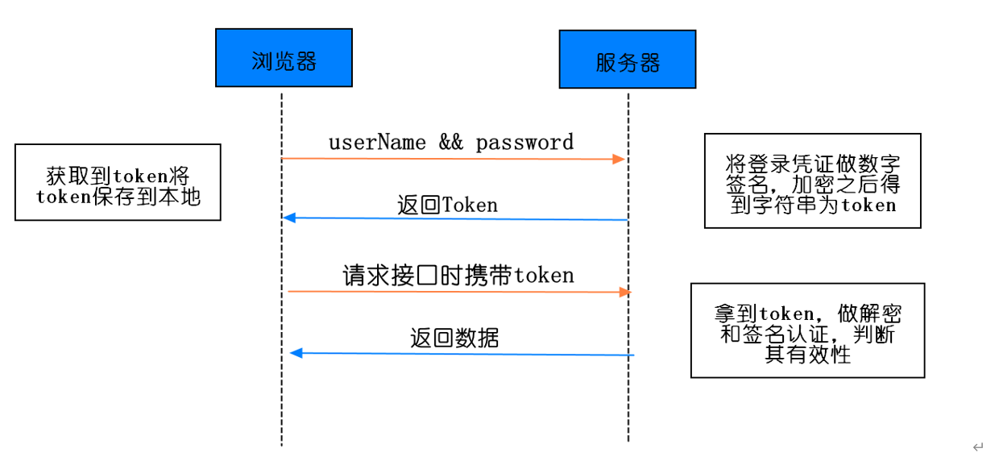
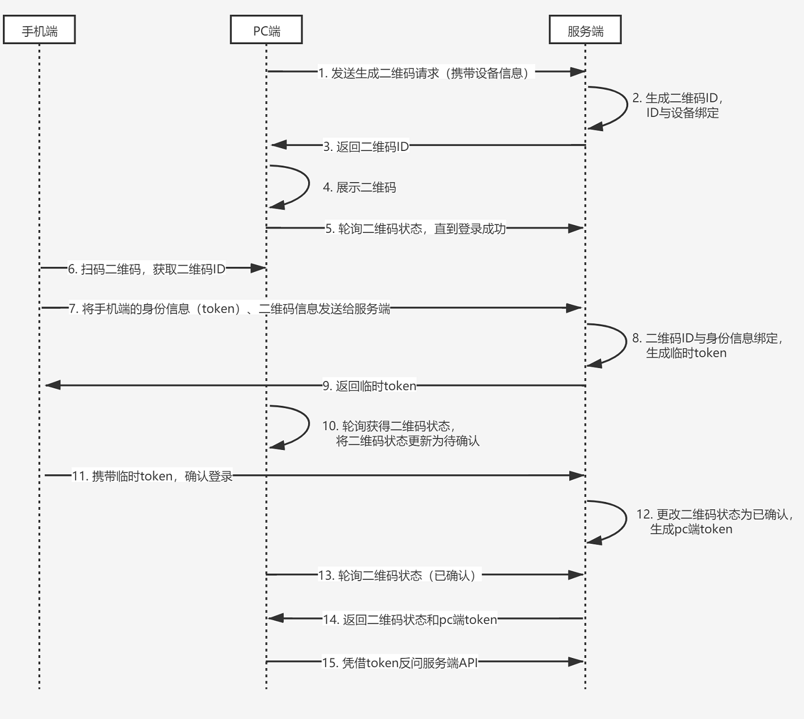

# 二维码登录

## 什么是二维码
二维码又称二维条码，常见的二维码为QR Code，QR全称Quick Response，是一个近几年来移动设备上超流行的一种编码方式，它比传统的Bar Code条形码能存更多的信息，也能表示更多的数据类型。----来自百度百科

在商品上，一般都会有条形码，条形码也称为一维码，条形码只能表示一串数字。二维码要比条形码丰富很多，可以存储数字、字符串、图片、文件等，比如我们可以把www.baidu.com存储在二维码中，扫码二维码我们就可以获取到百度的地址。

可能用文字说起来还是比较难理解，您可以百度：草料二维码，一款二维码生成和解析工具，玩一玩你就知道二维码是个啥了。

移动端基于 token 的认证机制
在了解扫码登录原理之前，有必要先了解移动端基于 token 的认证机制，对理解扫码登录原理还是非常有帮助的。基于 token 的认证机制跟我们常用的账号密码认证方式有较大的不同，安全系数比账号密码要高，如果每次验证都传入账号密码，那么被劫持的概率就变大了。

基于 token 的认证机制流程图，如下图所示：

基于 token 的认证机制，只有在第一次使用需要输入账号密码，后续使用将不在输入账号密码。其实在登陆的时候不仅传入账号、密码，还传入了手机的设备信息。在服务端验证账号、密码正确后，服务端会做两件事。

第一，将账号与设备关联起来，在某种意义上，设备信息就代表着账号。

第二，生成一个 token 令牌，并且在 token 与账号、设备关联，类似于key/value，token 作为 key ，账号、设备信息作为value，持久化在磁盘上。

将 token 返回给移动端，移动端将 token 存入在本地，往后移动端都通过 token 访问服务端 API ，当然除了 token 之外，还需要携带设备信息，因为 token 可能会被劫持。带上设备信息之后，就算 token 被劫持也没有关系，因为设备信息是唯一的。

这就是基于 token 的认证机制，将账号密码换成了 token、设备信息，从而提高了安全系数，可别小看这个 token ，token 是身份凭证，在扫码登录的时候也会用到。

## 二维码扫码登录的原理
好了，知道了移动端基于 token 的认证机制后，接下来就进入我们的主题：二维码扫码登陆的原理。先上二维码扫码登录的流程图：

扫码登录可以分为三个阶段：待扫描、已扫描待确认、已确认。我们就一一来看看这三个阶段。

1. 待扫描阶段

待扫描阶段也就是流程图中 1~5 阶段，即生成二维码阶段，这个阶段跟移动端没有关系，是 PC 端跟服务端的交互过程。

首先 PC 端携带设备信息想服务端发起生成二维码请求，服务端会生成唯一的二维码 ID，你可以理解为 UUID，并且将 二维码 ID 跟 PC 设备信息关联起来，这跟移动端登录有点相似。

PC 端接受到二维码 ID 之后，将二维码 ID 以二维码的形式展示，等待移动端扫码。此时在 PC 端会启动一个定时器，轮询查询二维码的状态。如果移动端未扫描的话，那么一段时间后二维码将会失效。

2. 已扫描待确认阶段

流程图中第 6 ~ 10 阶段，我们在 PC 端登录微信时，手机扫码后，PC 端的二维码会变成已扫码，请在手机端确认。这个阶段是移动端跟服务端交互的过程。

首先移动端扫描二维码，获取二维码 ID，然后将手机端登录的信息凭证（token）和 二维码 ID 作为参数发送给服务端，此时的手机一定是登录的，不存在没登录的情况。

服务端接受请求后，会将 token 与二维码 ID 关联，为什么需要关联呢？你想想，我们使用微信时，移动端退出， PC 端是不是也需要退出，这个关联就有点把子作用了。然后会生成一个一次性 token，这个 token 会返回给移动端，一次性 token 用作确认时候的凭证。

PC 端的定时器，会轮询到二维码的状态已经发生变化，会将 PC 端的二维码更新为已扫描，请确认。

3. 已确认

流程图中的 第 11 ~ 15 步骤，这是扫码登录的最后阶段，移动端携带上一步骤中获取的临时 token ，确认登录，服务端校对完成后，会更新二维码状态，并且给 PC 端生成一个正式的 token ，后续 PC 端就是持有这个 token 访问服务端。

PC 端的定时器，轮询到了二维码状态为登录状态，并且会获取到了生成的 token ，完成登录，后续访问都基于 token 完成。

在服务器端会跟手机端一样，维护着 token 跟二维码、PC 设备信息、账号等信息。

到此，二维码扫描登录原理就差不多了，二维码扫描登录在原理上不难理解，跟 OAuth2.0 有一丝的相似之处，但是实现起来可能就比较复杂。