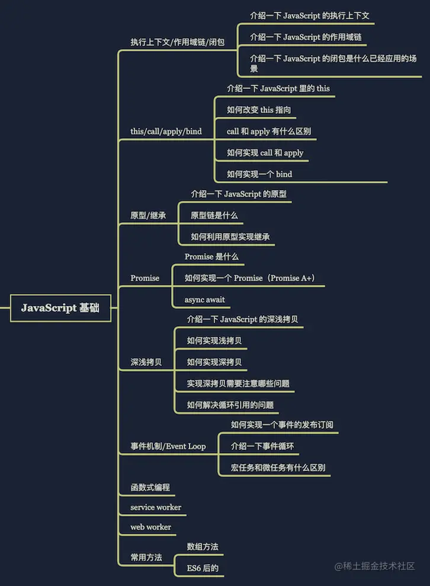
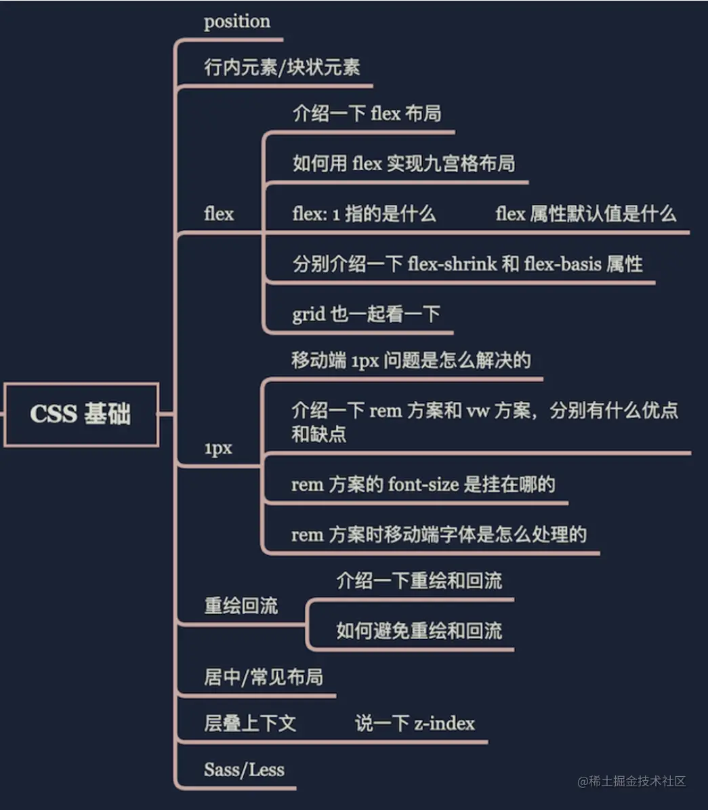
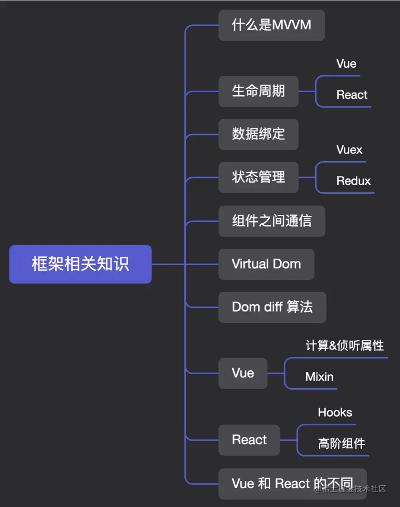
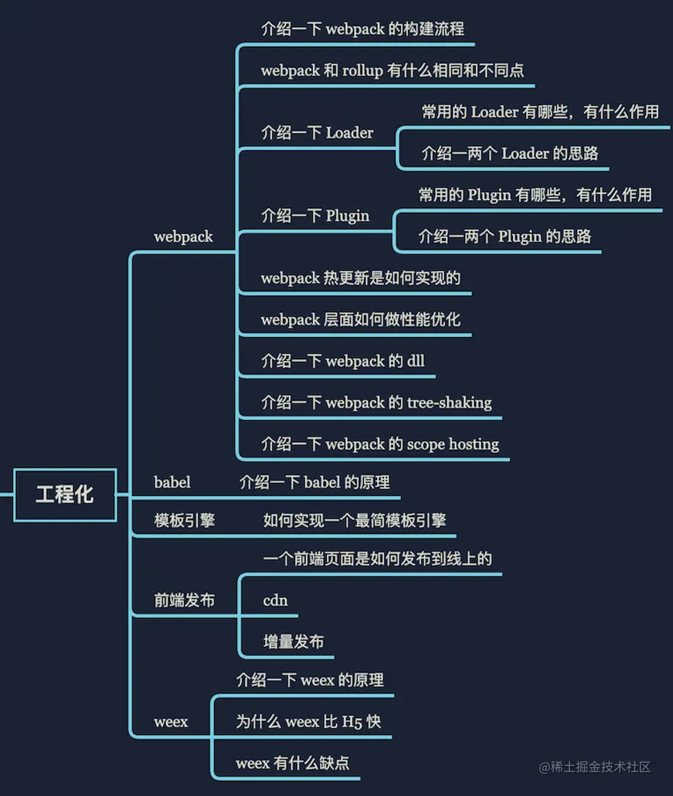
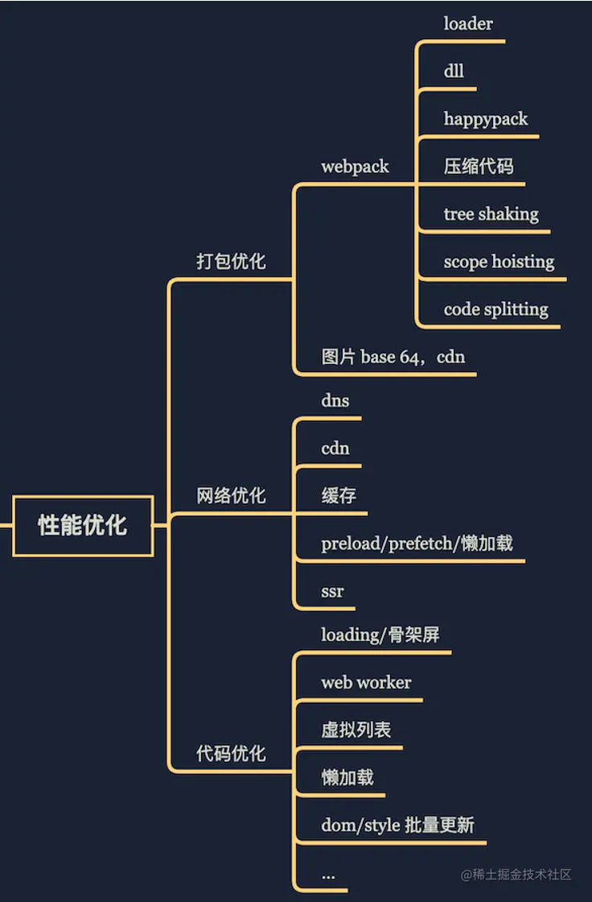
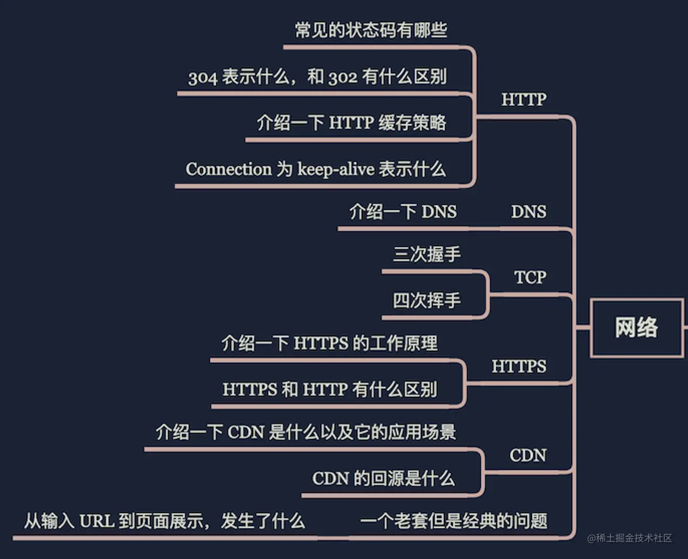
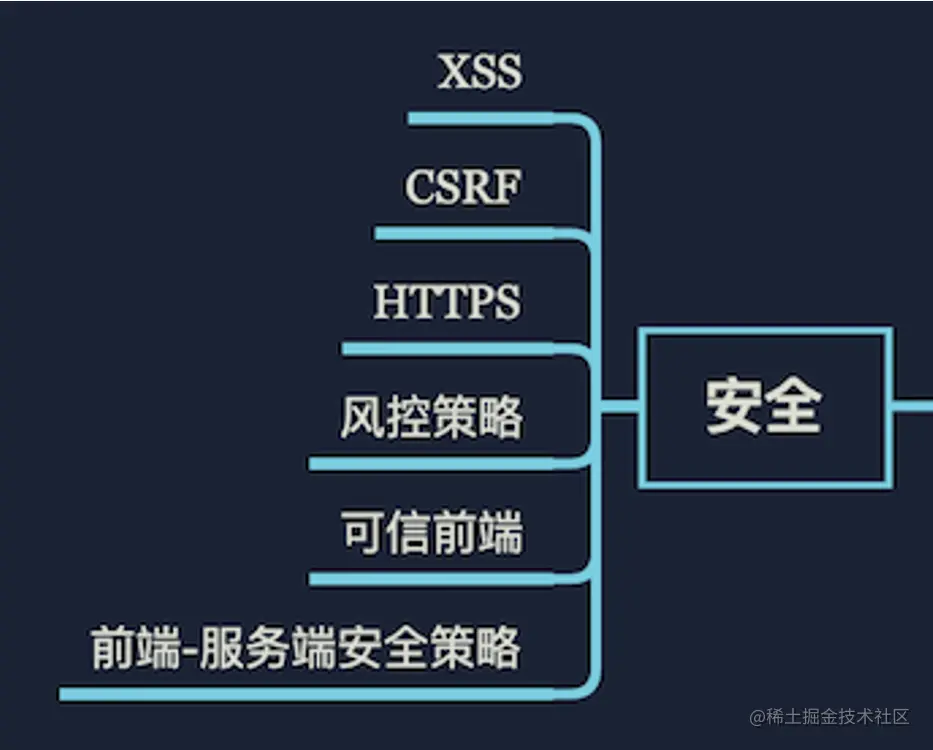
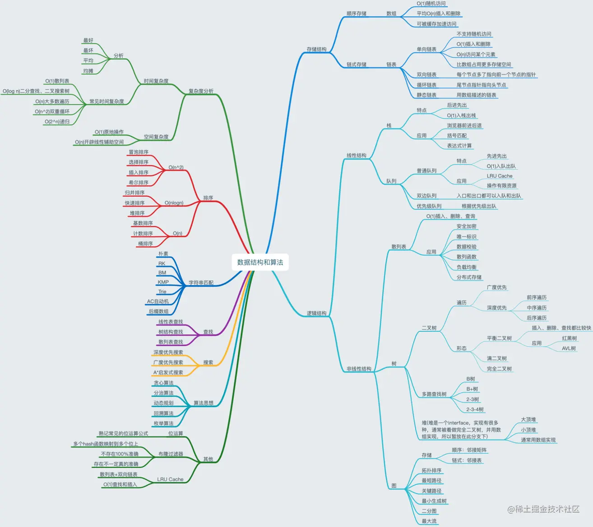

# 面试自检手册

## Part 1 · Javascript相关

## Part 2 · CSS相关

## Part 3 · 前端框架相关

## Part 4 · 工程化相关

## Part 5 · 性能优化相关

## Part 6 · 计算机网络相关

## Part 7 · 前端安全

## Part 8 · 针对性学习算法

## 算法刷题指南
首先要明确的是数据结构是工具，算法是通过合适的工具解决特定问题的方法。也就是说，学习算法之前，最起码得了解那些常用的数据结构，知道它们的特性和缺陷。

那么该如何在 LeetCode 刷题呢？我的建议是你在熟悉了基本数据结构，并且能很轻松用 JS 实现常见的数据结构之后，就可以去刷题了。LeetCode 刷题也有套路，建议你当数据结构基本都了解并能实现的基础上，可以先直接刷二叉树相关的题目，因为这块比较容易抽象出通用的思路（本讲的最后我会带你看二叉树这部分怎么突破）。

其实总结下来，算法刷题无非就是找到这几类题目的解题思路：
- If-else, switch（branch）
- for，while loop（Iteration）
- 递归 Recursion（Divide, Backtrace）
- 搜索 Search：深度优先搜索（Depth first search）、广度优先搜索（Breadth first search）、A* 等
- 动态规划（Dynamic Programming）
- 二分查找（Binary Search）
- 贪心算法（Greedy）
- 数学（Math）& 位运算等
上面提到的二叉树相关的实现思路以及相关的题目，其实就是第三类递归的思路，如果你把递归的思路掌握好，那对于二叉树相关的题目你将会得心应手。动态规划也类似，核心思路就是动态递推，从最小的开始计算，一步一步推导累加到第 n 次之后的结果。

